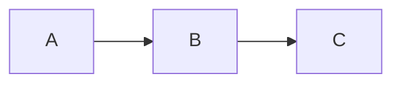

# Integrating Anime.js with Mermaid Diagrams

This guide explains how to incorporate [Anime.js](https://animejs.com/) with Mermaid diagrams for more advanced and customizable animations.

## Overview

Anime.js is a lightweight JavaScript animation library that works well with SVG elements. Since Mermaid diagrams are rendered as SVG, Anime.js is a perfect choice for creating more complex animations beyond what CSS can provide.

## Step 1: Install Anime.js

First, install Anime.js as a dependency:

```bash
npm install animejs
```

## Step 2: Create an Anime.js Client Module

Create a new client module for Anime.js integration:

```bash
mkdir -p src/clientModules
touch src/clientModules/mermaidAnimeIntegration.js
```

## Step 3: Implement the Anime.js Integration

Add the following code to `src/clientModules/mermaidAnimeIntegration.js`:

```javascript
/**
 * Mermaid Anime.js Integration Module
 * 
 * This module integrates Anime.js with Mermaid diagrams for advanced animations.
 */

import ExecutionEnvironment from '@docusaurus/ExecutionEnvironment';

// Only execute in browser environment
if (ExecutionEnvironment.canUseDOM) {
  // Initialize when DOM is ready
  if (document.readyState === 'loading') {
    document.addEventListener('DOMContentLoaded', initializeAnimeIntegration);
  } else {
    initializeAnimeIntegration();
  }
  
  // Re-initialize on route change
  document.addEventListener('docusaurus.routeDidUpdate', () => {
    // Wait for DOM to update and Mermaid to render
    setTimeout(initializeAnimeIntegration, 500);
  });
}

async function initializeAnimeIntegration() {
  console.log('Initializing Anime.js integration with Mermaid...');
  
  // Dynamically import Anime.js
  let anime;
  try {
    anime = (await import('animejs')).default;
  } catch (error) {
    console.error('Failed to load Anime.js:', error);
    return;
  }
  
  // Wait for Mermaid diagrams to be rendered
  const checkInterval = setInterval(() => {
    const diagrams = document.querySelectorAll('.mermaid[data-processed="true"]');
    if (diagrams.length > 0) {
      clearInterval(checkInterval);
      console.log(`Found ${diagrams.length} rendered Mermaid diagrams. Applying Anime.js animations...`);
      
      // Apply animations to each diagram
      diagrams.forEach(diagram => {
        enhanceDiagramWithAnime(diagram, anime);
      });
    }
  }, 300);
  
  // Set a timeout to stop checking after 10 seconds
  setTimeout(() => {
    clearInterval(checkInterval);
  }, 10000);
}

function enhanceDiagramWithAnime(diagram, anime) {
  // Skip if already enhanced with Anime.js
  if (diagram.classList.contains('anime-enhanced')) {
    return;
  }
  
  // Mark as enhanced
  diagram.classList.add('anime-enhanced');
  
  // Get parent container
  const container = diagram.closest('.docusaurus-mermaid-container') || diagram.parentNode;
  
  // Add anime container class
  container.classList.add('anime-animation-container');
  
  // Check for animation attributes
  const animationContainer = diagram.closest('[data-anime]');
  if (animationContainer) {
    const animationType = animationContainer.getAttribute('data-anime');
    const animationDuration = parseInt(animationContainer.getAttribute('data-anime-duration') || '1000', 10);
    const animationEasing = animationContainer.getAttribute('data-anime-easing') || 'easeOutElastic(1, .5)';
    
    // Initialize specific animation
    initializeAnimeAnimation(diagram, anime, animationType, animationDuration, animationEasing);
  } else {
    // Add default animation controls
    addAnimeControls(diagram, container, anime);
  }
}

function initializeAnimeAnimation(diagram, anime, animationType, duration, easing) {
  console.log(`Initializing ${animationType} animation with Anime.js...`);
  
  // Get SVG element
  const svg = diagram.querySelector('svg');
  if (!svg) return;
  
  switch (animationType) {
    case 'staggered-fade':
      applyStaggeredFadeAnimation(svg, anime, duration, easing);
      break;
    case 'path-drawing':
      applyPathDrawingAnimation(svg, anime, duration, easing);
      break;
    case 'node-scale':
      applyNodeScaleAnimation(svg, anime, duration, easing);
      break;
    case 'color-shift':
      applyColorShiftAnimation(svg, anime, duration, easing);
      break;
    case 'motion-path':
      applyMotionPathAnimation(svg, anime, duration, easing);
      break;
    default:
      console.log(`Unknown animation type: ${animationType}, applying default animation`);
      applyDefaultAnimation(svg, anime, duration, easing);
      break;
  }
}

function applyStaggeredFadeAnimation(svg, anime, duration, easing) {
  // Get all nodes and edges
  const elements = [...svg.querySelectorAll('.node'), ...svg.querySelectorAll('.edgePath')];
  
  // Set initial opacity
  elements.forEach(el => {
    el.style.opacity = '0';
  });
  
  // Create animation
  anime({
    targets: elements,
    opacity: 1,
    duration: duration,
    easing: easing,
    delay: anime.stagger(100),
    begin: () => {
      console.log('Starting staggered fade animation');
    }
  });
}

function applyPathDrawingAnimation(svg, anime, duration, easing) {
  // Get all paths
  const paths = svg.querySelectorAll('path');
  
  // Prepare paths for animation
  paths.forEach(path => {
    const length = path.getTotalLength();
    path.style.strokeDasharray = length;
    path.style.strokeDashoffset = length;
  });
  
  // Create animation
  anime({
    targets: paths,
    strokeDashoffset: 0,
    duration: duration,
    easing: easing,
    delay: anime.stagger(100),
    begin: () => {
      console.log('Starting path drawing animation');
    }
  });
}

function applyNodeScaleAnimation(svg, anime, duration, easing) {
  // Get all nodes
  const nodes = svg.querySelectorAll('.node');
  
  // Set initial scale
  nodes.forEach(node => {
    node.style.transformOrigin = 'center';
    node.style.transform = 'scale(0)';
  });
  
  // Create animation
  anime({
    targets: nodes,
    scale: 1,
    duration: duration,
    easing: easing,
    delay: anime.stagger(100),
    begin: () => {
      console.log('Starting node scale animation');
    }
  });
}

function applyColorShiftAnimation(svg, anime, duration, easing) {
  // Get all nodes and edges
  const nodes = svg.querySelectorAll('.node rect, .node circle, .node ellipse, .node polygon');
  
  // Create animation
  anime({
    targets: nodes,
    fill: [
      { value: '#FF5733', duration: duration / 3 },
      { value: '#33FF57', duration: duration / 3 },
      { value: '#3357FF', duration: duration / 3 }
    ],
    easing: easing,
    direction: 'alternate',
    loop: true,
    begin: () => {
      console.log('Starting color shift animation');
    }
  });
}

function applyMotionPathAnimation(svg, anime, duration, easing) {
  // Get all nodes
  const nodes = svg.querySelectorAll('.node');
  
  // Create a motion path
  const path = anime.path('M0 0 L50 50 L100 0 L150 50 L200 0');
  
  // Create animation
  anime({
    targets: nodes,
    translateX: path('x'),
    translateY: path('y'),
    duration: duration,
    easing: easing,
    loop: true,
    direction: 'alternate',
    begin: () => {
      console.log('Starting motion path animation');
    }
  });
}

function applyDefaultAnimation(svg, anime, duration, easing) {
  // Get all elements
  const elements = svg.querySelectorAll('g');
  
  // Create animation
  anime({
    targets: elements,
    opacity: [0, 1],
    translateY: [10, 0],
    duration: duration,
    easing: easing,
    delay: anime.stagger(50),
    begin: () => {
      console.log('Starting default animation');
    }
  });
}

function addAnimeControls(diagram, container, anime) {
  // Create controls container
  const controls = document.createElement('div');
  controls.className = 'anime-animation-controls';
  controls.style.display = 'flex';
  controls.style.justifyContent = 'center';
  controls.style.marginTop = '10px';
  controls.style.gap = '8px';
  
  // Create animation buttons
  const animations = [
    { name: 'Staggered Fade', type: 'staggered-fade' },
    { name: 'Path Drawing', type: 'path-drawing' },
    { name: 'Node Scale', type: 'node-scale' },
    { name: 'Color Shift', type: 'color-shift' }
  ];
  
  animations.forEach(animation => {
    const button = document.createElement('button');
    button.className = 'anime-animation-button';
    button.innerHTML = animation.name;
    button.style.background = '#3b82f6';
    button.style.color = 'white';
    button.style.border = 'none';
    button.style.borderRadius = '4px';
    button.style.padding = '4px 12px';
    button.style.fontSize = '12px';
    button.style.cursor = 'pointer';
    
    button.addEventListener('click', () => {
      // Get SVG element
      const svg = diagram.querySelector('svg');
      if (!svg) return;
      
      // Initialize animation
      initializeAnimeAnimation(diagram, anime, animation.type, 1000, 'easeOutElastic(1, .5)');
    });
    
    controls.appendChild(button);
  });
  
  // Add controls to container
  container.appendChild(controls);
}

export default {};
```

## Step 4: Update the Docusaurus Configuration

Update your Docusaurus configuration to include the Anime.js integration module:

```bash
node scripts/update-mermaid-config.js
```

Then manually add the Anime.js client module to the `clientModules` array in `docusaurus.config.ts`:

```javascript
clientModules: [
  // ... existing modules
  require.resolve('./src/clientModules/mermaidAnimeIntegration.js'),
],
```

## Step 5: Add Anime.js Animation Attributes to Diagrams

You can now add Anime.js animation attributes to your Mermaid diagrams:

```md
<div data-anime="staggered-fade" data-anime-duration="2000" data-anime-easing="easeOutElastic(1, .5)">



</div>
```

## Available Animation Types

The integration supports the following animation types:

1. **staggered-fade**: Elements fade in one after another
2. **path-drawing**: Paths are drawn progressively
3. **node-scale**: Nodes scale up from zero
4. **color-shift**: Nodes shift through different colors
5. **motion-path**: Nodes move along a predefined path

## Animation Parameters

You can customize the animations with the following attributes:

- `data-anime`: The animation type
- `data-anime-duration`: The duration of the animation in milliseconds (default: 1000)
- `data-anime-easing`: The easing function to use (default: 'easeOutElastic(1, .5)')

## Creating Custom Animations

You can create custom animations by modifying the `mermaidAnimeIntegration.js` file:

1. Add a new case in the `initializeAnimeAnimation` function
2. Implement a new function for your animation type
3. Add your animation to the `animations` array in the `addAnimeControls` function

Example of a custom animation function:

```javascript
function applyCustomAnimation(svg, anime, duration, easing) {
  // Get elements to animate
  const elements = svg.querySelectorAll('.your-selector');
  
  // Create animation
  anime({
    targets: elements,
    // Your animation properties
    duration: duration,
    easing: easing,
    // Additional options
    begin: () => {
      console.log('Starting custom animation');
    }
  });
}
```

## Advanced Usage

### Timeline Animations

You can create more complex animations using Anime.js timelines:

```javascript
function applyTimelineAnimation(svg, anime, duration, easing) {
  // Get elements
  const nodes = svg.querySelectorAll('.node');
  const edges = svg.querySelectorAll('.edgePath');
  
  // Create timeline
  const timeline = anime.timeline({
    easing: easing,
    duration: duration / 2
  });
  
  // Add animations to timeline
  timeline
    .add({
      targets: nodes,
      opacity: [0, 1],
      translateY: [10, 0],
      delay: anime.stagger(100)
    })
    .add({
      targets: edges,
      opacity: [0, 1],
      strokeDashoffset: [anime.setDashoffset, 0],
      delay: anime.stagger(100)
    });
}
```

### Interactive Animations

You can make animations respond to user interactions:

```javascript
function addInteractiveAnimations(svg, anime) {
  // Get nodes
  const nodes = svg.querySelectorAll('.node');
  
  // Add hover animations
  nodes.forEach(node => {
    node.addEventListener('mouseenter', () => {
      anime({
        targets: node,
        scale: 1.1,
        duration: 300,
        easing: 'easeOutElastic(1, .5)'
      });
    });
    
    node.addEventListener('mouseleave', () => {
      anime({
        targets: node,
        scale: 1,
        duration: 300,
        easing: 'easeOutElastic(1, .5)'
      });
    });
  });
}
```

## Conclusion

By integrating Anime.js with Mermaid diagrams, you can create more advanced and customizable animations that enhance the visual appeal and educational value of your diagrams. This integration complements the CSS animations provided by the base Mermaid fix solution, giving you more options for creating engaging documentation.

For more information on Anime.js, visit the [official documentation](https://animejs.com/documentation/).
