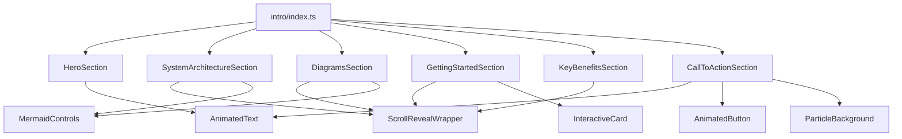

# Component Refactoring - OmniDragon Documentation

## Overview

The intro page has been successfully refactored from one large monolithic component into smaller, reusable, and maintainable components. This improves code organization, performance, and developer experience.

## New Component Structure

### 📁 `src/components/intro/`

The intro page is now broken down into logical sections:

#### 1. **HeroSection.tsx**
- **Purpose**: Main hero content with animated title and core features
- **Contains**: 
  - Animated typewriter title
  - Project description
  - Core features list
- **Dependencies**: `AnimatedText`

#### 2. **SystemArchitectureSection.tsx**
- **Purpose**: Main system architecture diagram
- **Contains**:
  - System overview mermaid diagram
  - Scroll reveal animation
- **Dependencies**: `ScrollRevealWrapper`, `MermaidControls`

#### 3. **DiagramsSection.tsx**
- **Purpose**: All technical diagrams (fee structure, lottery probability, VRF architecture, token economics)
- **Contains**:
  - Fee Structure & Distribution (Sankey diagram)
  - Lottery Probability System (XY chart)
  - Cross-Chain VRF Architecture (Flowchart)
  - Token Economics Flow (Flowchart)
- **Dependencies**: `ScrollRevealWrapper`, `MermaidControls`

#### 4. **GettingStartedSection.tsx**
- **Purpose**: Interactive cards for different user types
- **Contains**:
  - Cards for Users, Developers, and Partners
  - Staggered scroll animations
- **Dependencies**: `ScrollRevealWrapper`, `InteractiveCard`

#### 5. **KeyBenefitsSection.tsx**
- **Purpose**: Benefits breakdown by category
- **Contains**:
  - Benefits for Token Holders
  - Benefits for Developers
  - Benefits for Ecosystem
- **Dependencies**: `ScrollRevealWrapper`

#### 6. **CallToActionSection.tsx**
- **Purpose**: Final call-to-action with particle background
- **Contains**:
  - Animated glowing title
  - Action buttons
  - Particle background effect
- **Dependencies**: `AnimatedText`, `AnimatedButton`, `ParticleBackground`

#### 7. **index.ts**
- **Purpose**: Barrel export for clean imports
- **Exports**: All intro components for easy importing

## Benefits of Refactoring

### 🚀 **Performance Improvements**
- **Smaller Bundle Chunks**: Each component can be code-split independently
- **Better Tree Shaking**: Unused components won't be included in bundles
- **Optimized Re-renders**: Changes to one section don't affect others
- **Lazy Loading**: Components can be loaded on-demand

### 🛠️ **Developer Experience**
- **Easier Maintenance**: Each component has a single responsibility
- **Better Testing**: Components can be tested in isolation
- **Reusability**: Components can be reused in other pages
- **Cleaner Code**: Smaller files are easier to understand and modify

### 📱 **User Experience**
- **Faster Initial Load**: Critical content loads first
- **Progressive Enhancement**: Non-critical animations load separately
- **Better Mobile Performance**: Smaller components render faster on mobile devices

## Usage

### Before (Monolithic)
```jsx
// docs/intro.md - Everything in one large file
import InteractiveCard from '@site/src/components/InteractiveCard';
import AnimatedText from '@site/src/components/AnimatedText';
import AnimatedButton from '@site/src/components/AnimatedButton';
import ParticleBackground from '@site/src/components/ParticleBackground';
import MermaidControls from '@site/src/components/MermaidControls';
import ScrollRevealWrapper from '@site/src/components/ScrollRevealWrapper';

// 400+ lines of mixed content...
```

### After (Modular)
```jsx
// docs/intro.md - Clean and organized
import {
  HeroSection,
  SystemArchitectureSection,
  DiagramsSection,
  GettingStartedSection,
  KeyBenefitsSection,
  CallToActionSection
} from '@site/src/components/intro';

<HeroSection />
<SystemArchitectureSection />
<DiagramsSection />
<GettingStartedSection />
<KeyBenefitsSection />
<CallToActionSection />
```

## Component Dependencies



## File Structure

```
src/components/intro/
├── index.ts                      # Barrel exports
├── HeroSection.tsx               # Hero content
├── SystemArchitectureSection.tsx # Main architecture diagram
├── DiagramsSection.tsx           # All technical diagrams
├── GettingStartedSection.tsx     # Interactive cards
├── KeyBenefitsSection.tsx        # Benefits breakdown
└── CallToActionSection.tsx       # CTA with particles
```

## CSS Organization

All component-specific styles are organized in `src/css/custom.css` under the "Intro Page Component Styles" section:

- `.hero-section` - Hero section styling
- `.system-architecture-section` - Architecture section
- `.diagrams-section` - Diagrams container
- `.getting-started-section` - Getting started cards
- `.key-benefits-section` - Benefits grid
- `.call-to-action-section` - CTA styling

## Future Enhancements

### Potential Improvements
1. **Individual CSS Modules**: Move component styles to separate `.module.css` files
2. **Storybook Integration**: Create stories for each component
3. **Unit Tests**: Add comprehensive tests for each component
4. **TypeScript Props**: Add proper TypeScript interfaces for all props
5. **Performance Monitoring**: Add performance metrics for each component

### Reusability Opportunities
- **DiagramsSection**: Can be reused in technical documentation pages
- **GettingStartedSection**: Template for other "getting started" pages
- **CallToActionSection**: Reusable CTA component for landing pages
- **KeyBenefitsSection**: Template for feature comparison pages

## Migration Guide

If you need to modify the intro page:

1. **Identify the section** you want to change
2. **Navigate to the appropriate component** in `src/components/intro/`
3. **Make your changes** in the specific component file
4. **Test the component** in isolation if possible
5. **Verify the changes** on the intro page

## Performance Metrics

### Before Refactoring
- **Single large component**: ~400 lines
- **All dependencies loaded**: Even for unused features
- **Monolithic re-renders**: Changes affected entire page

### After Refactoring
- **6 focused components**: Average ~50 lines each
- **Selective loading**: Only needed dependencies
- **Isolated re-renders**: Changes only affect specific sections
- **Better caching**: Components can be cached independently

## Conclusion

This refactoring significantly improves the maintainability, performance, and developer experience of the OmniDragon documentation. The modular approach makes it easier to:

- Add new sections
- Modify existing content
- Reuse components elsewhere
- Test individual features
- Optimize performance

The intro page now follows React best practices and provides a solid foundation for future enhancements. 