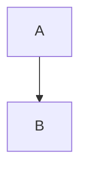
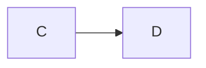
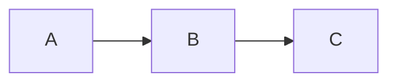

# Mermaid Diagram Fix Application Requirements

## Overview

This document outlines the requirements for an application that will fix Mermaid diagrams in Docusaurus documentation while preserving their complexity and ensuring they render correctly in both development and production environments.

## Problem Statement

The current Docusaurus documentation contains Mermaid diagrams that fail to render properly due to:

1. Syntax errors in the Mermaid diagram code
2. Improper encapsulation of Mermaid blocks
3. Styling conflicts
4. Client-side initialization issues
5. SPA navigation problems
6. Animation integration issues

## Application Requirements

### 1. Core Functionality

#### 1.1 Markdown Parsing
- Parse Markdown/MDX files to identify and extract Mermaid code blocks
- Support for all Mermaid diagram types (flowchart, sequence, class, etc.)
- Preserve document structure and non-Mermaid content

#### 1.2 Mermaid Syntax Validation
- Validate Mermaid syntax against the official Mermaid grammar
- Identify specific syntax errors with line numbers and error descriptions
- Support for the latest Mermaid syntax version

#### 1.3 Syntax Correction
- Automatically fix common syntax errors:
  - Missing end statements in subgraphs
  - Incorrect arrow syntax
  - Malformed class definitions
  - Improper styling syntax
  - Unclosed quotes
  - Invalid node shapes
  - Improper indentation
- Preserve diagram semantics and visual structure
- Maintain custom styling where possible

#### 1.4 Diagram Encapsulation
- Ensure proper encapsulation of Mermaid blocks with triple backticks
- Fix nested Mermaid blocks
- Correct malformed Mermaid declarations (e.g., ```mermaidgraph)

#### 1.5 Animation Support
- Add necessary data attributes for animation
- Generate animation-compatible diagram structure
- Preserve animation intent where detectable

### 2. User Interface

#### 2.1 File Selection
- Browse and select individual files or directories
- Filter by file extension (.md, .mdx)
- Display file tree with indicators for files containing Mermaid diagrams

#### 2.2 Diagram Preview
- Side-by-side preview of original and fixed diagrams
- Real-time rendering of Mermaid diagrams
- Visual highlighting of syntax errors
- Dark/light mode toggle for preview

#### 2.3 Batch Processing
- Process multiple files at once
- Progress indicators for batch operations
- Summary report of changes made

#### 2.4 Configuration Options
- Toggle automatic fixes by category
- Set Mermaid version
- Configure styling preferences
- Set animation options

### 3. Integration with Docusaurus

#### 3.1 Client Module Generation
- Generate optimized mermaidInit.js client module
- Create consolidated animation module
- Produce SPA navigation fix module

#### 3.2 CSS Generation
- Generate enhanced Mermaid CSS
- Create animation CSS
- Produce fallback styles for failed renders

#### 3.3 Configuration Updates
- Update docusaurus.config.ts with proper settings
- Add necessary theme configurations
- Configure client modules correctly

### 4. Technical Requirements

#### 4.1 Performance
- Process large documentation sets efficiently
- Optimize memory usage for large files
- Support incremental processing

#### 4.2 Reliability
- Comprehensive error handling
- Automatic backups before modifications
- Validation of output files

#### 4.3 Extensibility
- Plugin architecture for custom fixes
- Support for future Mermaid versions
- Configurable rule sets

## Detailed Specifications

### Mermaid Syntax Fixes

The application must identify and fix the following common syntax issues:

#### Subgraph Issues
```mermaid
subgraph "Group 1"
  A --> B
  B --> C
  // Missing "end" statement
```

Should be fixed to:
```mermaid
subgraph "Group 1"
  A --> B
  B --> C
end
```

#### Arrow Syntax
```mermaid
A -> B
B -- Text --> C
```

Should be fixed to:
```mermaid
A --> B
B -->|Text| C
```

#### Class Definitions
```mermaid
class MyClass fill:#f9f,stroke:#333
```

Should be fixed to:
```mermaid
class MyClass fill:#f9f,stroke:#333
```

#### Style Definitions
```mermaid
style A fill:#f9f stroke:#333 stroke-width:2px
```

Should be fixed to:
```mermaid
style A fill:#f9f,stroke:#333,stroke-width:2px
```

#### Nested Mermaid Blocks
```mermaid
graph TD
  A --> B
  ```mermaid
  graph LR
    C --> D
  ```
```

Should be fixed to:


And:


### Animation Support

The application should add appropriate attributes for animation:

```md
<div data-animation="flow" data-animation-speed="1">



</div>
```

### Client Module Generation

The application should generate the following client modules:

#### mermaidInit.js
```javascript
import ExecutionEnvironment from '@docusaurus/ExecutionEnvironment';

if (ExecutionEnvironment.canUseDOM) {
  // Initialize mermaid with proper configuration
  // Handle dark/light mode
  // Implement retry mechanism
  // Add error handling
}

export default {};
```

#### mermaidAnimations.js
```javascript
import ExecutionEnvironment from '@docusaurus/ExecutionEnvironment';

if (ExecutionEnvironment.canUseDOM) {
  // Initialize animations
  // Handle SPA navigation
  // Implement progressive reveal
}

export default {};
```

### CSS Generation

The application should generate the following CSS:

#### mermaid-enhanced.css
```css
.docusaurus-mermaid-container {
  /* Enhanced container styling */
}

.mermaid {
  /* Base mermaid styling */
}

/* Dark mode support */
[data-theme='dark'] .mermaid {
  /* Dark mode styling */
}
```

#### mermaid-animations.css
```css
/* Animation keyframes */
@keyframes flowAnimation {
  /* Flow animation */
}

/* Animation classes */
.mermaid-step {
  /* Step styling */
}

.mermaid-step.revealed {
  /* Revealed step styling */
}
```

## Implementation Approach

### Phase 1: Analysis
1. Scan all documentation files
2. Identify and categorize Mermaid syntax issues
3. Generate report of issues found

### Phase 2: Fix Implementation
1. Implement syntax fixes
2. Add proper encapsulation
3. Apply styling corrections

### Phase 3: Animation Integration
1. Add animation attributes
2. Generate animation modules
3. Create animation CSS

### Phase 4: Docusaurus Integration
1. Generate client modules
2. Update configuration
3. Add fallback mechanisms

### Phase 5: Testing & Validation
1. Render test of all fixed diagrams
2. Validate in both development and production
3. Test SPA navigation

## Technical Stack Recommendations

### Backend
- Node.js for file processing
- Mermaid.js for syntax validation and rendering
- Unified/Remark for Markdown parsing

### Frontend
- React for UI
- Monaco Editor for code editing
- Mermaid for diagram preview

### Build & Packaging
- Electron for desktop application
- CLI interface for automation
- Web version for online usage

## Conclusion

This application will provide a comprehensive solution for fixing Mermaid diagrams in Docusaurus documentation while preserving their complexity and ensuring proper rendering in all environments. By addressing syntax issues, animation integration, and Docusaurus-specific concerns, it will enable the creation of rich, interactive documentation with reliable diagram rendering.
