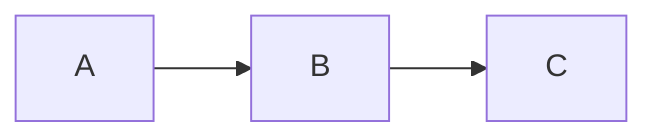

# Mermaid Fix Usage Guide

This guide explains how to use the scripts and components we've created to fix Mermaid diagrams and animations in your Docusaurus documentation.

## Overview

We've created several components to address the issues with Mermaid diagrams and animations:

1. **Requirements Document**: `MERMAID_FIX_REQUIREMENTS.md` - Detailed requirements for a comprehensive Mermaid fix application
2. **Diagram Fixer Script**: `scripts/mermaid-diagram-fixer.js` - Script to fix common Mermaid syntax issues
3. **Mermaid Initialization Module**: `src/clientModules/optimizedMermaidInit.js` - Client module for robust Mermaid initialization
4. **Mermaid Animations CSS**: `src/css/mermaid-animations.css` - CSS for Mermaid animations and styling
5. **Mermaid Animations Module**: `src/clientModules/mermaidAnimations.js` - Client module for interactive Mermaid animations
6. **Configuration Update Script**: `scripts/update-mermaid-config.js` - Script to update Docusaurus configuration

## Step 1: Fix Mermaid Diagram Syntax

The first step is to fix the syntax issues in your Mermaid diagrams using the `mermaid-diagram-fixer.js` script:

```bash
# Make the script executable
chmod +x scripts/mermaid-diagram-fixer.js

# Run the script on all files
node scripts/mermaid-diagram-fixer.js

# Or run it on a specific file
node scripts/mermaid-diagram-fixer.js docs/concepts/jackpot.md
```

This script will:
- Fix missing end statements in subgraphs
- Fix arrow syntax
- Fix class definitions
- Fix style syntax
- Fix nested Mermaid blocks
- Fix malformed Mermaid declarations

## Step 2: Update Docusaurus Configuration

Next, update your Docusaurus configuration to include the necessary modules and CSS files:

```bash
# Make the script executable
chmod +x scripts/update-mermaid-config.js

# Run the script
node scripts/update-mermaid-config.js
```

This script will:
- Add `@docusaurus/theme-mermaid` to the themes section
- Add the client modules to the clientModules section
- Add the CSS file to the stylesheets section
- Enable Mermaid in the markdown config
- Create necessary directories
- Copy CSS files to the static directory

## Step 3: Add Animation Attributes to Diagrams (Optional)

If you want to add animations to your diagrams, wrap them in a div with animation attributes:

```md
<div data-animation="flow" data-animation-speed="1">



</div>
```

Available animation types:
- `flow`: Animated flow along the edges
- `step-by-step`: Progressive reveal of nodes
- `highlight-path`: Highlight a path through the diagram
- `pulse`: Pulsing animation on nodes

## Step 4: Build and Test

Build and serve your Docusaurus site to test the changes:

```bash
# Build the site
npm run build

# Serve the site
npm run serve
```

## Troubleshooting

### Diagrams Not Rendering

If diagrams are not rendering:

1. Check the browser console for errors
2. Verify that the Mermaid syntax is correct
3. Make sure the Docusaurus configuration is updated correctly
4. Try running the diagram fixer script again

### Animations Not Working

If animations are not working:

1. Check that the animation attributes are added correctly
2. Verify that the CSS file is loaded
3. Check that the animation module is loaded
4. Try a different animation type

### Configuration Issues

If you encounter configuration issues:

1. Check that the backup files in the `backups` directory
2. Manually update the `docusaurus.config.ts` file
3. Make sure the CSS file is copied to the `static/css` directory

## Advanced Usage

### Custom Animation Types

You can add custom animation types by modifying the `mermaidAnimations.js` file:

1. Add a new case in the `initializeSpecificAnimation` function
2. Implement a new function for your animation type
3. Update the animation CSS as needed

### Styling Customization

You can customize the styling by modifying the `mermaid-animations.css` file:

1. Update the colors, sizes, and animations
2. Add new animation keyframes
3. Customize the dark mode support

### Diagram Type-Specific Enhancements

You can add type-specific enhancements by modifying the `mermaidAnimations.js` file:

1. Add a new case in the `enhanceDiagram` function
2. Implement a new function for your diagram type
3. Update the CSS as needed

## Conclusion

By following these steps, you should be able to fix the Mermaid diagrams and animations in your Docusaurus documentation. The scripts and components provided offer a comprehensive solution that addresses syntax issues, initialization problems, and animation integration.

For a more complete solution, consider developing a full application based on the requirements in `MERMAID_FIX_REQUIREMENTS.md`.
