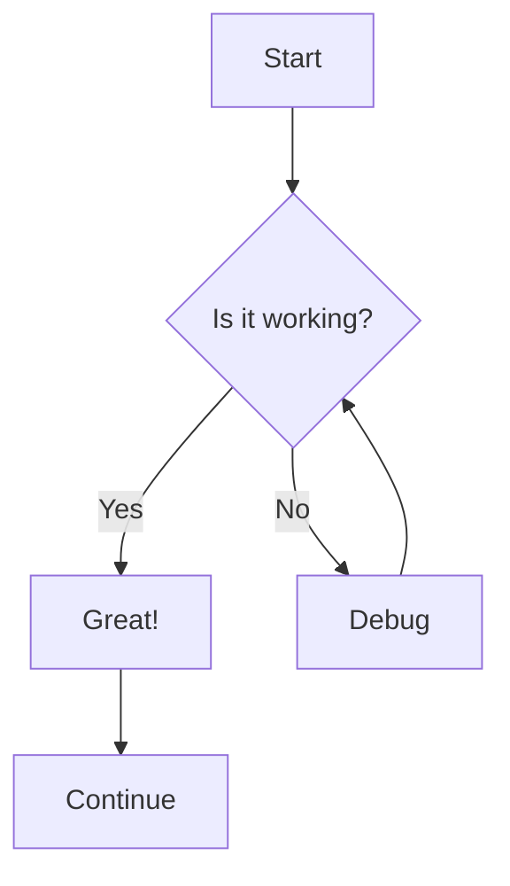

# Sonic Red Dragon Documentation

This is the documentation site for Sonic Red Dragon, built with [Docusaurus 3](https://docusaurus.io/).

## Using Mermaid Diagrams

This documentation site supports Mermaid diagrams in two ways:

### 1. Code Block Method

Use triple backticks with the `mermaid` language identifier:

```

```

### 2. Component Method

For more advanced diagrams with custom styling, you can use the MermaidWrapper component:

```jsx
<MermaidWrapper chart={`
graph TD
    A[Start] --> B{Is it working?}
    B -->|Yes| C[Great!]
    B -->|No| D[Debug]
    D --> B
    C --> E[Finish]
`} />
```

## Installation

```bash
npm install
```

## Local Development

```bash
npm start
```

This command starts a local development server and opens up a browser window. Most changes are reflected live without having to restart the server.

## Build

```bash
npm run build
```

This command generates static content into the `build` directory and can be served using any static contents hosting service.

## Deployment

The site is automatically deployed to GitHub Pages via GitHub Actions when changes are pushed to the main branch.

**Last updated**: 2024-12-19 22:35 UTC - Triggering fresh deployment with sidebar fixes
