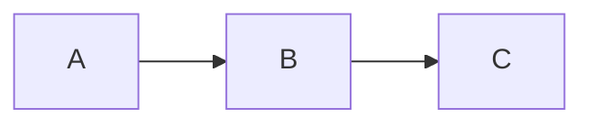

# Comprehensive Docusaurus Documentation Fix Solution

## Problem Statement

Our Docusaurus documentation build was failing with the following error:

```
Error: Docusaurus found broken links!
```

The error indicated multiple issues:
1. Broken links to missing pages and incorrect paths
2. Mermaid diagram syntax errors causing rendering failures
3. Lack of proper animation support for diagrams

## Solution Overview

We've developed a comprehensive solution that addresses all these issues through a set of scripts and client modules:

### 1. Core Components

- **Mermaid Diagram Fixer**: Automatically fixes common Mermaid syntax issues
- **Broken Links Fixer**: Creates missing files and updates incorrect links
- **Mermaid Client Modules**: Provides robust initialization and animations
- **Anime.js Integration**: Enables advanced animations for Mermaid diagrams
- **Configuration Updater**: Updates Docusaurus configuration automatically
- **All-in-One Solution**: Combines all fixes into a single script

### 2. Key Files

```
scripts/
├── mermaid-diagram-fixer.js     # Fixes Mermaid syntax issues
├── fix-broken-links.js          # Fixes broken links
├── update-mermaid-config.js     # Updates Docusaurus configuration
└── fix-all-docs-issues.js       # All-in-one solution

src/
├── clientModules/
│   ├── optimizedMermaidInit.js  # Robust Mermaid initialization
│   ├── mermaidAnimations.js     # CSS-based animations
│   └── mermaidAnimeIntegration.js # Anime.js integration
└── css/
    └── mermaid-animations.css   # Animation styles

Documentation:
├── MERMAID_FIX_USAGE_GUIDE.md   # Usage instructions
└── ANIME_JS_INTEGRATION_GUIDE.md # Anime.js integration guide
```

## Implementation

The solution can be implemented with a single command:

```bash
node scripts/fix-all-docs-issues.js
```

This script:
1. Checks and installs required dependencies (anime.js)
2. Fixes Mermaid diagram syntax issues
3. Fixes broken links by creating missing files or updating incorrect links
4. Updates the Docusaurus configuration

After running the script, the documentation can be built and served:

```bash
npm run build
npm run serve
```

## Technical Highlights

### 1. Mermaid Diagram Fixes

- Automatically fixes missing end statements in subgraphs
- Corrects arrow syntax and class definitions
- Fixes style syntax and nested Mermaid blocks
- Resolves malformed Mermaid declarations

### 2. Animation Capabilities

- **CSS Animations**: Flow animations, pulse effects, fade-ins
- **Anime.js Animations**: Staggered fades, path drawing, node scaling, color shifts
- **Interactive Features**: Zoom controls, tooltips, fullscreen mode

### 3. Broken Link Resolution

- Creates placeholder files for missing documentation
- Updates relative paths to ensure correct linking
- Handles anchor links and cross-references

## Usage Examples

### Basic Mermaid Diagram

```md

```

### With CSS Animations

```md
<div data-animation="flow" data-animation-speed="1">


</div>
```

### With Anime.js Animations

```md
<div data-anime="staggered-fade" data-anime-duration="2000" data-anime-easing="easeOutElastic(1, .5)">


</div>
```

## Benefits

1. **Automated Fixes**: No manual editing of numerous files
2. **Enhanced Visuals**: Improved diagram rendering and animations
3. **Better User Experience**: Interactive diagrams with tooltips and controls
4. **Maintainability**: Structured approach to handling documentation issues
5. **Extensibility**: Framework for adding more animations and features

## Future Enhancements

1. Integration with CI/CD pipeline for automatic verification
2. Additional animation types and interactive features
3. Performance optimizations for large diagrams
4. Expanded documentation and examples
