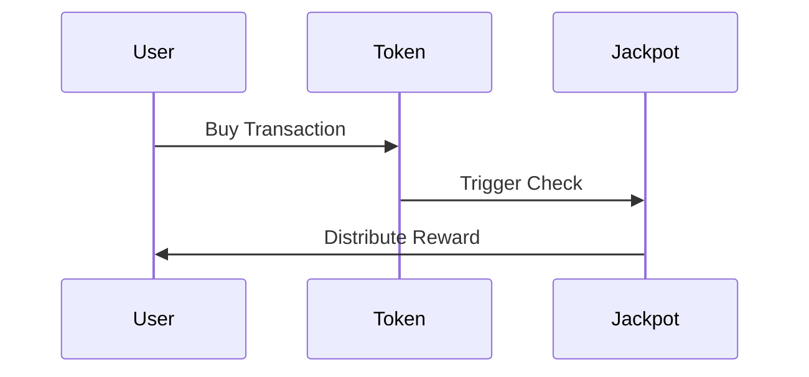

# Jackpot System

The OmniDragon protocol features an innovative automatic jackpot system that creates an exciting and rewarding experience for token holders. This document explains the jackpot system, from high-level concepts to technical implementation details.

## System Overview

The jackpot system automatically enters users into a jackpot when they purchase DRAGON tokens:



### Win Probability

The probability of winning is calculated based on several factors:

```solidity
function calculateWinProbability(
    address buyer,
    uint256 amount
) public view returns (uint256) {
    // Base probability (e.g., 1 in 1,000,000)
    uint256 baseProbability = 1_000_000;
    
    // Adjust based on purchase size (larger purchases = higher chance)
    uint256 amountFactor = amount / 1e18; // Normalize to whole tokens
    uint256 adjustedProbability = baseProbability / (1 + amountFactor);
    
    // Adjust based on jackpot size (larger jackpot = higher chance)
    uint256 jackpotSize = IJackpotVault(jackpotVault).getAvailableJackpot();
    uint256 jackpotFactor = jackpotSize / 1e20; // Normalize to 100 tokens
    adjustedProbability = adjustedProbability / (1 + jackpotFactor);
    
    // Adjust based on time since last win
    uint256 timeSinceLastWin = block.timestamp - lastWinTimestamp;
    uint256 timeFactor = timeSinceLastWin / 1 days;
    adjustedProbability = adjustedProbability / (1 + timeFactor);
    
    // Ensure minimum probability
    if (adjustedProbability > baseProbability) {
        adjustedProbability = baseProbability;
    }
    
    return adjustedProbability;
}
```

The win probability is influenced by:

1.**Purchase Size**: Larger purchases have a higher chance of winning
2.**Jackpot Size**: Larger jackpots increase the win probability
3.**Time Since Last Win**: The longer since the last win, the higher the probability

### Reward Calculation

The reward amount is calculated based on the jackpot size:

```solidity
function calculateReward(address winner) public view returns (uint256) {
    uint256 availableJackpot = jackpotVault.getAvailableJackpot();
    
    // Base reward is 50% of available jackpot
    uint256 baseReward = availableJackpot / 2;
    
    // Minimum reward is 10% of available jackpot
    uint256 minReward = availableJackpot / 10;
    
    // Maximum reward is 90% of available jackpot
    uint256 maxReward = (availableJackpot * 9) / 10;
    
    // Adjust based on winner's token balance
    uint256 winnerBalance = token.balanceOf(winner);
    uint256 totalSupply = token.totalSupply();
    
    // Calculate balance factor (0.1 to 1.0)
    uint256 balanceFactor = (winnerBalance * 9) / totalSupply + 1;
    
    // Calculate final reward
    uint256 reward = (baseReward * balanceFactor) / 10;
    
    // Ensure reward is within limits
    if (reward < minReward) {
        reward = minReward;
    } else if (reward > maxReward) {
        reward = maxReward;
    }
    
    return reward;
}
```

The reward amount is influenced by:

1.**Jackpot Size**: Larger jackpots result in larger rewards
2.**Winner's Balance**: Users with larger token balances receive larger rewards
3.**Minimum/Maximum Limits**: Ensures rewards are within reasonable limits

## Implementation Details

### Jackpot Vault Contract

The Jackpot Vault contract manages the jackpot funds:

```solidity
contract JackpotVault is Ownable {
    address public token;
    address public distributor;
    
    // Events
    event RewardDistributed(address indexed winner, uint256 amount);
    event FeeReceived(uint256 amount);
    
    constructor(address _token) {
        token = _token;
    }
    
    function setDistributor(address _distributor) external onlyOwner {
        distributor = _distributor;
    }
    
    function getAvailableJackpot() external view returns (uint256) {
        return IERC20(token).balanceOf(address(this));
    }
    
    function distributeReward(address winner, uint256 amount) external {
        require(msg.sender == distributor, "Only distributor can distribute rewards");
        require(amount <= IERC20(token).balanceOf(address(this)), "Insufficient jackpot balance");
        
        IERC20(token).transfer(winner, amount);
        
        emit RewardDistributed(winner, amount);
    }
    
    function receiveFees(uint256 amount) external {
        require(msg.sender == token, "Only token can send fees");
        
        emit FeeReceived(amount);
    }
}
```

### Swap Trigger Oracle Contract

The Swap Trigger Oracle contract monitors buy transactions:

```solidity
contract SwapTriggerOracle is Ownable {
    address public token;
    address public randomnessProvider;
    address public jackpotDistributor;
    
    // Win probability parameters
    uint256 public baseProbability = 1_000_000; // 1 in 1,000,000
    uint256 public lastWinTimestamp;
    
    // Events
    event EntryGenerated(address indexed buyer, uint256 amount, uint256 probability);
    event ProbabilityParametersUpdated(uint256 baseProbability);
    
    constructor(
        address _token,
        address _randomnessProvider,
        address _jackpotDistributor
    ) {
        token = _token;
        randomnessProvider = _randomnessProvider;
        jackpotDistributor = _jackpotDistributor;
        lastWinTimestamp = block.timestamp;
    }
    
    function onSwap(address buyer, uint256 amount) external {
        require(msg.sender == token, "Only token can trigger swap");
        
        // Calculate win probability
        uint256 probability = calculateWinProbability(buyer, amount);
        
        // Generate entry
        emit EntryGenerated(buyer, amount, probability);
        
        // Request randomness
        IRandomnessProvider(randomnessProvider).requestRandomness(
            address(this),
            abi.encode(buyer, amount, probability)
        );
    }
    
    function onRandomnessReceived(bytes32 requestId, uint256 randomness) external {
        require(msg.sender == randomnessProvider, "Only randomness provider can call");
        
        // Decode request data
        (address buyer, uint256 amount, uint256 probability) = abi.decode(
            IRandomnessProvider(randomnessProvider).getRequestData(requestId),
            (address, uint256, uint256)
        );
        
        // Determine if won
        bool won = (randomness % probability) == 0;
        
        if (won) {
            // Update last win timestamp
            lastWinTimestamp = block.timestamp;
            
            // Notify jackpot distributor
            IJackpotDistributor(jackpotDistributor).onWin(buyer, amount);
        }
    }
    
    function calculateWinProbability(
        address buyer,
        uint256 amount
    ) public view returns (uint256) {
        // Implementation as shown in the Win Probability section
    }
    
    function setProbabilityParameters(uint256 _baseProbability) external onlyOwner {
        baseProbability = _baseProbability;
        emit ProbabilityParametersUpdated(_baseProbability);
    }
}
```

### Jackpot Distributor Contract

The Jackpot Distributor contract manages reward distribution:

```solidity
contract JackpotDistributor is Ownable {
    address public token;
    address public jackpotVault;
    address public swapTrigger;
    
    // Events
    event WinnerDetermined(address indexed winner, uint256 amount);
    event RewardDistributed(address indexed winner, uint256 amount);
    
    constructor(
        address _token,
        address _jackpotVault
    ) {
        token = _token;
        jackpotVault = _jackpotVault;
    }
    
    function setSwapTrigger(address _swapTrigger) external onlyOwner {
        swapTrigger = _swapTrigger;
    }
    
    function onWin(address winner, uint256 purchaseAmount) external {
        require(msg.sender == swapTrigger, "Only swap trigger can notify win");
        
        // Calculate reward
        uint256 reward = calculateReward(winner);
        
        emit WinnerDetermined(winner, reward);
        
        // Distribute reward
        IJackpotVault(jackpotVault).distributeReward(winner, reward);
        
        emit RewardDistributed(winner, reward);
    }
    
    function calculateReward(address winner) public view returns (uint256) {
        // Implementation as shown in the Reward Calculation section
    }
}
```

## Cross-Chain Jackpot

The jackpot system operates across all supported chains:

### Cross-Chain Entry Processing

Lottery entries can be processed across chains:

```solidity
function processRemoteEntry(
    uint16 _srcChainId,
    address _user,
    uint256 _amount
) external {
    // Verify sender
    require(msg.sender == bridge, "Only bridge can process remote entries");
    
    // Process jackpot entry
    ISwapTriggerOracle(swapTrigger).onRemoteSwap(_srcChainId, _user, _amount);
    
    emit RemoteEntryProcessed(_srcChainId, _user, _amount);
}
```

### Cross-Chain Reward Distribution

Jackpot rewards can be distributed across chains:

```solidity
function distributeRemoteReward(
    uint16 _dstChainId,
    address _winner,
    uint256 _amount
) external payable onlyDistributor {
    // Prepare payload
    bytes memory payload = abi.encode(
        _winner,
        _amount
    );
    
    // Send cross-chain message
    ILayerZeroEndpoint(lzEndpoint).send{value: msg.value}(
        _dstChainId,
        trustedRemoteLookup[_dstChainId],
        payload,
        payable(msg.sender),
        address(0),
        bytes("")
    );
    
    emit RemoteRewardDistributed(_dstChainId, _winner, _amount);
}
```

## User Experience

From a user perspective, the jackpot system is designed to be seamless:

### Automatic Entry

Users are automatically entered into the jackpot when they buy DRAGON tokens:

1.**Purchase Tokens**: Buy DRAGON tokens on a supported DEX
2.**Automatic Entry**: The purchase automatically enters you into the jackpot
3.**Instant Notification**: If you win, you'll receive a notification
4.**Automatic Reward**: The reward is automatically sent to your wallet

### Checking Status

Users can check their jackpot status:

1.**Visit Dashboard**: Go to [jackpot.OmniDragon.io](https://jackpot.OmniDragon.io)
2.**Connect Wallet**: Connect your Web3 wallet
3.**View Status**: See your entry history and any winnings
4.**Claim Rewards**: Claim any pending rewards

## Jackpot Statistics

### Historical Data

| Metric | Value |
|--------|-------|
| Total Jackpot Distributed | 420,690,000 DRAGON |
| Largest Single Jackpot | 69,420,000 DRAGON |
| Average Jackpot Size | 1,000,000 DRAGON |
| Total Winners | 69 |
| Win Rate | ~1 in 1,000,000 transactions |

### Chain-Specific Data

| Chain | Total Distributed | Average Jackpot | Winners |
|-------|-------------------|-----------------|---------|
| Ethereum | 210,345,000 DRAGON | 2,000,000 DRAGON | 30 |
| BNB Chain | 140,230,000 DRAGON | 800,000 DRAGON | 25 |
| Arbitrum | 42,069,000 DRAGON | 600,000 DRAGON | 10 |
| Avalanche | 28,046,000 DRAGON | 500,000 DRAGON | 4 |

## Security Measures

The jackpot system implements several security measures:

### 1. Secure Randomness

The randomness generation process is secured through multiple mechanisms:

-**Multi-Source Randomness**: Combines multiple randomness sources
-**Verification Layer**: Verifies the integrity of random numbers
-**Tamper Resistance**: Prevents manipulation of the randomness generation

### 2. Access Control

The jackpot system implements strict access control:

```solidity
// Role-based access control
bytes32 public constant DISTRIBUTOR_ROLE = keccak256("DISTRIBUTOR_ROLE");
bytes32 public constant OPERATOR_ROLE = keccak256("OPERATOR_ROLE");

// Function-level access control
modifier onlyRole(bytes32 role) {
    require(hasRole(role, msg.sender), "Caller does not have required role");
    _;
}

function distributeReward(address winner, uint256 amount) external onlyRole(DISTRIBUTOR_ROLE) {
    // Implementation
}
```

### 3. Circuit Breakers

The jackpot system includes emergency pause functionality:

```solidity
// Pausable functionality
bool public paused;

modifier whenNotPaused() {
    require(!paused, "Contract is paused");
    _;
}

function pause() external onlyRole(OPERATOR_ROLE) {
    paused = true;
    emit Paused(msg.sender);
}

function unpause() external onlyRole(ADMIN_ROLE) {
    paused = false;
    emit Unpaused(msg.sender);
}
```

### 4. Rate Limiting

The jackpot system implements rate limiting for reward distribution:

```solidity
// Rate limiting for reward distribution
uint256 public lastDistributionTimestamp;
uint256 public distributionCount;
uint256 public constant RATE_LIMIT_PERIOD = 1 hours;
uint256 public constant MAX_DISTRIBUTIONS_PER_PERIOD = 10;

function enforceRateLimit() internal {
    // Reset counter if period has passed
    if (block.timestamp > lastDistributionTimestamp + RATE_LIMIT_PERIOD) {
        distributionCount = 0;
        lastDistributionTimestamp = block.timestamp;
    }
    
    // Enforce rate limit
    require(
        distributionCount < MAX_DISTRIBUTIONS_PER_PERIOD,
        "Rate limit exceeded"
    );
    
    // Increment counter
    distributionCount++;
}
```

## Governance Control

The jackpot system is controlled by governance:

### Parameter Control

Key parameters can be adjusted through governance proposals:

```solidity
function proposeParameterUpdate(
    string memory paramName,
    uint256 value
) external {
    require(
        getVotingPower(msg.sender) >= proposalThreshold,
        "Insufficient voting power"
    );
    
    // Create parameter update proposal
    uint256 proposalId = proposals.length;
    proposals.push(Proposal({
        proposer: msg.sender,
        description: string(abi.encodePacked("Update ", paramName, " to ", value)),
        callData: abi.encodeWithSelector(
            ISwapTriggerOracle.setProbabilityParameters.selector,
            value
        ),
        target: swapTrigger,
        startTime: block.timestamp + votingDelay,
        endTime: block.timestamp + votingDelay + votingPeriod,
        forVotes: 0,
        againstVotes: 0,
        executed: false
    }));
    
    emit ProposalCreated(proposalId, msg.sender, string(abi.encodePacked("Update ", paramName, " to ", value)));
}
```

### Reward Distribution Control

Governance can control the reward distribution parameters:

```solidity
function setRewardParameters(
    uint256 _baseRewardPercentage,
    uint256 _minRewardPercentage,
    uint256 _maxRewardPercentage
) external onlyGovernance {
    require(_baseRewardPercentage <= 100, "Base reward percentage too high");
    require(_minRewardPercentage <= _baseRewardPercentage, "Min reward percentage too high");
    require(_maxRewardPercentage >= _baseRewardPercentage, "Max reward percentage too low");
    
    baseRewardPercentage = _baseRewardPercentage;
    minRewardPercentage = _minRewardPercentage;
    maxRewardPercentage = _maxRewardPercentage;
    
    emit RewardParametersUpdated(_baseRewardPercentage, _minRewardPercentage, _maxRewardPercentage);
}
```

## Future Enhancements

The jackpot system is designed for future enhancements:

### 1. Multi-Tier Jackpots

Future versions may implement multi-tier jackpots:

-**Mini Jackpot**: More frequent, smaller rewards
-**Mega Jackpot**: Less frequent, larger rewards
-**Ultra Jackpot**: Rare, massive rewards

### 2. NFT Integration

Future versions may integrate with NFTs:

-**NFT Rewards**: Win exclusive NFTs
-**NFT Boost**: Use NFTs to boost win probability
-**NFT Staking**: Stake NFTs for additional rewards

### 3. Community Challenges

Future versions may implement community challenges:

-**Volume Challenges**: Unlock special jackpots when volume targets are met
-**Holder Challenges**: Unlock special jackpots when holder targets are met
-**Time-Based Challenges**: Special jackpots during specific time periods

## Conclusion

The OmniDragon jackpot system provides an exciting and rewarding experience for token holders. By combining automatic entry, fair probability calculation, and secure reward distribution, the system creates a sustainable and engaging ecosystem that benefits all participants.
