# OmniDragon VRF System Architecture Diagrams

## 1. High-Level System Architecture

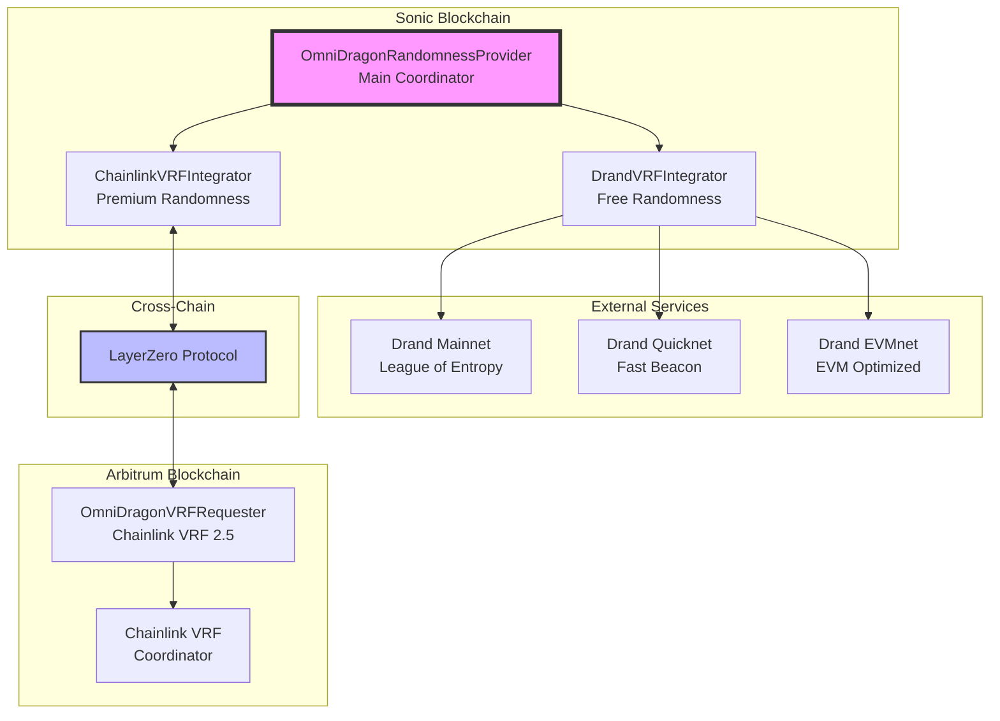

## 2. Request Flow Diagrams

### 2.1 Chainlink VRF Request Flow

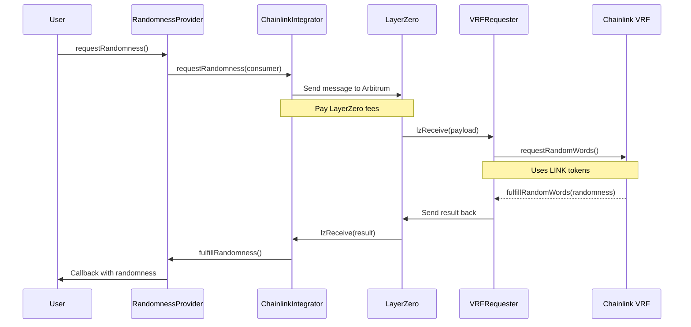

### 2.2 Drand Request Flow

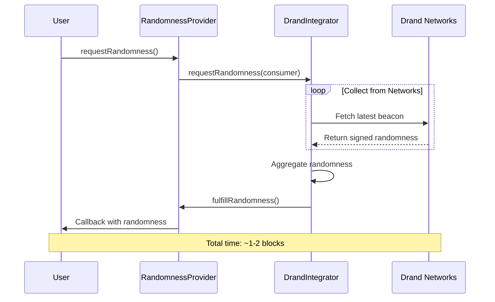

## 3. Data Flow Diagram

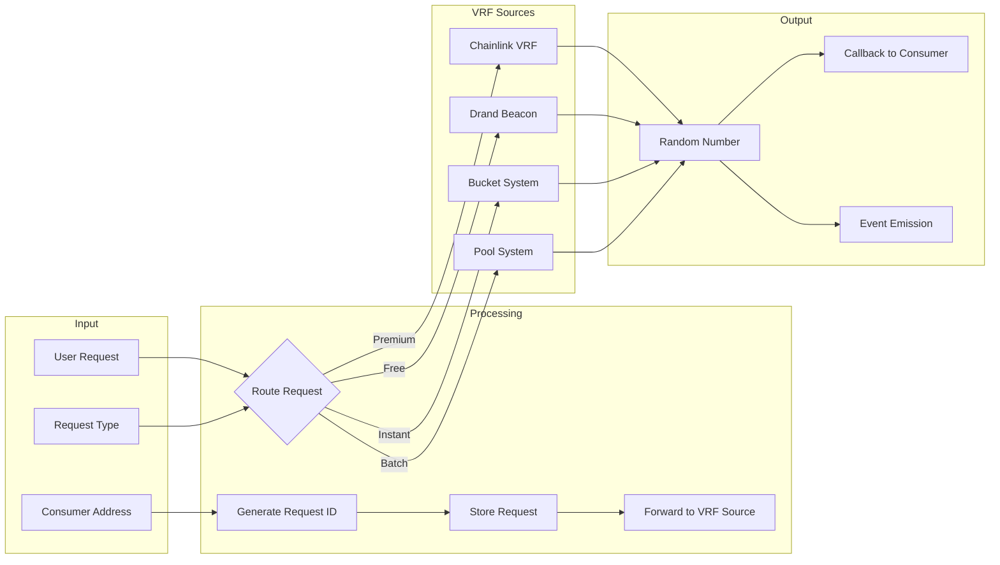

## 4. Contract Interaction Diagram

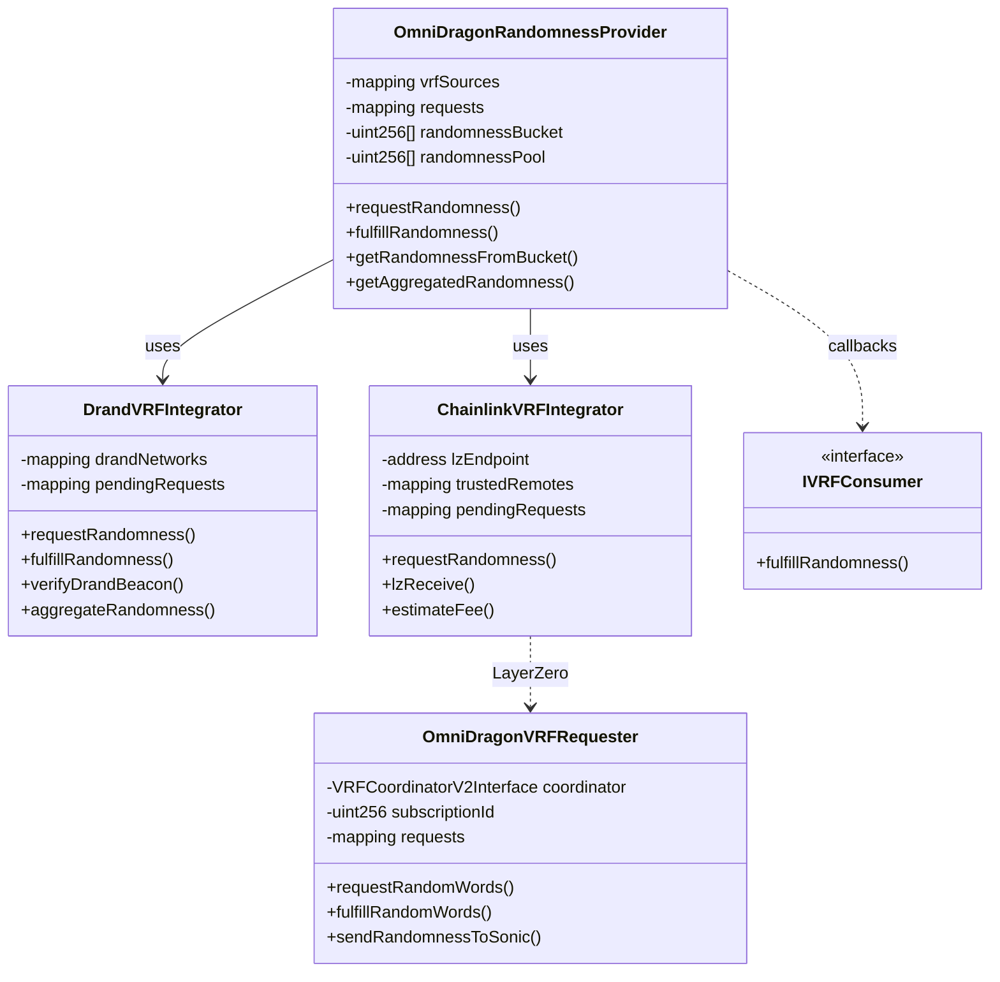

## 5. Security Architecture

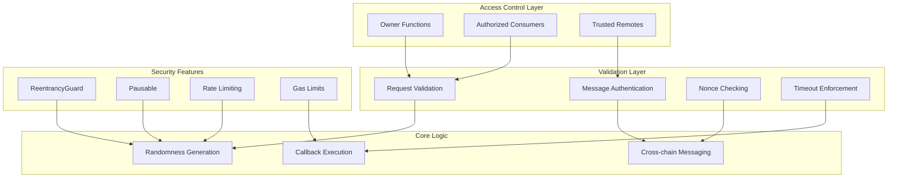

## 6. Gas Optimization Strategy

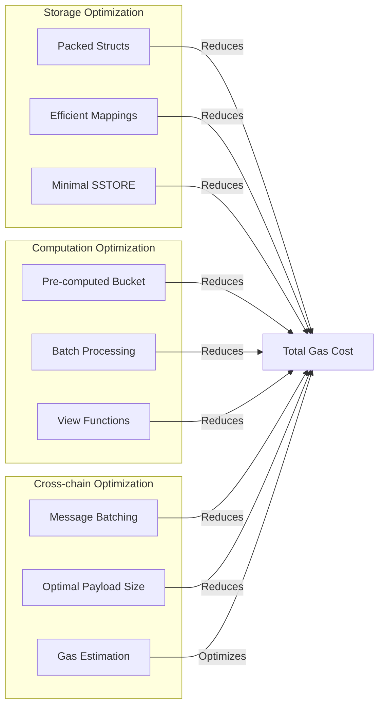

## 7. Failure Recovery Flow

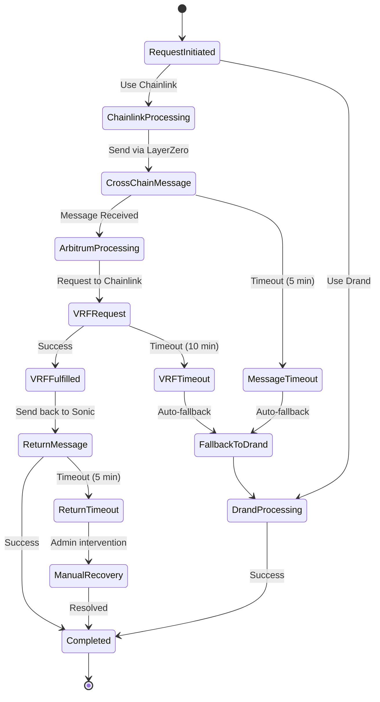

## 8. Cost Structure

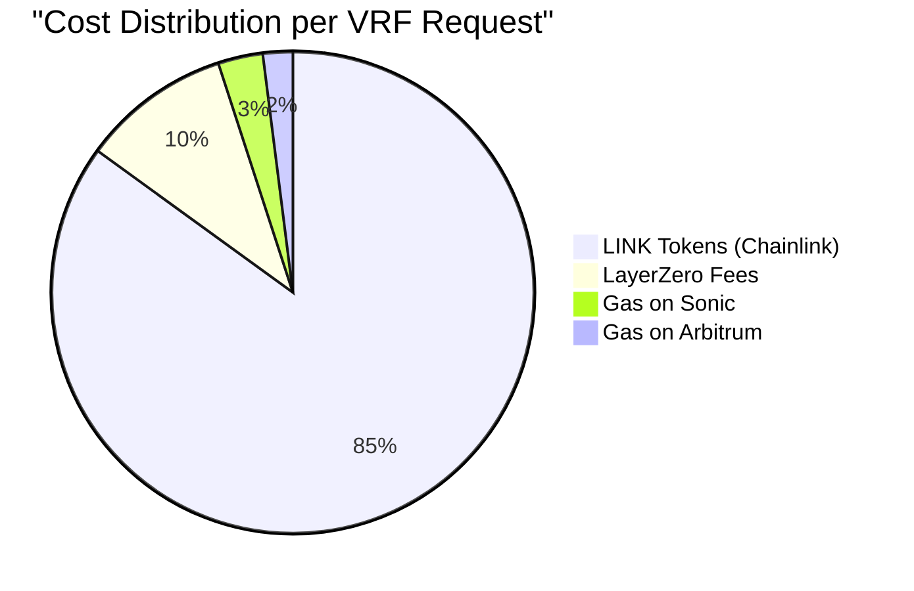

## 9. Performance Metrics

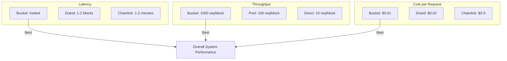

## 10. Deployment Architecture

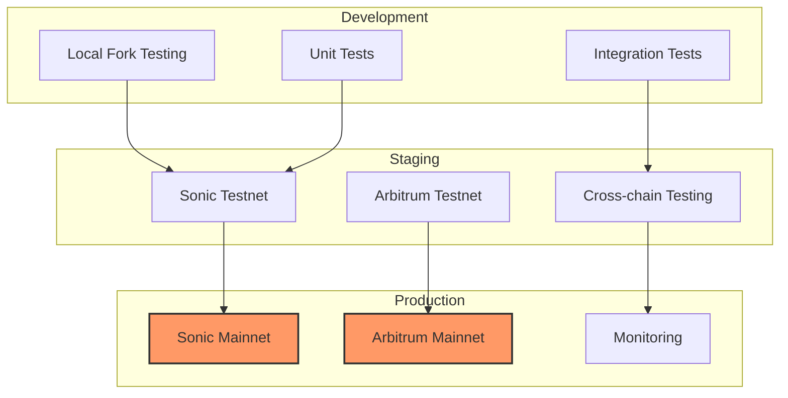

## Notes for Auditors

1. **Critical Paths**: Focus on cross-chain message flow (Section 2.1)
2. **Attack Surface**: Review Security Architecture (Section 5)
3. **Economic Model**: Understand cost structure (Section 8)
4. **Failure Modes**: Study recovery flow (Section 7)
5. **Performance**: Consider throughput limits (Section 9) 