# OmniDragon Comprehensive System Architecture

This diagram provides a complete overview of the OmniDragon ecosystem, showing how all major components interact across chains.

```mermaid
flowchart TB
    %% Define main system areas
    subgraph CrossChain ["Cross-Chain Infrastructure"]
        direction TB
        subgraph LayerZero ["LayerZero Protocol"]
            LZR["LayerZero Relayer"]:::lz
            LZE["LayerZero Endpoint"]:::lz
            LZO["LayerZero Oracle"]:::lz
        end
        
        subgraph BridgeLayer ["Token Bridge"]
            OMT_BRIDGE["OmniDragon Bridge"]:::bridge
            MSG_LIB["Messaging Library"]:::bridge
        end
    end
    
    subgraph RandomnessSystem ["Randomness System"]
        direction TB
        subgraph ExternalSources ["External VRF Sources"]
            direction LR
            DRAND["dRAND Network"]:::source
            CHAIN_VRF["Chainlink VRF"]:::source
            ARB_VRF["Arbitrum VRF"]:::source
        end
        
        subgraph Verifiers ["On-Chain Verification"]
            direction LR
            DRAND_INT["dRAND Integrator"]:::integrator
            CHAIN_INT["Chainlink Integrator"]:::integrator
            ARB_INT["Arbitrum Integrator"]:::integrator
        end
        
        subgraph Aggregation ["Aggregation Layer"]
            direction TB
            VRF_CONSUMER["VRF Consumer"]:::core
            RAND_BUFFER["Randomness Buffer"]:::core
            COMBINER["Weighted Combiner"]:::core
        end
    end
    
    subgraph CoreProtocol ["Core Protocol"]
        direction TB
        subgraph TokenSystem ["Token System"]
            TOKEN["OmniDragon Token"]:::token
            LIQ_POOL["Liquidity Pool"]:::token
            AMM["Automated Market Maker"]:::token
        end
        
        subgraph JackpotSystem ["Jackpot System"]
            VAULT["Jackpot Vault"]:::jackpot
            TRIGGER["Jackpot Trigger"]:::jackpot
            DIST["Reward Distributor"]:::jackpot
        end
        
        subgraph GovernanceSystem ["Governance"]
            DAO["DAO"]:::gov
            VETOKEN["veToken Voting"]:::gov
            PROP["Proposal System"]:::gov
        end
        
        subgraph FeeSystem ["Fee System"]
            FEE_COL["Fee Collector"]:::fee
            FEE_DIST["Fee Distributor"]:::fee
            ADAPT_FEE["Adaptive Fee Logic"]:::fee
        end
    end
    
    subgraph UserFacing ["User-Facing Applications"]
        direction LR
        WALLET["Web Wallet"]:::app
        DAPP["dApp Ecosystem"]:::app
        ANALYTICS["Analytics Dashboard"]:::app
        STAKING["Staking Interface"]:::app
    end
    
    %% Connect main components with data flow
    
    %% Cross-chain connections
    LZE <--> OMT_BRIDGE
    LZR --> LZE
    LZO --> LZE
    OMT_BRIDGE <--> MSG_LIB
    OMT_BRIDGE <--> TOKEN
    
    %% Randomness connections
    DRAND --> DRAND_INT
    CHAIN_VRF --> CHAIN_INT
    ARB_VRF --> ARB_INT
    
    DRAND_INT --> VRF_CONSUMER
    CHAIN_INT --> VRF_CONSUMER
    ARB_INT --> VRF_CONSUMER
    
    VRF_CONSUMER --> RAND_BUFFER
    RAND_BUFFER --> COMBINER
    
    %% Token system connections
    TOKEN <--> LIQ_POOL
    LIQ_POOL <--> AMM
    TOKEN --> FEE_COL
    
    %% Governance connections
    TOKEN --> VETOKEN
    VETOKEN --> DAO
    DAO --> PROP
    PROP --> TOKEN
    
    %% Fee system connections
    FEE_COL --> FEE_DIST
    ADAPT_FEE --> FEE_COL
    FEE_DIST --> VAULT
    FEE_DIST ---> DAO
    
    %% Jackpot connections
    COMBINER --> TRIGGER
    TRIGGER --> VAULT
    VAULT --> DIST
    DIST --> TOKEN
    
    %% User facing connections
    TOKEN <--> WALLET
    WALLET <--> DAPP
    ANALYTICS --> TOKEN
    ANALYTICS --> VAULT
    TOKEN <--> STAKING
    STAKING --> VETOKEN
    
    %% Define comprehensive styles
    classDef lz fill:#ede9fe,stroke:#8b5cf6,color:#5b21b6
    classDef bridge fill:#dbeafe,stroke:#3b82f6,color:#1d4ed8
    classDef source fill:#f1f5f9,stroke:#94a3b8,color:#475569
    classDef integrator fill:#e0e7ff,stroke:#6366f1,color:#4338ca
    classDef core fill:#cffafe,stroke:#06b6d4,color:#0e7490
    classDef token fill:#dbeafe,stroke:#3b82f6,color:#1d4ed8
    classDef jackpot fill:#fef9c3,stroke:#facc15,color:#a16207
    classDef gov fill:#dcfce7,stroke:#22c55e,color:#166534
    classDef fee fill:#ffedd5,stroke:#f97316,color:#c2410c
    classDef app fill:#f3e8ff,stroke:#a855f7,color:#7e22ce
    
    %% Style subgraphs
    style CrossChain fill:#f8fafc,stroke:#cbd5e1,color:#334155
    style RandomnessSystem fill:#f8fafc,stroke:#cbd5e1,color:#334155
    style CoreProtocol fill:#f8fafc,stroke:#cbd5e1,color:#334155
    style UserFacing fill:#f8fafc,stroke:#cbd5e1,color:#334155
    
    style LayerZero fill:#f5f3ff,stroke:#ddd6fe,color:#6d28d9
    style BridgeLayer fill:#eff6ff,stroke:#bfdbfe,color:#2563eb
    style ExternalSources fill:#f8fafc,stroke:#e2e8f0,color:#64748b
    style Verifiers fill:#eef2ff,stroke:#c7d2fe,color:#4f46e5
    style Aggregation fill:#ecfeff,stroke:#a5f3fc,color:#0891b2
    style TokenSystem fill:#eff6ff,stroke:#bfdbfe,color:#2563eb
    style JackpotSystem fill:#fefce8,stroke:#fef08a,color:#ca8a04
    style GovernanceSystem fill:#f0fdf4,stroke:#bbf7d0,color:#16a34a
    style FeeSystem fill:#fff7ed,stroke:#fed7aa,color:#ea580c
```

## Component Descriptions

### Cross-Chain Infrastructure
- **LayerZero Protocol**: Enables seamless cross-chain message passing
- **Token Bridge**: Facilitates token transfers between different blockchain networks

### Randomness System
- **External VRF Sources**: Provide verifiable random inputs from various networks
- **On-Chain Verification**: Validates external randomness proofs
- **Aggregation Layer**: Combines multiple sources of randomness for enhanced security

### Core Protocol
- **Token System**: The OmniDragon token and related trading infrastructure
- **Jackpot System**: Manages the accumulation and distribution of rewards
- **Governance System**: Enables community-based decision making
- **Fee System**: Handles fee collection and distribution

### User-Facing Applications
- **Web Wallet**: Interface for users to manage tokens
- **dApp Ecosystem**: Third-party applications built on OmniDragon
- **Analytics Dashboard**: Provides system statistics and performance metrics
- **Staking Interface**: Allows users to stake tokens for governance rights 