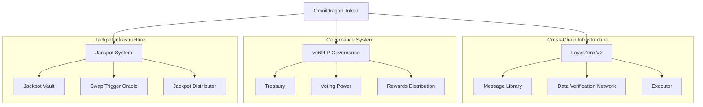
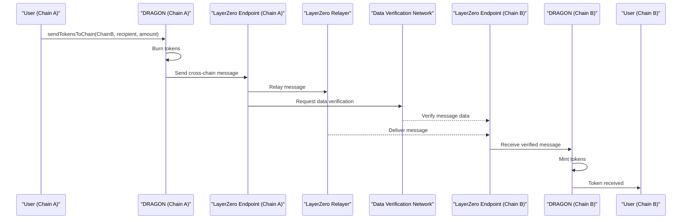
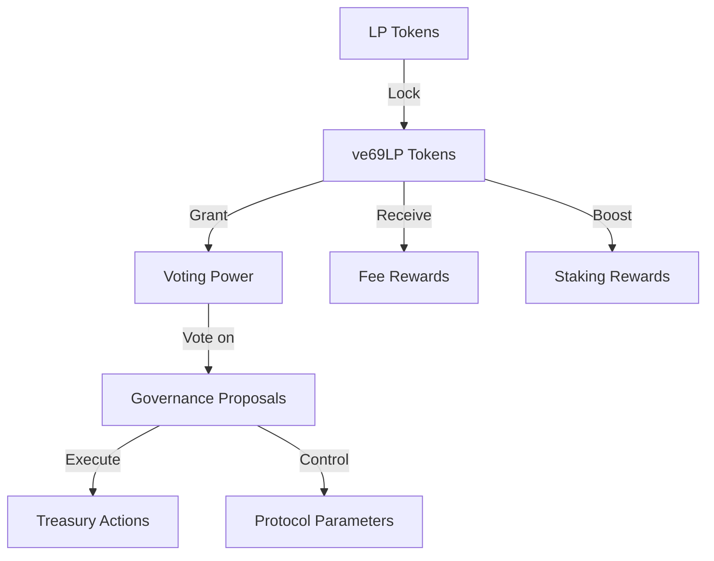
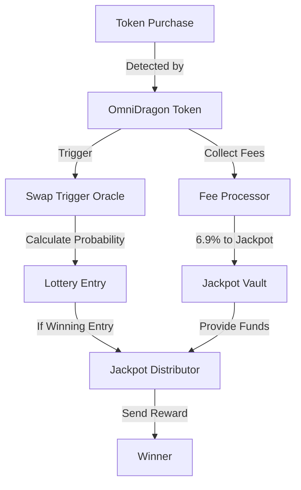
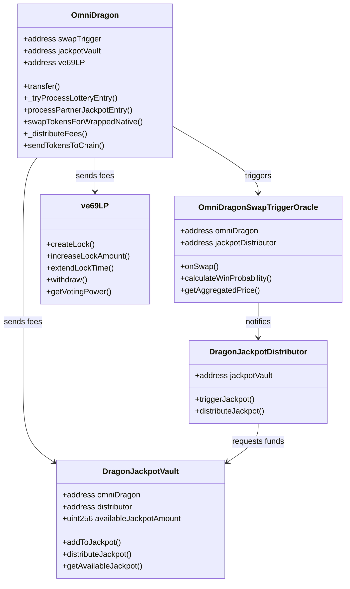
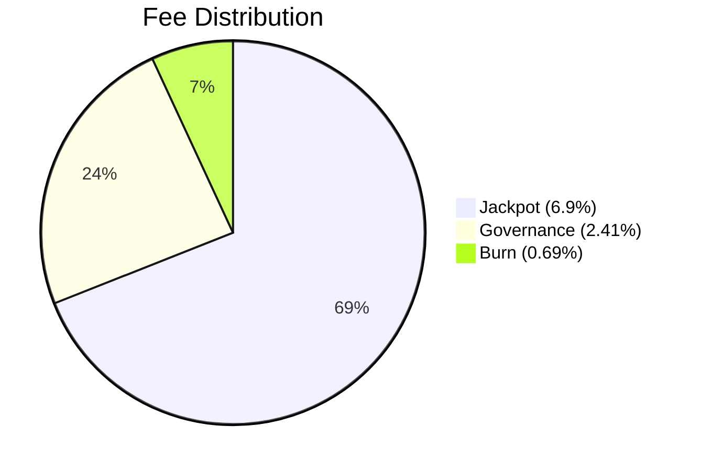

# Architecture

The Sonic Red Dragon ecosystem is built on a modular, extensible architecture designed for cross-chain compatibility, security, and scalability.

## System Overview

At a high level, the Sonic Red Dragon architecture consists of several interconnected components:

## Core Components

### OmniDragon Token

The OmniDragon token serves as the foundation of the ecosystem. It implements:

- ERC-20 standard functionality
- Cross-chain compatibility via LayerZero V2
- Fee collection and distribution
- Jackpot entry triggering for buy transactions
- Governance integration

### Cross-Chain Infrastructure

The cross-chain functionality is powered by LayerZero V2:

### Governance System

The governance system is based on the ve69LP (vote-escrowed) model:

### Jackpot System

The jackpot system provides on-chain lottery functionality:

## Technical Relationships

The relationship between the contracts can be visualized as follows:

## Multi-Chain Deployment

The Sonic Red Dragon ecosystem is deployed on multiple blockchains with identical functionality on each chain:

| Chain | Layer Type | Primary Use Cases |
|-------|------------|------------------|
| Ethereum | L1 | Governance, Security, Prime Liquidity |
| BNB Chain | L1 | High Throughput, Lower Fees |
| Arbitrum | L2 | Scaling, Lower Fees |
| Avalanche | L1 | Fast Finality, EVM Compatible |
| Base | L2 | Scaling, Lower Fees |

## Security Model

The security architecture is built on several principles:

1. **Multi-Layered Access Controls**: Role-based permissions with strict validation
2. **Economic Security**: Fee mechanism and incentive alignment
3. **Oracle Diversity**: Multiple price feeds for reliable market data
4. **Governance Time-Locks**: Delay periods for critical changes
5. **External Verification**: LayerZero DVN provides additional security layer

## Fee Flow

The token implements a fee model that distributes transaction fees as follows:

## Integration Points

The system exposes several integration points for partners and extensions:

1. **Partner Jackpot Program**: Special jackpot entries for integrated pools
2. **Cross-Chain Messaging**: LayerZero integration for cross-chain communication
3. **Governance Hooks**: Extensible governance for protocol evolution
4. **Oracle Aggregation**: Multiple price feed sources for reliability
