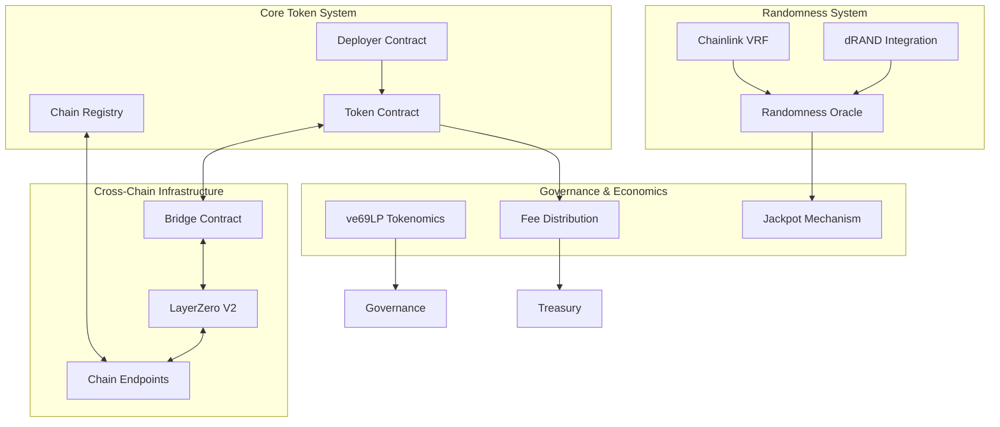
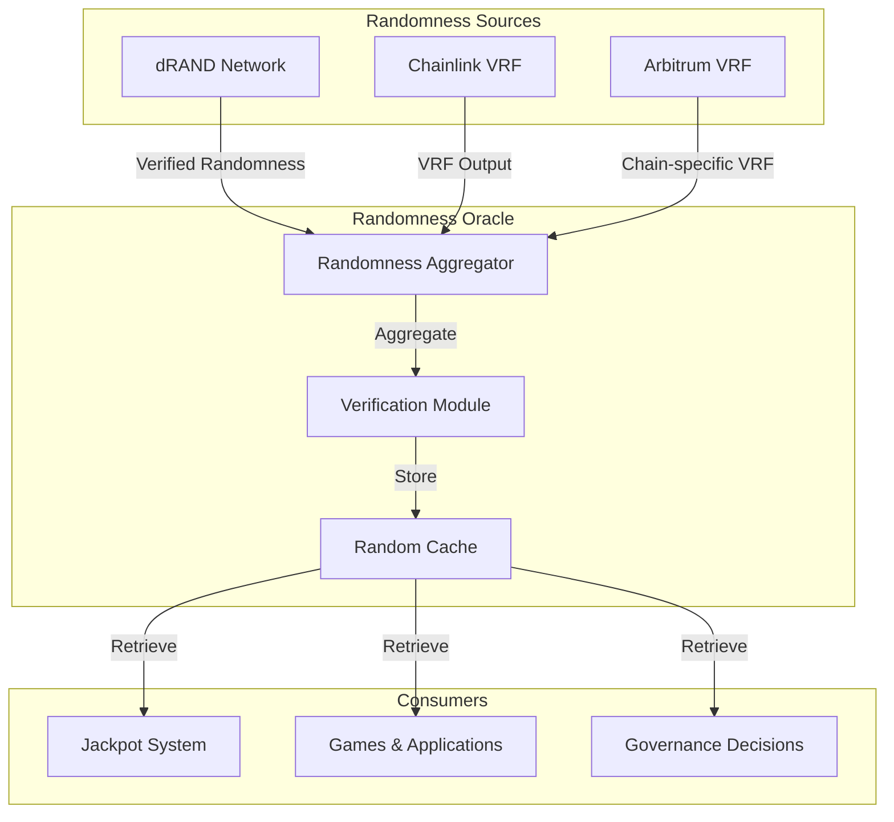
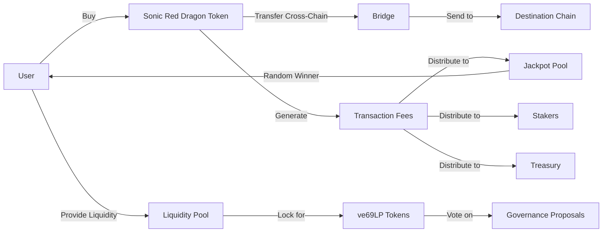

# Architecture

Sonic Red Dragon implements a comprehensive, multi-layered architecture that combines advanced blockchain technologies to create a secure, efficient, and feature-rich cross-chain token ecosystem.

## System Overview

The Sonic Red Dragon architecture consists of four main components that work together to provide its core functionality:

## Core Token System

The Core Token System implements the main ERC-20 compatible token with enhanced features:

1. **Token Contract**: Implements the ERC-20 interface with additional cross-chain capabilities
2. **Deployer Contract**: Manages the deployment of token contracts across different chains
3. **Chain Registry**: Maintains a registry of supported chains and their configurations

The token implementation includes role-based access control, pausable transfers for emergency situations, and integration points for the fee and jackpot mechanics.

## Cross-Chain Infrastructure

Sonic Red Dragon leverages LayerZero V2 for its cross-chain messaging capabilities:

1. **LayerZero Integration**: Enables secure cross-chain messaging with optimistic security
2. **Chain Endpoints**: Custom endpoints for each supported blockchain
3. **Bridge Contract**: Manages token transfers between chains

This infrastructure ensures that tokens can be seamlessly moved across different blockchains while maintaining security and consistency of the token supply.

## Randomness System

One of Sonic Red Dragon's unique features is its verifiable randomness system:

1. **dRAND Integration**: Primary source of verifiable randomness from the League of Entropy
2. **Chainlink VRF**: Secondary source for additional randomness verification
3. **Randomness Oracle**: Aggregates and verifies random values from multiple sources

This multi-source approach ensures that randomness cannot be manipulated, providing a secure foundation for the jackpot system and other random-dependent features.

## Governance & Economics

The economic model of Sonic Red Dragon is designed for long-term sustainability:

1. **ve69LP Tokenomics**: Vote-escrowed liquidity provider tokens for governance
2. **Fee System**: Transaction fees distributed to stakers, treasury, and jackpot
3. **Jackpot Mechanism**: Periodic random distribution of accumulated fees

## User Journey

This architecture provides a comprehensive foundation for the Sonic Red Dragon ecosystem, enabling advanced features while maintaining security and decentralization.

## Technical Implementation

At the technical level, all contracts are written in Solidity with a focus on:

1. Gas optimization for cost-effective operations
2. Comprehensive security measures including formal verification
3. Upgradability patterns for critical components
4. Extensive testing and auditing

For more detailed information about specific components, please refer to the corresponding sections in the documentation.
