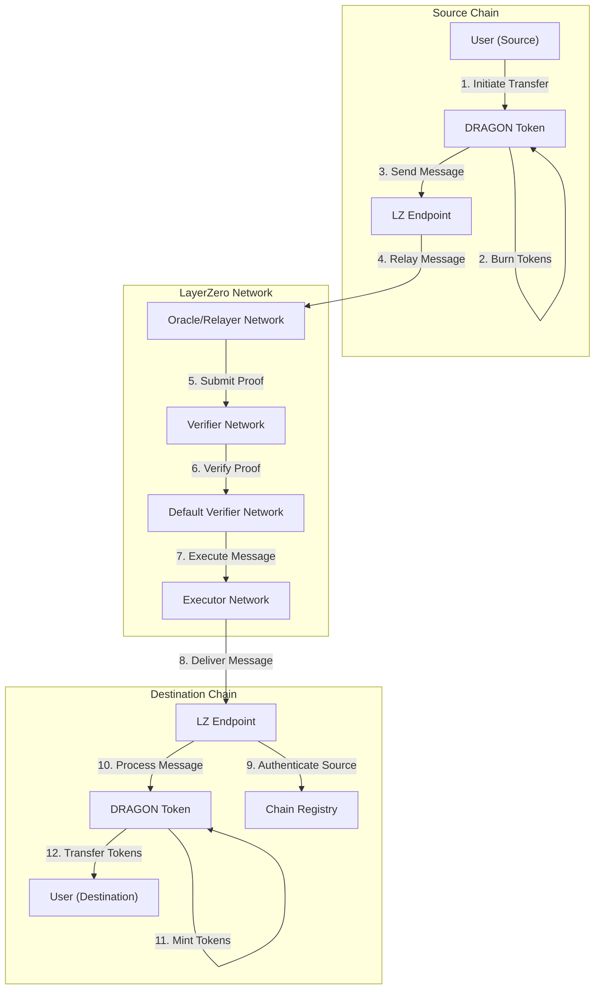
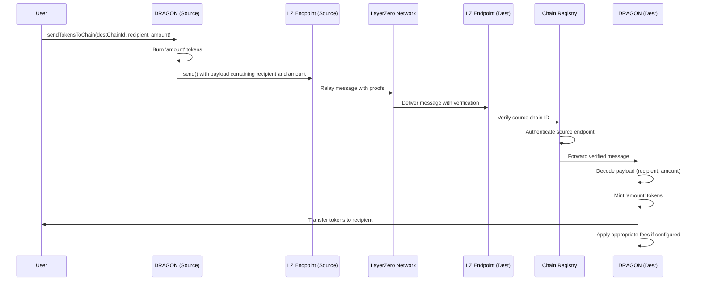
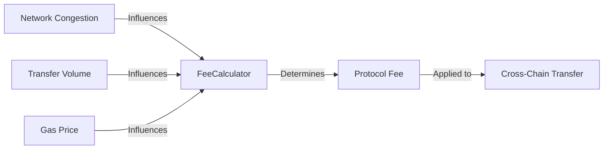

# Cross-Chain Functionality

Sonic Red Dragon is designed from the ground up to be a truly cross-chain token, enabling seamless asset transfers across multiple blockchain networks while maintaining a unified token economy.

## Overview

The cross-chain functionality of Sonic Red Dragon is powered by LayerZero V2, an omnichain interoperability protocol that provides secure and trustless messaging between blockchains. This integration allows users to transfer DRAGON tokens between supported chains with minimal friction while maintaining the token's unique features across all networks.

## Cross-Chain Architecture



## How Cross-Chain Transfers Work

The DRAGON token employs a burn-and-mint model for cross-chain transfers:

1. **Source Chain Actions**:
   - User initiates a transfer on the source chain
   - Tokens are burned on the source chain
   - A message is sent to the destination chain via LayerZero
   
2. **Cross-Chain Messaging**:
   - LayerZero relayers and validators submit proofs to destination chain
   - Default Verifier Network (DVN) verifies the authenticity of the message
   
3. **Destination Chain Actions**:
   - Message is received and authenticated by the Chain Registry
   - Equivalent tokens are minted on the destination chain
   - Tokens are transferred to the recipient address

### Detailed Flow



## Chain Registry

The Chain Registry is a critical component of the cross-chain architecture, responsible for:

1. **Chain Configuration**: Manages supported chains and their LayerZero endpoint addresses
2. **Security Verification**: Ensures messages come from authenticated sources
3. **Parameter Management**: Stores and manages chain-specific parameters
4. **Gas Estimation**: Provides estimated gas requirements for cross-chain operations

```solidity
interface IChainRegistry {
    function getEndpoint(uint16 chainId) external view returns (address);
    function isRegisteredChain(uint16 chainId) external view returns (bool);
    function addChain(uint16 chainId, address endpoint, bytes calldata path) external;
    function removeChain(uint16 chainId) external;
    function estimateGasForTransfer(uint16 chainId, uint256 amount) external view returns (uint256);
}
```

## Supported Chains

Sonic Red Dragon supports cross-chain functionality on the following networks:

| Chain | Chain ID | Status |
|-------|----------|--------|
| Ethereum | 101 | Active |
| BNB Chain | 102 | Active |
| Avalanche | 106 | Active |
| Arbitrum | 110 | Active |
| Base | 184 | Active |
| Optimism | 111 | Coming Soon |
| Polygon | 109 | Coming Soon |

## Cross-Chain Fee Structure

When transferring DRAGON tokens cross-chain, users need to be aware of two types of fees:

1. **LayerZero Fees**: Native gas fees for message relaying and execution
2. **Protocol Fees**: Optional DRAGON token fees for cross-chain transfers

### Fee Calculation

The total cost for a cross-chain transfer consists of:

```
Total Cost = Native Gas Fee + Protocol Fee
```

Where:
- **Native Gas Fee**: Paid in the source chain's native token (ETH, BNB, etc.)
- **Protocol Fee**: Paid in DRAGON tokens (if enabled)

## Security Considerations

The cross-chain system implements several security measures:

1. **Trusted Remote Verification**: Only registered source chains can trigger token minting
2. **Message Authentication**: Cryptographic verification of message sources
3. **Rate Limiting**: Protection against excessive minting on destination chains
4. **Emergency Pause**: Ability to pause cross-chain transfers in case of security concerns

## User Experience

From a user perspective, cross-chain transfers are designed to be simple and straightforward:

1. **Initiation**: User selects destination chain, recipient address, and amount
2. **Gas Estimation**: System provides an estimate of required gas fees
3. **Confirmation**: User confirms the transaction and pays the required fees
4. **Tracking**: User can track the status of the cross-chain transfer
5. **Receipt**: Tokens are received on the destination chain (typically within minutes)

## Integration Example

```solidity
// Example of initiating a cross-chain transfer
function transferCrossChain(
    uint16 destinationChainId,
    address recipient,
    uint256 amount
) external payable {
    // Convert recipient address to bytes
    bytes memory recipientBytes = abi.encodePacked(recipient);
    
    // Estimate required gas
    uint256 nativeFee = dragonToken.estimateSendFee(
        destinationChainId,
        recipientBytes,
        amount,
        false,
        bytes("")
    );
    
    // Ensure sufficient gas is provided
    require(msg.value >= nativeFee, "Insufficient gas for cross-chain transfer");
    
    // Initiate cross-chain transfer
    dragonToken.sendTokensToChain{value: nativeFee}(
        destinationChainId,
        recipientBytes,
        amount,
        payable(msg.sender), // refund address
        address(0), // zero payment address
        bytes("") // adapter parameters
    );
}
```

## Advanced Features

### 1. Adaptive Fee Scaling

The cross-chain system can dynamically adjust protocol fees based on network conditions:



### 2. Batched Transfers

For efficiency, multiple transfers can be batched into a single cross-chain message:

```solidity
function batchSendTokensToChain(
    uint16 destinationChainId,
    bytes[] memory recipients,
    uint256[] memory amounts,
    address payable refundAddress,
    address zroPaymentAddress,
    bytes memory adapterParams
) external payable;
```

### 3. Advanced Message Passing

Beyond simple token transfers, the cross-chain infrastructure supports arbitrary message passing:

```solidity
function sendMessage(
    uint16 destinationChainId,
    bytes memory destination,
    bytes memory message,
    address payable refundAddress,
    address zroPaymentAddress,
    bytes memory adapterParams
) external payable;
```

This enables complex cross-chain functionality such as governance votes, jackpot triggers, and other advanced features.
