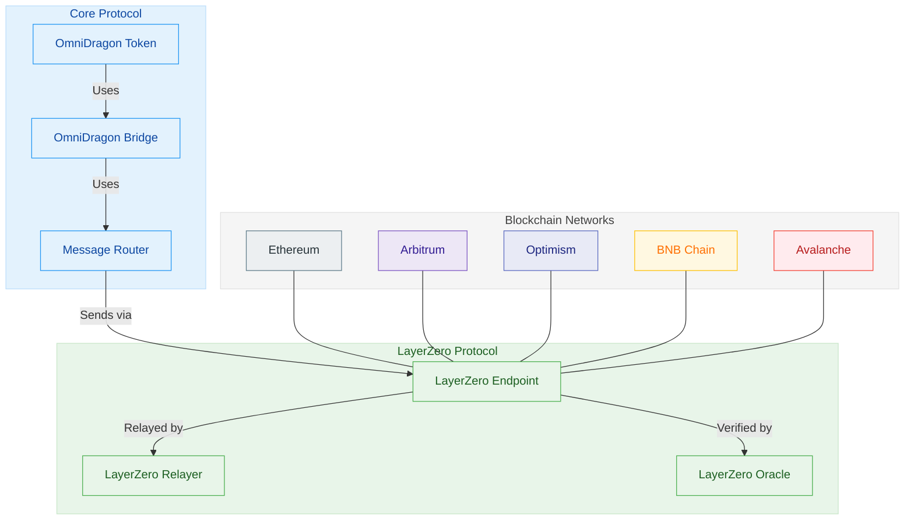
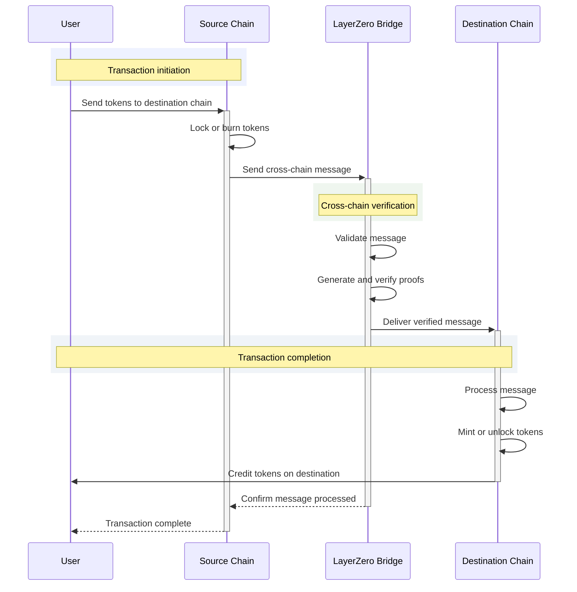
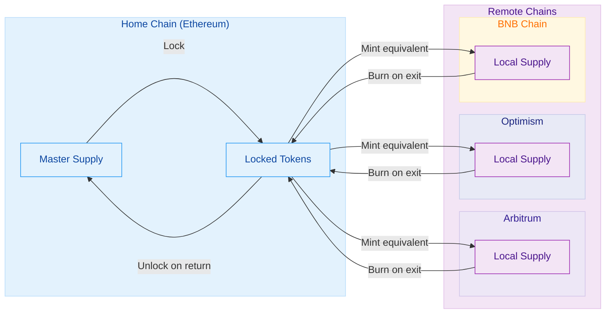
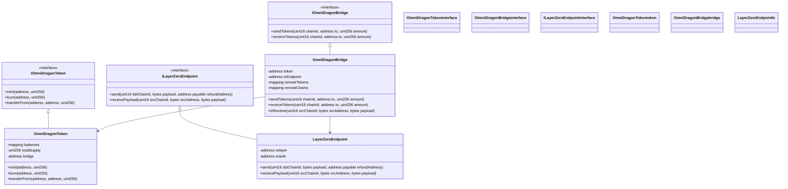

# OmniDragon Cross-Chain Architecture

OmniDragon is built from the ground up as a cross-chain token system, enabling seamless operations across multiple blockchains while maintaining coherent state and security.

## System Architecture

The diagram below illustrates the high-level architecture of OmniDragon's cross-chain functionality:

## Message Flow Sequence

The sequence diagram below demonstrates how messages and tokens flow between chains:

## Token Consistency Model

OmniDragon maintains token supply consistency across chains using a hybrid lock/mint model:

## Contract Architecture

The following class diagram shows the key contracts that enable cross-chain functionality:

## Security Features

OmniDragon's cross-chain system implements multiple security measures:

1. **Message Verification**: All cross-chain messages are cryptographically verified
2. **Oracle Validation**: Independent oracle networks verify cross-chain state
3. **Consistency Checks**: Built-in checks ensure token supply consistency across chains
4. **Relayer Redundancy**: Multiple relayers ensure message delivery
5. **Timeout Handling**: Automatic handling of timeout conditions with recovery mechanisms

By leveraging LayerZero's secure cross-chain messaging infrastructure and adding OmniDragon-specific security measures, the system ensures reliable and secure token movement across blockchain networks.
