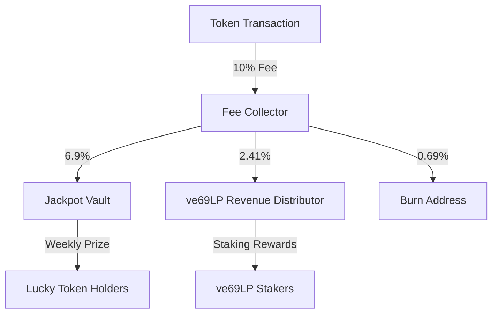
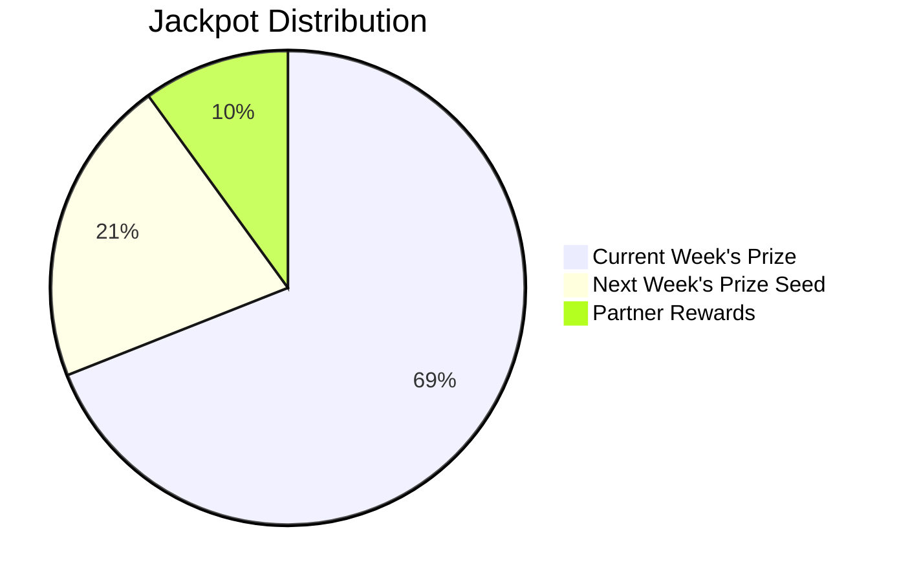

import TokenFeeAnimation from '@site/src/components/TokenFeeAnimation';
import EnhancedMermaid from '@site/src/components/EnhancedMermaid';

# OmniDragon Token Fee System

This page provides a detailed explanation of OmniDragon's token fee structure, including how fees are collected, processed, and distributed throughout the ecosystem.

## Interactive Fee Flow Visualization

<TokenFeeAnimation />

## Fee Structure

OmniDragon implements a multi-tier fee structure designed to sustain the ecosystem through multiple mechanisms:

### Buy & Sell Fees (10%)

For both buy and sell transactions, a 10% fee is applied, distributed as follows:

- **6.9%** - Directed to the Jackpot Vault, funding prizes for token holders
- **2.41%** - Allocated to ve69LP stakers through the Revenue Distributor
- **0.69%** - Permanently burned, reducing total supply

### Transfer Fees (0.69%)

For regular transfers between wallets (not involving liquidity pools), a reduced fee applies:

- **0.69%** - Permanently burned, reducing total supply



## Fee Processing Mechanism

When a swap occurs, fees are collected in $DRAGON tokens. The contract accumulates these tokens until a threshold is reached, then automatically performs the following actions:

1. Swaps accumulated $DRAGON tokens for wrapped native tokens (e.g., WETH)
2. Distributes the wrapped native tokens to:
   - Jackpot Vault (69% of fees)
   - Revenue Distributor (24.1% of fees)
3. Burns the remaining portion (6.9% of fees)

```solidity
function swapTokensForWrappedNative(uint256 tokenAmount) private lockTheSwap {
    // Skip if router or token amount is not valid
    if (uniswapRouter == address(0) || tokenAmount == 0) return;
    
    // Get router interface
    IUniswapRouter router = IUniswapRouter(uniswapRouter);
    
    // Cache wrapped native token address for gas savings
    address wrappedToken = wrappedNativeToken;
    
    // Approve router to spend tokens - only approve what's needed
    _approve(address(this), uniswapRouter, tokenAmount);
    
    // Set up the swap path
    address[] memory path = new address[](2);
    path[0] = address(this);
    path[1] = wrappedToken;
    
    // Store balance before swap for accurate received amount calculation
    uint256 balanceBefore = IERC20(wrappedToken).balanceOf(address(this));
    
    // Execute the swap
    router.swapExactTokensForTokensSupportingFeeOnTransferTokens(
        tokenAmount,
        0, // Accept any amount of wrapped native
        path,
        address(this),
        block.timestamp + 300
    );
    
    // Calculate how much we received and distribute
    uint256 wrappedNativeReceived = IERC20(wrappedToken).balanceOf(address(this)) - balanceBefore;
    
    emit SwapAndLiquify(tokenAmount, wrappedNativeReceived);
    
    // Skip distribution if nothing was received
    if (wrappedNativeReceived == 0) return;
    
    // Calculate fee distribution using cached variables for gas efficiency
    uint256 totalFeeBasis = buyFees.jackpot + buyFees.ve69LP;
    
    // Avoid division by zero
    if (totalFeeBasis == 0) return;
    
    uint256 jackpotShare = (wrappedNativeReceived * buyFees.jackpot) / totalFeeBasis;
    uint256 ve69Share = wrappedNativeReceived - jackpotShare; // Optimized to avoid additional math
    
    // Distribute fees
    _distributeFees(jackpotShare, ve69Share);
}
```

## Jackpot Mechanics

The Jackpot Vault accumulates 6.9% of all buy and sell fees. This creates a growing prize pool that is awarded to lucky token holders on a regular schedule.



## Benefits of the Fee Structure

OmniDragon's fee structure provides several key benefits to the ecosystem:

1. **Sustainable Rewards**: The Jackpot system creates ongoing incentives for holding tokens
2. **Governance Incentives**: ve69LP stakers receive a share of all transaction fees
3. **Deflationary Mechanism**: Continuous burning creates a deflationary effect, potentially increasing token value over time
4. **Ecosystem Growth**: Fee revenue funds further development and expansion

## Fee Exclusions

Certain addresses are excluded from fees to ensure proper ecosystem functioning:

- Contract addresses (OmniDragon, Jackpot Vault, etc.)
- Wrapped native token addresses
- Owner address (for initial setup and emergency operations)
- Partner pool addresses

This ensures that internal system operations don't incur unnecessary fees.

## How to Configure Fees (Owner Only)

Fee percentages can be adjusted by the contract owner if needed, with the following limitations:

- Total fees cannot exceed 15% (gas optimization and fairness constraint)
- Individual fee components can be adjusted separately for buys, sells, and transfers

```solidity
function setBuyFees(uint256 jackpotFee, uint256 ve69Fee, uint256 burnFee) external onlyOwner {
    buyFees.total = _validateFees(jackpotFee, ve69Fee, burnFee);
    buyFees.jackpot = jackpotFee;
    buyFees.ve69LP = ve69Fee;
    buyFees.burn = burnFee;
    
    emit FeesUpdated("Buy", jackpotFee, ve69Fee, burnFee, buyFees.total);
}
```

This flexible structure allows for future optimization of the fee model while maintaining its core benefits. 