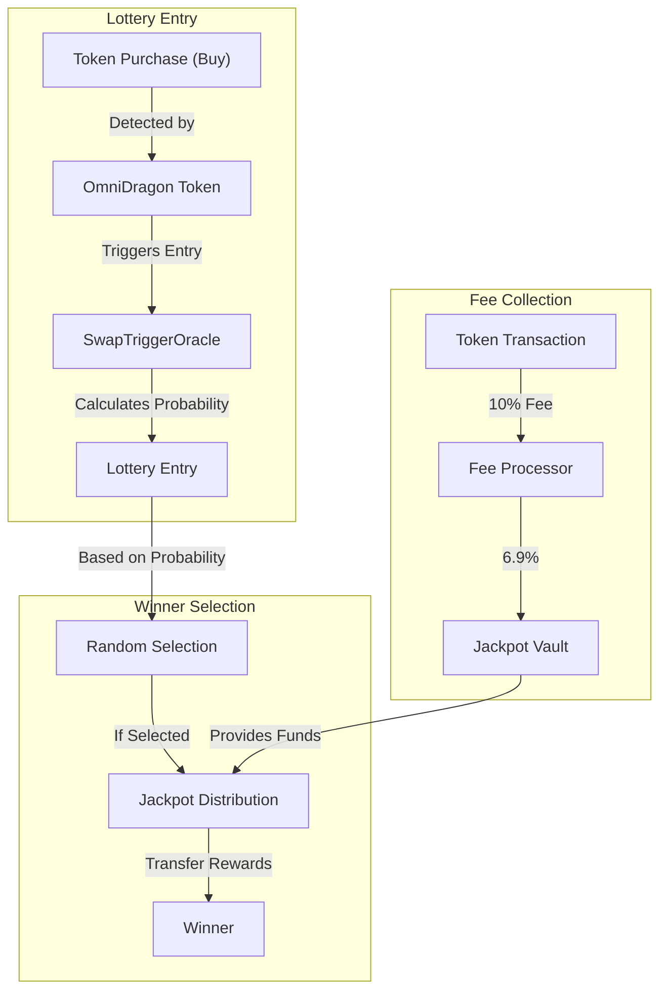
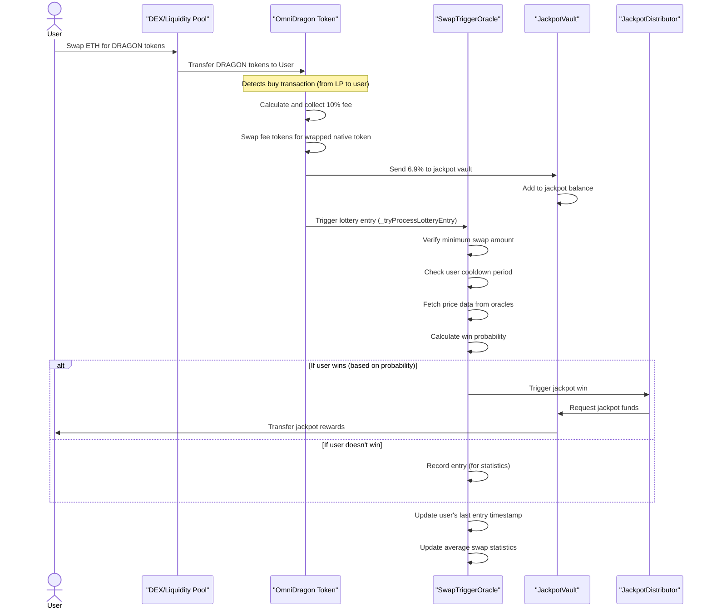
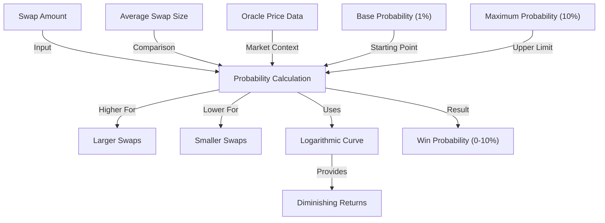

# Jackpot System

The Sonic Red Dragon jackpot system is a core feature of the ecosystem, providing an innovative on-chain lottery mechanism that rewards token buyers with a chance to win jackpot prizes.

## System Overview

The jackpot system introduces an exciting element of randomized rewards to the Sonic Red Dragon ecosystem through a sophisticated, probability-based lottery mechanism:



## How It Works

The jackpot system operates through the orchestration of three primary smart contracts:

1. **OmniDragon Token**: Collects fees and detects buy transactions
2. **OmniDragonSwapTriggerOracle**: Processes lottery entries and calculates win probability
3. **DragonJackpotVault**: Stores collected fees until distribution
4. **DragonJackpotDistributor**: Handles the distribution of jackpot rewards to winners

### Complete Flow Sequence

The following sequence diagram illustrates the complete jackpot process from transaction to potential win:



## Probability Calculation

The win probability for each lottery entry is calculated using a sophisticated algorithm that considers multiple factors:



The algorithm creates a probability curve that:
1. Starts at a base probability (typically 1%)
2. Increases as swap size increases (larger buys = higher chance)
3. Uses a logarithmic curve to provide diminishing returns for very large swaps
4. Is capped at a maximum probability (typically 10%)

## Key Components

### OmniDragon Token

The token contract handles fee collection and lottery entry triggering:

```solidity
function _transfer(address from, address to, uint256 amount) internal override {
    // ... other transfer logic ...
    
    // Process lottery entry ONLY for buys (from liquidity pool to user)
    if (swapTrigger != address(0) && isPairFrom) {
        _tryProcessLotteryEntry(to, amount);
    }
}

function _tryProcessLotteryEntry(address user, uint256 amount) private {
    try IOmniDragonSwapTriggerOracle(swapTrigger).onSwap(user, amount) {
        // Successful entry processing
    } catch {
        // Silently handle any failures
    }
}
```

### Swap Trigger Oracle

The oracle contract handles lottery entry processing and probability calculation:

```solidity
function onSwap(address user, uint256 amount) external override onlyOmniDragon {
    require(user != address(0), "Zero user");
    require(amount >= minSwapAmount, "Swap too small");
    require(block.timestamp >= lastEntry[user] + cooldownPeriod, "Cooldown active");

    // Calculate win probability for this swap
    uint256 probability = calculateWinProbability(amount);
    
    // ... record entry details ...
    
    // Check if this entry is a winner
    if (_isWinner(probability)) {
        // Trigger jackpot distribution
        if (jackpotDistributor != address(0)) {
            IDragonJackpotDistributor(jackpotDistributor).triggerJackpot(user);
        }
    }
    
    emit LotteryEntry(user, amount, block.timestamp, probability);
}
```

### Jackpot Vault

The vault contract securely stores jackpot funds:

```solidity
function addToJackpot(uint256 amount) external override onlyOmniDragon {
    require(amount > 0, "Zero amount");
    
    // Update jackpot balances
    totalJackpotAmount += amount;
    availableJackpotAmount += amount;
    
    emit JackpotDeposit(msg.sender, amount, totalJackpotAmount);
}

function distributeJackpot(address winner, uint256 amount) external override onlyDistributor {
    require(winner != address(0), "Zero address");
    require(amount > 0, "Zero amount");
    require(amount <= availableJackpotAmount, "Insufficient funds");
    
    // Update available amount
    availableJackpotAmount -= amount;
    
    // Transfer jackpot to winner
    IERC20(wrappedToken).safeTransfer(winner, amount);
    
    emit JackpotDistributed(winner, amount, availableJackpotAmount);
}
```

## Anti-Abuse Protections

The system implements multiple safeguards to prevent abuse and ensure fairness:

1. **Minimum Swap Amount**: Users must make a minimum-sized purchase to be eligible
   ```solidity
   require(amount >= minSwapAmount, "Swap too small");
   ```

2. **Cooldown Period**: Users must wait between lottery entries
   ```solidity
   require(block.timestamp >= lastEntry[user] + cooldownPeriod, "Cooldown active");
   ```

3. **Authorization Checks**: Only authorized contracts can trigger key functions
   ```solidity
   require(msg.sender == omniDragon, "Not authorized");
   ```

4. **Oracle Price Verification**: Uses multiple price sources for reliability
   ```solidity
   if (validPrices < minimumOracleResponses) {
       return (0, false); // Not enough reliable price sources
   }
   ```
   
5. **Probability Caps**: Maximum win probability is capped
   ```solidity
   return probability > maxWinProbability ? maxWinProbability : probability;
   ```

## Special Features

### Partner Jackpot Integration

The system supports special partner integrations that can trigger jackpot entries:

```solidity
function processPartnerJackpotEntry(address _user, uint256 _amount) external {
    // Only partner pools can call this
    if (!isPartnerPool[msg.sender]) revert NotPartnerPool();
    
    if (_user == address(0)) revert ZeroAddress();
    if (_amount == 0) revert ZeroAmount();
    
    // Process lottery entry if swap trigger is set
    if (swapTrigger != address(0)) {
        _tryProcessLotteryEntry(_user, _amount);
    }
    
    emit PartnerJackpotTriggered(_user, msg.sender, _amount);
}
```

### Multiple Jackpot Tiers

The system supports multiple jackpot tiers with different win probabilities:

| Tier | Description | Probability | Reward |
|------|-------------|-------------|--------|
| Grand | Main jackpot | Base calculation | Full jackpot |
| Partner | Through integrated partners | Custom calculation | Partner-defined |

## User Experience

From a user perspective, the jackpot system is extremely simple:

1. **Buy DRAGON Tokens**: Simply purchase tokens from a DEX or liquidity pool
2. **Automatic Entry**: Your purchase automatically enters you into the jackpot lottery
3. **Possible Win**: Based on your purchase size, you may instantly win the jackpot
4. **Reward Distribution**: If you win, rewards are automatically sent to your wallet

There's no need to claim entries, submit forms, or take any additional actions - the entire system operates automatically with each token purchase.

## Future Extensions

The jackpot system is designed for extensibility and can be enhanced in several ways:

1. **Multiple Jackpot Tiers**: Different prize levels with varying probabilities
2. **Time-Based Jackpots**: Guaranteed distribution after set time periods
3. **Special Events**: Boosted jackpot probabilities during special events
4. **Cross-Chain Jackpots**: Unified jackpot pool across multiple blockchains

## FAQs

**Q: How is the win probability calculated?**  
A: Win probability is primarily based on the size of your token purchase, using a logarithmic curve that gives higher probability to larger purchases but with diminishing returns. The base probability is typically 1%, with a maximum of 10% for very large purchases.

**Q: Are there any requirements to participate?**  
A: Yes, you must purchase at least the minimum required amount of tokens in a single transaction, and respect the cooldown period between entries.

**Q: How do I know if I've won?**  
A: If you win, the jackpot amount will be automatically transferred to your wallet, and an event will be emitted on-chain that can be tracked by monitoring tools.

**Q: Is the system fair and transparent?**  
A: Yes, the entire system operates on-chain with verifiable smart contract code. The probability calculation and winner selection process are fully transparent and can be audited by anyone. 