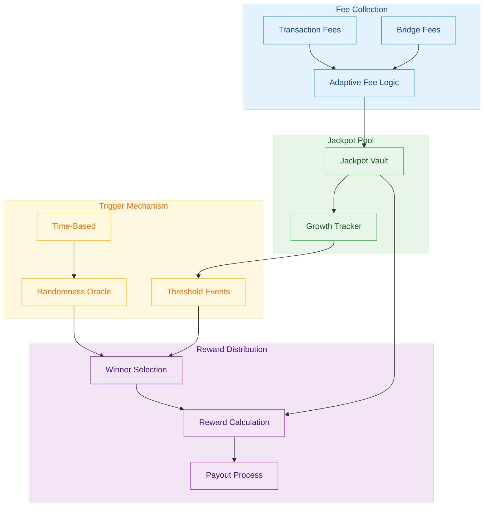
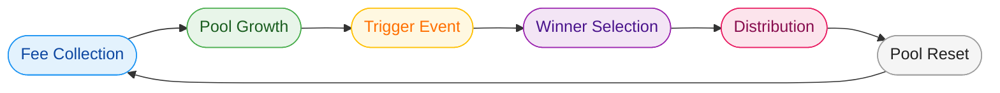
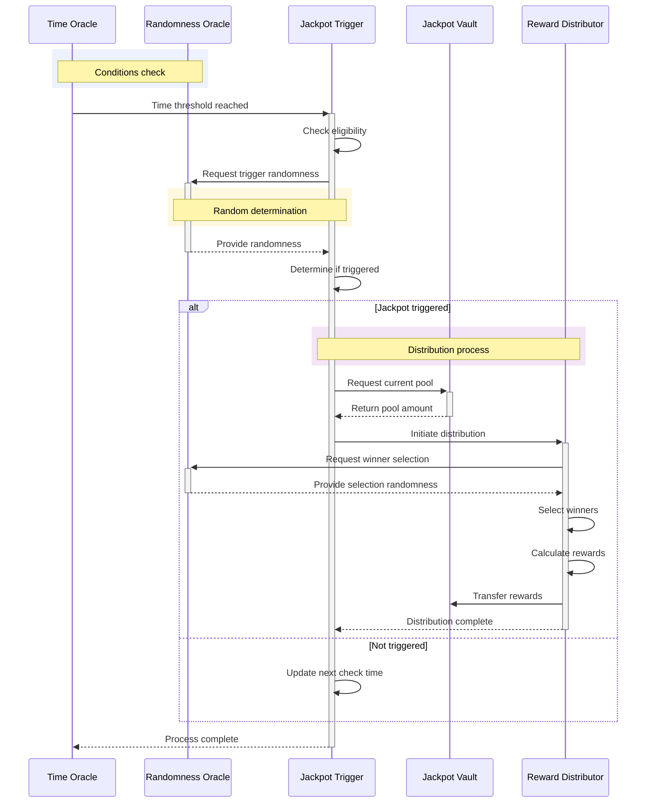
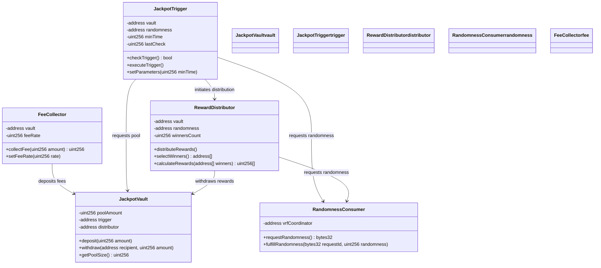

# OmniDragon Jackpot System

The OmniDragon Jackpot System is a core feature that distributes rewards to token holders based on verifiable randomness. This document explains how the system works and its key components.

## System Overview

The jackpot system uses a combination of fee collection, randomness, and distribution mechanisms to create an engaging token economy:

## Jackpot Cycle

The jackpot system follows a regular cycle of accumulation, triggering, and distribution:

## Trigger Mechanism

The jackpot is triggered through a combination of time-based and randomness-based mechanisms:

## Implementation Architecture

The core contracts that implement the jackpot system are structured as follows:

## Jackpot Distribution Formula

The jackpot distribution uses a weighted formula that rewards both loyalty and token holdings:

- **Base Allocation**: 60% of the pool distributed to randomly selected winners
- **Staking Boost**: 30% additional weight for staked tokens
- **Loyalty Multiplier**: Up to 2x multiplier based on holding duration
- **Cross-Chain Participants**: Special allocation for cross-chain token holders

This creates an engaging and fair distribution system that incentivizes long-term holding and active participation in the OmniDragon ecosystem. 