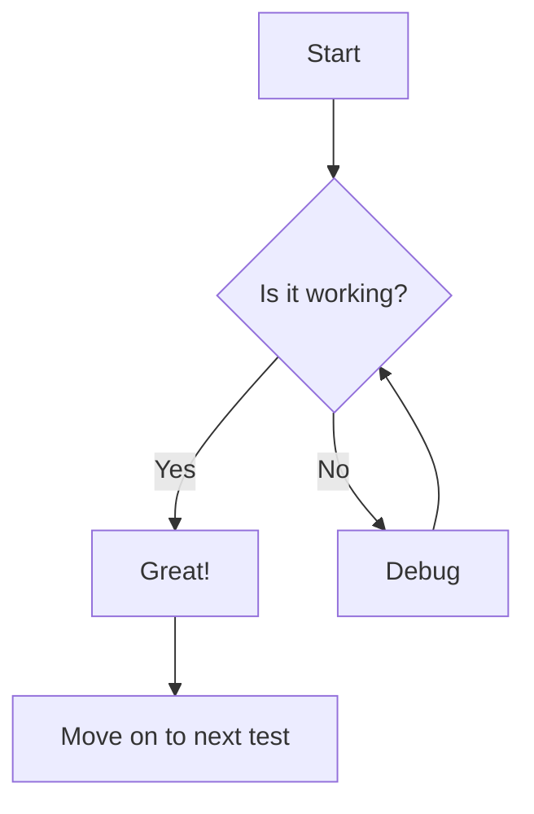
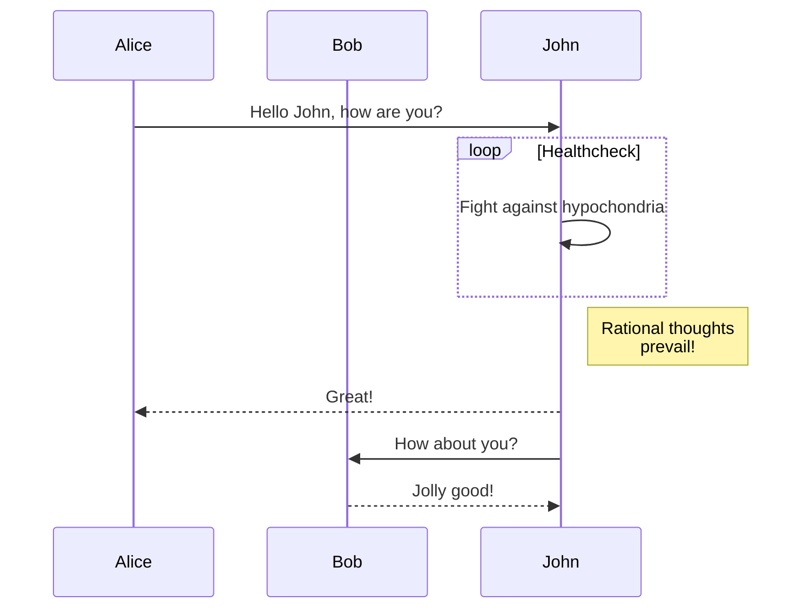
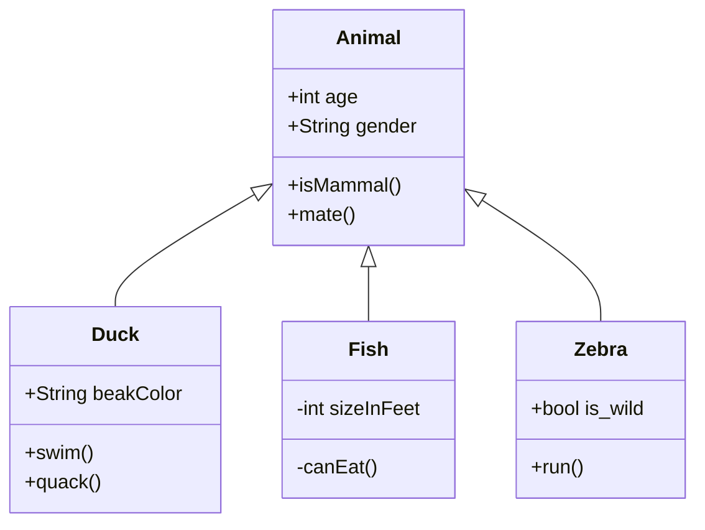

import MermaidDiagram from '@site/src/components/MermaidDiagram';

# Mermaid Diagram Test

This page tests both native Docusaurus mermaid diagram rendering and our custom MermaidDiagram component.

## Native Mermaid Diagram

Here's a mermaid diagram using the standard Docusaurus syntax:

## Custom MermaidDiagram Component

Here's the same diagram using our custom component:

<MermaidDiagram 
  title="Test Diagram"
  chart={`
    flowchart TD
      A[Start] --> B{Is it working?}
      B -->|Yes| C[Great!]
      B -->|No| D[Debug]
      D --> B
      C --> E[Move on to next test]
  `}
  caption="A simple flowchart to test diagram rendering"
/>

## More Complex Example with Native Mermaid

## Same Complex Example with Custom Component

<MermaidDiagram 
  title="Sequence Diagram"
  chart={`
    sequenceDiagram
      participant Alice
      participant Bob
      Alice->>John: Hello John, how are you?
      loop Healthcheck
          John->>John: Fight against hypochondria
      end
      Note right of John: Rational thoughts  prevail!
      John-->>Alice: Great!
      John->>Bob: How about you?
      Bob-->>John: Jolly good!
  `}
  caption="A sequence diagram to test more complex rendering"
/>

## Class Diagram with Native Mermaid

## Class Diagram with Custom Component

<MermaidDiagram 
  title="Class Hierarchy"
  chart={`
    classDiagram
      Animal <|-- Duck
      Animal <|-- Fish
      Animal <|-- Zebra
      Animal : +int age
      Animal : +String gender
      Animal: +isMammal()
      Animal: +mate()
      class Duck{
          +String beakColor
          +swim()
          +quack()
      }
      class Fish{
          -int sizeInFeet
          -canEat()
      }
      class Zebra{
          +bool is_wild
          +run()
      }
  `}
  caption="A class diagram showing inheritance relationships"
/> 