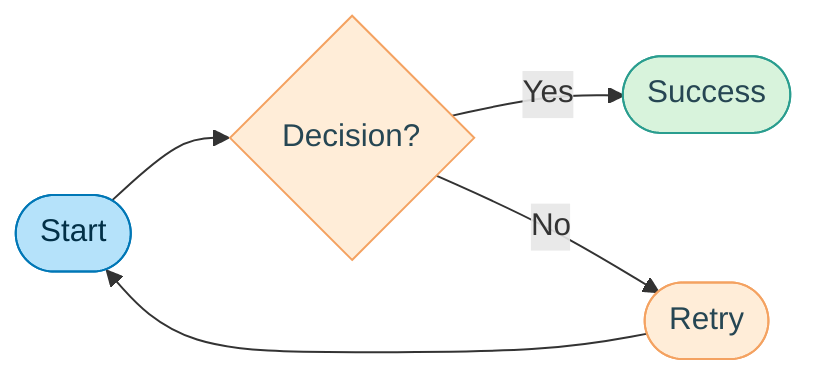
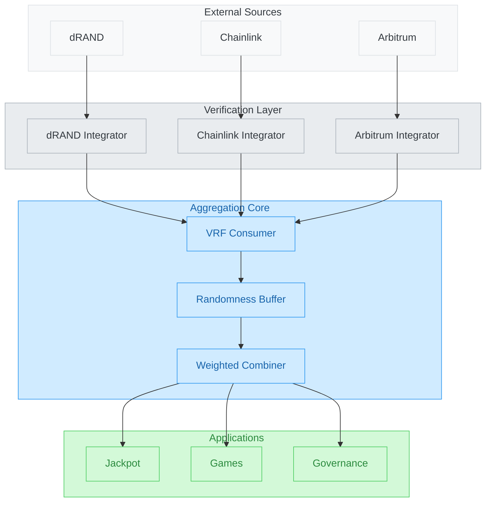
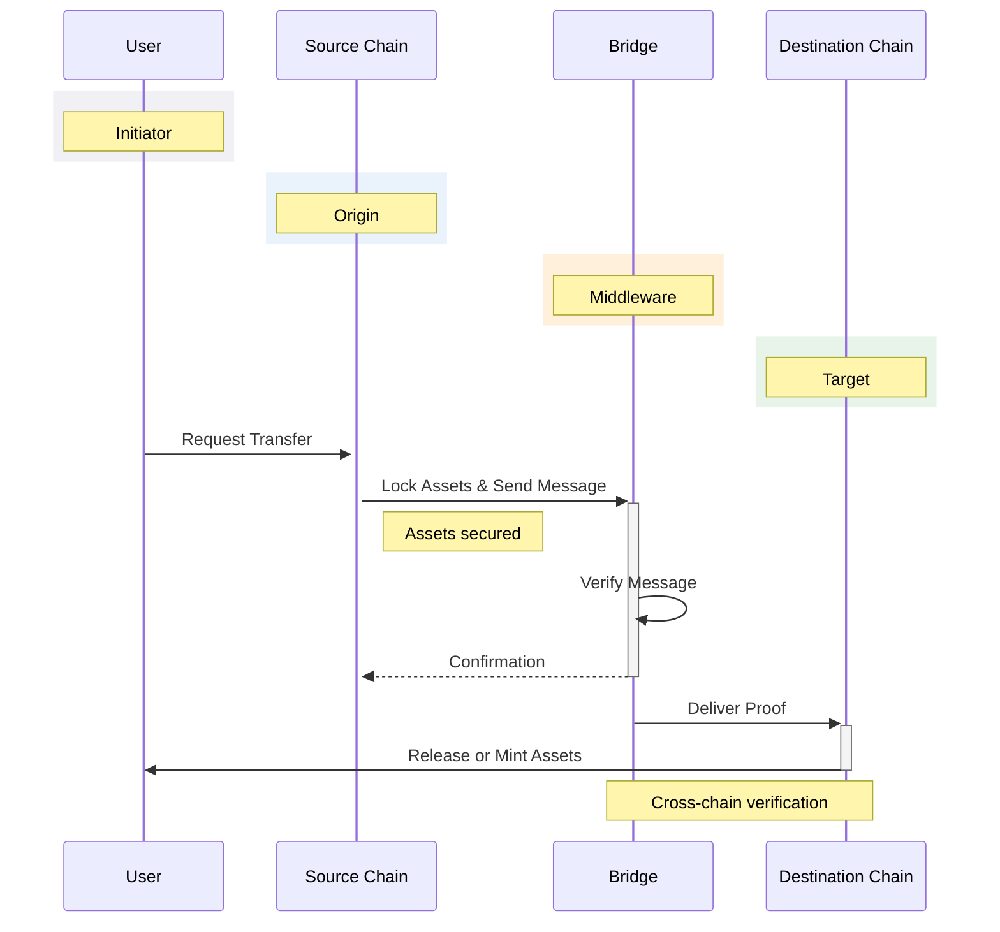
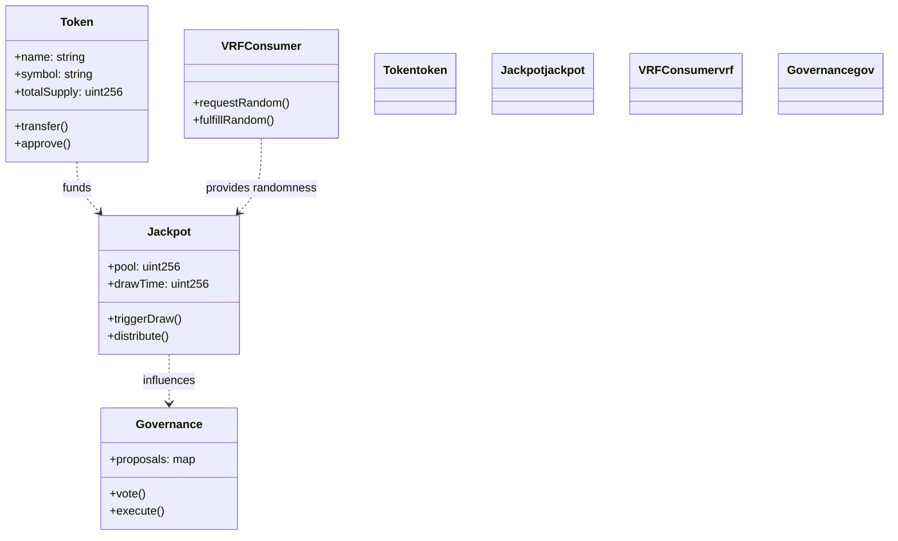

# Elegant Mermaid Diagrams

This page showcases our redesigned mermaid diagrams with minimalistic styling and semantic color coding.

## Basic Process Flow

A simple, elegant decision flow with action-based color coding:

## Randomness System Architecture

A layered architecture diagram with clear visual hierarchy:

## Cross-Chain Transfer Sequence

A sequence diagram with semantic colors for different actors and actions:

## Token System Class Diagram

A clean class diagram with meaningful relationships:

