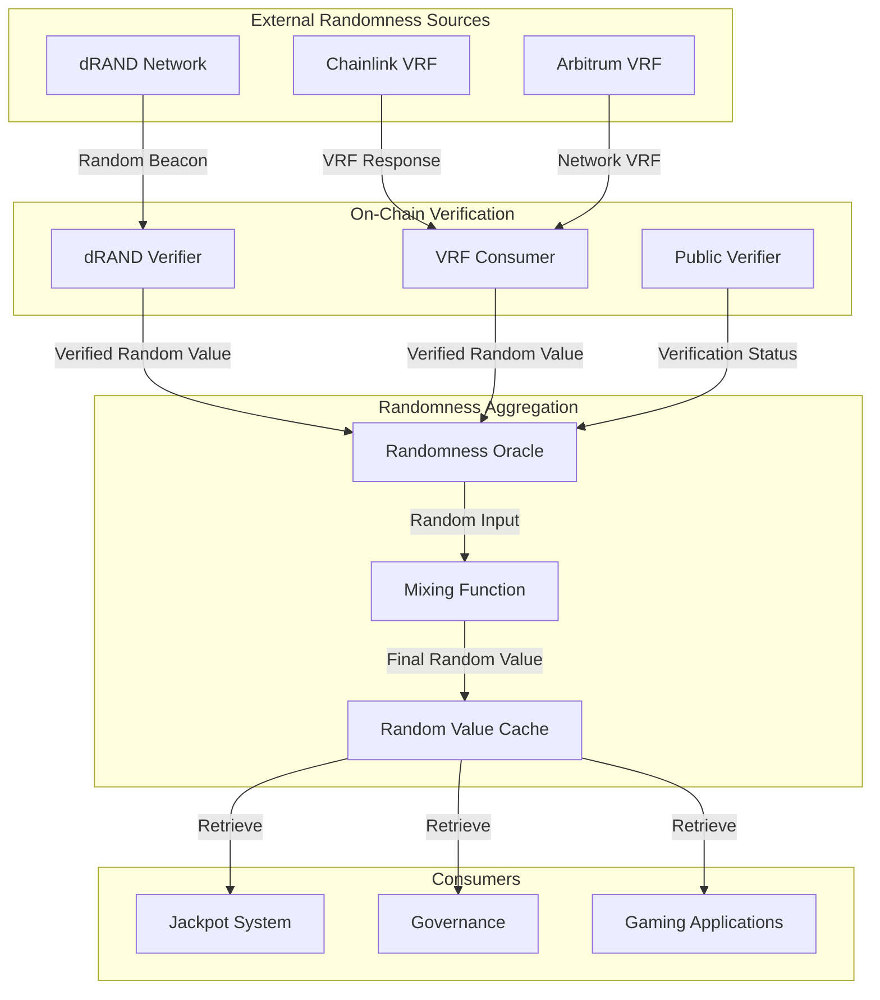
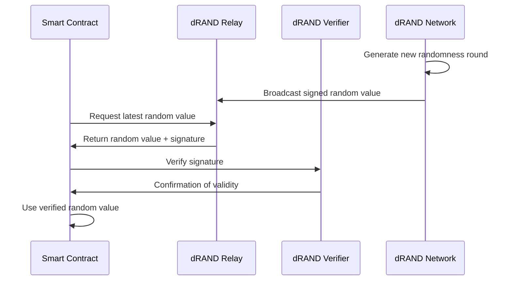

# Randomness System

The Sonic Red Dragon ecosystem implements a verifiable, multi-source randomness system that powers the jackpot mechanism and other random-dependent features.

## Overview

Randomness is a critical component of the Sonic Red Dragon ecosystem, powering the jackpot system and ensuring fair distribution of rewards. The project uses a multi-layered approach to randomness generation and verification, combining several sources to create a robust, tamper-resistant system.

## Randomness Architecture



## dRAND Integration

The primary source of randomness in the Sonic Red Dragon ecosystem is the dRAND network (distributed randomness beacon) operated by the League of Entropy:

### How dRAND Works

1. **Distributed Random Beacon**: dRAND is a distributed randomness beacon operated by multiple independent providers
2. **Threshold Cryptography**: Uses threshold cryptography to generate random values that no single party can predict or manipulate
3. **Public Verification**: Anyone can verify the correctness of the generated randomness

### dRAND Verification Process



## Implementation Architecture

The randomness system in Sonic Red Dragon consists of several interconnected components:

### 1. dRAND Relay Verifier

This component interacts with the dRAND network to fetch and verify random values:

```solidity
interface IDrandVerifier {
    function verify(
        bytes calldata pk_bytes,
        bytes calldata signature,
        bytes32 previous_signature_hash,
        uint64 round
    ) external view returns (bool);
}
```

### 2. Randomness Oracle

The central component that aggregates and manages random values from different sources:

```solidity
contract RandomnessOracle {
    // Request randomness from various sources
    function requestRandomness() external returns (bytes32 requestId);
    
    // Get verified random value
    function getRandomValue(bytes32 requestId) external view returns (uint256);
    
    // Check if random value is ready
    function isRandomnessReady(bytes32 requestId) external view returns (bool);
}
```

### 3. Chain-Specific VRF Consumers

Adapters for chain-specific randomness sources like Chainlink and Arbitrum VRF:

```solidity
contract ArbitrumVRFSonicConsumer {
    // Request randomness from Arbitrum VRF
    function requestRandomness() external returns (bytes32 requestId);
    
    // Callback for randomness fulfillment
    function fulfillRandomness(bytes32 requestId, uint256 randomness) internal;
}
```

## Security Considerations

The randomness system implements several security measures to prevent manipulation:

1. **Multi-Source Verification**: Combines multiple independent sources of randomness
2. **Time-Delayed Retrieval**: Prevents last-minute manipulation attempts
3. **Cryptographic Verification**: Uses threshold signatures for dRAND verification
4. **Public Auditability**: All randomness sources can be publicly verified
5. **On-Chain Verification**: All verification happens directly on-chain

## User Impact

The randomness system directly affects users in several ways:

1. **Fair Jackpot Distribution**: Ensures jackpot winners are selected fairly
2. **Predictable Schedule**: Regular randomness generation creates predictable jackpot schedules
3. **Transparent Verification**: Users can verify the fairness of random selections
4. **Gaming Applications**: Enables fair gaming experiences built on the ecosystem

## Technical Deep Dive

### dRAND Verification

The dRAND verification process validates the BLS signatures from the dRAND network:

```solidity
function verify(
    bytes calldata pk_bytes,
    bytes calldata signature,
    bytes32 previous_signature_hash,
    uint64 round
) public view returns (bool) {
    // Construct the message to be signed based on the round
    bytes memory message = abi.encodePacked(round, previous_signature_hash);
    
    // Verify the BLS signature using the public key
    return BLS.verify(pk_bytes, message, signature);
}
```

### Mixing Function

The mixing function combines random values from multiple sources to create the final random value:

```solidity
function mixRandomness(
    uint256 drandValue,
    uint256 chainlinkValue,
    uint256 blockHash
) internal pure returns (uint256) {
    return uint256(keccak256(abi.encodePacked(
        drandValue,
        chainlinkValue,
        blockHash
    )));
}
```

## Integration Example

Here's how to integrate with the randomness system:

```solidity
// Get randomness oracle instance
RandomnessOracle oracle = RandomnessOracle(oracleAddress);

// Request randomness
bytes32 requestId = oracle.requestRandomness();

// Check if randomness is ready
bool isReady = oracle.isRandomnessReady(requestId);

// Get random value when ready
if (isReady) {
    uint256 randomValue = oracle.getRandomValue(requestId);
    // Use the random value
}
```
