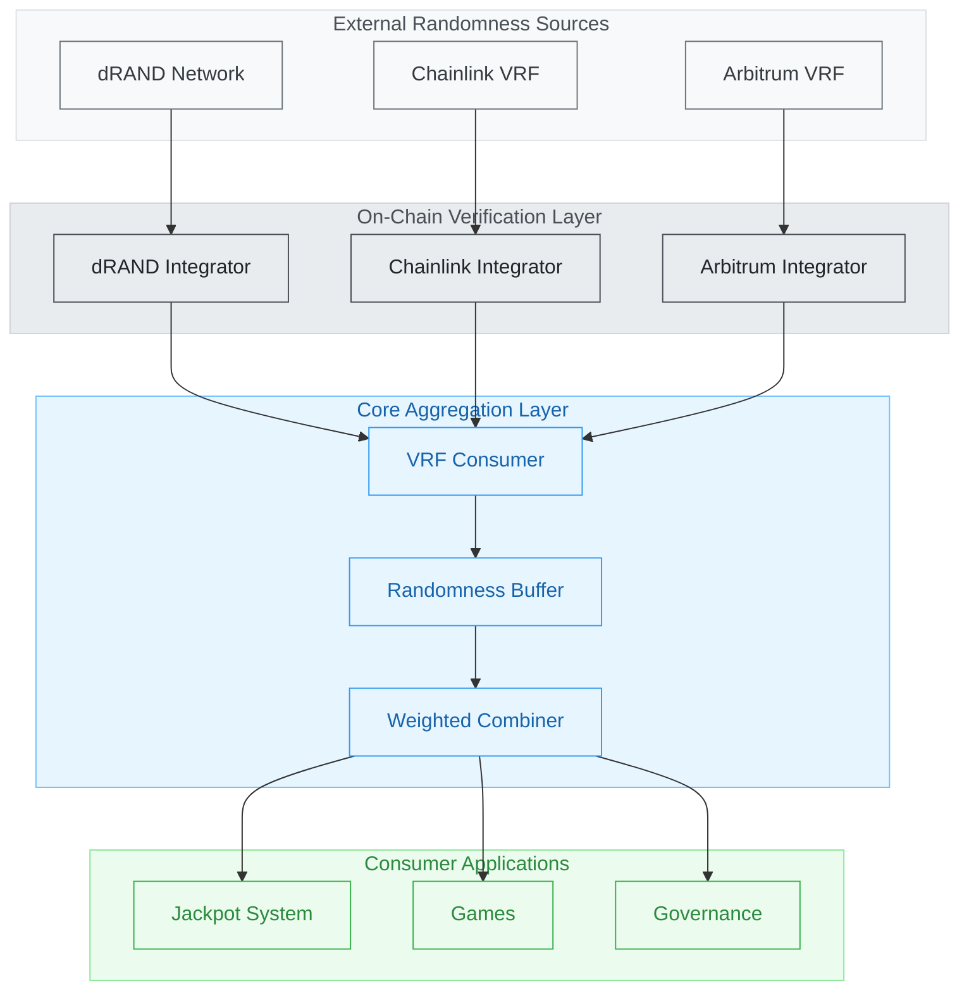
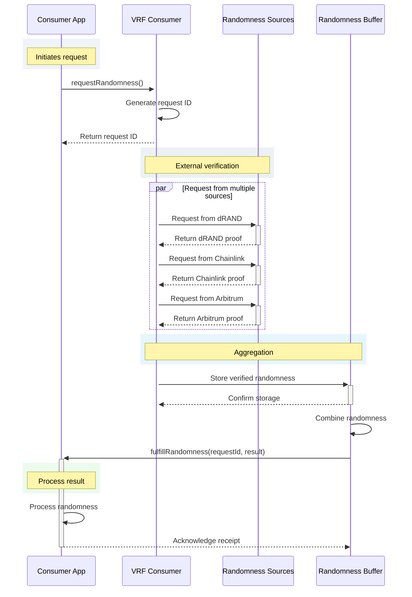
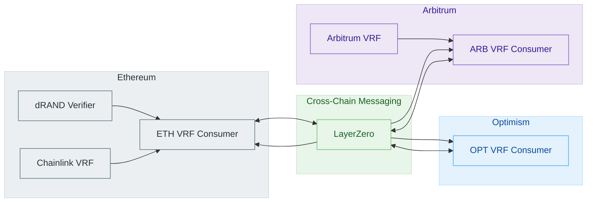
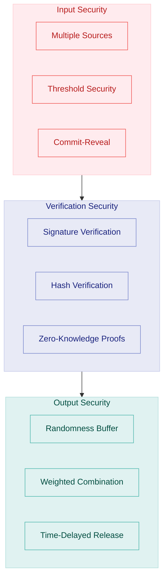
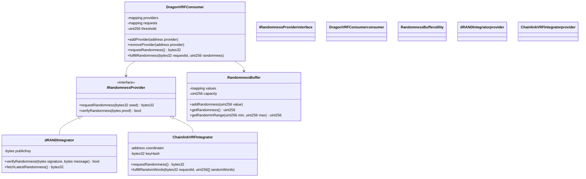

# OmniDragon Randomness System

The OmniDragon protocol leverages multiple sources of verifiable randomness to power its jackpot system and other applications requiring secure randomness.

## System Overview

The following diagram illustrates the high-level architecture of our randomness system:

## Randomness Request Flow

The sequence diagram below shows how randomness is requested and fulfilled:

## Multi-Chain Randomness Architecture

Our system works across multiple chains with secure cross-chain verification:

## Security Model

The diagram below illustrates our multi-layered security approach:

## Implementation Components

The following class diagram shows the main components of our randomness system:

By integrating multiple sources of randomness and utilizing a secure aggregation mechanism, OmniDragon achieves a highly secure and reliable source of randomness that is resistant to manipulation and single points of failure.
