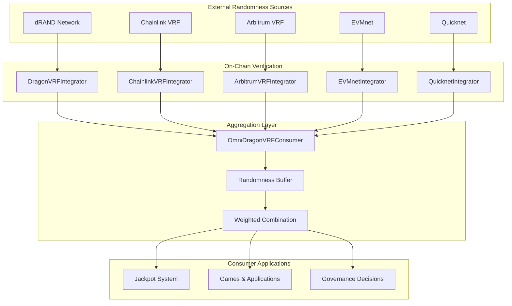
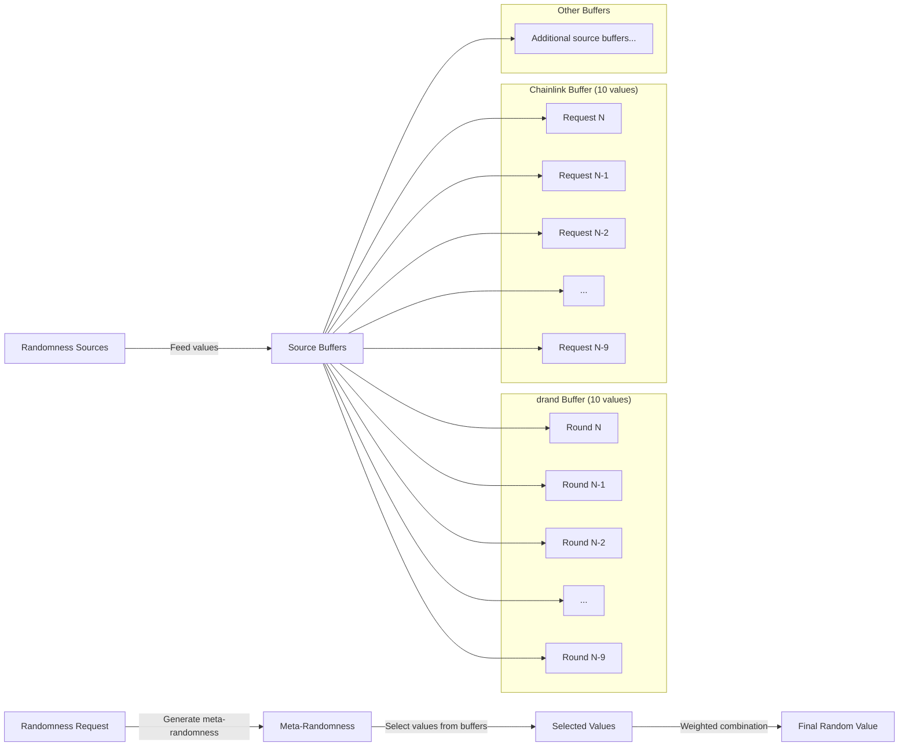
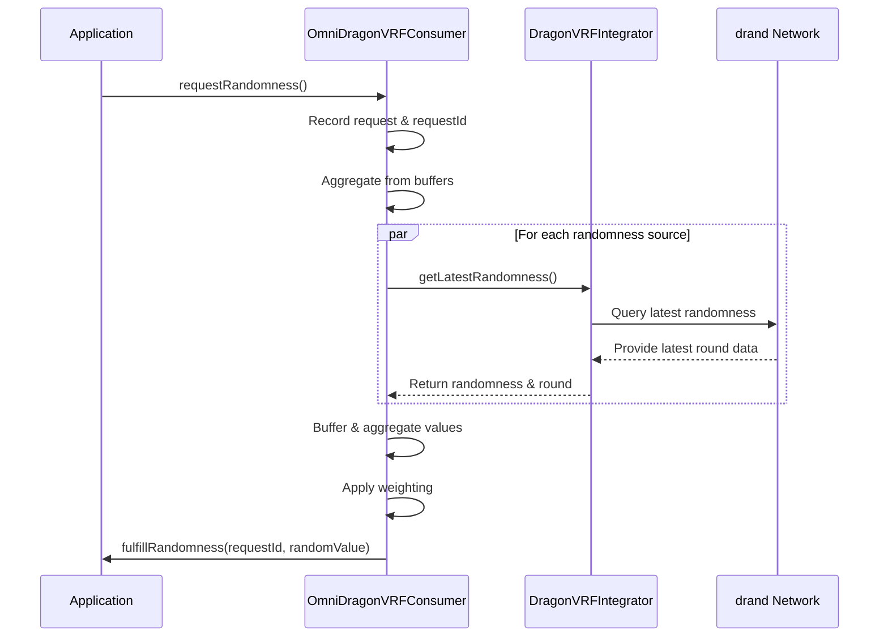

# Randomness System

The Sonic Red Dragon ecosystem implements a secure, verifiable multi-source randomness system that powers the jackpot mechanism and other random-dependent features.

## Overview

Randomness is a critical component of the Sonic Red Dragon ecosystem, powering the jackpot system and ensuring fair distribution of rewards. The project uses a multi-layered approach to randomness generation and verification, combining several sources to create a robust, tamper-resistant system.

## Multi-Source Randomness Architecture

The OmniDragon randomness system uses a unique approach of combining multiple independent randomness sources:



### Key Security Features

Our multi-source approach offers several significant advantages over traditional single-source randomness:

1. **Source Diversity**: By combining multiple independent sources, we eliminate single points of failure
2. **Network Diversity**: Each source uses different cryptographic schemes and operator sets
3. **Weighted Aggregation**: Sources can be assigned different weights based on reliability
4. **Randomness Buffer**: Each source maintains a buffer of recent values for enhanced unpredictability
5. **Meta-Randomness Selection**: Selection from buffers uses block data that cannot be predicted in advance

## Randomness Buffer System

A key security innovation is our buffered randomness approach:



This design provides significantly stronger guarantees than using only the latest randomness values because:
   - Even if an attacker knows all current buffer values, they cannot predict which will be selected
   - The selection mechanism depends on future block data, making front-running difficult
   - Each source has 10 possible values, creating 10^4 = 10,000 possible combinations

## drand Network Integration

The drand network is a core component of our randomness system:

### What is drand?

[drand](https://drand.love) is a distributed randomness beacon that provides publicly verifiable, unpredictable and unbiasable random values at regular intervals. The randomness is generated in a distributed way by a set of nodes operated by research institutions and companies from around the world, collectively known as the League of Entropy.

### Supported drand Networks

The OmniDragon system integrates with multiple drand networks:

1. **League of Entropy Mainnet**
   - Period: 30 seconds
   - Public Key: `868f005eb8e6e4ca0a47c8a77ceaa5309a47978a7c71bc5cce96366b5d7a569937c529eeda66c7293784a9402801af31`

2. **Quicknet**
   - Period: 3 seconds
   - Optimized for higher frequency randomness needs

3. **EVMnet**
   - Period: 3 seconds
   - Uses BLS-BN254 cryptographic curve with native support in Ethereum and other EVM chains
   - Designed specifically for on-chain verification with lower gas costs

## On-Chain Request and Fulfillment Flow

The following sequence diagram illustrates how randomness is requested and fulfilled:



## Core Contract Components

The randomness system consists of several specialized contracts:

### DragonVRFLib

A utility library that provides helper functions for deploying and managing VRF consumer contracts:
- Deploy upgradeable VRF consumer contracts
- Configure VRF parameters
- Manage consumer-coordinator relationships

### DragonVRFIntegrator

Bridge contract that connects external randomness sources to the OmniDragon ecosystem:
- Receives and verifies randomness from a specific source (e.g., drand, Chainlink)
- Maintains the latest randomness values from that source
- Provides a standard interface for consumers to request randomness

### OmniDragonVRFConsumer

Advanced aggregator that combines randomness from multiple sources:
- Maintains connections to multiple integrator contracts
- Buffers randomness values from each source
- Applies weighted combination algorithms
- Distributes the final randomness to consumer applications

## Integration Examples

### Basic Usage with Single Source

```solidity
// Import the DragonVRFConsumer
import "../drand/DragonVRFConsumer.sol";

contract MyRandomApp is DragonVRFConsumer {
    // Request ID tracking
    uint256 private requestId;
    
    // Constructor
    constructor(address _vrfIntegrator) DragonVRFConsumer(_vrfIntegrator) {}
    
    // Request randomness
    function getRandomNumber() external {
        requestId = requestRandomness();
    }
    
    // Receive randomness
    function _fulfillRandomness(uint256 _requestId, uint256 _randomness) internal override {
        // Use randomness here
    }
}
```

### Advanced Usage with OmniDragonVRFConsumer

```solidity
// Import the OmniDragonVRFConsumer interface
import "../drand/interfaces/IOmniDragonVRFConsumer.sol";

contract SecureRandomApp {
    // OmniDragonVRFConsumer reference
    IOmniDragonVRFConsumer public omniConsumer;
    
    // Request tracking
    mapping(uint256 => bool) public pendingRequests;
    uint256 public lastRandomValue;
    
    // Constructor
    constructor(address _omniConsumer) {
        omniConsumer = IOmniDragonVRFConsumer(_omniConsumer);
    }
    
    // Request aggregated randomness
    function getSecureRandomNumber() external {
        uint256 requestId = omniConsumer.requestRandomness(address(this));
        pendingRequests[requestId] = true;
    }
    
    // Callback function for randomness fulfillment
    function fulfillRandomness(uint256 _requestId, uint256 _randomness) external {
        require(msg.sender == address(omniConsumer), "Only OmniConsumer can fulfill");
        require(pendingRequests[_requestId], "Request not found");
        
        lastRandomValue = _randomness;
        delete pendingRequests[_requestId];
        
        // Use randomness here
    }
}
```

## Security Considerations

When using randomness in blockchain applications:

1. **Public Nature**: All randomness values are public and known once published
2. **Timing Considerations**: There is a small delay between randomness generation and availability
3. **Front-Running Protection**: The buffer system helps mitigate front-running attacks
4. **Source Diversity**: Using multiple sources significantly enhances security
5. **High-Value Applications**: For high-value applications, consider additional security layers
