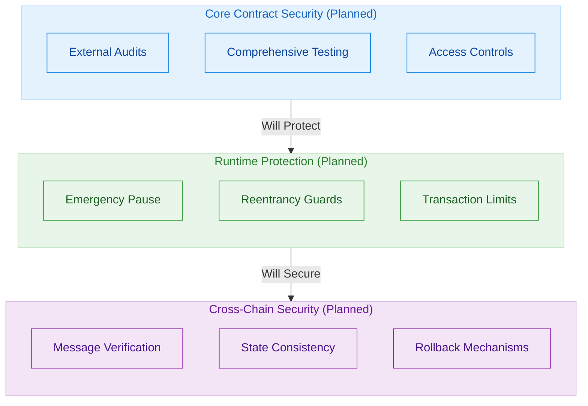

# Security Architecture

This document outlines the planned security architecture for the OmniDragon protocol.

## Current Status

OmniDragon is currently in development, and the full security architecture described in this document represents our planned approach. At present, we are in the process of designing and implementing these security features.

## Planned Security Layers



## Planned Security Features

### Access Control Mechanisms

We plan to implement role-based access control (RBAC) with clearly defined roles:

1. **Owners** - Will be able to update critical protocol parameters and perform emergency actions
2. **Operators** - Will be able to execute routine maintenance operations
3. **Fee Collectors** - Will be able to receive and distribute protocol fees
4. **Bridges** - Will be able to initiate and receive cross-chain messages

Each role will have limited permissions, following the principle of least privilege.

### Reentrancy Protection

All fund-moving functions will implement reentrancy guards to prevent potential attacks:

```solidity
function distributeRewards(address[] memory recipients, uint256[] memory amounts) 
    external 
    onlyAuthorized 
    nonReentrant 
{
    // Function implementation
}
```

### Emergency Circuit Breakers

Critical contracts will include pausable functionality that can be triggered in case of emergencies:

```solidity
function transfer(address to, uint256 amount) public override whenNotPaused returns (bool) {
    // Function implementation
}
```

### Cross-Chain Message Verification

The protocol will implement verification for all cross-chain messages:

1. **Message Authentication** - Cryptographic verification of message origin
2. **Replay Protection** - Prevention of message replay attacks
3. **Timeout Mechanisms** - Automatic invalidation of stale messages
4. **Consistent State** - Verification of cross-chain state consistency

## Security Audit Plan

We plan to engage with reputable blockchain security firms for audits prior to mainnet launch:

| Timeline | Audit Focus | Status |
|----------|-------------|--------|
| Pre-launch | Core Contracts | Planned |
| Pre-launch | Cross-Chain Bridge | Planned |
| Pre-launch | Jackpot System | Planned |

## Future Incident Response Plan

Once launched, we plan to implement a defined incident response process:

1. **Detection** - Continuous monitoring systems for early threat detection
2. **Analysis** - Rapid impact assessment by the security team
3. **Containment** - Emergency pause of affected components if necessary
4. **Remediation** - Development and deployment of fixes
5. **Recovery** - Safe system restart and user communication
6. **Post-Incident Review** - Detailed analysis and preventive measures

## Bug Bounty Program

We intend to establish a bug bounty program to encourage responsible disclosure of security vulnerabilities. Details will be announced closer to the mainnet launch.
