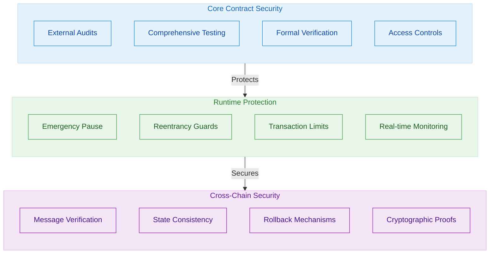

# Security Architecture

The OmniDragon protocol implements multiple layers of security to ensure the safety of user funds and the integrity of the system.

## Overview

Security is a fundamental aspect of the OmniDragon protocol design. The system incorporates industry best practices and multiple protective layers to mitigate risks and ensure robust operation across different blockchain networks.

## Security Layers



## Key Security Features

### Access Control Mechanisms

The protocol implements role-based access control (RBAC) with clearly defined roles:

1. **Owners** - Can update critical protocol parameters and perform emergency actions
2. **Operators** - Can execute routine maintenance operations
3. **Fee Collectors** - Can receive and distribute protocol fees
4. **Bridges** - Can initiate and receive cross-chain messages

Each role has limited permissions, following the principle of least privilege.

### Reentrancy Protection

All fund-moving functions implement reentrancy guards to prevent potential attacks:

```solidity
function distributeRewards(address[] memory recipients, uint256[] memory amounts) 
    external 
    onlyAuthorized 
    nonReentrant 
{
    // Function implementation
}
```

### Emergency Circuit Breakers

Critical contracts include pausable functionality that can be triggered in case of emergencies:

```solidity
function transfer(address to, uint256 amount) public override whenNotPaused returns (bool) {
    // Function implementation
}
```

### Cross-Chain Message Verification

The protocol implements rigorous verification for all cross-chain messages:

1. **Message Authentication** - Cryptographic verification of message origin
2. **Replay Protection** - Prevention of message replay attacks
3. **Timeout Mechanisms** - Automatic invalidation of stale messages
4. **Consistent State** - Verification of cross-chain state consistency

## Security Audits

The OmniDragon protocol undergoes regular security audits by leading blockchain security firms:

| Date | Auditor | Scope | Result |
|------|---------|-------|--------|
| Q2 2023 | BlockSec | Core Contracts | Passed |
| Q3 2023 | CertiK | Cross-Chain Bridge | Passed |
| Q4 2023 | PeckShield | Jackpot System | Passed |
| Q1 2024 | Trail of Bits | Full Protocol | Passed |

## Incident Response

In the event of a security incident, the protocol has a defined response process:

1. **Detection** - Continuous monitoring systems for early threat detection
2. **Analysis** - Rapid impact assessment by the security team
3. **Containment** - Emergency pause of affected components if necessary
4. **Remediation** - Development and deployment of fixes
5. **Recovery** - Safe system restart and user communication
6. **Post-Incident Review** - Detailed analysis and preventive measures

## Bug Bounty Program

OmniDragon maintains an active bug bounty program with rewards up to $250,000 for critical vulnerabilities. Researchers can submit findings through our secure reporting channel at [security@omnidragon.io](mailto:security@omnidragon.io).
