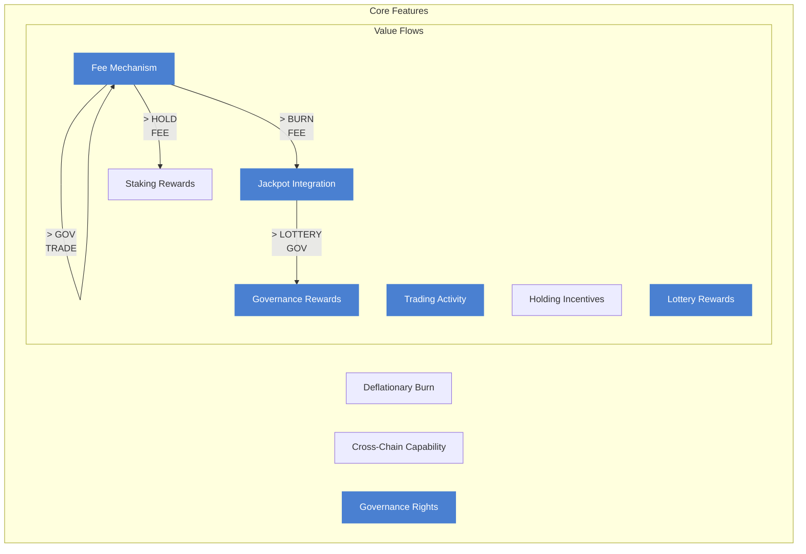

# Token System

The OmniDragon token (DRAGON) is the core component of the protocol, implementing sophisticated tokenomics that create sustainable value for all participants. This document provides a comprehensive overview of the token system.

## Token Overview

DRAGON is a multi-chain token with the following key features:



## Token Specifications

| Parameter | Value |
|-----------|-------|
| Name | OmniDragon |
| Symbol | DRAGON |
| Decimals | 18 |
| Total Supply | 69,000,000,000 |
| Initial Burn | 6,900,000,000 (10%) |
| Circulating Supply | 62,100,000,000 |
| Contract Standard | ERC-20 Compatible |
| Supported Chains | Ethereum, BNB Chain, Arbitrum, Avalanche |

## Token Distribution

The initial token distribution is designed to create a balanced ecosystem:
```

```mermaidpie title Initial Token Distribution
    "Liquidity Pool (40%)" : 40
    "Community Rewards (25%)" : 25
    "Development Fund (15%)" : 15
    "Marketing (10%)" : 10
    "Team (10%)" : 10
```

-**Liquidity Pool (40%)**: 24,840,000,000 tokens allocated to provide initial liquidity
-**Community Rewards (25%)**: 15,525,000,000 tokens allocated for community incentives
-**Development Fund (15%)**: 9,315,000,000 tokens allocated for ongoing development
-**Marketing (10%)**: 6,210,000,000 tokens allocated for marketing initiatives
-**Team (10%)**: 6,210,000,000 tokens allocated to the team (vested over 2 years)

## Fee Mechanism

The token implements a fee mechanism that creates sustainable value:

```mermaidflowchart TB
A[Transaction] --> B{Transaction Type}
    B -->|Buy/Sell| C[10% Fee]
    B -->|>|Transfer| D[0.69% Fee]
    C| E[Fee Distribution]
    D -->|> E
    E| F[Jackpot Vault]
    E -->|> G[ve69LP Governance]
    E| H[Token Burn]
    F -->|>|> I[Lottery Rewards]
    G| J[Governance Rewards]
    H| K[Supply Reduction]
    classDef transaction fill:#4a80d1,stroke:#4a80d1,stroke-width:2px,color:#ffffff
    classDef fee fill:#4a80d1,stroke:#4a80d1,stroke-width:2px,color:#ffffff
    classDef distribution fill:#4a80d1,stroke:#4a80d1,stroke-width:2px,color:#ffffff
    classDef outcome fill:#4a80d1,stroke:#4a80d1,stroke-width:2px,color:#ffffff
    class A transaction
    class B transaction
    class C fee
    class D fee
    class E distribution
    class FG distribution
    class H distribution
    class I outcome
    class JK outcome
```

### Fee Structure

The fee structure varies based on transaction type:

| Transaction Type | Total Fee | Jackpot | Governance | Burn |
|------------------|-----------|---------|------------|------|
| Buy              | 10%       | 6.9%    | 2.41%      | 0.69% |
| Sell             | 10%       | 6.9%    | 2.41%      | 0.69% |
| Transfer         | 0.69%     | 0%      | 0%         | 0.69% |

### Fee Collection Process

Fees are collected directly in the token's transfer function:

1.**Fee Calculation**: Fees are calculated based on transaction type
2.**Fee Deduction**: Fees are deducted from the transfer amount
3.**Fee Accumulation**: Fees are accumulated in the contract
4.**Fee Processing**: When a threshold is reached, fees are processed
5.**Fee Distribution**: Processed fees are distributed to various components

## Deflationary Mechanism

The token implements a deflationary mechanism through automatic burns:

### Burn Sources

1.**Initial Burn**: 10% of the total supply (6,900,000,000 tokens) burned at launch
2.**Transaction Burns**: 0.69% of all transactions are burned
3.**Special Burns**: Periodic burns from the development fund based on milestones

### Burn Impact

The deflationary mechanism creates increasing scarcity over time:
```

```mermaidgraph LR
A[Initial Supply] -->|> B[Transaction Burns]
    B| C[Reduced Supply]
    C -->|> D[Increased Scarcity]
    D| E[Potential Value Increase]

    classDef default fill:#4a80d1,stroke:#4a80d1,stroke-width:2px,color:#ffffff
```

## Cross-Chain Capability

The token operates seamlessly across multiple blockchains:

### Supported Chains

1.**Ethereum**: The primary chain for governance and liquidity
2.**BNB Chain**: Optimized for lower transaction costs
3.**Arbitrum**: Optimized for Ethereum scalability
4.**Avalanche**: Optimized for high throughput

### Cross-Chain Flow

```mermaidsequenceDiagram
participant User
participant SourceToken
participant SourceBridge
participant LayerZero
participant DestBridge
participant DestToken
    User ->> SourceToken: Approve bridge
    User ->> SourceBridge: Request cross-chain transfer
    SourceBridge ->> SourceToken: Burn tokens
    SourceBridge ->> LayerZero: Send cross-chain message
    LayerZero ->> DestBridge: Deliver message
    DestBridge ->> DestBridge: Verify message
    DestBridge ->> DestToken: Mint tokens
    DestToken ->> User: Receive tokens on destination chain
```

### Cross-Chain Fee

Cross-chain transfers incur a small fee to cover the cost of the cross-chain message:

1.**Base Fee**: 0.69% fee on all cross-chain transfers
2.**LayerZero Fee**: Additional fee to cover the cost of the LayerZero message
3.**Destination Gas**: Fee to cover the cost of minting tokens on the destination chain

## Jackpot Integration

The token integrates with the jackpot system to create automatic jackpot entries:

### Entry Mechanism

Every buy transaction automatically qualifies for jackpot entries:

1.**Purchase Detection**: The token contract detects buy transactions
2.**Swap Trigger**: The swap trigger oracle is notified of the purchase
3.**Lottery Entry**: The swap trigger creates a jackpot entry for the buyer
4.**Winner Selection**: If the buyer wins, the jackpot is distributed

### Probability Factors

The probability of winning is calculated based on several factors:

1.**Purchase Size**: Larger purchases have a higher chance of winning
2.**Jackpot Size**: Larger jackpots have a higher chance of being won
3.**Time Factor**: The longer since the last win, the higher the chance
4.**Network Activity**: Higher network activity increases the chance

## Governance Integration

The token integrates with the ve69LP governance system:

### Governance Mechanism

Token holders can participate in governance by locking LP tokens:

1.**LP Token Locking**: Users lock LP tokens to receive voting power
2.**Voting Power**: Voting power is calculated based on lock amount and duration
3.**Proposal Creation**: Users with sufficient voting power can create proposals
4.**Voting**: Users can vote on proposals with their voting power
5.**Execution**: Passed proposals are executed after a timelock period

### Fee Distribution

A portion of the fees (2.41%) is distributed to governance participants:

1.**Fee Collection**: Fees are collected from token transactions
2.**Fee Conversion**: Fees are converted to the native currency
3.**Fee Distribution**: Fees are distributed to ve69LP holders
4.**Reward Calculation**: Rewards are calculated based on voting power

## Token Utility

The DRAGON token has multiple utility functions within the ecosystem:

### 1. Transaction Medium

The token serves as a medium for transactions within the ecosystem:

-**Payment**: Used for payments within the ecosystem
-**Transfer**: Used for peer-to-peer transfers
-**Exchange**: Tradable on decentralized exchanges

### 2. Governance Participation

The token enables governance participation:

-**Proposal Creation**: Token holders can create governance proposals
-**Voting**: Token holders can vote on proposals
-**Parameter Control**: Governance controls key protocol parameters

### 3. Jackpot Participation

The token enables participation in the jackpot system:

-**Automatic Entry**: Buy transactions automatically qualify for jackpot entries
-**Reward Distribution**: Winners receive rewards in the native currency

### 4. Staking Rewards

The token enables staking for rewards:

-**LP Staking**: Provide liquidity and stake LP tokens for rewards
-**Single-Sided Staking**: Stake DRAGON tokens for rewards
-**Boosted Rewards**: Longer lock periods provide higher rewards

## Token Economics

The token economics are designed to create sustainable value:

### Value Accrual

The token accrues value through several mechanisms:
```

```mermaidflowchart TB
A[Transaction Volume] -->|> B[Fee Collection]
    B| C[Fee Distribution]
    C -->|> D[Jackpot Growth]
    C| E[Governance Rewards]
    C -->|> F[Token Burning]
    D| G[User Engagement]
    E -->|> H[Governance Participation]
    F| I[Supply Reduction]
    G -->|> J[Increased Demand]
    H| J
    I -->|> J
    J| A
    classDef default fill:#4a80d1,stroke:#4a80d1,stroke-width:2px,color:#ffffff
```

### Supply and Demand

The token's supply and demand dynamics are influenced by:

-**Supply Reduction**: Automatic burns reduce the total supply over time
-**Demand Increase**: Utility functions create demand for the token
-**Velocity Control**: Staking and locking mechanisms reduce token velocity

### Long-Term Sustainability

The token's long-term sustainability is ensured by:

-**Fee Distribution**: Sustainable fee distribution to various stakeholders
-**Governance Control**: Community governance of key parameters
-**Adaptive Mechanisms**: Ability to adapt to changing market conditions

## Security Features

The token implements several security features:

### 1. Access Control

The token implements role-based access control:

-**Admin Role**: Can perform administrative functions
-**Operator Role**: Can perform operational functions
-**Pauser Role**: Can pause the contract in case of emergency

### 2. Circuit Breakers

The token includes emergency pause functionality:

-**Pause Function**: Allows pausing all transfers in case of emergency
-**Unpause Function**: Allows resuming transfers after the emergency is resolved
-**Role Restriction**: Only authorized roles can pause/unpause

### 3. Reentrancy Protection

The token includes reentrancy guards:

-**Transfer Lock**: Prevents reentrancy during transfers
-**Fee Processing Lock**: Prevents reentrancy during fee processing
-**External Call Protection**: Protects against reentrancy in external calls

### 4. Fee Limits

The token enforces maximum fee limits:

-**Maximum Fee**: Total fee cannot exceed 20%
-**Fee Validation**: All fee changes are validated against the maximum
-**Governance Control**: Fee changes require governance approval

## Implementation Details

The token is implemented as an ERC-20 compatible token with additional functionality:

```solidity
// SPDX-License-Identifier: MIT
pragma solidity ^0.8.17;

import "@openzeppelin/contracts/token/ERC20/ERC20.sol";
import "@openzeppelin/contracts/access/AccessControl.sol";
import "@openzeppelin/contracts/security/Pausable.sol";
import "@openzeppelin/contracts/security/ReentrancyGuard.sol";
import "@openzeppelin/contracts/utils/math/SafeMath.sol";
import "./interfaces/ILayerZeroReceiver.sol";

contract OmniDragon is ERC20, AccessControl, Pausable, ReentrancyGuard, ILayerZeroReceiver {
    using SafeMath for uint256;
    
    // Roles
    bytes32 public constant ADMIN_ROLE = keccak256("ADMIN_ROLE");
    bytes32 public constant OPERATOR_ROLE = keccak256("OPERATOR_ROLE");
    bytes32 public constant PAUSER_ROLE = keccak256("PAUSER_ROLE");
    
    // Fee structure
    struct FeeStructure {
        uint256 jackpot;
        uint256 ve69LP;
        uint256 burn;
        uint256 total;
    }
    
    // Fee configurations
    FeeStructure public buyFees;
    FeeStructure public sellFees;
    FeeStructure public transferFees;
    
    // Contract addresses
    address public jackpotVault;
    address public ve69LP;
    address public swapTrigger;
    address public lzEndpoint;
    
    // Cross-chain configuration
    mapping(uint16 => bytes) public trustedRemoteLookup;
    
    // Fee exclusions
    mapping(address => bool) public isExcludedFromFees;
    
    // AMM pairs
    mapping(address => bool) public isAutomatedMarketMaker;
    
    // Events
    event FeesUpdated(string feeType, uint256 jackpotFee, uint256 ve69Fee, uint256 burnFee, uint256 totalFee);
    event ExcludeFromFees(address indexed account, bool excluded);
    event SetAutomatedMarketMaker(address indexed pair, bool indexed value);
    event TokensBurned(uint256 amount);
    event JackpotFeeDistributed(uint256 amount);
    event GovernanceFeeDistributed(uint256 amount);
    event TokensSent(uint16 indexed chainId, address indexed from, uint256 amount);
    event TokensReceived(uint16 indexed chainId, address indexed to, uint256 amount);
    
    // Constructor
    constructor(
        string memory name,
        string memory symbol,
        uint256 initialSupply,
        address _jackpotVault,
        address _ve69LP,
        address _swapTrigger,
        address _lzEndpoint
    ) ERC20(name, symbol) {
        _setupRole(DEFAULT_ADMIN_ROLE, msg.sender);
        _setupRole(ADMIN_ROLE, msg.sender);
        _setupRole(OPERATOR_ROLE, msg.sender);
        _setupRole(PAUSER_ROLE, msg.sender);
        
        _mint(msg.sender, initialSupply);
        
        jackpotVault = _jackpotVault;
        ve69LP = _ve69LP;
        swapTrigger = _swapTrigger;
        lzEndpoint = _lzEndpoint;
        
        // Set default fee structure
        buyFees = FeeStructure({
            jackpot: 690,
            ve69LP: 241,
            burn: 69,
            total: 1000
        });
        
        sellFees = FeeStructure({
            jackpot: 690,
            ve69LP: 241,
            burn: 69,
            total: 1000
        });
        
        transferFees = FeeStructure({
            jackpot: 0,
            ve69LP: 0,
            burn: 69,
            total: 69
        });
        
        // Exclude contract deployer from fees
        isExcludedFromFees[msg.sender] = true;
        
        // Exclude important addresses from fees
        isExcludedFromFees[address(0)] = true;
        isExcludedFromFees[address(this)] = true;
        isExcludedFromFees[_jackpotVault] = true;
        isExcludedFromFees[_ve69LP] = true;
    }
    
    // Transfer function with fee processing
    function _transfer(
        address sender,
        address recipient,
        uint256 amount
    ) internal override whenNotPaused nonReentrant {
        // Skip fees for excluded addresses
        if (isExcludedFromFees[sender] || isExcludedFromFees[recipient]) {
            super._transfer(sender, recipient, amount);
            return;
        }
        
        // Determine fee structure based on transaction type
        FeeStructure memory fees;
        
        if (isAutomatedMarketMaker[sender]) {
            // Buy transaction
            fees = buyFees;
        } else if (isAutomatedMarketMaker[recipient]) {
            // Sell transaction
            fees = sellFees;
        } else {
            // Transfer transaction
            fees = transferFees;
        }
        
        // Calculate fee amount
        uint256 feeAmount = amount.mul(fees.total).div(10000);
        uint256 transferAmount = amount.sub(feeAmount);
        
        // Transfer tokens to recipient
        super._transfer(sender, recipient, transferAmount);
        
        // Transfer fee to contract
        if (feeAmount > 0) {
            super._transfer(sender, address(this), feeAmount);
            
            // Process burn fee immediately
            if (fees.burn > 0) {
                uint256 burnAmount = amount.mul(fees.burn).div(10000);
                _burn(address(this), burnAmount);
                emit TokensBurned(burnAmount);
            }
        }
        
        // Try to process accumulated fees if threshold reached
        _tryProcessAccumulatedFees();
        
        // Try to process jackpot entry
        _tryProcessLotteryEntry(sender, recipient, amount);
    }
    
    // Process accumulated fees
    function _tryProcessAccumulatedFees() private {
        uint256 contractTokenBalance = balanceOf(address(this));
        
        // Check if balance exceeds threshold and not already swapping
        if (
            contractTokenBalance >= swapTokensAtAmount &&
            !swapping &&
            !isAutomatedMarketMaker[msg.sender] // Prevent swap during AMM operations
        ) {
            swapping = true;
            
            // Swap tokens for native currency
            swapTokensForWrappedNative(contractTokenBalance);
            
            swapping = false;
        }
    }
    
    // Process jackpot entry
    function _tryProcessLotteryEntry(
        address sender,
        address recipient,
        uint256 amount
    ) internal {
        // Only process for buy transactions
        if (!isAutomatedMarketMaker[sender]) {
            return;
        }
        
        // Notify swap trigger oracle
        if (swapTrigger != address(0)) {
            ISwapTriggerOracle(swapTrigger).onSwap(recipient, amount);
        }
    }
    
    // Cross-chain functions
    function sendTokensToChain(
        uint16 _dstChainId,
        bytes memory _toAddress,
        uint256 _amount,
        address payable _refundAddress,
        address _zroPaymentAddress,
        bytes memory _adapterParams
    ) external payable whenNotPaused nonReentrant {
        // Apply cross-chain fee
        uint256 feeAmount = _amount.mul(crossChainFee).div(10000);
        uint256 amountAfterFee = _amount.sub(feeAmount);
        
        // Process fee
        if (feeAmount > 0) {
            _transfer(msg.sender, address(this), feeAmount);
            _tryProcessAccumulatedFees();
        }
        
        // Burn tokens on source chain
        _burn(msg.sender, amountAfterFee);
        
        // Prepare payload for cross-chain message
        bytes memory payload = abi.encode(msg.sender, _toAddress, amountAfterFee);
        
        // Send cross-chain message via LayerZero
        ILayerZeroEndpoint(lzEndpoint).send{value: msg.value}(
            _dstChainId,
            trustedRemoteLookup[_dstChainId],
            payload,
            _refundAddress,
            _zroPaymentAddress,
            _adapterParams
        );
        
        emit TokensSent(_dstChainId, msg.sender, amountAfterFee);
    }
    
    // Receive cross-chain message
    function lzReceive(
        uint16 _srcChainId,
        bytes memory _srcAddress,
        uint64 _nonce,
        bytes memory _payload
    ) external override {
        // Verify sender
        require(msg.sender == lzEndpoint, "Invalid endpoint");
        
        // Verify source address
        require(
            _srcAddress.length == trustedRemoteLookup[_srcChainId].length &&
            keccak256(_srcAddress) == keccak256(trustedRemoteLookup[_srcChainId]),
            "Invalid source address"
        );
        
        // Decode payload
        (address from, bytes memory toAddressBytes, uint256 amount) = abi.decode(
            _payload,
            (address, bytes, uint256)
        );
        
        // Convert bytes to address
        address toAddress = _bytesToAddress(toAddressBytes);
        
        // Mint tokens on destination chain
        _mint(toAddress, amount);
        
        emit TokensReceived(_srcChainId, toAddress, amount);
    }
    
    // Admin functions
    function setBuyFees(
        uint256 jackpotFee,
        uint256 ve69Fee,
        uint256 burnFee
    ) external onlyRole(ADMIN_ROLE) {
        // Validate total fees don't exceed maximum
        uint256 totalFee = _validateFees(jackpotFee, ve69Fee, burnFee);
        
        // Update fee structure
        buyFees.jackpot = jackpotFee;
        buyFees.ve69LP = ve69Fee;
        buyFees.burn = burnFee;
        buyFees.total = totalFee;
        
        emit FeesUpdated("Buy", jackpotFee, ve69Fee, burnFee, totalFee);
    }
    
    function setSellFees(
        uint256 jackpotFee,
        uint256 ve69Fee,
        uint256 burnFee
    ) external onlyRole(ADMIN_ROLE) {
        // Validate total fees don't exceed maximum
        uint256 totalFee = _validateFees(jackpotFee, ve69Fee, burnFee);
        
        // Update fee structure
        sellFees.jackpot = jackpotFee;
        sellFees.ve69LP = ve69Fee;
        sellFees.burn = burnFee;
        sellFees.total = totalFee;
        
        emit FeesUpdated("Sell", jackpotFee, ve69Fee, burnFee, totalFee);
    }
    
    function setTransferFees(
        uint256 jackpotFee,
        uint256 ve69Fee,
        uint256 burnFee
    ) external onlyRole(ADMIN_ROLE) {
        // Validate total fees don't exceed maximum
        uint256 totalFee = _validateFees(jackpotFee, ve69Fee, burnFee);
        
        // Update fee structure
        transferFees.jackpot = jackpotFee;
        transferFees.ve69LP = ve69Fee;
        transferFees.burn = burnFee;
        transferFees.total = totalFee;
        
        emit FeesUpdated("Transfer", jackpotFee, ve69Fee, burnFee, totalFee);
    }
    
    function excludeFromFees(address account, bool excluded) external onlyRole(ADMIN_ROLE) {
        require(
            isExcludedFromFees[account] != excluded,
            "Account is already set to that value"
        );
        
        isExcludedFromFees[account] = excluded;
        
        emit ExcludeFromFees(account, excluded);
    }
    
    function setAutomatedMarketMaker(address pair, bool value) external onlyRole(ADMIN_ROLE) {
        require(
            isAutomatedMarketMaker[pair] != value,
            "Pair is already set to that value"
        );
        
        isAutomatedMarketMaker[pair] = value;
        
        emit SetAutomatedMarketMaker(pair, value);
    }
    
    function setTrustedRemote(
        uint16 _remoteChainId,
        bytes calldata _remoteAddress
    ) external onlyRole(ADMIN_ROLE) {
        trustedRemoteLookup[_remoteChainId] = _remoteAddress;
    }
    
    function pause() external onlyRole(PAUSER_ROLE) {
        _pause();
    }
    
    function unpause() external onlyRole(ADMIN_ROLE) {
        _unpause();
    }
    
    // Helper functions
    function _validateFees(
        uint256 jackpotFee,
        uint256 ve69Fee,
        uint256 burnFee
    ) private pure returns (uint256) {
        uint256 totalFee = jackpotFee.add(ve69Fee).add(burnFee);
        require(totalFee <= MAX_FEE, "Fees exceed maximum");
        return totalFee;
    }
    
    function _bytesToAddress(bytes memory _bytes) internal pure returns (address addr) {
        require(_bytes.length == 20, "Invalid address length");
        assembly {
            addr := mload(add(_bytes, 20))
        }
    }
}
```

## Conclusion

The OmniDragon token system provides a comprehensive framework for a sustainable token economy. By combining fee distribution, deflationary mechanics, cross-chain capability, jackpot integration, and governance features, the token creates multiple value streams while maintaining the highest security standards.

## Further Reading

- [Fee System](/concepts/fee-system): In-depth explanation of the fee mechanism
- [Jackpot System](/concepts/jackpot-system-consolidated): Comprehensive documentation of the jackpot system
- [Cross-Chain Architecture](/concepts/cross-chain): Detailed explanation of cross-chain functionality
- [Governance System](/concepts/token-system-consolidated#governance): In-depth documentation of the governance system
- [Security Model](/concepts/security-model): Comprehensive overview of the security architecture
