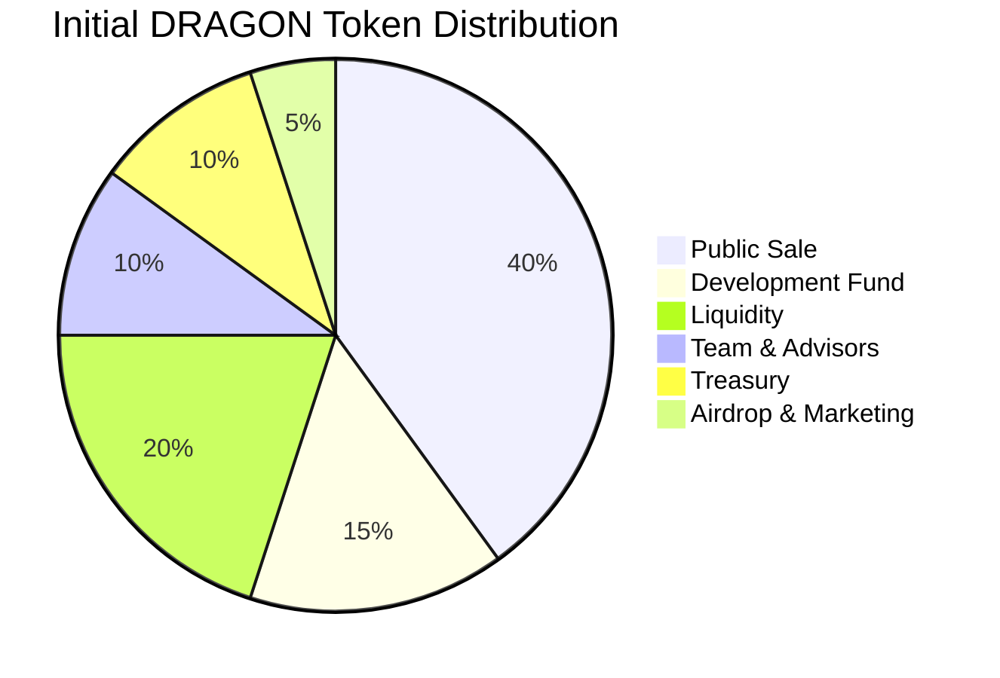
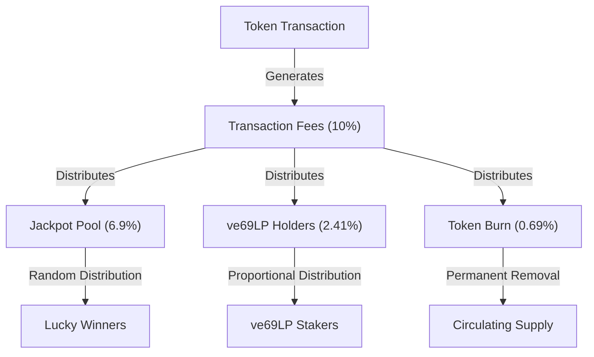
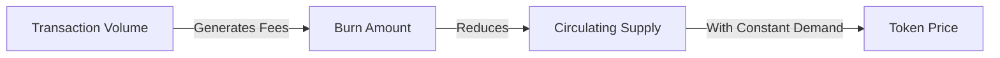
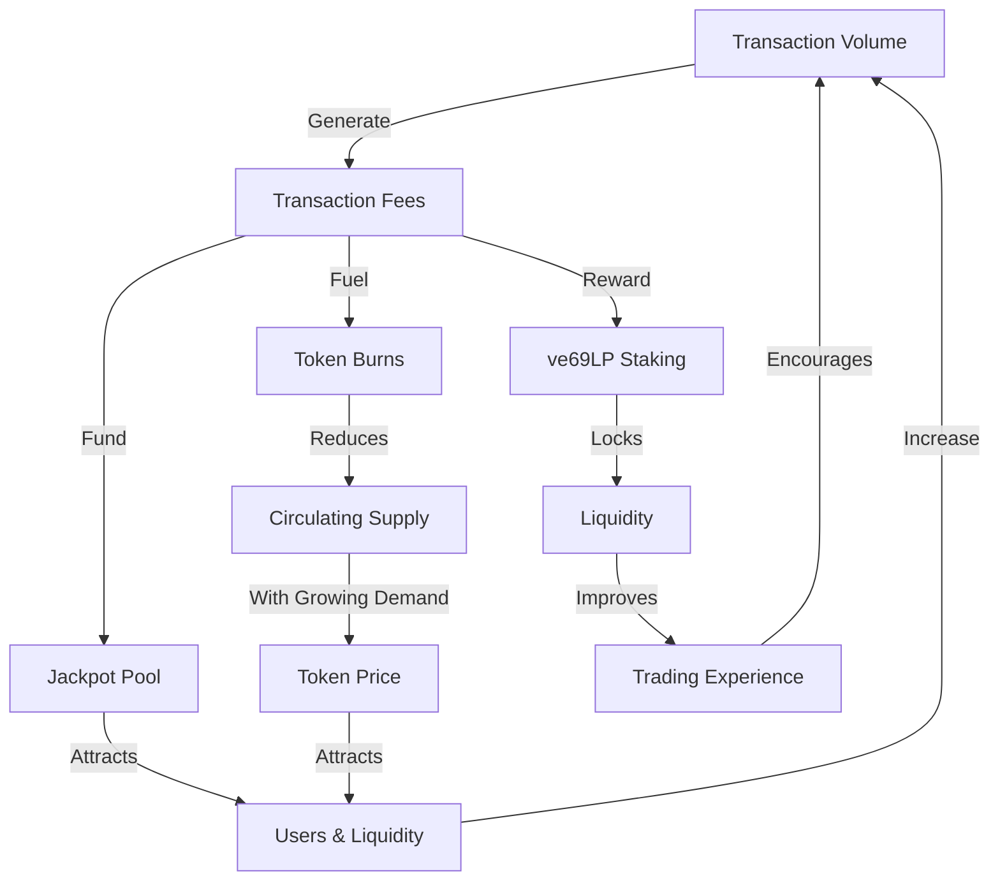

# Tokenomics

The Sonic Red Dragon token economy is designed for long-term sustainability, fair distribution, and value accrual through multiple mechanisms.

## Token Overview

The DRAGON token is the native token of the Sonic Red Dragon ecosystem:

| Parameter | Value |
|-----------|-------|
| Token Name | Sonic Red Dragon |
| Token Symbol | DRAGON |
| Decimals | 18 |
| Total Supply | 6,942,000 DRAGON |
| Token Type | ERC-20 (Cross-Chain) |
| Supply Model | Fixed Supply |

## Token Distribution

The initial distribution of DRAGON tokens is designed to ensure fair participation across various stakeholders:



| Allocation | Percentage | Tokens | Vesting |
|------------|------------|--------|---------|
| Public Sale | 40% | 2,776,800 | None (Immediate) |
| Development Fund | 15% | 1,041,300 | 2 years (linear) |
| Liquidity | 20% | 1,388,400 | Locked for 3 years |
| Team & Advisors | 10% | 694,200 | 2 years (6-month cliff) |
| Treasury | 10% | 694,200 | 3 years (linear) |
| Airdrop & Marketing | 5% | 347,100 | 1 year (linear) |

## Fee Structure

One of the unique aspects of the DRAGON token is its built-in fee structure that automatically distributes value across the ecosystem:



### Fee Breakdown

The total transaction fee of 10% is distributed as follows:

- **6.9% to Jackpot**: Accumulated in the jackpot pool for random distribution
- **2.41% to ve69LP Holders**: Distributed to users who have locked LP tokens
- **0.69% to Burn**: Permanently removed from circulation, creating deflationary pressure

### Fee Types

Different transaction types may have different fee structures:

| Transaction Type | Total Fee | Jackpot | ve69LP | Burn |
|------------------|-----------|---------|--------|------|
| Buy | 10% | 6.9% | 2.41% | 0.69% |
| Sell | 10% | 6.9% | 2.41% | 0.69% |
| Transfer | 5% | 3.45% | 1.205% | 0.345% |
| Cross-Chain | 0.5% | 0.345% | 0.1205% | 0.0345% |

## Value Accrual Mechanisms

The DRAGON token economics include multiple mechanisms for value accrual:

### 1. Deflationary Pressure

The burn mechanism creates continuous deflationary pressure on the token supply:



### 2. Jackpot Incentive

The jackpot system incentivizes holding and trading DRAGON:

- **Holding**: Increases chances of winning jackpots
- **Trading**: Generates more fees for the jackpot pool
- **Staking**: Provides additional jackpot entries

### 3. Governance Rights

DRAGON token holders can participate in governance through the ve69LP mechanism:

- **LP Provision**: Users provide liquidity with DRAGON
- **LP Locking**: LP tokens are locked to receive ve69LP
- **Governance**: ve69LP grants voting power proportional to amount and lock time

## Token Utility

The DRAGON token has multiple utilities within the ecosystem:

1. **Medium of Exchange**: Used for transactions within the ecosystem
2. **Governance**: Liquidity provision + locking for governance rights
3. **Fee Sharing**: ve69LP holders receive a share of transaction fees
4. **Jackpot Participation**: Token holders are eligible for jackpot winnings
5. **Cross-Chain Bridging**: Enables transfer of value across supported chains

## Economic Flywheel

The Sonic Red Dragon tokenomics create a self-reinforcing economic flywheel:



## Long-Term Sustainability

The Sonic Red Dragon tokenomics model is designed for long-term sustainability through:

1. **Fixed Supply**: No inflation, with deflationary pressure from burns
2. **Fee Distribution**: Revenue sharing with token holders
3. **Governance Incentives**: Long-term alignment through time-weighted voting
4. **Cross-Chain Strategy**: Expansion to multiple chains for wider adoption
5. **Partner Ecosystem**: Integration with partner protocols for expanded utility

## Emission Schedule

The token emission schedule follows a predetermined vesting period for each allocation:

```mermaid
gantt
    title DRAGON Token Emission Schedule
    dateFormat  YYYY-MM
    axisFormat %Y-%m
    
    section Public Sale
    Available Immediately :done, ps, 2023-10, 0d
    
    section Development Fund
    Linear Vesting (2 Years) :df, 2023-10, 2023-10-01, 24m
    
    section Liquidity
    Locked (3 Years) :liq, 2023-10, 36m
    
    section Team & Advisors
    Cliff (6 Months) :team_cliff, 2023-10, 6m
    Linear Vesting (18 Months) :team_vest, after team_cliff, 18m
    
    section Treasury
    Linear Vesting (3 Years) :treasury, 2023-10, 36m
    
    section Airdrop & Marketing
    Linear Vesting (1 Year) :airdrop, 2023-10, 12m
```

## Cross-Chain Economics

The cross-chain dimension adds unique economic considerations:

1. **Unified Supply**: Total token supply remains constant across all chains
2. **Chain-Specific Liquidity**: Each chain maintains its own liquidity pools
3. **Chain-Specific Fees**: Fee parameters can be optimized per chain
4. **Bridge Incentives**: Additional rewards for cross-chain activity
5. **Multi-Chain Governance**: Governance decisions apply across all chains

## Market Stabilization Mechanisms

To maintain price stability, several mechanisms are in place:

1. **Liquidity Bootstrapping**: Initial liquidity provision with long-term locks
2. **Dynamic Fee Adjustment**: Governance can adjust fees based on market conditions
3. **Buyback and Burn**: Treasury may conduct periodic buybacks and burns
4. **Jackpot Frequency Control**: Adjusting jackpot triggers to optimize market impact
5. **Staking Incentives**: Encouraging long-term holding through staking rewards
