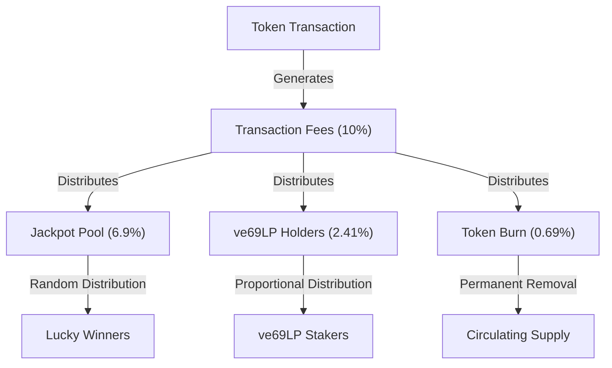
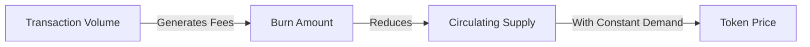
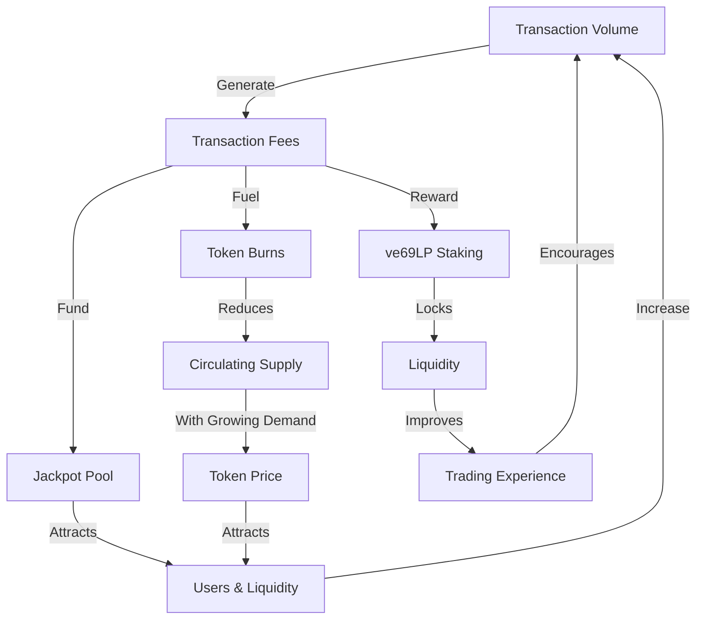

# Tokenomics

The OmniDragon token economy is designed for long-term sustainability, fair distribution, and value accrual through multiple mechanisms.

## Token Overview

The DRAGON token is the native token of the OmniDragon ecosystem:

| Parameter | Value |
|-----------|-------|
| Token Name | Dragon |
| Token Symbol | DRAGON |
| Decimals | 18 |
| Total Supply | 6,942,000 DRAGON |
| Token Type | ERC-20 (Cross-Chain) |
| Supply Model | Fixed Supply |

## Token Distribution

Details about the token distribution will be provided at a later date.

## Fee Structure

One of the unique aspects of the DRAGON token is its built-in fee structure that automatically distributes value across the ecosystem:

### Fee Breakdown

The total transaction fee is distributed as follows:

- **6.9% to Jackpot**: Accumulated in the jackpot pool for random distribution
- **2.41% to ve69LP Holders**: Distributed to users who have locked LP tokens
- **0.69% to Burn**: Permanently removed from circulation, creating deflationary pressure

### Fee Types

Different transaction types have different fee structures, based on the contracts:

| Transaction Type | Total Fee | Jackpot | ve69LP | Burn |
|------------------|-----------|---------|--------|------|
| Buy | 10% | 6.9% | 2.41% | 0.69% |
| Sell | 10% | 6.9% | 2.41% | 0.69% |
| Transfer | 0.69% | 0% | 0% | 0.69% |
| Cross-Chain | Varies by destination | 0% | 0% | 0% |

## Value Accrual Mechanisms

The DRAGON token economics include multiple mechanisms for value accrual:

### 1. Deflationary Pressure

The burn mechanism creates continuous deflationary pressure on the token supply:

### 2. Jackpot Incentive

The jackpot system incentivizes holding and trading DRAGON:

- **Holding**: Increases chances of winning jackpots
- **Trading**: Generates more fees for the jackpot pool
- **Staking**: Provides additional jackpot entries

### 3. Governance Rights

DRAGON token holders can participate in governance through the ve69LP mechanism:

- **LP Provision**: Users provide liquidity with DRAGON
- **LP Locking**: LP tokens are locked to receive ve69LP
- **Governance**: ve69LP grants voting power proportional to amount and lock time

## Token Utility

The DRAGON token has multiple utilities within the ecosystem:

1. **Medium of Exchange**: Used for transactions within the ecosystem
2. **Governance**: Liquidity provision + locking for governance rights
3. **Fee Sharing**: ve69LP holders receive a share of transaction fees
4. **Jackpot Participation**: Token holders are eligible for jackpot winnings
5. **Cross-Chain Bridging**: Enables transfer of value across supported chains

## Economic Flywheel

The OmniDragon tokenomics create a self-reinforcing economic flywheel:

## Long-Term Sustainability

The OmniDragon tokenomics model is designed for long-term sustainability through:

1. **Fixed Supply**: No inflation, with deflationary pressure from burns
2. **Fee Distribution**: Revenue sharing with token holders
3. **Governance Incentives**: Long-term alignment through time-weighted voting
4. **Cross-Chain Strategy**: Expansion to multiple chains for wider adoption
5. **Partner Ecosystem**: Integration with partner protocols for expanded utility

## Emission Schedule

Details about the token emission schedule will be provided at a later date.

## Cross-Chain Economics

The cross-chain dimension adds unique economic considerations:

1. **Unified Supply**: Total token supply remains constant across all chains (6,942,000 DRAGON)
2. **Chain-Specific Liquidity**: Each chain maintains its own liquidity pools
3. **Chain-Specific Fees**: LayerZero gas fees apply to cross-chain transfers
4. **Bridge Mechanism**: Tokens are burned on source chain and minted on destination chain
5. **Multi-Chain Governance**: Governance decisions apply across all chains

## Market Stabilization Mechanisms

To maintain price stability, several mechanisms are in place:

1. **Liquidity Bootstrapping**: Initial liquidity provision with long-term locks
2. **Dynamic Fee Adjustment**: Governance can adjust fees based on market conditions
3. **Buyback and Burn**: Treasury may conduct periodic buybacks and burns
4. **Jackpot Frequency Control**: Adjusting jackpot triggers to optimize market impact
5. **Staking Incentives**: Encouraging long-term holding through staking rewards
