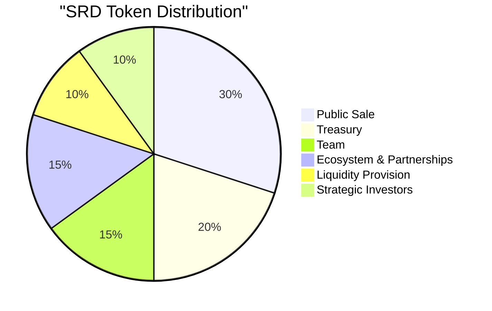
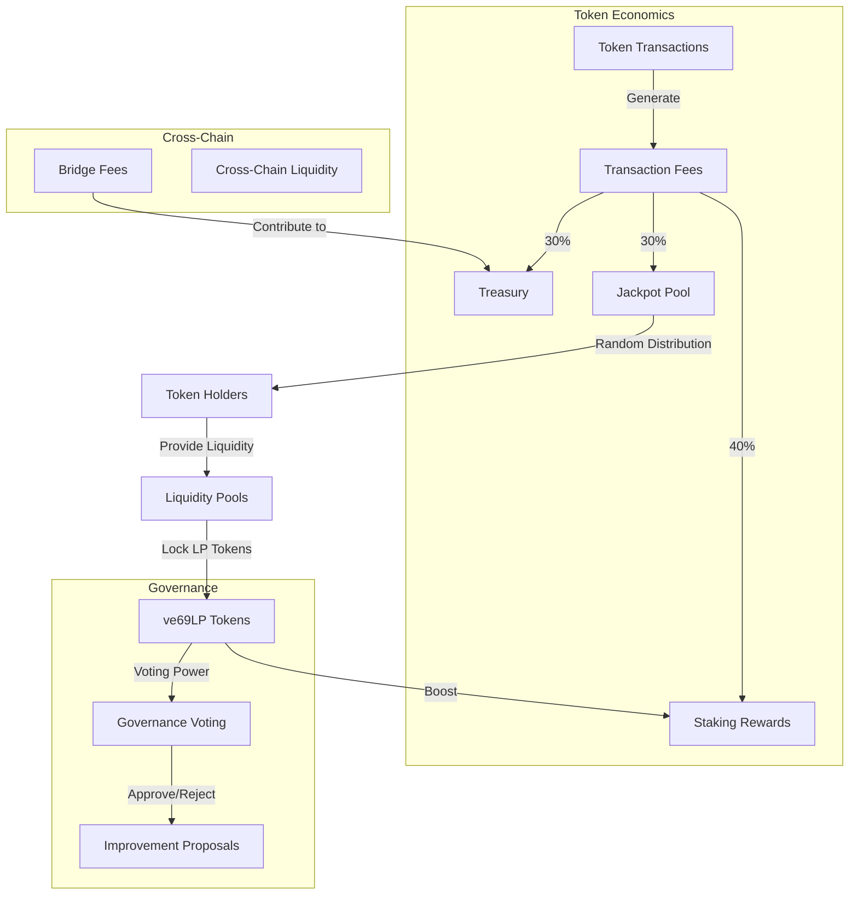
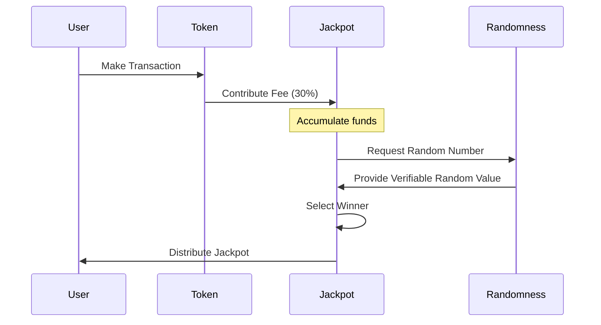

# Tokenomics

Sonic Red Dragon implements a carefully designed tokenomic model that balances sustainable growth, community rewards, and long-term value creation.

## Token Overview

- **Name**: Sonic Red Dragon
- **Symbol**: SRD
- **Decimals**: 18
- **Chain of Origin**: Ethereum
- **Type**: ERC-20 compatible, cross-chain enabled

## Token Distribution

The total supply of SRD tokens is distributed across several key allocations:



| Allocation | Percentage | Vesting |
|------------|------------|---------|
| Public Sale | 30% | No lock-up |
| Treasury | 20% | Linear vesting over 36 months |
| Team | 15% | 1-year cliff, then linear vesting over 24 months |
| Ecosystem & Partnerships | 15% | Linear vesting over 24 months |
| Liquidity Provision | 10% | Locked in LP pools |
| Strategic Investors | 10% | 6-month cliff, then linear vesting over 18 months |

## Economic Model

Sonic Red Dragon implements a unique economic model that combines several mechanisms to create value and distribute rewards.



### Fee Structure

Every token transaction includes a small fee that is distributed as follows:

- **30%** to the Treasury for long-term development and operations
- **40%** to Staking Rewards for liquidity providers and stakers
- **30%** to the Jackpot Pool for random distribution to token holders

### Jackpot Mechanism

The Jackpot is a unique feature of Sonic Red Dragon that distributes accumulated fees to random token holders:

1. **Accumulation**: Fees accumulate in the Jackpot Pool over time
2. **Randomness**: The dRAND network provides verifiable randomness for winner selection
3. **Distribution**: Jackpots are distributed on a regular schedule (daily, weekly, monthly)
4. **Eligibility**: All active wallets holding a minimum amount of SRD are eligible



### ve69LP Governance Model

The governance system uses vote-escrowed liquidity provider tokens (ve69LP) to determine voting power:

1. **Liquidity Provision**: Users provide liquidity to SRD pools
2. **LP Token Locking**: LP tokens can be locked for up to 4 years
3. **ve69LP Generation**: Locked LP tokens generate ve69LP tokens
4. **Voting Power**: ve69LP represents voting power and decays linearly over time
5. **Rewards Boost**: ve69LP holders receive boosted staking rewards

## Deflationary Mechanics

Sonic Red Dragon implements several deflationary mechanisms:

1. **Fee Burning**: A portion of the fees collected is burned, reducing the circulating supply
2. **Buyback and Burn**: Treasury funds are used periodically to buy back and burn tokens
3. **Jackpot Burns**: A percentage of each jackpot is burned before distribution

## Cross-Chain Economics

The token's cross-chain capability introduces additional economic considerations:

1. **Bridge Fees**: Cross-chain transfers incur a small fee that contributes to the Treasury
2. **Chain-Specific Liquidity**: Native liquidity is maintained on each supported chain
3. **Supply Consistency**: The total supply is maintained consistently across all chains

## Long-Term Sustainability

Several mechanisms ensure the long-term sustainability of the Sonic Red Dragon ecosystem:

1. **Treasury Growth**: The Treasury accumulates funds for ongoing development
2. **Governance Participation**: ve69LP incentivizes long-term commitment and participation
3. **Strategic Partnerships**: Ecosystem funds are used to develop strategic partnerships
4. **Fee Adjustability**: Fee parameters can be adjusted through governance to respond to market conditions

## Usage Example

Here's an example of how a user might interact with the ve69LP system:

```solidity
// Lock LP tokens to get ve69LP
function lockLPTokens(uint256 amount, uint256 lockDuration) external {
    // Transfer LP tokens from user
    lpToken.transferFrom(msg.sender, address(this), amount);
    
    // Calculate ve69LP amount based on amount and lock duration
    uint256 ve69lpAmount = calculateVe69LP(amount, lockDuration);
    
    // Mint ve69LP tokens to user
    ve69LP.mint(msg.sender, ve69lpAmount);
    
    // Record the lock expiry
    lockExpiry[msg.sender] = block.timestamp + lockDuration;
}
```

The Sonic Red Dragon tokenomics are designed to create a balanced ecosystem that rewards participation, encourages long-term holding, and maintains value through deflationary mechanisms.
