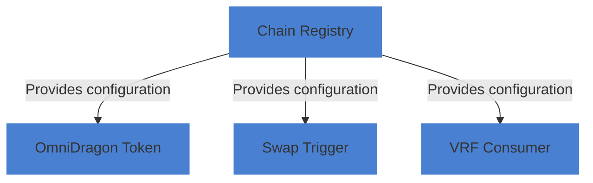

# Chain Registry Contract

The Chain Registry (`ChainRegistry.sol`) maintains information about supported blockchain networks and their respective configurations for cross-chain functionality in the OmniDragon ecosystem.

## Contract Overview

The Chain Registry serves as a central directory for the OmniDragon ecosystem, providing:

- Registry of supported blockchain networks and their chain IDs
- Chain-specific configuration for tokens and contracts
- Active/inactive status tracking for chains
- Ability to retrieve chain information across the ecosystem

## Actual Implementation

The Chain Registry contract is implemented as an Ownable contract with the following storage structure:

```solidity
// Storage for chain configuration
mapping(uint16 => ChainConfig) private chainConfigs;

// Track all supported chains
uint16[] private supportedChains;

// Current chain ID (set at deployment time)
uint16 private currentChainId;
```

The `ChainConfig` struct is defined in the `IChainRegistry` interface:

```solidity
struct ChainConfig {
    uint16 chainId;
    string chainName;
    address wrappedNativeToken;
    address swapTrigger;
    address vrfConsumer;
    address dragonToken;
    bool isActive;
}
```

## Key Functions

The contract implements several functions for managing chain configurations:

```solidity
// Register a new blockchain network
function registerChain(
    uint16 _chainId,
    string calldata _chainName,
    address _wrappedNativeToken,
    address _swapTrigger,
    address _vrfConsumer,
    address _dragonToken
) external override onlyOwner;

// Update an existing chain configuration
function updateChain(
    uint16 _chainId,
    address _wrappedNativeToken,
    address _swapTrigger,
    address _vrfConsumer,
    address _dragonToken
) external override onlyOwner;

// Set chain active/inactive status
function setChainActive(uint16 _chainId, bool _isActive) external override onlyOwner;

// Get chain configuration
function getChainConfig(uint16 _chainId) external view override returns (ChainConfig memory);

// Get the current chain's LayerZero ID
function getCurrentChainId() external view override returns (uint16);
```

## Chain Registry Usage

The Chain Registry is used throughout the OmniDragon ecosystem to retrieve chain-specific information:



## Chain-Specific Configuration

The Chain Registry tracks the following for each supported chain:

1.**Wrapped Native Token**: The chain's wrapped native token (WETH, WAVAX, WBNB, etc.)
2.**Swap Trigger**: The address of the swap trigger contract for that chain
3.**VRF Consumer**: The address of the VRF consumer for that chain
4.**DRAGON Token**: The OmniDragon token address on that chain

## Implementation Details

The Registry supports key functions for retrieving specific configuration elements:

```solidity
// Get the wrapped native token address
function getWrappedNativeToken(uint16 _chainId) external view override returns (address);

// Get swap trigger address
function getSwapTrigger(uint16 _chainId) external view override returns (address);

// Get VRF consumer address
function getVRFConsumer(uint16 _chainId) external view override returns (address);

// Get DRAGON token address
function getDragonToken(uint16 _chainId) external view override returns (address);

// Get all supported chain IDs
function getSupportedChains() external view override returns (uint16[] memory);

// Check if a chain is supported
function isChainSupported(uint16 _chainId) external view override returns (bool);
```

## Security Considerations

The Chain Registry implements several security features:

-**Owner-Only Configuration**: Only the contract owner can register or update chains
-**Validation Checks**: Validates addresses and parameters before updating the registry
-**Error Handling**: Uses custom errors for clear error reporting
