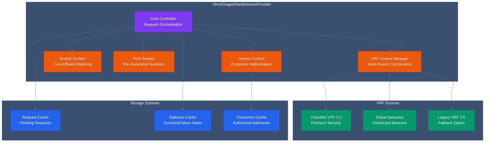
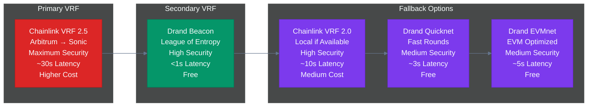
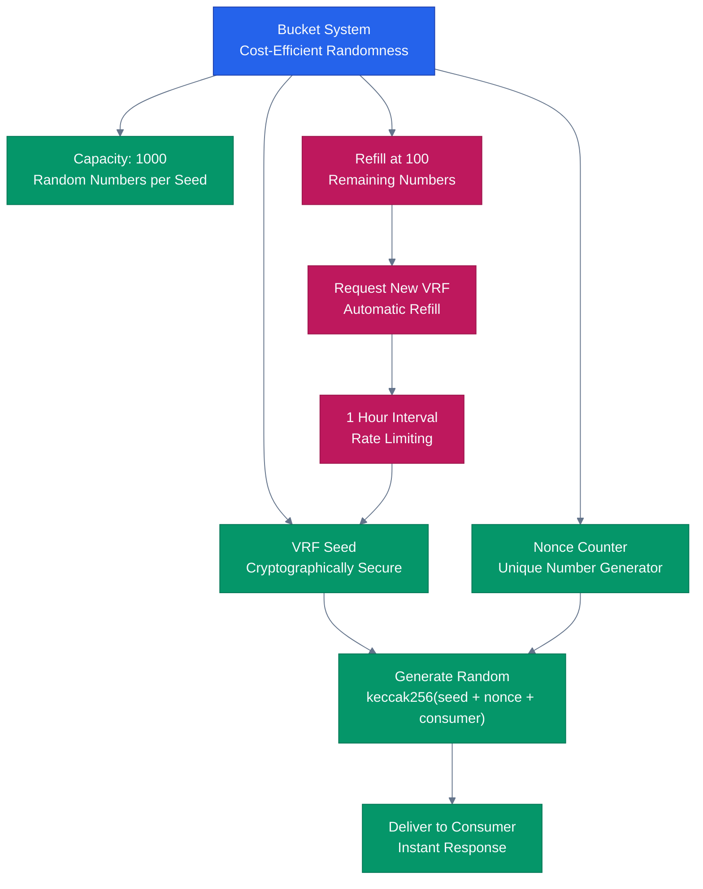
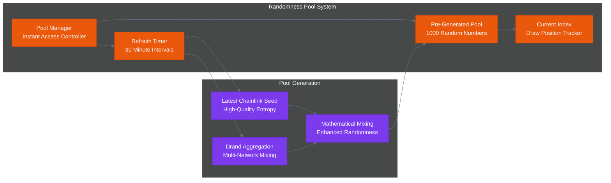
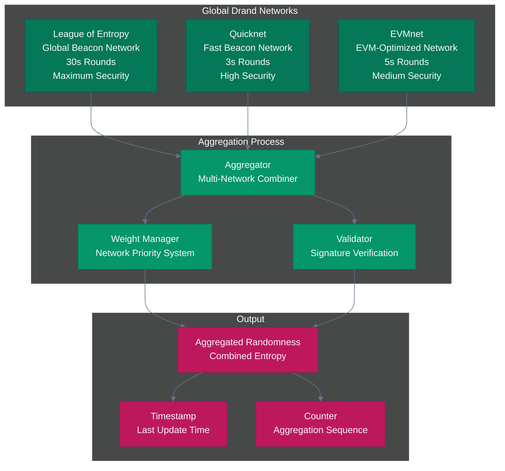
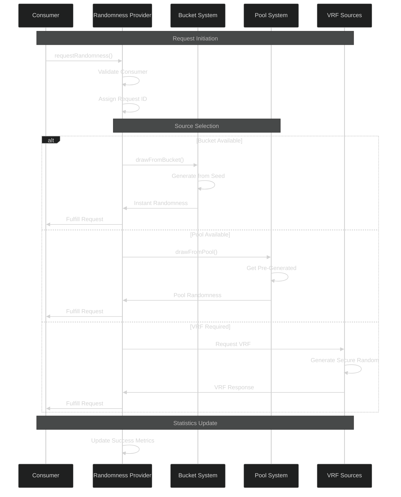
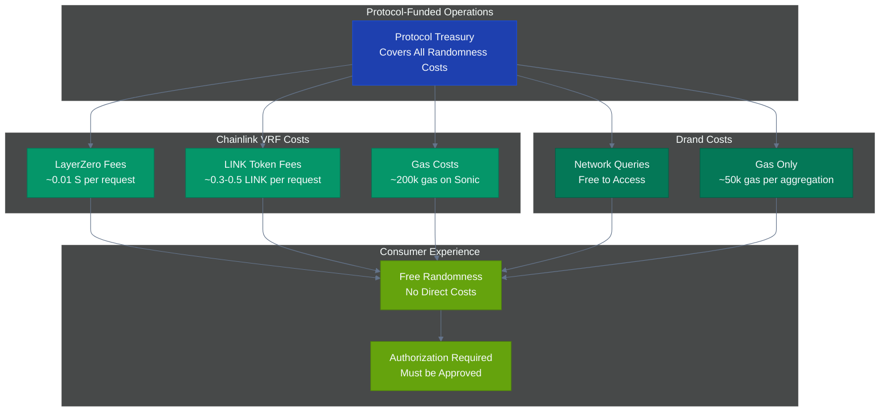

# OmniDragon Randomness Provider

The **OmniDragonRandomnessProvider** is the single source of truth for all randomness in the OmniDragon ecosystem. It manages multiple VRF sources, provides fallback mechanisms, and serves randomness to any authorized consumer with cost-efficient bucket systems.

## Overview

The Randomness Provider serves as the central hub for:
- **Multiple VRF Sources**: Chainlink VRF 2.5 via LayerZero, Drand networks
- **Cost-Efficient Systems**: Bucket system for high-frequency requests
- **Fallback Mechanisms**: Automatic switching between VRF sources
- **Enhanced Security**: Aggregated randomness from multiple sources
- **Universal Service**: Serves any authorized consumer (lottery, games, etc.)

## Key Features

### Multiple VRF Sources
- **Primary**: Chainlink VRF 2.5 via LayerZero from Arbitrum
- **Secondary**: Drand League of Entropy beacon network
- **Fallback**: Legacy Chainlink VRF 2.0 (if available locally)
- **Tertiary**: Drand Quicknet for fast randomness
- **Quaternary**: Drand EVMnet for EVM-optimized randomness

### Cost Optimization
- **Bucket System**: Batches multiple requests for efficiency
- **Randomness Pool**: Pre-generated numbers for instant access
- **Protocol-Funded**: All randomness costs covered by protocol
- **Gas Efficient**: Optimized for high-frequency operations

### Security Features
- **Multi-Source Aggregation**: Enhanced security through diversity
- **Continuous Monitoring**: Automatic health checks and failover
- **Access Control**: Only authorized consumers can request randomness
- **Request Validation**: Comprehensive input validation

## Contract Architecture

<div className="mermaid-container">
  <div className="mermaid-controls">
    <button className="mermaid-btn">Zoom In</button>
    <button className="mermaid-btn">Zoom Out</button>
    <button className="mermaid-btn">Reset View</button>
    <button className="mermaid-btn">Replay</button>
  </div>


</div>

## VRF Sources

### Supported Sources

<div className="mermaid-container">
  <div className="mermaid-controls">
    <button className="mermaid-btn">Animate Sources</button>
  </div>


</div>

```solidity
enum VRFSource {
    CHAINLINK_V2_5,    // Primary: Chainlink VRF 2.5 via LayerZero
    DRAND_BEACON,      // Secondary: Drand League of Entropy
    CHAINLINK_V2_0,    // Fallback: Legacy Chainlink VRF 2.0
    DRAND_QUICKNET,    // Tertiary: Drand Quicknet
    DRAND_EVMNET       // Quaternary: Drand EVMnet
}
```

### VRF Configuration

```solidity
struct VRFConfig {
    address contractAddress;    // VRF contract address
    bool isActive;             // Whether this VRF source is active
    uint256 priority;          // Priority level (1 = highest)
    uint256 maxRetries;        // Maximum retry attempts
    uint256 timeoutSeconds;    // Timeout for VRF response
    uint256 successCount;      // Number of successful requests
    uint256 failureCount;      // Number of failed requests
}
```

## Core Systems

### Bucket System

<div className="mermaid-container">
  <div className="mermaid-controls">
    <button className="mermaid-btn">Zoom In</button>
    <button className="mermaid-btn">Replay</button>
  </div>


</div>

The bucket system provides cost-efficient randomness for high-frequency requests:

```solidity
struct RandomnessBucket {
    uint256 seed;              // Current VRF seed
    uint256 nonce;             // Counter for deriving unique numbers
    uint256 maxNonce;          // Maximum nonce for this seed
    uint256 lastRefill;        // Timestamp of last VRF request
}
```

**Constants**:
- `BUCKET_SIZE`: 1000 random numbers per bucket
- `REFILL_THRESHOLD`: 100 numbers remaining triggers refill
- `CHAINLINK_REQUEST_INTERVAL`: 1 hour between Chainlink requests

### Randomness Pool

<div className="mermaid-container">
  <div className="mermaid-controls">
    <button className="mermaid-btn">Animate Pool</button>
  </div>


</div>

Enhanced pool system for instant randomness access:

```solidity
struct RandomnessPool {
    uint256[] randomNumbers;    // Array of pre-generated random numbers
    uint256 currentIndex;       // Current index for drawing numbers
    uint256 lastChainlinkSeed; // Last Chainlink VRF seed used
    uint256 lastRefreshTime;    // Last time pool was refreshed
    bool isRefreshing;          // Whether pool is currently being refreshed
}
```

**Constants**:
- `POOL_SIZE`: 1000 pre-generated numbers
- `POOL_REFRESH_INTERVAL`: 30 minutes between refreshes
- `MIN_POOL_SIZE`: 100 minimum numbers before refresh

### Drand Network Aggregation

<div className="mermaid-container">
  <div className="mermaid-controls">
    <button className="mermaid-btn">Zoom In</button>
    <button className="mermaid-btn">Replay</button>
  </div>


</div>

Multi-network Drand integration for enhanced security:

```solidity
struct DrandNetwork {
    address integrator;
    bool active;
    uint256 weight;
    uint256 lastUpdate;
    uint256 lastValue;
    uint256 lastRound;
}
```

## Request Lifecycle

<div className="mermaid-container">
  <div className="mermaid-controls">
    <button className="mermaid-btn">Zoom In</button>
    <button className="mermaid-btn">Replay Flow</button>
  </div>


</div>

## Core Functions

### Main Randomness Functions

#### Request Randomness
```solidity
function requestRandomness() external returns (uint256 requestId);
```

**Features**:
- Protocol covers all costs
- Automatic source selection
- Fallback mechanisms
- Request tracking

**Requirements**:
- Caller must be authorized consumer
- System must not be paused
- VRF sources must be available

#### Request with Specific Source
```solidity
function requestRandomnessWithSource(
    VRFSource vrfSource, 
    bool useBucket
) public returns (uint256 requestId);
```

**Parameters**:
- `vrfSource`: Preferred VRF source
- `useBucket`: Whether to use bucket system for cost efficiency

#### Draw from Bucket
```solidity
function drawRandomnessFromBucket() external returns (uint256 randomness);
```

**Features**:
- Instant randomness delivery
- Cost-efficient for high-frequency use
- Automatic refill management
- Deterministic generation from VRF seed

**Important Notes**:
- Reverts if bucket is empty
- Check `getBucketStatus()` before calling
- Bucket refills are asynchronous

#### Get Aggregated Randomness
```solidity
function getAggregatedRandomness() external view returns (uint256 randomness);
```

**Features**:
- Free, immediate access
- Aggregated from all Drand networks
- May be stale if not recently updated
- No gas cost for reading

## Cost Model

<div className="mermaid-container">
  <div className="mermaid-controls">
    <button className="mermaid-btn">Animate Costs</button>
  </div>


</div>

### Protocol-Funded Operations

The protocol covers all randomness costs:

- **Chainlink VRF**: LayerZero fees paid in $S (Sonic native token)
- **Drand**: Free queries, only gas costs
- **Consumers**: Free to request randomness (must be authorized)

### Operational Requirements

1. **ChainlinkVRFIntegrator** must be funded with $S for LayerZero fees
2. **OmniDragonVRFRequester** must be deployed on Arbitrum with funded VRF subscription
3. **LayerZero endpoints** must be configured for cross-chain messaging
4. **Drand integrator contracts** must be deployed and configured

### Gas Costs

- **Individual Request**: ~200k gas
- **Bucket Draw**: ~50k gas
- **Pool Refresh**: ~1M gas
- **Drand Collection**: ~1M gas (multiple networks)

## Security Features

### Access Control

```solidity
modifier onlyAuthorizedConsumer() {
    require(authorizedConsumers[msg.sender], "Not authorized consumer");
    _;
}
```

### Request Validation

```solidity
function _validateRequest(address requester, VRFSource source) internal view {
    require(authorizedConsumers[requester], "Not authorized");
    require(vrfConfigs[source].isActive, "VRF source not active");
    require(!paused(), "System paused");
}
```

### Randomness Generation

```solidity
function _generateFromSeed(
    uint256 seed, 
    uint256 nonce, 
    address consumer
) internal pure returns (uint256) {
    return uint256(keccak256(abi.encodePacked(seed, nonce, consumer)));
}
```

**Security Notes**:
- Uses only VRF-derived seeds
- Deterministic generation for auditability
- Consumer address adds uniqueness
- Suitable for high-frequency, lower-security use cases

## Performance Metrics

```mermaid
%%{init: {
  'theme': 'dark',
  'themeVariables': {
    'primaryColor': '#1d4ed8',
    'primaryTextColor': '#f8fafc',
    'lineColor': '#64748b'
  },
  'xyChart': {
    'width': 700,
    'height': 400
  }
}}%%
xychart-beta
    title "VRF Method Performance Comparison"
    x-axis ["Cost", "Latency", "Security", "Throughput"]
    y-axis "Performance Score" 0 --> 10
    bar [9, 2, 10, 3]
    bar [3, 9, 8, 8]
    bar [1, 10, 6, 9]
    bar [2, 10, 6, 10]
```

<div className="mermaid-container">
  <div className="mermaid-controls">
    <button className="mermaid-btn">Show Performance</button>
  </div>


</div>

| Method | Cost | Latency | Security | Use Case |
|--------|------|---------|----------|----------|
| Chainlink VRF | High | ~30s | Maximum | Critical applications |
| Drand Aggregated | Low | &lt;1s | High | General purpose |
| Bucket Draw | Very Low | &lt;1s | Medium | High-frequency |
| Pool Access | Minimal | Instant | Medium | Immediate needs |

## Integration Examples

### For Consumers

1. **Get Authorized**
   ```solidity
   // Owner must authorize your contract
   randomnessProvider.authorizeConsumer(yourContract, true);
   ```

2. **Implement Callback**
   ```solidity
   function fulfillRandomness(uint256 requestId, uint256 randomness) external {
       require(msg.sender == address(randomnessProvider), "Unauthorized");
       // Use randomness for your logic
   }
   ```

3. **Request Randomness**
   ```solidity
   uint256 requestId = randomnessProvider.requestRandomness();
   // Store requestId for callback matching
   ```

### For High-Frequency Use

1. **Check Bucket Status**
   ```solidity
   function getBucketStatus() external view returns (
       uint256 remainingNumbers,
       uint256 lastRefill,
       bool needsRefill
   );
   ```

2. **Draw from Bucket**
   ```solidity
   try randomnessProvider.drawRandomnessFromBucket() returns (uint256 randomness) {
       // Use randomness immediately
   } catch {
       // Bucket empty, fallback to regular request
       uint256 requestId = randomnessProvider.requestRandomness();
   }
   ```

## Links

- **Social**: [Twitter](https://x.com/sonicreddragon) | [Telegram](https://t.me/sonicreddragon)
- **Repository**: [GitHub](https://github.com/wenakita/omnidragon)
- **VRF Integration**: [Chainlink VRF](/contracts/randomness/chainlink) | [Drand Integration](/contracts/randomness/drand)


 