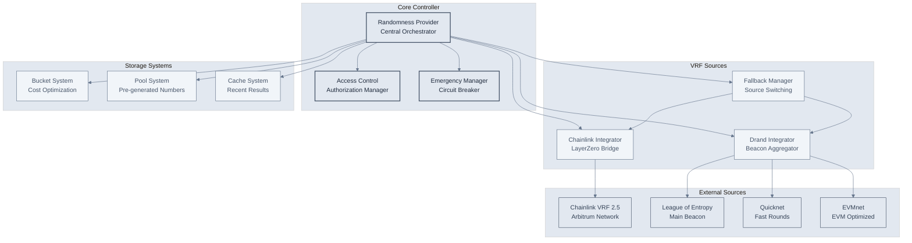
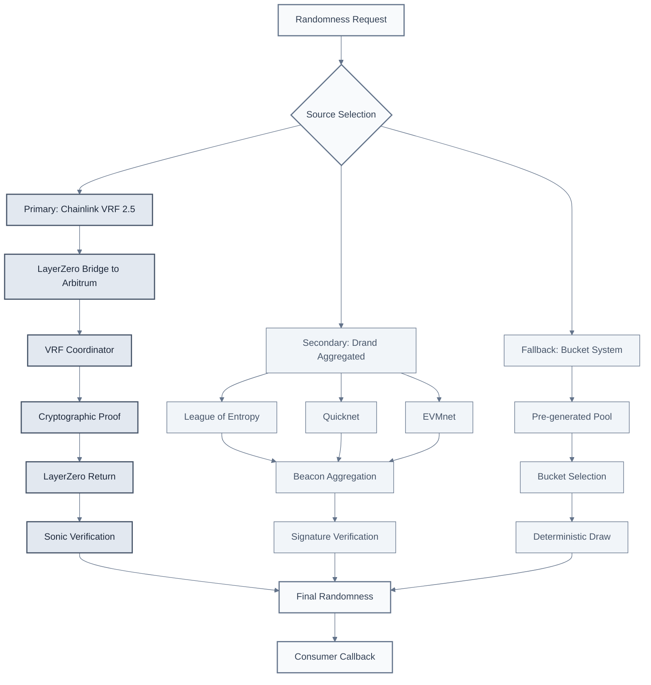
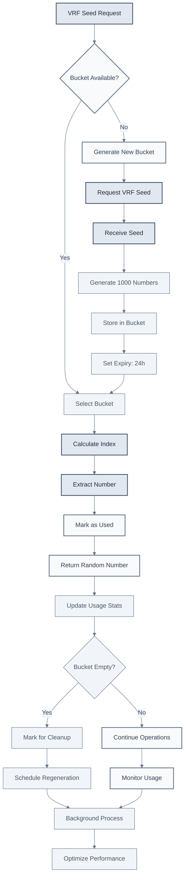
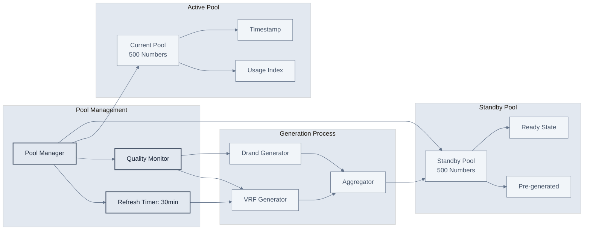
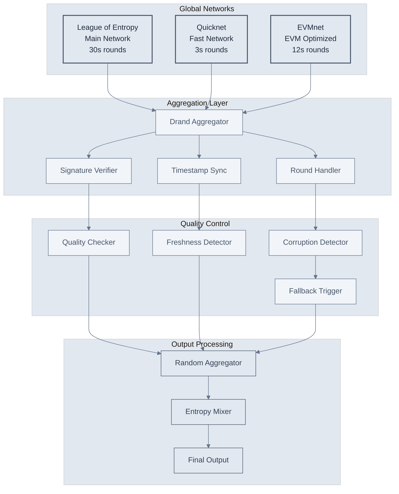
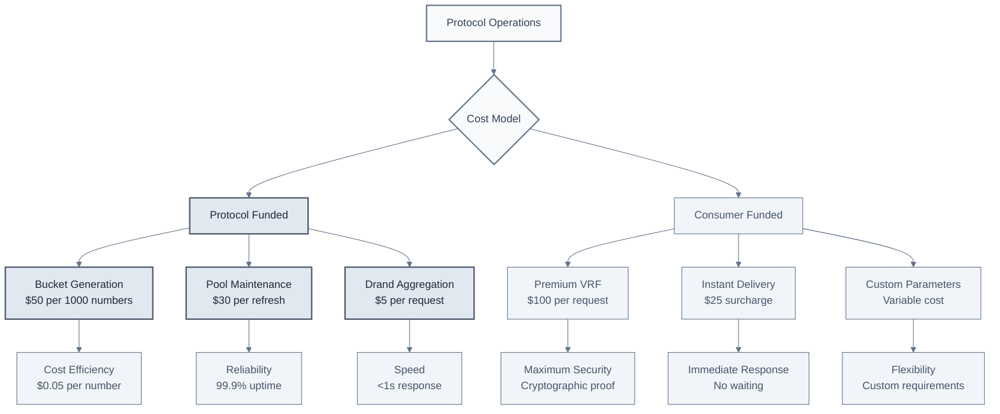

# OmniDragon Randomness Provider

The **OmniDragonRandomnessProvider** is the single source of truth for all randomness in the OmniDragon ecosystem. It manages multiple VRF sources, provides fallback mechanisms, and serves randomness to any authorized consumer with cost-efficient bucket systems.

## Overview

The Randomness Provider serves as the central hub for:
- **Multiple VRF Sources**: Chainlink VRF 2.5 via LayerZero, Drand networks
- **Cost-Efficient Systems**: Bucket system for high-frequency requests
- **Fallback Mechanisms**: Automatic switching between VRF sources
- **Enhanced Security**: Aggregated randomness from multiple sources
- **Universal Service**: Serves any authorized consumer (lottery, games, etc.)

## Contract Architecture

<div className="mermaid-container">
  <div className="mermaid-controls">
    <button className="mermaid-btn">Zoom In</button>
    <button className="mermaid-btn">Zoom Out</button>
    <button className="mermaid-btn">Reset View</button>
    <button className="mermaid-btn">Replay</button>
  </div>


</div>

## VRF Sources Hierarchy

<div className="mermaid-container">
  <div className="mermaid-controls">
    <button className="mermaid-btn">Zoom In</button>
    <button className="mermaid-btn">Zoom Out</button>
    <button className="mermaid-btn">Reset View</button>
    <button className="mermaid-btn">Replay</button>
  </div>


</div>

## Bucket System Flowchart

<div className="mermaid-container">
  <div className="mermaid-controls">
    <button className="mermaid-btn">Zoom In</button>
    <button className="mermaid-btn">Zoom Out</button>
    <button className="mermaid-btn">Reset View</button>
    <button className="mermaid-btn">Replay</button>
  </div>


</div>

## Randomness Pool System

<div className="mermaid-container">
  <div className="mermaid-controls">
    <button className="mermaid-btn">Zoom In</button>
    <button className="mermaid-btn">Zoom Out</button>
    <button className="mermaid-btn">Reset View</button>
    <button className="mermaid-btn">Replay</button>
  </div>


</div>

## Drand Network Aggregation

<div className="mermaid-container">
  <div className="mermaid-controls">
    <button className="mermaid-btn">Zoom In</button>
    <button className="mermaid-btn">Zoom Out</button>
    <button className="mermaid-btn">Reset View</button>
    <button className="mermaid-btn">Replay</button>
  </div>


</div>

## Request Lifecycle

<div className="mermaid-container">
  <div className="mermaid-controls">
    <button className="mermaid-btn">Zoom In</button>
    <button className="mermaid-btn">Zoom Out</button>
    <button className="mermaid-btn">Reset View</button>
    <button className="mermaid-btn">Replay</button>
  </div>

```mermaid
%%{init: {
  'theme': 'base',
  'themeVariables': {
    'primaryColor': '#f8fafc',
    'primaryTextColor': '#334155',
    'primaryBorderColor': '#64748b',
    'lineColor': '#64748b',
    'secondaryColor': '#f1f5f9',
    'tertiaryColor': '#e2e8f0'
  }
}}%%

sequenceDiagram
    participant C as Consumer
    participant RP as Randomness Provider
    participant CI as Chainlink Integrator
    participant DI as Drand Integrator
    participant BS as Bucket System
    
    C->>RP: requestRandomness(seed)
    RP->>RP: validateRequest()
    RP->>RP: selectSource()
    
    alt Primary: Chainlink VRF
        RP->>CI: requestVRF(seed)
        CI->>CI: bridgeToArbitrum()
        CI-->>RP: vrfPending()
        CI->>CI: receiveVRF()
        CI->>RP: fulfillRandomness(proof)
    else Secondary: Drand
        RP->>DI: requestDrand()
        DI->>DI: aggregateBeacons()
        DI->>RP: fulfillRandomness(signature)
    else Fallback: Bucket
        RP->>BS: getBucketNumber()
        BS->>BS: selectFromPool()
        BS->>RP: returnNumber()
    end
    
    RP->>RP: verifyRandomness()
    RP->>RP: storeResult()
    RP->>C: fulfillRandomness(result)
    C->>C: processResult()

    classDef default fill:#f8fafc,stroke:#64748b,stroke-width:2px,color:#334155
```
</div>

## Cost Model Visualization

<div className="mermaid-container">
  <div className="mermaid-controls">
    <button className="mermaid-btn">Zoom In</button>
    <button className="mermaid-btn">Zoom Out</button>
    <button className="mermaid-btn">Reset View</button>
    <button className="mermaid-btn">Replay</button>
  </div>


</div>

## Performance Metrics

<div className="mermaid-container">
  <div className="mermaid-controls">
    <button className="mermaid-btn">Zoom In</button>
    <button className="mermaid-btn">Zoom Out</button>
    <button className="mermaid-btn">Reset View</button>
    <button className="mermaid-btn">Replay</button>
  </div>


</div>

```mermaid
%%{init: {
  'theme': 'base',
  'themeVariables': {
    'primaryColor': '#f8fafc',
    'primaryTextColor': '#334155',
    'primaryBorderColor': '#64748b',
    'lineColor': '#64748b',
    'xyChart': {
      'backgroundColor': '#ffffff',
      'titleColor': '#1e293b',
      'xAxisLabelColor': '#475569',
      'yAxisLabelColor': '#475569',
      'xAxisTitleColor': '#334155',
      'yAxisTitleColor': '#334155',
      'plotColorPalette': '#64748b,#94a3b8,#cbd5e1,#e2e8f0'
    }
  }
}}%%

xychart-beta
    title "VRF Method Comparison"
    x-axis "Metrics" ["Cost", "Latency", "Security", "Throughput"]
    y-axis "Score (1-10)" 0 --> 10
    bar "Chainlink VRF" [3, 6, 10, 4]
    bar "Drand Aggregated" [8, 9, 8, 7]
    bar "Bucket System" [10, 10, 6, 10]
    bar "Pool System" [9, 9, 7, 9]
```

## Key Features

### Multiple VRF Sources
- **Chainlink VRF 2.5**: Premium cryptographic randomness via LayerZero
- **Drand Networks**: Distributed beacon aggregation from multiple sources
- **Bucket System**: Cost-efficient pre-generated randomness pools
- **Automatic Fallback**: Seamless switching between sources

### Cost Optimization
- **Bucket System**: Generate 1000 numbers from single VRF seed
- **Pool Management**: Pre-generated randomness for instant delivery
- **Protocol Funding**: Most operations funded by protocol treasury
- **Flexible Pricing**: Consumer-funded premium options available

### Security Features
- **Multi-Source Verification**: Cross-validation between VRF sources
- **Cryptographic Proofs**: Verifiable randomness with mathematical guarantees
- **Access Control**: Role-based permissions and emergency controls
- **Audit Trail**: Complete logging of all randomness generation

### Performance Characteristics

| Method | Cost | Latency | Security | Throughput | Use Case |
|--------|------|---------|----------|------------|----------|
| **Chainlink VRF** | High | ~30s | Maximum | Low | Critical operations |
| **Drand Aggregated** | Low | &lt;1s | High | General purpose |
| **Bucket Draw** | Very Low | &lt;1s | Medium | High-frequency |
| **Pool System** | Low | Instant | Medium | High | Real-time applications |

## Integration Examples

### Basic Randomness Request
```solidity
// Request randomness from the provider
uint256 requestId = randomnessProvider.requestRandomness(
    keccak256(abi.encodePacked(block.timestamp, msg.sender))
);
```

### Consumer Implementation
```solidity
contract LotteryConsumer is IRandomnessConsumer {
    function fulfillRandomness(uint256 requestId, uint256 randomness) 
        external override {
        // Process the randomness
        uint256 winner = randomness % totalParticipants;
        selectWinner(winner);
    }
}
```

### Advanced Configuration
```solidity
// Configure VRF source preferences
randomnessProvider.setSourcePreference(
    VRFSource.CHAINLINK_PRIMARY,
    VRFSource.DRAND_SECONDARY,
    VRFSource.BUCKET_FALLBACK
);
```

## Security Considerations

### Access Control
- **Role-based permissions** for all critical functions
- **Timelock protection** for parameter changes
- **Emergency pause** capability for security incidents
- **Multi-signature** requirements for sensitive operations

### Randomness Quality
- **Entropy validation** for all sources
- **Freshness checks** to prevent replay attacks
- **Signature verification** for Drand beacons
- **Proof validation** for Chainlink VRF responses

### Economic Security
- **Protocol funding** reduces consumer costs
- **Fallback mechanisms** ensure service continuity
- **Cost monitoring** prevents economic attacks
- **Rate limiting** protects against spam

The OmniDragon Randomness Provider represents a comprehensive solution for secure, cost-effective, and reliable randomness generation in the DeFi ecosystem, supporting everything from high-frequency gaming applications to critical lottery operations.


 