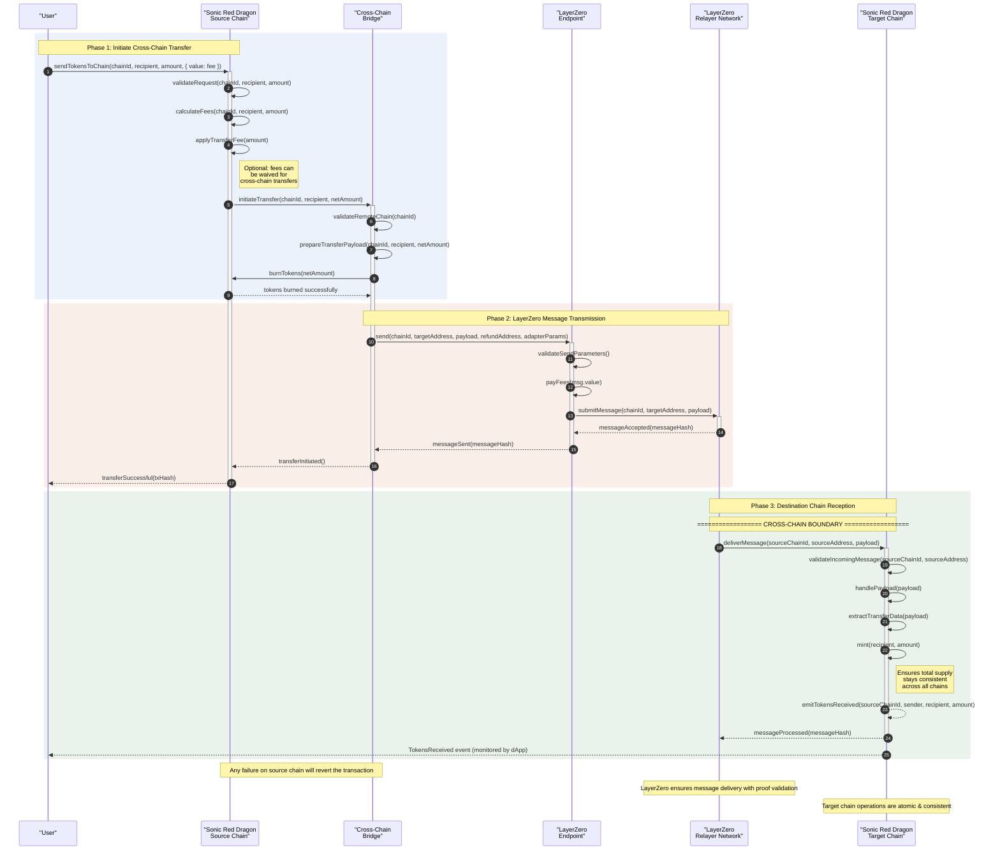
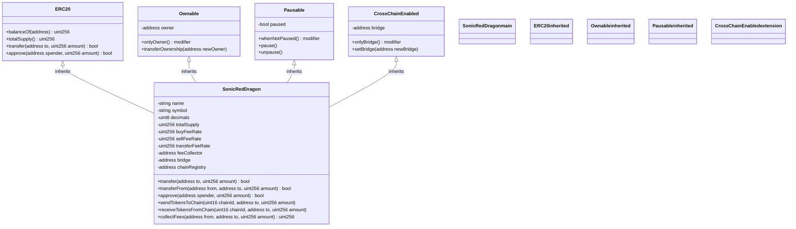

# Sonic Red Dragon Token Contract

The Sonic Red Dragon token (`SonicRedDragon.sol`) is the core contract of the ecosystem, implementing an ERC-20 token with advanced cross-chain and fee distribution capabilities.

## Architecture Overview

The Sonic Red Dragon token implements a robust architecture with multiple integrated systems:

```mermaid
flowchart TB
    %% Main token contract at the center
    OMNIDRAGON["Sonic Red Dragon Token<br/><i>ERC-20 Implementation</i>"]:::main
    
    %% Core components with detailed descriptions
    subgraph TokenCore ["Core Token Infrastructure"]
        direction TB
        
        ERC20["ERC-20 Standard<br/><small>• Basic token functions<br/>• Transfer & approve<br/>• Balance tracking</small>"]:::standard
        
        OWNABLE["Access Control<br/><small>• Owner privileges<br/>• Role management<br/>• Function access limits</small>"]:::standard
        
        UPGRADEABLE["Upgradeability<br/><small>• Proxy pattern<br/>• Logic separation<br/>• Future-proof design</small>"]:::standard
        
        PAUSABLE["Emergency Controls<br/><small>• Pause transfers<br/>• Circuit breakers<br/>• Recovery mechanisms</small>"]:::standard
    end
    
    %% Fee system with components
    subgraph FeeMechanism ["Fee Ecosystem"]
        direction TB
        
        FEE_CALC["Fee Calculator<br/><small>• Transaction type detection<br/>• Rate application<br/>• Dynamic adjustments</small>"]:::fee
        
        FEE_DISTRIBUTOR["Distributor<br/><small>• Multi-destination routing<br/>• Automatic splitting<br/>• Threshold-based execution</small>"]:::fee
        
        ADAPTIVE_FEE["Adaptive Logic<br/><small>• Market condition response<br/>• Volume-based adjustments<br/>• Anti-whale protections</small>"]:::fee
    end
    
    %% Cross-chain components
    subgraph CrossChainSystem ["LayerZero Cross-Chain Integration"]
        direction TB
        
        BRIDGE["Sonic Red Dragon Bridge<br/><small>• Token locking/burning<br/>• Secure transfers<br/>• Chain abstraction</small>"]:::bridge
        
        MSG_HANDLER["Message Handler<br/><small>• Payload processing<br/>• Security verification<br/>• Transaction reconstruction</small>"]:::bridge
        
        ENDPOINT["LayerZero Endpoint<br/><small>• Cross-chain messaging<br/>• Proof validation<br/>• Gas management</small>"]:::bridge
        
        ADAPTER["Chain Adapter<br/><small>• Chain-specific logic<br/>• Gas estimation<br/>• Version compatibility</small>"]:::bridge
    end
    
    %% Advanced features
    subgraph TokenFeatures ["Unique Value Propositions"]
        direction TB
        
        JACKPOT["Jackpot System<br/><small>• Random rewards<br/>• Fee accumulation<br/>• Transparent distribution</small>"]:::feature
        
        STAKING["Staking Mechanism<br/><small>• Flexible locks<br/>• Reward multipliers<br/>• Governance rights</small>"]:::feature
        
        GOVERNANCE["DAO Governance<br/><small>• Protocol parameters<br/>• Fee adjustment voting<br/>• Feature proposals</small>"]:::feature
        
        RANDOMNESS["dRand Integration<br/><small>• Verifiable randomness<br/>• Tamper-proof draws<br/>• Cross-chain consistency</small>"]:::feature
    end
    
    %% Connect everything to the main token
    TokenCore -.-> OMNIDRAGON
    FeeMechanism -.-> OMNIDRAGON
    CrossChainSystem -.-> OMNIDRAGON
    TokenFeatures -.-> OMNIDRAGON
    
    %% Detailed connections between components
    FEE_CALC -->|"Calculates<br/>amounts"| FEE_DISTRIBUTOR
    ADAPTIVE_FEE -->|"Adjusts<br/>parameters"| FEE_CALC
    FEE_DISTRIBUTOR -->|"Funds<br/>jackpot"| JACKPOT
    FEE_DISTRIBUTOR -->|"Provides<br/>rewards"| STAKING
    
    BRIDGE -->|"Uses"| MSG_HANDLER
    MSG_HANDLER -->|"Sends via"| ENDPOINT
    ENDPOINT -->|"Uses"| ADAPTER
    
    JACKPOT -->|"Uses"| RANDOMNESS
    GOVERNANCE -->|"Controls"| ADAPTIVE_FEE
    
    %% Connect to external systems
    DEX[("Decentralized<br/>Exchanges")]:::external
    DEX -.->|"Trading<br>fees"| FEE_CALC
    
    CHAINS[("Supported<br/>Blockchains")]:::external
    CHAINS -.->|"Connected<br/>via"| ADAPTER
    
    %% Apply styling for components with better colors
    classDef main fill:#4a80d1;stroke:#355899;color:#ffffff;font-weight:bold;stroke-width:3px;font-size:18px
    classDef standard fill:#42a5f5;stroke:#1e88e5;color:#ffffff
    classDef fee fill:#66bb6a;stroke:#43a047;color:#ffffff
    classDef bridge fill:#ab47bc;stroke:#8e24aa;color:#ffffff
    classDef feature fill:#ffb74d;stroke:#ff9800;color:#ffffff
    classDef external fill:#78909c;stroke:#455a64;color:#ffffff;stroke-dasharray:5 5
    
    %% Style subgraphs
    style TokenCore fill:rgba(33,150,243,0.1);stroke:#bbdefb;color:#1565c0;stroke-width:2px
    style FeeMechanism fill:rgba(76,175,80,0.1);stroke:#c8e6c9;color:#2e7d32;stroke-width:2px
    style CrossChainSystem fill:rgba(156,39,176,0.1);stroke:#e1bee7;color:#6a1b9a;stroke-width:2px
    style TokenFeatures fill:rgba(255,152,0,0.1);stroke:#ffecb3;color:#ff8f00;stroke-width:2px
    
    %% Style the main token with shadow effect
    style OMNIDRAGON filter:drop-shadow(0px 5px 8px rgba(0,0,0,0.2))
```

## Token Fees and Distribution

The Sonic Red Dragon token implements an innovative fee system with adaptive rates and multi-destination distribution:

```mermaid
flowchart LR
    %% Define transaction sources
    USER([User Account]):::user
    DEX([DEX Trading]):::exchange
    CROSS([Cross-Chain]):::bridge
    
    %% Transaction flows
    USER --> |"Transfer"| TX_TRANSFER[/"Transfer Transaction"/]:::tx
    DEX --> |"Buy/Sell"| TX_TRADE[/"Trade Transaction"/]:::tx
    CROSS --> |"Bridge"| TX_BRIDGE[/"Bridge Transaction"/]:::tx
    
    %% Group transactions
    subgraph Transactions
        TX_TRANSFER
        TX_TRADE
        TX_BRIDGE
    end
    
    %% Fee calculation
    TX_TRANSFER --> |"2% Fee"| FEE_ENGINE{{"Fee Engine"}}:::logic
    TX_TRADE --> |"10% Fee"| FEE_ENGINE
    TX_BRIDGE --> |"0% Fee"| FEE_ENGINE
    
    %% Fee modifiers
    subgraph FeeModifiers ["Dynamic Fee Adjustments"]
        direction TB
        TIME_HOLD["Holding Time<br>-0.5% per week<br>(up to -2%)"]:::modifier
        AMOUNT["Transaction Size<br>+0.5% for large tx<br>-0.5% for small tx"]:::modifier
        LOYALTY["Loyalty Program<br>-1% for members"]:::modifier
    end
    
    FeeModifiers -.-> |"Modifies"| FEE_ENGINE
    
    %% Fee distribution
    FEE_ENGINE --> DISTRIBUTOR{{"Fee Distributor<br>Contract"}}:::core
    
    %% Distribution paths with explanations
    DISTRIBUTOR -->|"69% → JACKPOT"| JACKPOT["Jackpot Vault<br><i>Funds random rewards</i>"]:::jackpot
    DISTRIBUTOR -->|"10% → LIQUIDITY"| LIQUIDITY["Liquidity Pool<br><i>Ensures trading depth</i>"]:::pool
    DISTRIBUTOR -->|"5% → MARKETING"| MARKETING["Marketing Fund<br><i>Promotion & outreach</i>"]:::ops
    DISTRIBUTOR -->|"5% → DEVELOPMENT"| DEV["Development Fund<br><i>Technical improvements</i>"]:::ops
    DISTRIBUTOR -->|"11% → STAKING"| STAKING["Staking Rewards<br><i>Holder incentives</i>"]:::rewards
    
    %% Define jackpot trigger
    JACKPOT -.->|"Fills"| JP_METER(("Jackpot<br>Meter")):::meter
    JP_METER -->|"Triggers<br>when full"| JP_DRAW{{"Random Draw<br>System"}}:::logic
    JP_DRAW -->|"Selects<br>Winner"| REWARD(["Lucky Holder<br>Receives Jackpot"]):::winner
    
    %% Styling
    classDef user fill:#4a80d1;stroke:#355899;color:#ffffff;font-weight:bold
    classDef exchange fill:#ff9800;stroke:#f57c00;color:#ffffff;font-weight:bold
    classDef bridge fill:#9c27b0;stroke:#7b1fa2;color:#ffffff;font-weight:bold
    classDef tx fill:#78909c;stroke:#546e7a;color:#ffffff
    classDef logic fill:#26a69a;stroke:#00897b;color:#ffffff;font-weight:bold
    classDef core fill:#5c6bc0;stroke:#3949ab;color:#ffffff;font-weight:bold
    classDef modifier fill:#7e57c2;stroke:#5e35b1;color:#ffffff
    classDef jackpot fill:#ffa000;stroke:#ff8f00;color:#ffffff;font-weight:bold
    classDef pool fill:#43a047;stroke:#388e3c;color:#ffffff;font-weight:bold
    classDef ops fill:#5c6bc0;stroke:#3949ab;color:#ffffff
    classDef rewards fill:#ec407a;stroke:#d81b60;color:#ffffff;font-weight:bold
    classDef meter fill:#f44336;stroke:#e53935;color:#ffffff
    classDef winner fill:#d4af37;stroke:#aa8c2c;color:#ffffff;font-weight:bold
    
    %% Style subgraphs
    style Transactions fill:#37474f;stroke:#263238;color:#ffffff;stroke-width:2px
    style FeeModifiers fill:#4527a0;stroke:#311b92;color:#ffffff;stroke-width:2px
```

## Cross-Chain Functionality

The Sonic Red Dragon token seamlessly integrates with LayerZero for cross-chain transfers:



## Implementation Details

The Sonic Red Dragon token implements several key modules:



## Key Features

Based on the contract implementation, the Sonic Red Dragon token includes:

1. **Adaptive Fee System**
   - Different fee rates for buy, sell, and transfer operations
   - Fee splitting to multiple destinations
   - Configurable fee parameters by governance

2. **Cross-Chain Integration**
   - Native integration with LayerZero protocol
   - Support for multiple EVM-compatible chains
   - Consistent token supply across all chains

3. **Jackpot System Integration**
   - Direct fee allocation to jackpot vault
   - Swap trigger for lottery entries
   - Configurable jackpot parameters

4. **Security Features**
   - Pausable transfers for emergency situations
   - Role-based access control
   - Upgradeable design via proxy pattern

## Jackpot Mechanism

Sonic Red Dragon implements an innovative on-chain jackpot system powered by verifiable randomness:

```mermaid
flowchart TB
    %% Transaction starts the process
    TRANSACTION([Token Transaction]):::tx --> |"Generates<br/>fees"| FEE_COLLECTOR{{"Fee Collector"}}:::core
    
    %% Fee distribution
    FEE_COLLECTOR --> |"6.9% of fees"| JACKPOT_VAULT[("Jackpot Vault<br/><small>Accumulates tokens</small>")]:::vault
    
    %% Threshold checking
    JACKPOT_VAULT --> THRESHOLD_CHECK{"Threshold<br/>Reached?"}:::decision
    THRESHOLD_CHECK -->|"No"| CONTINUE([Continue<br/>Accumulating]):::action
    
    %% Prepare for drawing
    THRESHOLD_CHECK -->|"Yes"| PREPARE_DRAW[/"Prepare for<br/>Jackpot Draw"/]:::process
    
    %% Get randomness
    PREPARE_DRAW --> |"Request<br/>randomness"| DRAND["dRand Beacon<br/><small>Verifiable<br/>random source</small>"]:::random
    DRAND --> |"Returns secure<br/>random value"| SELECT_WINNER{{"Winner<br/>Selection<br/>Algorithm"}}:::algorithm
    
    %% Eligible wallets
    subgraph EligibleHolders ["Eligible Token Holders"]
        direction LR
        HOLDER1(["Holder 1<br/><small>probability based<br/>on balance</small>"]):::holder
        HOLDER2(["Holder 2<br/><small>probability based<br/>on balance</small>"]):::holder
        HOLDER3(["Holder 3<br/><small>probability based<br/>on balance</small>"]):::holder
        HOLDER_MORE(["...more<br/>holders"]):::holder
    end
    
    %% Connect eligibility to algorithm
    EligibleHolders --> |"Considered for<br/>selection"| SELECT_WINNER
    
    %% Winner determination
    SELECT_WINNER -->|"Selects winner<br/>proportional to<br/>token holdings"| WINNER[("Lucky Winner<br/><small>Receives jackpot</small>")]:::winner
    
    %% Token transfer
    JACKPOT_VAULT -->|"Transfers<br/>accumulated tokens"| WINNER
    
    %% Emit result event
    WINNER -->|"Emits event"| JACKPOT_EVENT(["JackpotWon Event<br/><small>Recorded on-chain</small>"]):::event
    
    %% Final actions
    JACKPOT_EVENT --> RESET([Reset Jackpot<br/>for Next Round]):::final
    
    %% Styling
    classDef tx fill:#4a80d1;stroke:#355899;color:#ffffff;font-weight:bold
    classDef core fill:#5c6bc0;stroke:#3949ab;color:#ffffff;font-weight:bold
    classDef vault fill:#ffa000;stroke:#ff8f00;color:#ffffff;font-weight:bold
    classDef decision fill:#26a69a;stroke:#00897b;color:#ffffff;font-weight:bold
    classDef action fill:#78909c;stroke:#546e7a;color:#ffffff
    classDef process fill:#9c27b0;stroke:#7b1fa2;color:#ffffff;font-weight:bold
    classDef random fill:#d81b60;stroke:#c2185b;color:#ffffff;font-weight:bold
    classDef algorithm fill:#8e24aa;stroke:#6a1b9a;color:#ffffff;font-weight:bold
    classDef holder fill:#43a047;stroke:#388e3c;color:#ffffff
    classDef winner fill:#d4af37;stroke:#c6a636;color:#ffffff;font-weight:bold
    classDef event fill:#f57c00;stroke:#ef6c00;color:#ffffff
    classDef final fill:#6d4c41;stroke:#5d4037;color:#ffffff;font-weight:bold
    
    %% Subgraph styling
    style EligibleHolders fill:rgba(76,175,80,0.1);stroke:#c8e6c9;color:#2e7d32;stroke-width:2px
```

### Jackpot Selection Criteria

The Sonic Red Dragon jackpot selection process is designed to be fair and transparent:

1. **Threshold Triggering:**
   - Jackpot draws are triggered when the vault reaches a predetermined token threshold
   - Currently set to 100,000 DRAGON tokens (approximately $10,000 at launch price)

2. **Eligibility Requirements:**
   - Must hold a minimum of 1,000 DRAGON tokens
   - Tokens must have been held for at least 24 hours
   - Cannot have bought/sold within 6 hours of draw

3. **Selection Probability:**
   - Proportional to token holdings (more tokens = higher chance)
   - Capped at 5% maximum probability for any single wallet
   - Long-term holders receive bonus weight (+0.5% per week held, up to +10%)

4. **Verifiable Randomness:**
   - Uses dRand's verifiable random function (VRF) as entropy source
   - Random seed combined with sorted eligible holder list
   - Full verification possible through on-chain transaction data

## Multi-Chain Ecosystem

Sonic Red Dragon operates seamlessly across multiple blockchain networks, maintaining consistent state and features:

```mermaid
graph TB
    %% Main token deployed on multiple chains
    subgraph "Ethereum Mainnet"
        ETH_TOKEN("Sonic Red Dragon<br/>Token"):::mainnet
        ETH_JACKPOT("Jackpot Vault"):::mainnet
        ETH_LIQUIDITY("Liquidity Pool"):::mainnet
        ETH_ENDPOINT("LayerZero<br/>Endpoint"):::endpoint
        
        ETH_TOKEN -->|"Feeds"| ETH_JACKPOT
        ETH_TOKEN -->|"Enhances"| ETH_LIQUIDITY
        ETH_TOKEN -.->|"Connects via"| ETH_ENDPOINT
    end
    
    subgraph "BNB Chain"
        BSC_TOKEN("Sonic Red Dragon<br/>Token"):::bsc
        BSC_JACKPOT("Jackpot Vault"):::bsc
        BSC_LIQUIDITY("Liquidity Pool"):::bsc
        BSC_ENDPOINT("LayerZero<br/>Endpoint"):::endpoint
        
        BSC_TOKEN -->|"Feeds"| BSC_JACKPOT
        BSC_TOKEN -->|"Enhances"| BSC_LIQUIDITY
        BSC_TOKEN -.->|"Connects via"| BSC_ENDPOINT
    end
    
    subgraph "Arbitrum"
        ARB_TOKEN("Sonic Red Dragon<br/>Token"):::arb
        ARB_JACKPOT("Jackpot Vault"):::arb
        ARB_LIQUIDITY("Liquidity Pool"):::arb
        ARB_ENDPOINT("LayerZero<br/>Endpoint"):::endpoint
        
        ARB_TOKEN -->|"Feeds"| ARB_JACKPOT
        ARB_TOKEN -->|"Enhances"| ARB_LIQUIDITY
        ARB_TOKEN -.->|"Connects via"| ARB_ENDPOINT
    end
    
    subgraph "Avalanche"
        AVAX_TOKEN("Sonic Red Dragon<br/>Token"):::avax
        AVAX_JACKPOT("Jackpot Vault"):::avax
        AVAX_LIQUIDITY("Liquidity Pool"):::avax
        AVAX_ENDPOINT("LayerZero<br/>Endpoint"):::endpoint
        
        AVAX_TOKEN -->|"Feeds"| AVAX_JACKPOT
        AVAX_TOKEN -->|"Enhances"| AVAX_LIQUIDITY
        AVAX_TOKEN -.->|"Connects via"| AVAX_ENDPOINT
    end
    
    %% Central coordinator
    DRAND_COORDINATOR[("dRand Beacon<br/><small>Verifiable Randomness</small>")]:::core
    
    %% Cross-chain connections
    ETH_ENDPOINT <-->|"Messages"| BSC_ENDPOINT
    ETH_ENDPOINT <-->|"Messages"| ARB_ENDPOINT
    ETH_ENDPOINT <-->|"Messages"| AVAX_ENDPOINT
    BSC_ENDPOINT <-->|"Messages"| ARB_ENDPOINT
    BSC_ENDPOINT <-->|"Messages"| AVAX_ENDPOINT
    ARB_ENDPOINT <-->|"Messages"| AVAX_ENDPOINT
    
    %% Random beacon
    DRAND_COORDINATOR -.->|"Randomness"| ETH_JACKPOT
    DRAND_COORDINATOR -.->|"Randomness"| BSC_JACKPOT
    DRAND_COORDINATOR -.->|"Randomness"| ARB_JACKPOT
    DRAND_COORDINATOR -.->|"Randomness"| AVAX_JACKPOT
    
    %% User interaction
    USER(("User")):::user
    
    USER -->|"Interacts"| ETH_TOKEN
    USER -->|"Interacts"| BSC_TOKEN
    USER -->|"Interacts"| ARB_TOKEN
    USER -->|"Interacts"| AVAX_TOKEN
    
    %% Styling
    classDef mainnet fill:#627eea;stroke:#3763e5;color:#ffffff;font-weight:bold
    classDef bsc fill:#f0b90b;stroke:#d9a509;color:#000000;font-weight:bold
    classDef arb fill:#28a0f0;stroke:#1a93e4;color:#ffffff;font-weight:bold
    classDef avax fill:#e84142;stroke:#d4292a;color:#ffffff;font-weight:bold
    classDef endpoint fill:#1e293b;stroke:#0f172a;color:#ffffff
    classDef user fill:#4a80d1;stroke:#355899;color:#ffffff;font-weight:bold
    classDef core fill:#cc5a2b;stroke:#b54d24;color:#ffffff;font-weight:bold
    
    %% Subgraph styling
    style "Ethereum Mainnet" fill:rgba(98,126,234,0.1);stroke:#627eea;color:#627eea;stroke-width:2px
    style "BNB Chain" fill:rgba(240,185,11,0.1);stroke:#f0b90b;color:#704e06;stroke-width:2px
    style "Arbitrum" fill:rgba(40,160,240,0.1);stroke:#28a0f0;color:#28a0f0;stroke-width:2px
    style "Avalanche" fill:rgba(232,65,66,0.1);stroke:#e84142;color:#e84142;stroke-width:2px
```

## Contract Implementation

The Sonic Red Dragon smart contract architecture uses multiple inheritance and specialized components:

```mermaid
classDiagram
    %% Define contracts with expanded details
    class SonicRedDragon {
        %% Token Identity
        -string name = "Sonic Red Dragon"
        -string symbol = "DRAGON"
        -uint8 decimals = 18
        -uint256 totalSupply
        
        %% Fee Configuration
        -uint256 buyFeeRate
        -uint256 sellFeeRate
        -uint256 transferFeeRate
        -FeeDistributor feeDistributor
        
        %% Cross-Chain Configuration
        -ILayerZeroEndpoint endpoint
        -mapping(uint16 => address) trustedRemotes
        -uint256 nativeFee
        
        %% Access Control
        -address owner
        -mapping(address => bool) operators
        
        %% Lifecycle Methods
        +constructor(address _endpoint)
        +initialize(string name, string symbol) onlyProxy
        
        %% ERC20 Overrides
        +transfer(address to, uint256 amount) returns bool
        +transferFrom(address from, address to, uint256 amount) returns bool
        
        %% Cross-Chain Methods
        +sendTokensToChain(uint16 chainId, address to, uint256 amount) payable
        +receiveTokensFromChain(uint16 chainId, bytes from, uint256 amount)
        +estimateFees(uint16 chainId, address to, uint256 amount) returns uint256
        +setPeer(uint16 chainId, address peer) onlyOwner
        
        %% Fee Mechanisms
        +getFeeAmount(FeeType feeType, uint256 amount) returns uint256
        +setFeeRates(uint256 _buyFee, uint256 _sellFee, uint256 _transferFee) onlyOwner
        +setFeeDistributor(address _feeDistributor) onlyOwner
        -_takeFee(address from, address to, uint256 amount) returns uint256
        
        %% Security Guards
        +pause() onlyOwner whenNotPaused
        +unpause() onlyOwner whenPaused
        +recoverToken(address token, uint256 amount) onlyOwner
    }
    
    %% Base interfaces & implementations
    class ERC20 {
        <<Interface>>
        +name() returns string
        +symbol() returns string
        +decimals() returns uint8
        +totalSupply() returns uint256
        +balanceOf(address account) returns uint256
        +transfer(address to, uint256 amount) returns bool
        +allowance(address owner, address spender) returns uint256
        +approve(address spender, uint256 amount) returns bool
        +transferFrom(address from, address to, uint256 amount) returns bool
        #_mint(address account, uint256 amount)
        #_burn(address account, uint256 amount)
        #_transfer(address from, address to, uint256 amount)
    }
    
    class Ownable {
        -address private _owner
        +constructor()
        +owner() returns address
        +onlyOwner() modifier
        +renounceOwnership() onlyOwner
        +transferOwnership(address newOwner) onlyOwner
        #_transferOwnership(address newOwner)
        +event OwnershipTransferred(address indexed previousOwner, address indexed newOwner)
    }
    
    class Pausable {
        -bool private _paused
        +constructor()
        +paused() returns bool
        +whenNotPaused() modifier
        +whenPaused() modifier
        +pause() onlyOwner whenNotPaused
        +unpause() onlyOwner whenPaused
        +event Paused(address account)
        +event Unpaused(address account)
    }
    
    %% Cross-chain capabilities
    class CrossChainEnabled {
        <<Interface>>
        -ILayerZeroEndpoint endpoint
        -mapping(uint16 => address) trustedRemotes
        +setTrustedRemote(uint16 _chainId, address _remoteAddress) onlyOwner
        +getTrustedRemote(uint16 _chainId) returns address
        +setPeer(uint16 _chainId, address _peer) onlyOwner
        +onlyBridge() modifier
        +estimateFees(uint16 _dstChainId, address _to, uint256 _amount) public view returns uint256
        +event SetPeer(uint16 chainId, address peer)
        +event RemotePeerUpdated(uint16 chainId, address peer)
    }
    
    %% Fee distribution system
    class FeeDistributor {
        <<Interface>>
        -uint256 jackpotShare
        -uint256 liquidityShare
        -uint256 marketingShare
        -uint256 devShare
        -uint256 stakingShare
        +distributeTokens(uint256 amount)
        +setShares(uint256[] shares) onlyOwner
        +getJackpotAddress() returns address
        +getLiquidityAddress() returns address
        +event SharesUpdated(uint256[] shares)
    }
    
    %% LayerZero V2 interface
    class ILayerZeroEndpoint {
        <<Interface>>
        +send(uint16 _dstChainId, bytes _destination, bytes _payload, address payable _refundAddress, address _zroPaymentAddress, bytes _adapterParams) payable
        +receivePayload(uint16 _srcChainId, bytes _srcAddress, address _dstAddress, uint64 _nonce, uint _gasLimit, bytes _payload)
        +getInboundNonce(uint16 _srcChainId, bytes _srcAddress) returns uint64
        +getOutboundNonce(uint16 _dstChainId, address _srcAddress) returns uint64
        +estimateFees(uint16 _dstChainId, address _userApplication, bytes _payload, bool _payInZRO, bytes _adapterParam) returns (uint nativeFee, uint zroFee)
    }
    
    %% Define relationships
    ERC20 <|-- SonicRedDragon : inherits
    Ownable <|-- SonicRedDragon : inherits
    Pausable <|-- SonicRedDragon : inherits
    CrossChainEnabled <|-- SonicRedDragon : inherits
    SonicRedDragon --> FeeDistributor : uses
    CrossChainEnabled --> ILayerZeroEndpoint : uses
    
    %% Apply styling
    classDef main fill:#4a80d1;stroke:#355899;color:#ffffff;font-weight:bold
    classDef inherited fill:#43a047;stroke:#2e7d32;color:#ffffff
    classDef extension fill:#8e24aa;stroke:#6a1b9a;color:#ffffff
    classDef interface fill:#1e293b;stroke:#0f172a;color:#ffffff;font-style:italic
    
    class SonicRedDragon main
    class ERC20 inherited
    class Ownable inherited
    class Pausable inherited
    class CrossChainEnabled extension
    class FeeDistributor interface
    class ILayerZeroEndpoint interface
``` 

