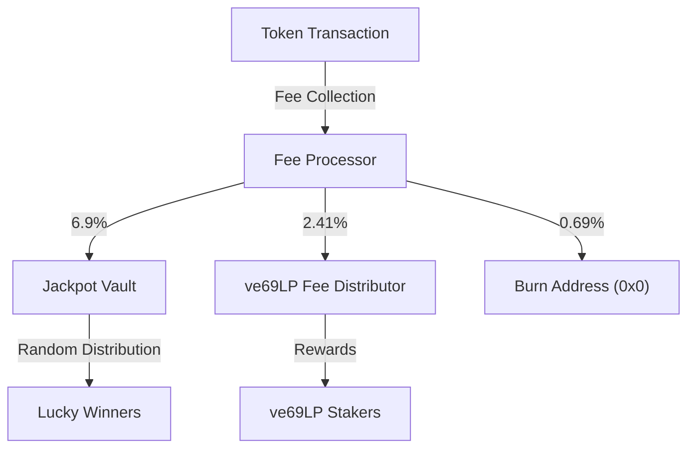
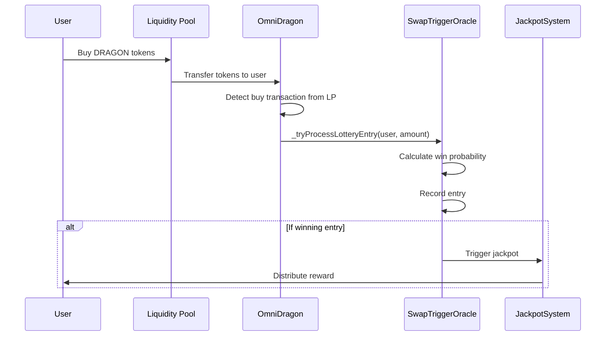
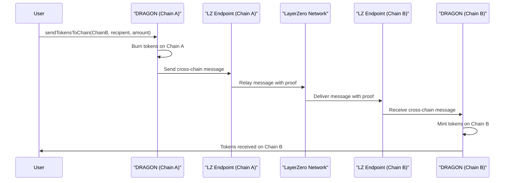

# OmniDragon Token

The OmniDragon token (`DRAGON`) is the core smart contract that powers the Sonic Red Dragon ecosystem, implementing a cross-chain compatible ERC-20 token with specialized functionality for fee distribution, jackpot mechanics, and LayerZero V2 integration.

## Overview

The OmniDragon token is designed with a comprehensive set of features that extend beyond the standard ERC-20 functionality:

- **Cross-Chain Compatibility**: Seamlessly bridge tokens between supported blockchains via LayerZero V2
- **Built-in Fee System**: Automatically distributes transaction fees to various ecosystem components
- **Jackpot Mechanics**: Integrate with the jackpot system for random token distributions
- **Governance Integration**: Connect with the ve69LP governance system
- **Partner Program Support**: Enable third-party integrations through the Dragon Partner Program

## Token Specifications

| Parameter | Value |
|-----------|-------|
| Token Name | Sonic Red Dragon |
| Token Symbol | DRAGON |
| Decimals | 18 |
| Maximum Supply | 6,942,000 DRAGON |
| Initial Supply | 6,942,000 DRAGON |
| Fee Structure | Dynamic fees based on transaction type |

## Fee Distribution

The OmniDragon token implements a sophisticated fee structure that automatically distributes fees on transactions:



The fee percentages are:
- **6.9%** directed to the jackpot vault for random distribution
- **2.41%** directed to ve69LP holders as staking rewards
- **0.69%** permanently burned, reducing total supply

## Lottery Entry Mechanism

The OmniDragon contract integrates directly with the jackpot system through the SwapTriggerOracle:



The implementation in code:

```solidity
// From OmniDragon.sol
function _transfer(
    address from,
    address to,
    uint256 amount
) internal override {
    // ... other transfer logic ...
    
    // Process lottery entry ONLY for buys (from liquidity pool to user)
    if (swapTrigger != address(0) && (isPairFrom || isPartnerPoolFrom)) {
        _tryProcessLotteryEntry(to, amount);
    }
}

function _tryProcessLotteryEntry(address user, uint256 amount) private {
    try IOmniDragonSwapTriggerOracle(swapTrigger).onSwap(user, amount) {
        // Lottery entry successful - no action needed
    } catch {
        // Ignore failures - no action needed
    }
}
```

This mechanism ensures that:
1. Only buy transactions generate lottery entries
2. Each buy has a chance to win the jackpot
3. Larger buys get higher chances of winning (as calculated by SwapTriggerOracle)

## Cross-Chain Functionality

The OmniDragon token implements the LayerZero V2 messaging protocol for secure cross-chain transfers:



## Core Functions

### Token Management

```solidity
// Mint tokens (owner only)
function mint(address to, uint256 amount) external onlyOwner

// Burn tokens
function burn(uint256 amount) external

// Transfer with fee handling
function transfer(address recipient, uint256 amount) external returns (bool)

// Transfer from with fee handling
function transferFrom(address sender, address recipient, uint256 amount) external returns (bool)
```

### Fee Configuration

```solidity
// Update fee structure
function updateFees(
    uint256 jackpotFee,
    uint256 ve69Fee,
    uint256 burnFee,
    string memory feeType
) external onlyOwner

// Exclude an address from fees
function excludeFromFees(address account, bool excluded) external onlyOwner
```

### Cross-Chain Operations

```solidity
// Send tokens to another chain
function sendTokensToChain(
    uint16 dstChainId,
    bytes memory toAddress,
    uint amount,
    address payable refundAddress,
    address zroPaymentAddress,
    bytes memory adapterParams
) external payable

// Receive tokens from another chain (internal)
function _receiveTokensFromChain(
    uint16 srcChainId,
    bytes memory srcAddress,
    address toAddress,
    uint amount
) internal
```

### Partner Integration

```solidity
// Register a partner pool
function registerPartnerPool(address pool) external onlyOwner

// Remove a partner pool
function removePartnerPool(address pool) external onlyOwner
```

## Fee Management Implementation

The OmniDragon contract swaps accumulated token fees for wrapped native tokens (WETH, WBNB, etc.) and distributes them:

```solidity
// From OmniDragon.sol
function swapTokensForWrappedNative(uint256 tokenAmount) private lockTheSwap {
    // ... swap logic ...
    
    // Calculate fee distribution using cached variables for gas efficiency
    uint256 totalFeeBasis = buyFees.jackpot + buyFees.ve69LP;
    
    // Avoid division by zero
    if (totalFeeBasis == 0) return;
    
    uint256 jackpotShare = (wrappedNativeReceived * buyFees.jackpot) / totalFeeBasis;
    uint256 ve69Share = wrappedNativeReceived - jackpotShare; // Optimized to avoid additional math
    
    // Distribute fees
    _distributeFees(jackpotShare, ve69Share);
}

function _distributeFees(uint256 jackpotAmount, uint256 ve69Amount) internal {
    // ... distribution logic ...
    
    if (jackpotAmount > 0 && vault != address(0)) {
        IERC20(wrappedToken).safeTransfer(vault, jackpotAmount);
        IDragonJackpotVault(vault).addToJackpot(jackpotAmount);
        emit FeeTransferred(vault, jackpotAmount, "Jackpot");
    }
    
    // ... other fee distributions ...
}
```

## Integration Examples

### Basic Token Transfer

```solidity
// Transfer tokens
IERC20(dragonTokenAddress).transfer(recipient, amount);
```

### Cross-Chain Transfer

```solidity
// Get the required fee for the cross-chain transfer
uint nativeFee = dragonToken.estimateSendFee(
    destinationChainId,
    abi.encodePacked(recipientAddress),
    amount,
    false,
    bytes("")
);

// Send tokens to another chain
dragonToken.sendTokensToChain{value: nativeFee}(
    destinationChainId,
    abi.encodePacked(recipientAddress),
    amount,
    msg.sender,
    address(0),
    bytes("")
);
```

## Security Considerations

The OmniDragon token implements several security measures:

- **Reentrancy Protection**: Uses ReentrancyGuard to prevent reentrant calls
- **Access Control**: Implements Ownable pattern for privileged operations
- **Pause Mechanism**: Ability to pause transfers in case of emergency
- **Fee Caps**: Maximum fee limits to prevent potential abuse

## Contract Address

| Chain | Address |
|-------|---------|
| Ethereum | `0x...` (coming soon) |
| BNB Chain | `0x...` (coming soon) |
| Arbitrum | `0x...` (coming soon) |
| Avalanche | `0x...` (coming soon) |
| Base | `0x...` (coming soon) |

For the most up-to-date contract addresses, see the [Contract Addresses](/reference/addresses/mainnet) section.
