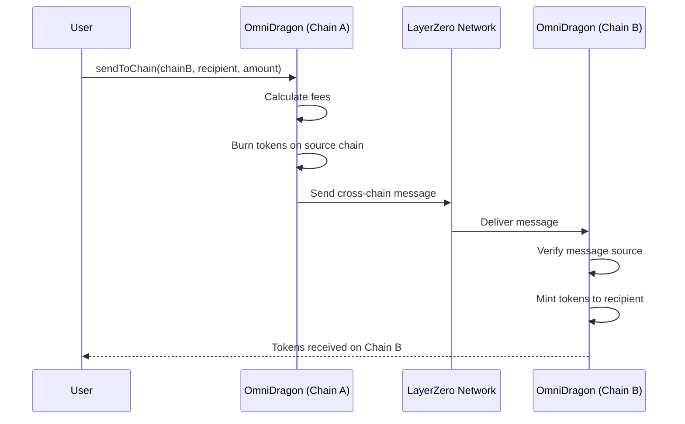

# OmniDragon Token Contract

The OmniDragon token (`OmniDragon.sol`) is the core smart contract of the ecosystem, implementing an ERC-20 token with LayerZero cross-chain capabilities, fee distribution, and jackpot mechanics.

## Contract Overview

The OmniDragon token contract implements several key features:

- **Cross-Chain Compatibility**: Token transfers across different blockchains via LayerZero
- **Fee System**: Automatic fee collection and distribution to various ecosystem components
- **Jackpot Mechanics**: Portion of fees directed to the jackpot system
- **Burn Mechanism**: Small portion of tokens burned on transfers

## Actual Implementation

The contract inherits from OpenZeppelin's ERC20, Ownable, and ReentrancyGuard, and implements core functionality:

```solidity
// Core imports
import "@openzeppelin/contracts/token/ERC20/ERC20.sol";
import "@openzeppelin/contracts/token/ERC20/utils/SafeERC20.sol";
import "@openzeppelin/contracts/security/ReentrancyGuard.sol";
import "@openzeppelin/contracts/access/Ownable.sol";

// Constructor parameters
constructor(
    string memory _name,
    string memory _symbol,
    address _jackpotVault,
    address _revenueDistributor,
    address _lzEndpoint,
    address _chainRegistry
) ERC20(_name, _symbol) Ownable() {
    // Initialize contract with key components
}
```

## Key Functions

The contract implements several key functions for cross-chain functionality and fee handling:

```solidity
// LayerZero integration for cross-chain transfers
function lzReceive(
    uint16 _srcChainId,
    bytes calldata _srcAddress,
    uint64 _nonce,
    bytes calldata _payload
) external;

// Standard transfer with fee handling
function transfer(address recipient, uint256 amount) 
    public 
    override 
    returns (bool);

// Transfer with custom fee processing
function _transfer(
    address sender, 
    address recipient, 
    uint256 amount
) internal override;

// Set peer function for LayerZero connections
function setPeer(
    uint16 _chainId,
    bytes calldata _peer
) external onlyOwner;
```

## Fee Structure

The OmniDragon token implements the following fee structure:

| Transaction Type | Total Fee | Jackpot | ve69LP | Burn |
|------------------|-----------|---------|--------|------|
| Buy | 10% | 6.9% | 2.41% | 0.69% |
| Sell | 10% | 6.9% | 2.41% | 0.69% |
| Transfer | 0.69% | 0% | 0% | 0.69% |

## Cross-Chain Functionality

OmniDragon integrates with LayerZero for cross-chain transfers:

1. Tokens are burned on the source chain
2. A message is sent through LayerZero to the destination chain
3. Equivalent tokens are minted on the destination chain

The contract specifies a maximum supply of 6,942,000 tokens.

## Key Components Interaction

```mermaid
flowchart TB
    classDef main fill:#4a80d1;stroke:#355899;color:#ffffff;font-weight:bold
    classDef component fill:#42a5f5;stroke:#1e88e5;color:#ffffff
    
    OmniDragon["OmniDragon Token"]:::main
    JackpotVault["JackpotVault"]:::component
    RevenueDist["RevenueDistributor"]:::component
    ChainRegistry["ChainRegistry"]:::component
    LZEndpoint["LayerZero Endpoint"]:::component
    
    OmniDragon -->|"Sends fees"| JackpotVault
    OmniDragon -->|"Distributes fees"| RevenueDist
    OmniDragon -->|"Consults"| ChainRegistry
    OmniDragon -->|"Cross-chain messaging"| LZEndpoint
```

## Security Features

The contract implements several security features:

- **Access Control**: Role-based permissions for sensitive operations
- **Reentrancy Protection**: Guards against reentrancy attacks
- **Fee Limits**: Maximum fee caps to protect against configuration errors
- **Pausable Transfers**: Ability to pause transfers in emergencies

## Implementation Notes

- The token contract requires configuration of jackpot vault, revenue distributor, LayerZero endpoint, and chain registry
- Fees can be enabled/disabled by the owner
- Certain addresses (jackpot vault, revenue distributor, owner) are excluded from fees
- The contract includes safety mechanisms to protect against common vulnerabilities

## Architecture Diagram

```mermaid
flowchart TB
    %% Main token contract
    OmniDragon["OmniDragon Token<br/>(ERC-20)"]:::main
    
    %% Core components
    subgraph Core ["Core Components"]
        direction TB
        ERC20["ERC-20 Standard"]:::standard
        LZ["LayerZero Integration"]:::bridge
        Fees["Fee Processor"]:::fee
    end
    
    %% Fee distribution
    subgraph Distribution ["Fee Distribution"]
        direction TB
        Jackpot["Jackpot Pool"]:::reward
        ve69LP["ve69LP Staking"]:::reward
        Burn["Token Burn"]:::mechanism
    end
    
    %% Cross-chain
    subgraph CrossChain ["Cross-Chain System"]
        direction TB
        Endpoint["LZ Endpoint"]:::external
        Registry["Chain Registry"]:::component
        Bridge["OmniDragon Bridge"]:::bridge
    end
    
    %% Connect everything
    Core --> OmniDragon
    OmniDragon --> Distribution
    OmniDragon --> CrossChain
    
    %% Detailed connections
    ERC20 -.-> OmniDragon
    LZ -.-> OmniDragon
    Fees -.-> OmniDragon
    
    Fees -->|"Distributes"| Jackpot
    Fees -->|"Rewards"| ve69LP
    Fees -->|"Burns"| Burn
    
    OmniDragon -->|"Uses"| Endpoint
    OmniDragon -->|"References"| Registry
    Registry -->|"Configures"| Bridge
    
    %% External systems
    DEX[("DEX Trading")]:::external
    DEX -.->|"Generates fees"| Fees
    
    %% Styling
    classDef main fill:#4a80d1;stroke:#355899;color:#ffffff;font-weight:bold
    classDef standard fill:#42a5f5;stroke:#1e88e5;color:#ffffff
    classDef fee fill:#66bb6a;stroke:#43a047;color:#ffffff
    classDef bridge fill:#ab47bc;stroke:#8e24aa;color:#ffffff
    classDef reward fill:#ffb74d;stroke:#ff9800;color:#ffffff
    classDef external fill:#78909c;stroke:#455a64;color:#ffffff
    classDef component fill:#5c6bc0;stroke:#3949ab;color:#ffffff
    classDef mechanism fill:#f44336;stroke:#e53935;color:#ffffff
    
    %% Subgraph styling
    style Core fill:rgba(33,150,243,0.1);stroke:#bbdefb;color:#1565c0
    style Distribution fill:rgba(255,152,0,0.1);stroke:#ffecb3;color:#ff8f00
    style CrossChain fill:rgba(156,39,176,0.1);stroke:#e1bee7;color:#6a1b9a
```

## Cross-Chain Functionality

OmniDragon implements cross-chain transfers using LayerZero's messaging protocol:



## Implementation Details

The OmniDragon token was designed with multiple security considerations:

- **Access Control**: Role-based permissions for sensitive operations
- **Reentrancy Protection**: Guards against reentrancy attacks in critical functions
- **Fee Limitations**: Maximum fee caps to protect against configuration errors
- **Emergency Functions**: Circuit breakers that can pause operations if needed

## Integration Example

Here's an example of how to integrate with the OmniDragon token contract:

```solidity
// SPDX-License-Identifier: MIT
pragma solidity ^0.8.0;

import "@omnidragon/contracts/interfaces/IOmniDragon.sol";

contract OmniDragonIntegration {
    IOmniDragon public omniDragon;
    
    constructor(address _omniDragonAddress) {
        omniDragon = IOmniDragon(_omniDragonAddress);
    }
    
    function transferTokens(address recipient, uint256 amount) external {
        // Note: The caller must have approved this contract first
        omniDragon.transferFrom(msg.sender, recipient, amount);
    }
    
    function sendCrossChain(
        uint16 dstChainId,
        bytes calldata destination,
        uint256 amount
    ) external payable {
        // Note: The caller must have approved this contract first
        omniDragon.transferFrom(msg.sender, address(this), amount);
        omniDragon.sendToChain{value: msg.value}(
            dstChainId,
            destination,
            amount,
            payable(msg.sender), // refund address
            address(0),          // zero payment address
            ""                   // default adapter params
        );
    }
}
```

## Interface

The OmniDragon token exposes a comprehensive interface that extends the standard ERC-20 functionality:

```solidity
interface IOmniDragon is IERC20 {
    // Cross-chain functionality
    function sendToChain(
        uint16 _dstChainId,
        bytes calldata _destination,
        uint256 _amount,
        address payable _refundAddress,
        address _zroPaymentAddress,
        bytes calldata _adapterParams
    ) external payable;
    
    // Fee configuration
    function setFeeReceivers(
        address _jackpotAddress,
        address _stakingAddress
    ) external;
    
    function setFeeRates(
        uint256 _buyFeeRate,
        uint256 _sellFeeRate,
        uint256 _transferFeeRate
    ) external;
    
    // LayerZero configuration
    function setPeer(uint16 _chainId, bytes calldata _peer) external;
    
    // Fee distribution
    function distributeFees() external;
    
    // View functions
    function getFeesAccumulated() external view returns (uint256);
    function getAmountAfterFees(uint256 _amount, uint8 _txType) external view returns (uint256);
}
``` 