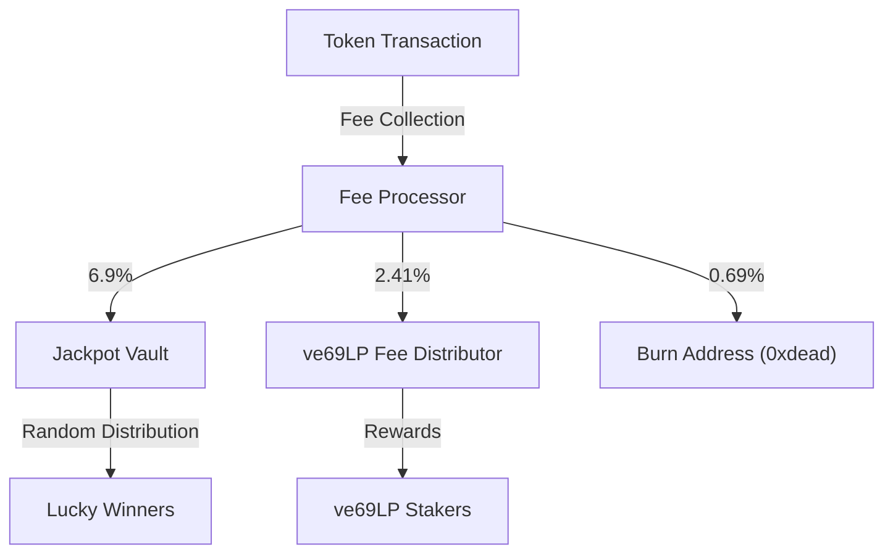
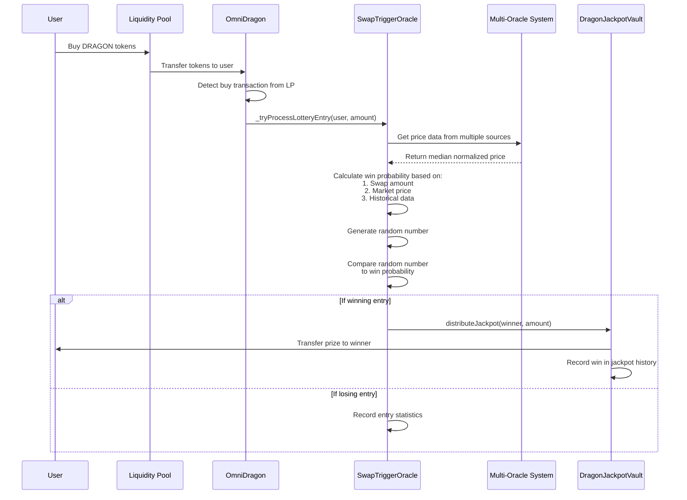
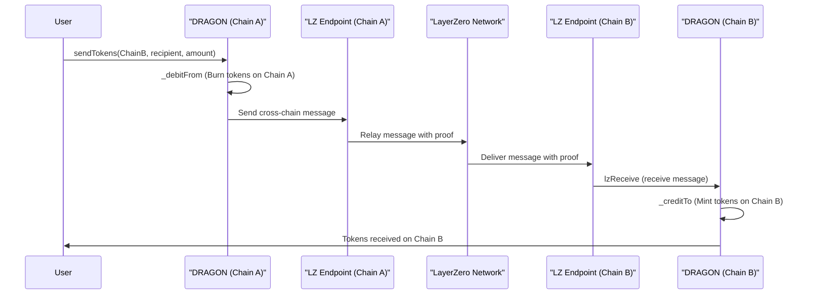

# OmniDragon Token

The OmniDragon token (`DRAGON`) is the core smart contract that powers the OmniDragon ecosystem, implementing a cross-chain compatible ERC-20 token with specialized functionality for fee distribution, jackpot mechanics, and LayerZero V2 integration.

## Overview

The OmniDragon token is designed with a comprehensive set of features that extend beyond the standard ERC-20 functionality:

- **Cross-Chain Compatibility**: Seamlessly bridge tokens between supported blockchains via LayerZero V2
- **Built-in Fee System**: Automatically distributes transaction fees to various ecosystem components
- **Jackpot Mechanics**: Integrate with the jackpot system for random token distributions
- **Governance Integration**: Connect with the ve69LP governance system
- **Partner Program Support**: Enable third-party integrations through the Dragon Partner Program

## Token Specifications

| Parameter | Value |
|-----------|-------|
| Token Name | Dragon |
| Token Symbol | DRAGON |
| Decimals | 18 |
| Maximum Supply | 6,942,000 DRAGON |
| Initial Supply | 6,942,000 DRAGON |
| Fee Structure | Dynamic fees based on transaction type |

## Fee Distribution

The OmniDragon token implements a sophisticated fee structure that automatically distributes fees on transactions:



The default fee percentages are:
- **6.9%** directed to the jackpot vault for random distribution
- **2.41%** directed to ve69LP holders as staking rewards
- **0.69%** permanently burned, reducing total supply

## Fee Types

Different transaction types have different fee structures:

| Transaction Type | Total Fee | Jackpot | ve69LP | Burn |
|------------------|-----------|---------|--------|------|
| Buy | 10% | 6.9% | 2.41% | 0.69% |
| Sell | 10% | 6.9% | 2.41% | 0.69% |
| Transfer | 0% | 0% | 0% | 0% |
| Cross-Chain | Varies by destination | - | - | - |

## Lottery Entry Mechanism

The OmniDragon token features an innovative jackpot system that automatically enters users into a lottery when they buy tokens. This system is designed to create engagement and reward token holders through a fair, transparent process.

### How It Works



The implementation in code:

```solidity
// From OmniDragon.sol
function _transfer(
    address from,
    address to,
    uint256 amount
) internal override {
    // ... other transfer logic ...
    
    // Process lottery entry ONLY for buys (from liquidity pool to user or partner pool to user)
    if (swapTrigger != address(0) && (isPairFrom || isPartnerPoolFrom)) {
        _tryProcessLotteryEntry(to, amount);
    }
}

function _tryProcessLotteryEntry(address user, uint256 amount) private {
    try IOmniDragonSwapTriggerOracle(swapTrigger).onSwap(user, amount) {
        // Lottery entry successful - no action needed
    } catch {
        // Ignore failures - no action needed
    }
}
```

### Lottery Entry Eligibility

For a transaction to qualify for a lottery entry:

1. **Transaction Type**: Must be a buy transaction (from liquidity pool or partner pool to user)
2. **Minimum Amount**: The swap amount must exceed the minimum threshold (configurable)
3. **Cooldown Period**: The user must not have entered within the cooldown period (configurable)
4. **SwapTrigger Set**: The swap trigger oracle address must be configured in the token contract

### Probability Calculation

Win probability is calculated by the SwapTriggerOracle using sophisticated algorithms:

1. **Base on Swap Size**: Larger swaps get higher probabilities (but with diminishing returns)
2. **Market Awareness**: Uses price data from multiple oracles to adjust probabilities
3. **Logarithmic Scaling**: Prevents whales from dominating while still rewarding larger buyers
4. **Anti-Manipulation**: Median price from multiple oracles protects against price manipulation

The probability calculation follows this pattern:

```solidity
// Simplified version of the calculation
function calculateWinProbability(uint256 amount) public view returns (uint256) {
    // Get swap ratio compared to average swap
    uint256 swapRatio = (amount * 10000) / averageSwapAmount;
    
    // Start with base probability
    uint256 probability = baseWinProbability;
    
    if (swapRatio <= 10000) {
        // For swaps below average, linear scale between base and 2x base
        probability = baseWinProbability + ((baseWinProbability * swapRatio) / 10000);
    } else {
        // For swaps above average, logarithmic scale with diminishing returns
        uint256 logFactor = 10000 * (1 + _log2(swapRatio / 10000));
        probability = baseWinProbability + (baseWinProbability * logFactor) / 10000;
    }
    
    // Cap at maximum probability
    return probability > maxWinProbability ? maxWinProbability : probability;
}
```

### Jackpot Funding

The jackpot is continuously funded through the fee structure of the token:

1. **Fee Collection**: 6.9% of all buy/sell transactions is allocated to the jackpot
2. **Token Swaps**: The OmniDragon contract accumulates tokens and periodically swaps for the native token
3. **Vault Transfers**: The native tokens are transferred to the jackpot vault
4. **Accumulated Growth**: The jackpot grows until a winner is determined

### Winner Determination

When a user performs a qualifying transaction:

1. The SwapTriggerOracle calculates their win probability (e.g., 5%)
2. A random number between 0-10000 is generated (using secure randomness)
3. If the random number is below the win probability threshold, the user wins
4. The oracle notifies the vault to distribute the prize
5. A portion of the jackpot (configurable percentage) is transferred to the winner

### Security Features

The lottery system includes multiple protections:

- **Separate Contracts**: Function separation prevents manipulation
- **Multi-Oracle Integration**: Price data from multiple sources prevents oracle manipulation
- **Rate Limiting**: Cooldown periods prevent rapid entries from the same user
- **Try/Catch Pattern**: Failed lottery entries don't interrupt normal token operations
- **Minimum Thresholds**: Prevents dust transactions from qualifying

### Cross-Chain Considerations

The lottery system operates independently on each chain:

- Each chain has its own jackpot vault
- Win probabilities are calculated using the same formula across chains
- Jackpot sizes correlate with chain activity levels
- Each chain's oracle uses local price feeds

## Cross-Chain Functionality

The OmniDragon token implements the LayerZero V2 messaging protocol for secure cross-chain transfers:



## Core Functions

### Token Management

```solidity
// Mint tokens (owner only)
function mint(address to, uint256 amount) external onlyOwner

// Perform initial minting (only on Sonic chain)
function performInitialMinting(address recipient) external onlyOwner

// Burn tokens
function burn(uint256 amount) public
```

### Fee Configuration

```solidity
// Set buy fees
function setBuyFees(uint256 jackpotFee, uint256 ve69Fee, uint256 burnFee) external onlyOwner

// Set sell fees
function setSellFees(uint256 jackpotFee, uint256 ve69Fee, uint256 burnFee) external onlyOwner

// Set transfer fees
function setTransferFees(uint256 jackpotFee, uint256 ve69Fee, uint256 burnFee) external onlyOwner

// Exclude an address from fees
function setExcludedFromFees(address account, bool excluded) external onlyOwner
```

### Cross-Chain Operations

```solidity
// Send tokens to another chain
function sendTokens(
    uint16 _dstChainId, 
    bytes32 _toAddress, 
    uint _amount, 
    address payable _refundAddress, 
    address _zroPaymentAddress, 
    bytes calldata _adapterParams
) external payable

// Receive tokens from another chain
function lzReceive(
    Origin calldata _origin,
    bytes32 /* _guid */,
    bytes calldata _message,
    address /* _executor */,
    bytes calldata /* _extraData */
) external
```

### Partner Integration

```solidity
// Register a partner pool
function registerPartnerPool(address _pool, uint256 _partnerId) external

// Remove a partner pool
function removePartnerPool(address _pool) external

// Process jackpot entry from a partner pool
function processPartnerJackpotEntry(address _user, uint256 _amount) external
```

## Fee Management Implementation

The OmniDragon contract swaps accumulated token fees for wrapped native tokens (WETH, WBNB, etc.) and distributes them:

```solidity
// From OmniDragon.sol
function swapTokensForWrappedNative(uint256 tokenAmount) private lockTheSwap {
    // ... swap logic ...
    
    // Calculate fee distribution using cached variables for gas efficiency
    uint256 totalFeeBasis = buyFees.jackpot + buyFees.ve69LP;
    
    // Avoid division by zero
    if (totalFeeBasis == 0) return;
    
    uint256 jackpotShare = (wrappedNativeReceived * buyFees.jackpot) / totalFeeBasis;
    uint256 ve69Share = wrappedNativeReceived - jackpotShare; // Optimized to avoid additional math
    
    // Distribute fees
    _distributeFees(jackpotShare, ve69Share);
}

function _distributeFees(uint256 jackpotAmount, uint256 ve69Amount) internal {
    // Cache token and vault addresses for gas optimization
    address wrappedToken = wrappedNativeToken;
    address vault = jackpotVault;
    
    // Process jackpot fee if non-zero and vault exists
    if (jackpotAmount > 0 && vault != address(0)) {
        IERC20(wrappedToken).safeTransfer(vault, jackpotAmount);
        IDragonJackpotVault(vault).addToJackpot(jackpotAmount);
        emit FeeTransferred(vault, jackpotAmount, "Jackpot");
    }
    
    // Process ve69LP fee if non-zero and distributor exists
    if (ve69Amount > 0 && revenueDistributor != address(0)) {
        IERC20(wrappedToken).safeTransfer(revenueDistributor, ve69Amount);
        // Use the general fee distribution method
        IDragonRevenueDistributor(revenueDistributor).distributeGeneralFees(wrappedToken, ve69Amount);
        emit FeeTransferred(revenueDistributor, ve69Amount, "Revenue");
    }
}
```

## Integration Examples

### Basic Token Transfer

```solidity
// Transfer tokens
IERC20(dragonTokenAddress).transfer(recipient, amount);
```

### Cross-Chain Transfer

```solidity
// Get the required fee for the cross-chain transfer
(uint nativeFee, ) = dragonToken.estimateSendFee(
    destinationChainId,
    recipientAddressBytes32,
    amount,
    false,
    bytes("")
);

// Send tokens to another chain
dragonToken.sendTokens{value: nativeFee}(
    destinationChainId,
    recipientAddressBytes32,
    amount,
    payable(msg.sender),  // refund address
    address(0),           // zro payment address
    bytes("")             // adapter params
);
```

## Security Considerations

The OmniDragon token implements several security measures:

- **Reentrancy Protection**: Uses ReentrancyGuard to prevent reentrant calls
- **Access Control**: Implements Ownable pattern for privileged operations
- **Pause Mechanism**: Ability to pause transfers in case of emergency
- **Fee Caps**: Maximum fee limits to prevent potential abuse

## Contract Address

| Chain | Address |
|-------|---------|
| Ethereum | `0x...` (coming soon) |
| BNB Chain | `0x...` (coming soon) |
| Arbitrum | `0x...` (coming soon) |
| Avalanche | `0x...` (coming soon) |
| Base | `0x...` (coming soon) |

For the most up-to-date contract addresses, see the [Contract Addresses](/reference/addresses/mainnet) section.
