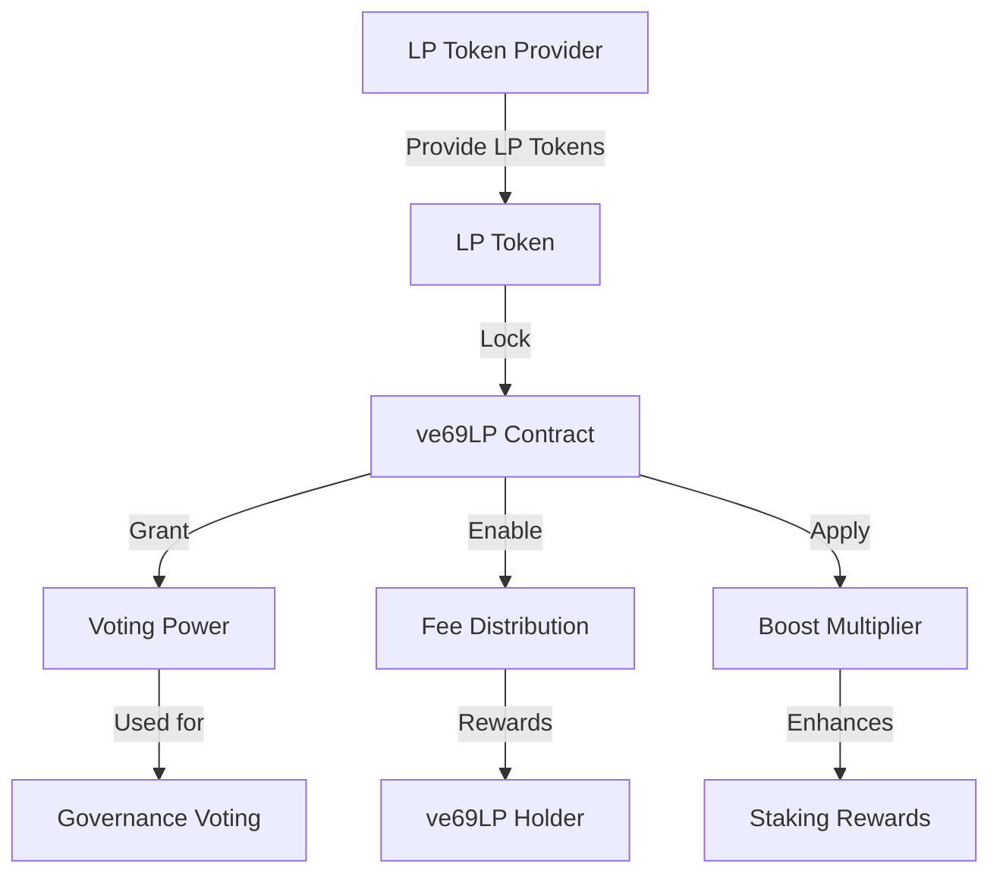
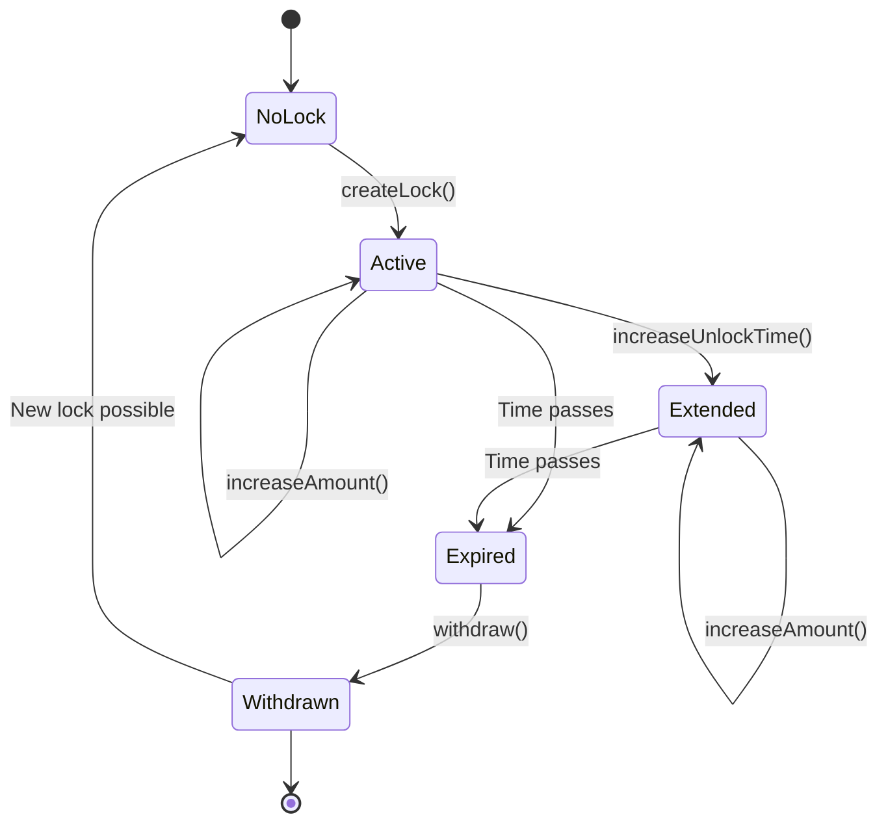

# ve69LP Governance

The ve69LP (vote-escrowed 69 Liquidity Provider) token is a core component of the Sonic Red Dragon governance system, implementing a time-weighted voting mechanism based on locked liquidity.

## Overview

ve69LP follows the vote-escrow model popularized by protocols like Curve Finance, with customizations specific to the Sonic Red Dragon ecosystem. Users lock their LP tokens for a period of time to receive voting power and other benefits proportional to both the amount locked and the lock duration.

## Key Features

- **Time-Weighted Voting**: Longer lock periods grant more voting power
- **Fee Distribution**: ve69LP holders receive a share of protocol fees
- **Boost Mechanics**: Staking rewards are boosted based on ve69LP holdings
- **Non-Transferable**: ve69LP tokens cannot be transferred, only earned through locking
- **Decaying Balance**: Voting power decreases linearly as the lock period approaches expiry

## Voting Power Calculation

The ve69LP voting power is calculated using a time-weighted formula:

```
VotingPower = AmountLocked * (LockDuration / MaxLockDuration)
```

Where:
- **AmountLocked**: The amount of LP tokens locked
- **LockDuration**: Time remaining until the lock expires (in seconds)
- **MaxLockDuration**: Maximum possible lock duration (4 years / 1461 days)

## Architecture



## Core Functions

### Locking and Voting Power

```solidity
// Create a new lock
function createLock(uint256 _amount, uint256 _unlockTime) external

// Increase lock amount
function increaseAmount(uint256 _amount) external

// Extend lock time
function increaseUnlockTime(uint256 _unlockTime) external

// Get current voting power
function balanceOf(address _owner) external view returns (uint256)

// Get voting power at a historical timestamp
function balanceOfAt(address _owner, uint256 _block) external view returns (uint256)

// Get total supply of voting power
function totalSupply() external view returns (uint256)

// Get total supply at a historical timestamp
function totalSupplyAt(uint256 _block) external view returns (uint256)
```

### Lock Management

```solidity
// Withdraw LP tokens after lock expiry
function withdraw() external

// Get lock details
function locked(address _addr) external view returns (LockedBalance memory)

// Get timestamp when lock expires
function lockEnd(address _addr) external view returns (uint256)
```

### Delegation

```solidity
// Delegate voting power to another address
function delegate(address _addr) external

// Get delegated voting power
function delegatedPower(address _addr) external view returns (uint256)

// Clear delegation
function clearDelegate() external
```

## Locking Mechanics

The ve69LP locking mechanism has the following parameters:

| Parameter | Value | Description |
|-----------|-------|-------------|
| Minimum Lock | 7 days | Shortest possible locking period |
| Maximum Lock | 1461 days (4 years) | Longest possible locking period |
| Minimum Amount | 0.01 LP | Smallest amount that can be locked |
| Early Unlock | Not allowed | Tokens cannot be withdrawn before lock expiry |
| Lock Extension | Allowed | Lock periods can be extended before expiry |
| Lock Increase | Allowed | More tokens can be added to an existing lock |

## Lock Lifecycle



## Integration with Governance

The ve69LP token is the cornerstone of the governance system, allowing holders to:

1. **Create Proposals**: Propose changes to protocol parameters
2. **Vote on Proposals**: Cast votes with weight proportional to their ve69LP balance
3. **Delegate Voting Power**: Delegate voting rights to other addresses
4. **Receive Fee Distributions**: Earn a share of protocol fees

## Reward Distribution

ve69LP holders receive rewards from protocol fees in the following ways:

1. **Periodic Snapshots**: The system takes regular snapshots of ve69LP balances
2. **Fee Accumulation**: Transaction fees accumulate in the distributor contract
3. **Claim Process**: Holders can claim their share of fees based on their proportion of the total ve69LP supply

## Example Usage

### Creating a Lock

```solidity
// Approve LP tokens for locking
IERC20(lpToken).approve(address(ve69LP), amount);

// Create a lock for 1 year
uint256 unlockTime = block.timestamp + 365 days;
ve69LP.createLock(amount, unlockTime);
```

### Extending a Lock

```solidity
// Extend lock to maximum duration (4 years)
uint256 maxUnlockTime = block.timestamp + 1461 days;
ve69LP.increaseUnlockTime(maxUnlockTime);
```

### Participating in Governance

```solidity
// Vote on a proposal
governance.castVote(proposalId, true); // true = support

// Create a proposal (if enough voting power)
governance.propose(targets, values, calldatas, description);
```

## Security Considerations

The ve69LP implementation includes several security features:

1. **Checkpoint System**: Protects against flash-loan attacks by recording historical balances
2. **Emergency Pause**: Allows for pausing of locking and withdrawal functions in case of vulnerabilities
3. **Non-Transferability**: Prevents market manipulation by making ve69LP non-transferable
4. **Time-Weighted Decay**: Prevents last-minute voting by having voting power decay over time

## Implementation Details

The ve69LP contract extends the classic vote-escrow model with several SonicRed-specific enhancements:

1. **Boost Calculation**: Custom boost formula for staking rewards
2. **Jackpot Entry Multiplier**: ve69LP holders receive additional jackpot entries
3. **Cross-Chain Governance**: Support for governance across multiple chains
4. **Delegation with Decay**: Delegated voting power also decays appropriately

## Events

```solidity
// Emitted when a new lock is created
event Locked(address indexed provider, uint256 amount, uint256 unlockTime);

// Emitted when lock amount is increased
event AmountIncreased(address indexed provider, uint256 amount);

// Emitted when lock duration is extended
event UnlockTimeIncreased(address indexed provider, uint256 unlockTime);

// Emitted when tokens are withdrawn after lock expiry
event Withdrawn(address indexed provider, uint256 amount);

// Emitted when voting power is delegated
event Delegated(address indexed delegator, address indexed delegate);

// Emitted when delegation is cleared
event DelegationCleared(address indexed delegator);
```
