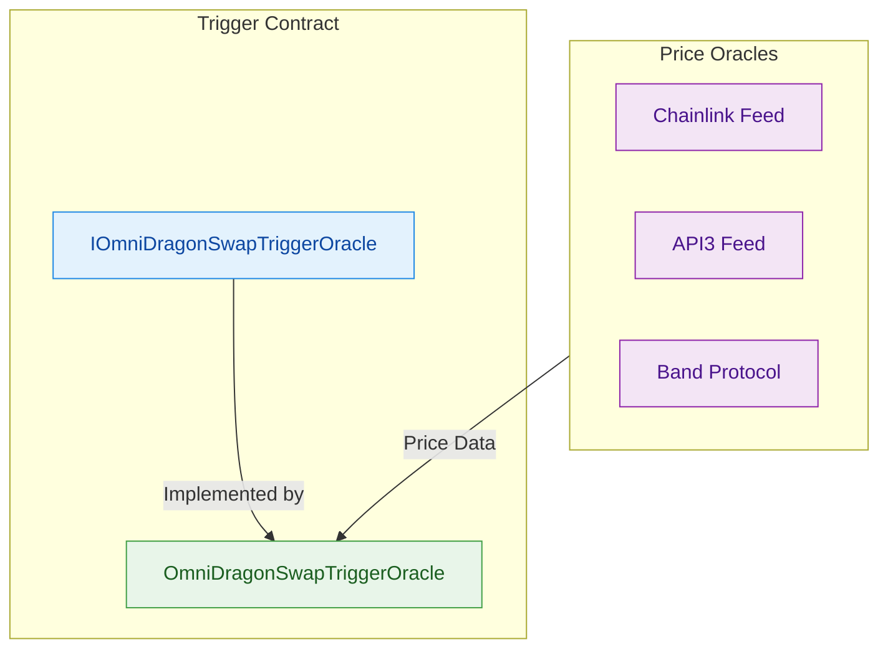

import AnimatedTriggerFlow from '@site/src/components/AnimatedTriggerFlow';
import AnimatedDiagram, { AnimatedNode } from '@site/src/components/AnimatedDiagram';
import AnimeTester from '@site/src/components/AnimeTester';

# Animated Diagrams with Anime.js

This page demonstrates how to combine Mermaid diagrams with anime.js animations for interactive documentation.

## Basic Anime.js Test

First, let's verify that anime.js is working correctly:

<AnimeTester />

## Interactive Trigger System Visualization

The animation below shows the OmniDragon swap-based trigger system in action:

<AnimatedTriggerFlow />

## Mermaid Diagrams

Mermaid diagrams provide clear, static representations of your system architecture:



## Interactive Components with Anime.js

Anime.js allows for custom interactive components that help explain complex processes:

<AnimatedDiagram 
  title="Probability Calculation Flow" 
  description="How swap amounts affect lottery winning probability"
>
  <div style={{display: 'flex', justifyContent: 'space-around', alignItems: 'center', flexWrap: 'wrap', gap: '20px', padding: '20px'}}>
    <AnimatedNode 
      label="Swap Amount" 
      highlight 
      id="swap-amount"
    />
    <AnimatedNode 
      label="Base Probability"
      id="base-prob"
    />
    <AnimatedNode 
      label="Market Conditions" 
      pulse
      id="market"
    />
    <AnimatedNode 
      label="Final Probability" 
      highlight
      id="final-prob" 
    />
  </div>
</AnimatedDiagram>

## Combining Static and Animated Content

Using both Mermaid for architecture diagrams and anime.js for interactive elements gives you the best of both worlds:

1. **Mermaid diagrams** provide clear, static representations that are easy to maintain
2. **Anime.js animations** add interactivity and help illustrate complex processes
3. **Combined approach** creates more engaging documentation

## Implementation Notes

Both the Mermaid diagrams and anime.js animations are implemented as React components in your Docusaurus site:

```jsx
// Import components
import EnhancedMermaid from '@site/src/components/EnhancedMermaid';
import AnimatedDiagram from '@site/src/components/AnimatedDiagram';
import anime from 'animejs/lib/anime.es.js';

// Use in your MDX documentation
<EnhancedMermaid 
  chart={`flowchart TB
    A --> B
    B --> C`} 
  title="Simple Flowchart" 
/>

<AnimatedDiagram title="Interactive Animation">
  {/* Your interactive content */}
</AnimatedDiagram>
```

## Browser Support

The anime.js animations are only rendered in the browser and have fallbacks for non-browser environments. Mermaid diagrams are pre-rendered during build time for static sites and enhanced with interactivity when JavaScript is available.

## Troubleshooting Animation Issues

If animations aren't displaying:

1. Ensure the anime.js library is imported correctly
2. Check console for any JavaScript errors
3. Verify that DOM elements with the correct classes exist
4. Try using a simple test animation like `AnimeTester` to verify configuration 