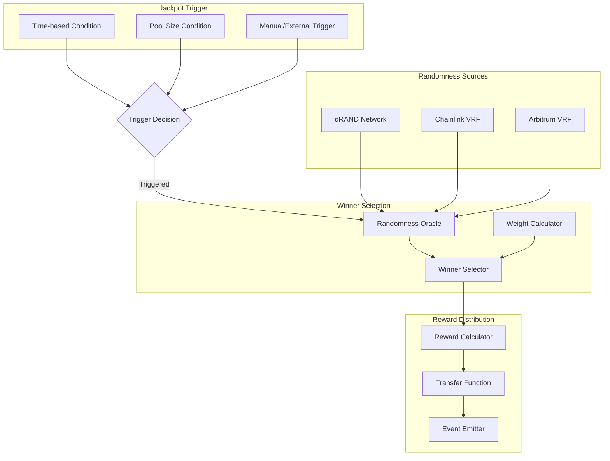

# Jackpot Distributor

The DragonJackpotDistributor is a core component of the Sonic Red Dragon ecosystem that manages the distribution of jackpot rewards to lucky winners based on verifiable randomness.

## Overview

The DragonJackpotDistributor contract works in conjunction with the DragonJackpotVault to handle the entire jackpot system flow:

1. Collect fees from token transactions
2. Securely store accumulated rewards
3. Trigger jackpot draws based on configurable conditions
4. Select winners using verifiable randomness
5. Distribute rewards to winners

## Jackpot Mechanism

The jackpot distribution mechanism uses a weighted random selection algorithm based on user activity and token holdings:



## Jackpot Types

The DragonJackpotDistributor supports multiple jackpot types with different reward structures:

| Jackpot Type | Description | Trigger Condition | Reward Structure |
|--------------|-------------|-------------------|------------------|
| Daily Jackpot | Smaller rewards distributed daily | Time-based (24h) | 20% of daily pool |
| Weekly Jackpot | Medium rewards distributed weekly | Time-based (7d) | 30% of weekly pool |
| Mega Jackpot | Large rewards distributed monthly | Time-based (30d) | 50% of monthly pool |
| Flash Jackpot | Surprise jackpots triggered randomly | Random or manual | Variable |
| Partner Jackpot | Special jackpots for partner integrations | Partner-defined | Partner-defined |

## Jackpot Ticket System

Users receive jackpot tickets through various interactions with the ecosystem:

- **Token Purchases**: Buying tokens generates tickets proportional to purchase amount
- **Staking Duration**: Longer staking periods earn more tickets
- **Lottery Entries**: Specific actions can earn additional entries
- **Partner Interactions**: Activities with ecosystem partners can reward tickets

Each ticket increases the user's chance of winning proportional to the total ticket supply.

## Core Functions

### Jackpot Management

```solidity
// Trigger a jackpot distribution
function triggerJackpot(uint256 jackpotId) external

// Add tickets to a user
function addTickets(address user, uint256 amount) external onlyAuthorized

// Calculate user's winning chance
function getUserWinningChance(address user) external view returns (uint256)
```

### Randomness Integration

```solidity
// Request randomness from oracle
function requestRandomness() internal returns (bytes32 requestId)

// Fulfill randomness request (callback)
function fulfillRandomness(bytes32 requestId, uint256 randomness) internal
```

### Reward Distribution

```solidity
// Distribute rewards to winner
function distributeReward(address winner, uint256 amount) internal

// Calculate reward amount based on jackpot type
function calculateReward(uint256 jackpotId) internal view returns (uint256)
```

## Security Considerations

The DragonJackpotDistributor implements several security measures:

- **Randomness Verification**: Multiple layers of randomness validation
- **Time-locks**: Cooldown periods between jackpot draws
- **Anti-Snipe Mechanisms**: Prevents last-minute ticket purchases
- **Access Controls**: Restricted functions for authorized roles only
- **Emergency Pause**: Ability to pause distribution in case of issues

## Events

The contract emits the following events for tracking jackpot distributions:

```solidity
// Emitted when a jackpot is triggered
event JackpotTriggered(uint256 indexed jackpotId, address indexed triggeredBy);

// Emitted when a winner is selected
event WinnerSelected(uint256 indexed jackpotId, address indexed winner, uint256 amount);

// Emitted when tickets are added to a user
event TicketsAdded(address indexed user, uint256 amount, uint256 totalTickets);

// Emitted when a jackpot is created
event JackpotCreated(uint256 indexed jackpotId, uint256 startTime, uint256 endTime);
```

## Integration Example

```solidity
// Get instance of the jackpot distributor
DragonJackpotDistributor jackpotDistributor = DragonJackpotDistributor(jackpotDistributorAddress);

// Check user's winning chance
uint256 winningChance = jackpotDistributor.getUserWinningChance(userAddress);

// Trigger a jackpot (if authorized)
if (jackpotDistributor.canTriggerJackpot(jackpotId)) {
    jackpotDistributor.triggerJackpot(jackpotId);
}
```
