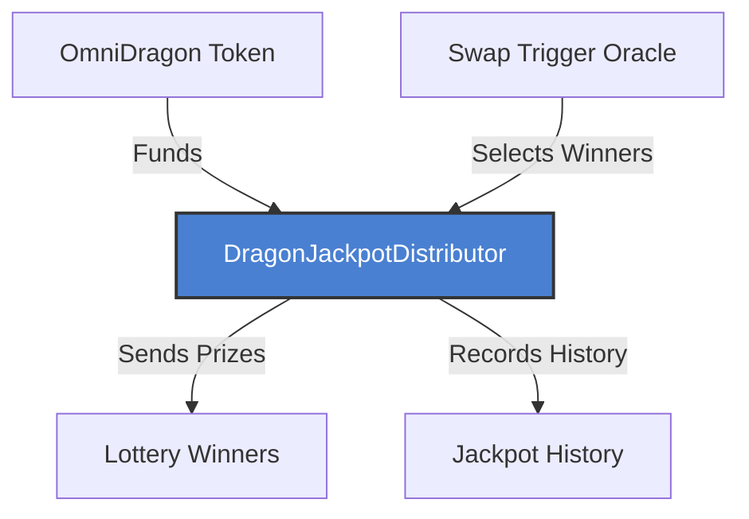
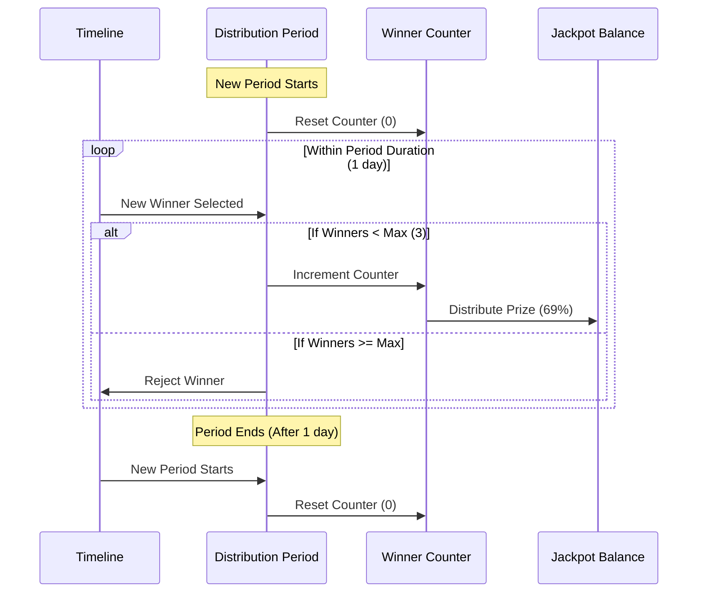
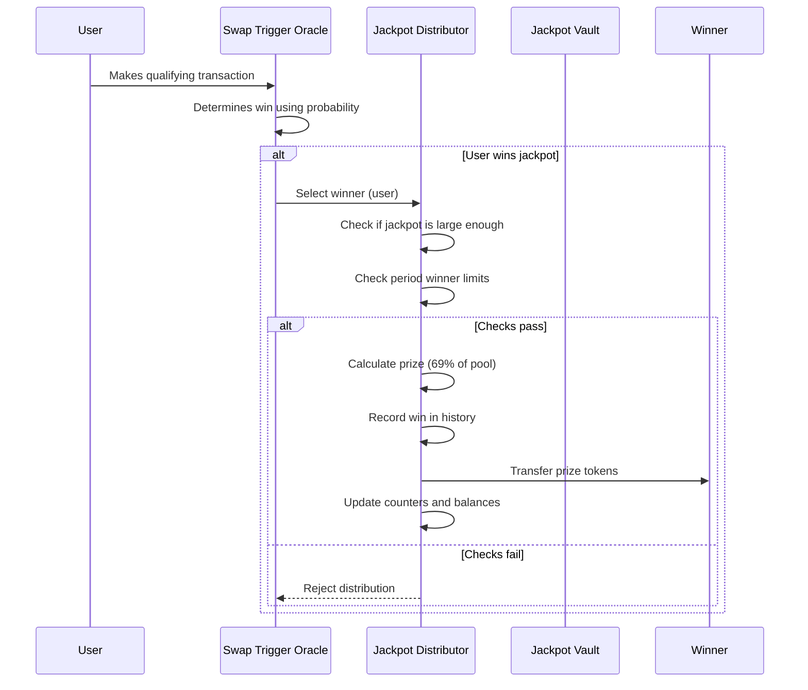

# DragonJackpotDistributor

The `DragonJackpotDistributor` contract is responsible for managing the distribution of jackpot prizes within the Sonic Red Dragon ecosystem. It handles winner selection rules, prize calculation, and the secure delivery of rewards.

## Overview



The distributor manages the entire jackpot lifecycle:

1. **Fund Accumulation**: Collects tokens from transactions and direct contributions
2. **Prize Distribution**: Calculates appropriate prize amounts and delivers to winners
3. **Rate Limiting**: Ensures fair distribution with limits on frequency and amount
4. **History Tracking**: Maintains a complete record of all jackpot winners
5. **Emergency Controls**: Includes safety features for unexpected situations

## Contract Implementation

The `DragonJackpotDistributor` contract implements several interfaces and includes security features:

```solidity
contract DragonJackpotDistributor is IDragonJackpotDistributor, Ownable, ReentrancyGuard, Pausable {
    using SafeERC20 for IERC20;
    using DragonTokenUtils for IERC20;
    
    // Constants
    uint256 public constant PERCENTAGE_DENOMINATOR = 10000; // 100% = 10000
    
    // State variables
    IERC20 public token; // The token to distribute
    address public treasury; // Treasury wallet for emergency functions
    address public swapTriggerOracle; // The swap trigger oracle contract
    uint256 public minJackpotSize; // Minimum size a jackpot must reach before distribution
    uint256 public distributionPercentage = 6900; // 69% of jackpot per win
    uint256 public maxWinnersPerPeriod = 3; // Maximum number of winners per period
    uint256 public jackpotBalance; // Current jackpot balance
    uint256 public lastDistributionTime; // Last time a jackpot was distributed
    uint256 public periodDuration = 1 days; // Duration of a distribution period
    
    // ... additional state variables and structs ...
}
```

## Key Configuration Parameters

| Parameter | Description | Default | Adjustable? |
|-----------|-------------|---------|------------|
| `distributionPercentage` | Percentage of jackpot given per win (basis points) | 6900 (69%) | ✓ |
| `maxWinnersPerPeriod` | Maximum winners allowed per period | 3 | ✓ |
| `periodDuration` | Duration of each distribution period | 1 day | ✓ |
| `minJackpotSize` | Minimum jackpot size before distribution | Configurable | ✓ |

## Core Functions

### Jackpot Funding

```solidity
/**
 * @dev Add funds to the jackpot
 * @param amount Amount to add
 */
function addToJackpot(uint256 amount) external override {
    // Transfer tokens from sender to contract
    token.safeTransferFrom(msg.sender, address(this), amount);
    
    // Update jackpot balance
    jackpotBalance += amount;
    
    emit JackpotAdded(amount, jackpotBalance);
}
```

This function allows any authorized address to add funds to the jackpot pool. The tokens are transferred from the sender to the contract, and the jackpot balance is updated accordingly.

### Prize Distribution

```solidity
/**
 * @dev Distribute a jackpot to a winner
 * @param winner Address of the winner
 * @param amount Amount to distribute
 */
function distributeJackpot(address winner, uint256 amount) external override onlyAuthorized nonReentrant whenNotPaused {
    require(winner != address(0), "Winner cannot be zero address");
    
    // Check jackpot size
    require(jackpotBalance >= minJackpotSize, "Jackpot too small");
    
    // Check max winners per period
    if (block.timestamp >= currentPeriodStart + periodDuration) {
        // Start a new period
        currentPeriodStart = block.timestamp;
        winnersInCurrentPeriod = 0;
    }
    
    require(winnersInCurrentPeriod < maxWinnersPerPeriod, "Max winners reached for current period");
    
    // Calculate distribution amount (capped by percentage)
    uint256 maxDistribution = (jackpotBalance * distributionPercentage) / PERCENTAGE_DENOMINATOR;
    uint256 distributionAmount = amount > maxDistribution ? maxDistribution : amount;
    
    // Update balances and counters
    jackpotBalance -= distributionAmount;
    totalDistributed += distributionAmount;
    winnersInCurrentPeriod++;
    lastDistributionTime = block.timestamp;
    
    // Record win in history
    jackpotHistory.push(JackpotWin({
        winner: winner,
        amount: distributionAmount,
        timestamp: block.timestamp
    }));
    
    // Transfer tokens to winner
    token.safeTransfer(winner, distributionAmount);
    
    emit JackpotDistributed(winner, distributionAmount, block.timestamp);
}
```

This is the core function that handles jackpot distribution. It includes several important controls:

1. **Authorization Check**: Only authorized distributors can call this function
2. **Jackpot Size Check**: Ensures the jackpot has reached minimum size
3. **Rate Limiting**: Manages the number of winners per time period
4. **Amount Calculation**: Ensures distribution follows percentage rules
5. **History Tracking**: Records win details for transparency
6. **Secure Transfer**: Safely transfers tokens to the winner

### Multi-Recipient Distribution

```solidity
/**
 * @dev Distribute rewards to multiple recipients by basis points
 * @param amount Amount to distribute
 * @param recipients Array of recipient addresses
 * @param basisPoints Array of basis points for each recipient (totaling 10000)
 */
function distributeRewards(
    uint256 amount, 
    address[] memory recipients, 
    uint256[] memory basisPoints
) external onlyOwner nonReentrant whenNotPaused {
    require(jackpotBalance >= amount, "Insufficient balance");
    
    // Update jackpot balance
    jackpotBalance -= amount;
    
    // Using the optimized distribution function
    DragonTokenUtils.distributeByBasisPoints(
        token,
        amount,
        recipients,
        basisPoints
    );
}
```

This function enables more complex prize distributions where multiple recipients receive proportional shares of a prize pool, useful for team-based competitions or tiered reward structures.

### Emergency Controls

```solidity
/**
 * @dev Emergency withdraw all funds to treasury
 */
function emergencyWithdraw() external onlyOwner {
    uint256 balance = token.balanceOf(address(this));
    
    // Use the optimized token utility for better gas efficiency
    DragonTokenUtils.safeTransferTokenOrNative(
        address(token),
        treasury,
        balance
    );
    
    jackpotBalance = 0;
    
    emit EmergencyWithdrawal(treasury, balance);
}
```

The contract includes emergency functions that allow the owner to:
- Withdraw all funds to the treasury in case of critical issues
- Pause/unpause the distribution system
- Batch transfer multiple tokens if needed

## Rate Limiting Mechanism

To prevent jackpot depletion and maintain sustainable prizes, the distributor implements a time-based rate limiting system:



This mechanism ensures:
1. No more than 3 winners per day by default
2. Each winner receives a maximum of 69% of the current jackpot
3. The jackpot can recover between distributions
4. The system automatically resets after each period

## Configuration Functions

The contract includes several owner-only functions for configuring the distribution parameters:

```solidity
function setMinJackpotSize(uint256 _minJackpotSize) external onlyOwner;
function setDistributionPercentage(uint256 _percentage) external onlyOwner;
function setMaxWinnersPerPeriod(uint256 _maxWinners) external onlyOwner;
function setPeriodDuration(uint256 _duration) external onlyOwner;
function setAuthorizedDistributor(address _distributor, bool _authorized) external onlyOwner;
function setToken(address _token) external onlyOwner;
function setTreasury(address _treasury) external onlyOwner;
```

These functions allow adaptation of the jackpot system to different market conditions and user behavior patterns.

## View Functions

The contract provides several view functions for querying jackpot information:

```solidity
/**
 * @dev Get the current jackpot balance
 * @return Current jackpot balance
 */
function getCurrentJackpot() external view override returns (uint256) {
    return jackpotBalance;
}

/**
 * @dev Get a jackpot win by index
 * @param index Index of the win
 * @return Winner, amount, and timestamp
 */
function getJackpotHistory(uint256 index) external view returns (
    address winner,
    uint256 amount,
    uint256 timestamp
) {
    require(index < jackpotHistory.length, "Invalid index");
    JackpotWin memory win = jackpotHistory[index];
    return (win.winner, win.amount, win.timestamp);
}

/**
 * @dev Get jackpot history count
 * @return Number of jackpot history entries
 */
function getJackpotHistoryCount() external view returns (uint256) {
    return jackpotHistory.length;
}
```

These functions enable:
- Frontend display of current jackpot size
- Historical record viewing
- Statistical analysis of past distributions

## Security Features

The contract implements multiple security features:

1. **ReentrancyGuard**: Prevents reentrant calls during token transfers
2. **Pausable**: Allows emergency pausing of all distribution functions
3. **Ownership Controls**: Restricts sensitive functions to the contract owner
4. **SafeERC20**: Uses safe transfer methods to prevent token handling issues
5. **DragonTokenUtils**: Leverages optimized token utilities for gas efficiency

## Integration Points

The distributor integrates with several other system components:

1. **Token Contract**: Receives funds from the token contract
2. **Swap Trigger Oracle**: Receives winner selections from the oracle
3. **Treasury**: Emergency fund recipient
4. **Client Applications**: Provides data for jackpot displays and history

## Jackpot Distribution Flow



This flow ensures winners are selected fairly, prizes are distributed correctly, and the system maintains sustainability through rate limiting and percentage-based distributions.
