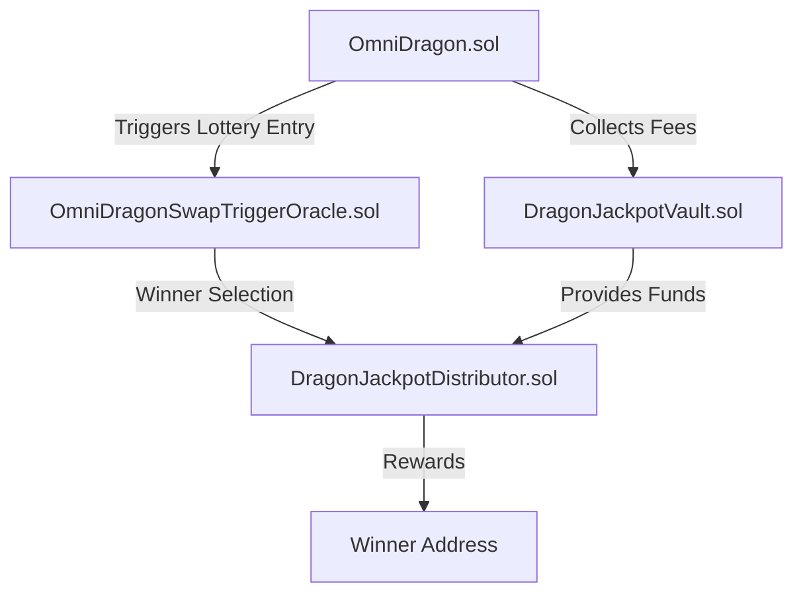
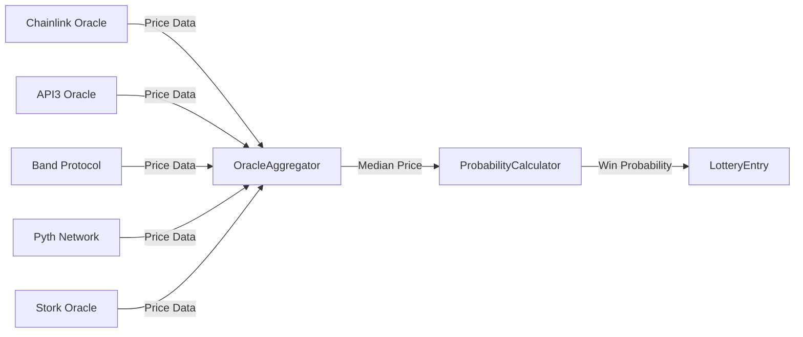

# Jackpot Distributor

The DragonJackpotDistributor is a core component of the Sonic Red Dragon ecosystem that manages the distribution of jackpot rewards based on the lottery system implemented in OmniDragonSwapTriggerOracle.

## Lottery System Overview

The jackpot system operates through a coordinated flow of three primary contracts:



1. **Fee Collection**: The OmniDragon token collects a 10% fee on transactions with 6.9% allocated to the jackpot vault
2. **Swap Detection**: Buy transactions (from liquidity pools to users) trigger lottery entries
3. **Probability Calculation**: Each swap's win probability is calculated based on amount and market conditions
4. **Distribution**: Winners receive rewards from the accumulated jackpot pool

## Swap Trigger Implementation

The OmniDragonSwapTriggerOracle contract powers the lottery system with these key features from the code:

```solidity
// From OmniDragonSwapTriggerOracle.sol
function onSwap(address user, uint256 amount) external override onlyOmniDragon nonReentrant {
    require(user != address(0), "Zero user");
    require(amount >= minSwapAmount, "Swap too small");
    require(block.timestamp >= lastEntry[user] + cooldownPeriod, "Cooldown active");

    // Calculate win probability for this swap
    uint256 probability = calculateWinProbability(amount);
    
    // Update user's recorded probability
    userWinProbability[user] = probability;
    
    // Update statistics for future calculations
    _updateSwapStatistics(amount);
    
    // Record entry time
    lastEntry[user] = block.timestamp;

    emit LotteryEntry(user, amount, block.timestamp, probability);
}
```

## Probability Calculation

The win probability is calculated using a sophisticated formula that considers:

1. **Swap Amount**: Larger swaps receive higher probability (with diminishing returns)
2. **Market Data**: Price information from multiple oracles
3. **Relative Size**: Comparison to the average swap amount
4. **Logarithmic Scaling**: Prevents extremely large swaps from dominating

```solidity
// Actual probability calculation from the code
function calculateWinProbability(uint256 amount) public view returns (uint256) {
    // If we don't have enough data yet, return base probability
    if (swapCount < 10 || averageSwapAmount == 0) {
        return baseWinProbability;
    }
    
    // Get aggregated price from oracles
    (int256 price, bool priceSuccess) = getAggregatedPrice();
    
    // If price aggregation failed, use base probability
    if (!priceSuccess || price <= 0) {
        return baseWinProbability;
    }
    
    // Calculate ratio of this swap to average (scaled by 10000)
    uint256 swapRatio = (amount * 10000) / averageSwapAmount;
    
    // Calculate probability with logarithmic scaling
    uint256 probability;
    
    if (swapRatio <= 10000) {
        // For swaps below average, linear scale between base and 2x base
        probability = baseWinProbability + ((baseWinProbability * swapRatio) / 10000);
    } else {
        // For swaps above average, logarithmic scale with diminishing returns
        uint256 logFactor = 10000 * (1 + _log2(swapRatio / 10000));
        probability = baseWinProbability + (baseWinProbability * logFactor) / 10000;
    }
    
    // Cap at maximum probability
    return probability > maxWinProbability ? maxWinProbability : probability;
}
```

This creates a system where:
- Base probability: 1% (100 basis points)
- Maximum probability: 10% (1000 basis points)
- Small swaps get close to base probability
- Larger swaps get higher probability but with diminishing returns

## Oracle Price Integration

The system uses multiple price oracles for reliability:



The contract aggregates prices using a median calculation to prevent manipulation:

```solidity
// From OmniDragonSwapTriggerOracle.sol
function getAggregatedPrice() public view returns (int256 aggregatedPrice, bool success) {
    int256[] memory prices = new int256[](activeOracleCount);
    uint8 validPrices = 0;
    
    // Collect prices from all active oracles
    for (uint8 i = 0; i < 10; i++) {
        if (oracleSources[i].isActive) {
            (int256 price, bool priceSuccess) = getPriceFromOracle(i);
            
            if (priceSuccess && price > 0) {
                prices[validPrices] = price;
                validPrices++;
            }
        }
    }
    
    // Check if we have enough valid prices
    if (validPrices < minimumOracleResponses) {
        return (0, false);
    }
    
    // Sort prices to find median
    // ... [sorting code] ...
    
    // Calculate median price
    if (validPrices % 2 == 0) {
        aggregatedPrice = (prices[validPrices / 2 - 1] + prices[validPrices / 2]) / 2;
    } else {
        aggregatedPrice = prices[validPrices / 2];
    }
    
    return (aggregatedPrice, true);
}
```

## Fee Collection and Distribution

The jackpot vault receives fees in wrapped native tokens (WETH, WBNB, etc.) rather than DRAGON tokens:

```solidity
// From OmniDragon.sol
function _distributeFees(uint256 jackpotAmount, uint256 ve69Amount) internal {
    // Cache token and vault addresses for gas optimization
    address wrappedToken = wrappedNativeToken;
    address vault = jackpotVault;
    
    // Process jackpot fee if non-zero and vault exists
    if (jackpotAmount > 0 && vault != address(0)) {
        IERC20(wrappedToken).safeTransfer(vault, jackpotAmount);
        IDragonJackpotVault(vault).addToJackpot(jackpotAmount);
        emit FeeTransferred(vault, jackpotAmount, "Jackpot");
    }
    
    // Process other fees...
}
```

## User Protection Features

The system implements several protections:

1. **Minimum Swap Amount**: Prevents spam from tiny transactions
   ```solidity
   require(amount >= minSwapAmount, "Swap too small");
   ```

2. **Cooldown Period**: Limits how frequently users can enter
   ```solidity
   require(block.timestamp >= lastEntry[user] + cooldownPeriod, "Cooldown active");
   ```

3. **Oracle Redundancy**: Uses multiple price sources for reliable data
   ```solidity
   if (validPrices < minimumOracleResponses) {
       return (0, false);
   }
   ```

4. **Maximum Probability Cap**: Prevents excessive win probability
   ```solidity
   return probability > maxWinProbability ? maxWinProbability : probability;
   ```

5. **Reentrancy Protection**: Prevents exploits from contract callbacks
   ```solidity
   modifier nonReentrant() {
       // Implementation from ReentrancyGuard
   }
   ```

## Partner Integration

The system supports special partner-specific lottery entries:

```solidity
// From OmniDragon.sol
function processPartnerJackpotEntry(address _user, uint256 _amount) external {
    // Only partner pools can call this
    if (!isPartnerPool[msg.sender]) revert NotPartnerPool();
    
    if (_user == address(0)) revert ZeroAddress();
    if (_amount == 0) revert ZeroAmount();
    
    // Process lottery entry if swap trigger is set
    if (swapTrigger != address(0)) {
        _tryProcessLotteryEntry(_user, _amount);
    }
    
    emit PartnerJackpotTriggered(_user, msg.sender, _amount);
}
```

## Configuration Parameters

The system has several configurable parameters:

| Parameter | Description | Default Value |
|-----------|-------------|---------------|
| `baseWinProbability` | Baseline chance of winning | 100 (1%) |
| `maxWinProbability` | Maximum possible win chance | 1000 (10%) |
| `cooldownPeriod` | Time between entries for a user | Configurable |
| `minSwapAmount` | Minimum swap to qualify | Configurable |
| `minimumOracleResponses` | Required oracle responses | 1 (configurable) |

## Events

The contracts emit events to track lottery entries and winners:

```solidity
// From OmniDragonSwapTriggerOracle.sol
event LotteryEntry(address indexed user, uint256 amount, uint256 timestamp, uint256 winProbability);

// From DragonJackpotDistributor.sol
event WinnerSelected(uint256 indexed jackpotId, address indexed winner, uint256 amount);

// From OmniDragon.sol
event PartnerJackpotTriggered(address indexed user, address indexed partnerPool, uint256 amount);
```
