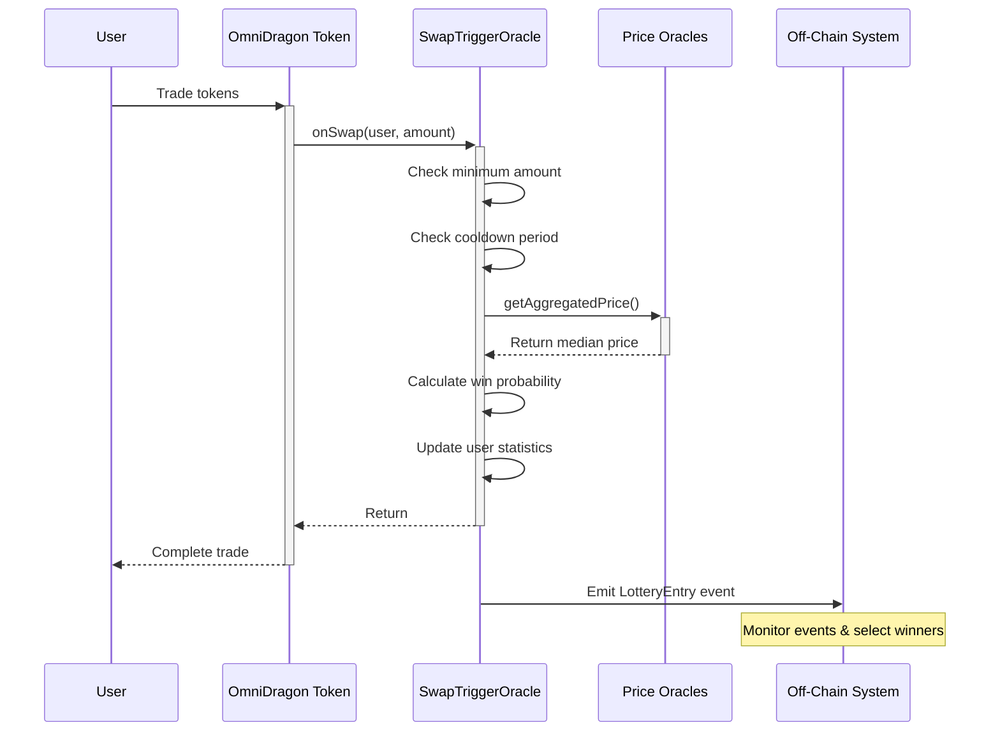

# OmniDragonSwapTriggerOracle

The `OmniDragonSwapTriggerOracle` is a critical component of the OmniDragon jackpot system. It processes swap events, assigns jackpot entry probabilities, and interacts with oracle price feeds to ensure fair and transparent jackpot entry opportunities.

## Overview

```mermaidflowchart TB
OmniDragon["OmniDragon Token"] -->|"Calls onSwap()"| SwapTrigger["OmniDragonSwapTriggerOracle"]
    SwapTrigger -->|"Entry Processing"| Lottery["Lottery System"]
    PriceFeeds["Oracle Price Feeds"] -->|>|"Market Data"| SwapTrigger
    subgraph "Price Oracles"
    Chainlink["Chainlink"]
    API3["API3"]
    Band["Band Protocol"]
    Pyth["Pyth Network"]
    Stork["Stork Network"]
    Chainlink| PriceFeeds
    API3 -->|> PriceFeeds
    Band| PriceFeeds
    Pyth -->|> PriceFeeds
    Stork| PriceFeeds    endclass SwapTrigger primary    end
```

The swap trigger oracle serves multiple key functions:

1.**Lottery Entry Detection**: Processes swap events from the OmniDragon token
2.**Probability Calculation**: Determines each entry's win probability based on swap amount
3.**Oracle Integration**: Aggregates price data from multiple oracles for reliability
4.**Anti-Abuse Protection**: Implements safeguards against system manipulation
5.**Event Emission**: Emits events for off-chain jackpot winner selection

## Contract Implementation

The `OmniDragonSwapTriggerOracle` is implemented as follows:

```solidity
contract OmniDragonSwapTriggerOracle is IOmniDragonSwapTriggerOracle, Ownable, ReentrancyGuard {
    address public immutable omniDragon;
    address public jackpotVault;
    uint256 public minSwapAmount;
    uint256 public cooldownPeriod; // in seconds
    
    // Oracle configuration
    enum OracleType { CHAINLINK, API3, BAND, PYTH, REDSTONE, STORK }
    
    struct OracleSource {
        address oracleAddress;
        OracleType oracleType;
        bool isActive;
        uint8 decimals;
    }
    
    // Multiple oracle data sources
    mapping(uint8 => OracleSource) public oracleSources;
    uint8 public activeOracleCount;
    uint8 public minimumOracleResponses = 1; // Minimum oracles needed for valid price
    
    // Base probability configurations (in basis points, 10000 = 100%)
    uint256 public baseWinProbability = 100; // 1% base chance
    uint256 public maxWinProbability = 1000; // 10% max chance
    
    // Historical swap data for probability calculation
    uint256 public totalSwapVolume;
    uint256 public swapCount;
    uint256 public averageSwapAmount;
    
    // Track user probability history
    mapping(address => uint256) public userWinProbability;
    mapping(address => uint256) public lastEntry;
    
    // ... events and modifiers ...
}
```

## Core Functions

### Lottery Entry Processing

```solidity
function onSwap(address user, uint256 amount) external override onlyOmniDragon nonReentrant {
    require(user != address(0), "Zero user");
    require(amount >= minSwapAmount, "Swap too small");
    require(block.timestamp >= lastEntry[user] + cooldownPeriod, "Cooldown active");

    // Calculate win probability for this swap
    uint256 probability = calculateWinProbability(amount);
    
    // Update user's recorded probability
    userWinProbability[user] = probability;
    
    // Update statistics for future calculations
    _updateSwapStatistics(amount);
    
    // Record entry time
    lastEntry[user] = block.timestamp;

    emit LotteryEntry(user, amount, block.timestamp, probability);
}
```

This is the main entry point called by the OmniDragon token when a token swap occurs. It:
- Validates minimum swap amount and cooldown period
- Calculates win probability
- Updates user statistics
- Records the entry time
- Emits an event for off-chain tracking

### Probability Calculation

```solidity
function calculateWinProbability(uint256 amount) public view returns (uint256) {
    // If we don't have enough data yet, return base probability
    if (swapCount < 10 || averageSwapAmount == 0) {
        return baseWinProbability;
    }
    
    // Get aggregated price from oracles
    (int256 price, bool priceSuccess) = getAggregatedPrice();
    
    // If price aggregation failed, use base probability
    if (!priceSuccess || price <= 0) {
        return baseWinProbability;
    }
    
    // Calculate ratio of this swap to average (scaled by 10000)
    uint256 swapRatio = (amount * 10000) / averageSwapAmount;
    
    // Calculate probability with logarithmic scaling
    uint256 probability;
    
    if (swapRatio <= 10000) {
        // For swaps below average, linear scale between base and 2x base
        probability = baseWinProbability + ((baseWinProbability * swapRatio) / 10000);
    } else {
        // For swaps above average, logarithmic scale with diminishing returns
        uint256 logFactor = 10000 * (1 + _log2(swapRatio / 10000));
        probability = baseWinProbability + (baseWinProbability * logFactor) / 10000;
    }
    
    // Cap at maximum probability
    return probability > maxWinProbability ? maxWinProbability : probability;
}
```

This sophisticated probability algorithm ensures:
- Larger swaps get higher probability (but not disproportionate)
- A logarithmic curve is used for fair scaling
- The probability is capped at a maximum value (10%)
- Market conditions are factored in through oracle price data

### Oracle Price Aggregation

```solidity
function getAggregatedPrice() public view returns (int256 aggregatedPrice, bool success) {
    int256[] memory prices = new int256[](activeOracleCount);
    uint8 validPrices = 0;
    
    // Collect prices from all active oracles
    for (uint8 i = 0; i < 10; i++) {
        if (oracleSources[i].isActive) {
            (int256 price, bool priceSuccess) = getPriceFromOracle(i);
            
            if (priceSuccess && price > 0) {
                prices[validPrices] = price;
                validPrices++;
            }
        }
    }
    
    // Check if we have enough valid prices
    if (validPrices < minimumOracleResponses) {
        return (0, false);
    }
    
    // Sort prices to find median
    // ... [sorting code omitted] ...
    
    // Calculate median price
    if (validPrices % 2 == 0) {
        // Even number of prices, average the middle two
        aggregatedPrice = (prices[validPrices / 2 - 1] + prices[validPrices / 2]) / 2;
    } else {
        // Odd number of prices, take the middle one
        aggregatedPrice = prices[validPrices / 2];
    }
    
    return (aggregatedPrice, true);
}
```

This function provides reliable price data by:
- Collecting prices from multiple oracle sources
- Using a median calculation to prevent manipulation
- Requiring a minimum number of valid responses
- Normalizing different decimal formats

## Oracle Integration

The contract can integrate with multiple price oracle providers:

```solidity
// Oracle addresses
address public constant CHAINLINK_FEED = 0xc76dFb89fF298145b417d221B2c747d84952e01d;
address public constant API3_FEED = 0x709944a48cAf83535e43471680fDA4905FB3920a;
address public constant BAND_FEED = 0x506085050Ea5494Fe4b89Dd5BEa659F506F470Cc;
address public constant PYTH_FEED = 0x2880aB155794e7179c9eE2e38200202908C17B43;
address public constant STORK_FEED = 0xacC0a0cF13571d30B4b8637996F5D6D774d4fd62;
```

Each oracle is represented with a standard structure:

```solidity
struct OracleSource {
    address oracleAddress;
    OracleType oracleType;
    bool isActive;
    uint8 decimals;
}
```

Oracles can be added, updated, or disabled through owner-only management functions:

```solidity
function addOracle(
    uint8 _oracleId, 
    address _oracleAddress, 
    OracleType _oracleType,
    uint8 _decimals
) external onlyOwner {
    _addOracle(_oracleId, _oracleAddress, _oracleType, _decimals);
}

function updateOracleStatus(uint8 _oracleId, bool _isActive) external onlyOwner {
    require(oracleSources[_oracleId].oracleAddress != address(0), "Oracle does not exist");
    
    if (oracleSources[_oracleId].isActive && !_isActive) {
        activeOracleCount--;
    } else if (!oracleSources[_oracleId].isActive && _isActive) {
        activeOracleCount++;
    }
    
    oracleSources[_oracleId].isActive = _isActive;
    emit OracleUpdated(_oracleId, oracleSources[_oracleId].oracleAddress, _isActive);
}
```

## Anti-Abuse Mechanisms

Several mechanisms are implemented to prevent system abuse:

1.**Minimum Swap Amount**```solidity
   require(amount >= minSwapAmount, "Swap too small");
   ```
   Prevents dust transactions from participating.

2.**Cooldown Period**```solidity
   require(block.timestamp >= lastEntry[user] + cooldownPeriod, "Cooldown active");
   ```
   Prevents rapid entry spamming by users.

3.**Oracle Consensus**```solidity
   if (validPrices < minimumOracleResponses) {
       return (0, false);
   }
   ```
   Requires multiple oracle sources to agree.

4.**Logarithmic Scaling**```solidity
   uint256 logFactor = 10000 * (1 + _log2(swapRatio / 10000));
   ```
   Prevents large swaps from having disproportionate advantages.

5.**Maximum Cap**```solidity
   return probability > maxWinProbability ? maxWinProbability : probability;
   ```
   Limits the maximum win probability to a fair value.

## Probability Curve

The implemented probability curve creates a fair distribution:

-**Base Probability**: 1% (100 basis points)
-**Average Swap**: ~1.5% (150 basis points)
-**2x Average Swap**: ~1.69% (169 basis points) - logarithmic scaling starts
-**5x Average Swap**: ~2.16% (216 basis points)
-**10x Average Swap**: ~2.32% (232 basis points)
-**Maximum Probability**: 10% (1000 basis points) - hard cap
```

```mermaidxychart-beta
    title "Win Probability vs. Swap Size"
    x-axis "Swap Size (multiple of average)" [0.1, 0.5, 1, 2, 5, 10, 20, 50, 100]
    y-axis "Win Probability (%)" 0 --> 10
    line[0.5, 0.75, 1, 1.69, 2.16, 2.32, 2.6, 3.0, 3.3]
```

## Configuration Parameters

The system can be configured with these parameters:

| Parameter | Description | Default | Range |
|-----------|-------------|---------|-------|
| `minSwapAmount` | Minimum swap size | Configurable | > 0 |
| `cooldownPeriod` | User cooldown period | Configurable | > 0 |
| `baseWinProbability` | Base win probability | 100 (1%) | 0-9999 |
| `maxWinProbability` | Maximum win probability | 1000 (10%) | 1-10000 |
| `minimumOracleResponses` | Required oracle responses | 1 | 1-activeOracleCount |

## Events

The contract emits several events for tracking and auditing:

```solidity
event LotteryEntry(address indexed user, uint256 amount, uint256 timestamp, uint256 winProbability);
event JackpotVaultUpdated(address indexed oldVault, address indexed newVault);
event MinSwapAmountUpdated(uint256 oldAmount, uint256 newAmount);
event CooldownPeriodUpdated(uint256 oldPeriod, uint256 newPeriod);
event OracleAdded(uint8 indexed oracleId, address oracleAddress, OracleType oracleType);
event OracleUpdated(uint8 indexed oracleId, address oracleAddress, bool isActive);
event MinimumOracleResponsesUpdated(uint8 oldValue, uint8 newValue);
event ProbabilityConfigUpdated(uint256 baseProb, uint256 maxProb);
```

## Lottery Flow

The jackpot entry process follows this sequence:


