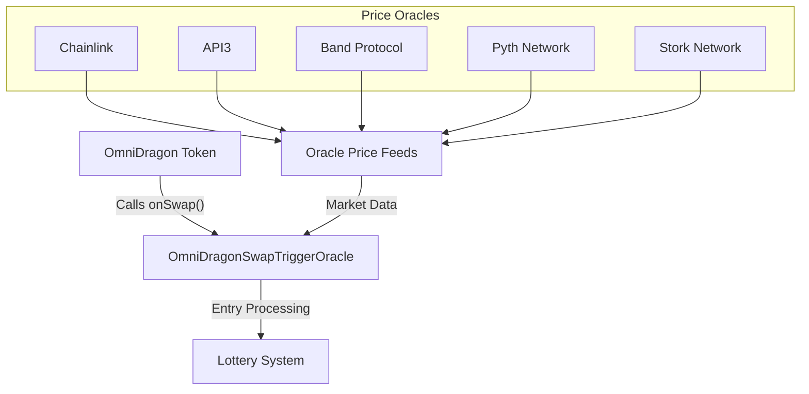

# Swap Trigger Oracle

The OmniDragonSwapTriggerOracle is a critical component of the Sonic Red Dragon jackpot system, responsible for processing lottery entries generated by token swap events.

## Overview

The SwapTriggerOracle serves as the bridge between token transactions and the jackpot lottery system:



This contract's primary responsibility is to process potential lottery entries when users purchase DRAGON tokens and determine their win probability based on various factors.

## Core Functionality

The SwapTriggerOracle functions based on several key principles:

1. **Buy Detection**: Processes only legitimate buy transactions
2. **Probability Calculation**: Assigns win probability based on swap size and market conditions
3. **Oracle Integration**: Aggregates price data from multiple sources for reliable market information
4. **Entry Tracking**: Records all lottery entries and their associated probabilities
5. **Anti-Abuse**: Implements mechanisms to prevent system abuse

## Contract Implementation

From the actual codebase, here's the central function for processing lottery entries:

```solidity
/**
 * @dev Called by OmniDragon on every swap to potentially trigger a lottery entry
 *      - Enforces minimum swap amount
 *      - Enforces per-user cooldown
 *      - Calculates win probability based on amount
 *      - Emits event for off-chain tracking
 *      - Can be extended for jackpot/lottery logic
 */
function onSwap(address user, uint256 amount) external override onlyOmniDragon nonReentrant {
    require(user != address(0), "Zero user");
    require(amount >= minSwapAmount, "Swap too small");
    require(block.timestamp >= lastEntry[user] + cooldownPeriod, "Cooldown active");

    // Calculate win probability for this swap
    uint256 probability = calculateWinProbability(amount);
    
    // Update user's recorded probability
    userWinProbability[user] = probability;
    
    // Update statistics for future calculations
    _updateSwapStatistics(amount);
    
    // Record entry time
    lastEntry[user] = block.timestamp;

    // Optionally, interact with jackpot vault or other systems here
    // e.g., IDragonJackpotVault(jackpotVault).addToJackpot(amount);

    emit LotteryEntry(user, amount, block.timestamp, probability);
}
```

## Probability Calculation

The win probability is determined using a sophisticated algorithm that takes into account multiple factors:

```solidity
function calculateWinProbability(uint256 amount) public view returns (uint256) {
    // If we don't have enough data yet, return base probability
    if (swapCount < 10 || averageSwapAmount == 0) {
        return baseWinProbability;
    }
    
    // Get aggregated price from oracles
    (int256 price, bool priceSuccess) = getAggregatedPrice();
    
    // If price aggregation failed, use base probability
    if (!priceSuccess || price <= 0) {
        return baseWinProbability;
    }
    
    // Calculate ratio of this swap to average (scaled by 10000)
    uint256 swapRatio = (amount * 10000) / averageSwapAmount;
    
    // Calculate probability: base probability + bonus based on amount
    // The formula creates a logarithmic curve where:
    // - Small swaps get close to base probability
    // - Large swaps get higher probability but with diminishing returns
    // - Probability is capped at maxWinProbability
    uint256 probability;
    
    if (swapRatio <= 10000) {
        // For swaps below average, linear scale between base and 2x base
        probability = baseWinProbability + ((baseWinProbability * swapRatio) / 10000);
    } else {
        // For swaps above average, logarithmic scale with diminishing returns
        uint256 logFactor = 10000 * (1 + _log2(swapRatio / 10000));
        probability = baseWinProbability + (baseWinProbability * logFactor) / 10000;
    }
    
    // Cap at maximum probability
    return probability > maxWinProbability ? maxWinProbability : probability;
}
```

This results in a probability curve that:
- Starts at a base of 1% (100 basis points)
- Increases with swap size but with diminishing returns
- Is capped at 10% (1000 basis points) maximum

## Oracle Integration

For reliable price information, the contract integrates with multiple oracle sources:

```solidity
// Oracle configuration
enum OracleType { CHAINLINK, API3, BAND, PYTH, REDSTONE, STORK }

struct OracleSource {
    address oracleAddress;
    OracleType oracleType;
    bool isActive;
    uint8 decimals;
}

// Multiple oracle data sources
mapping(uint8 => OracleSource) public oracleSources;
uint8 public activeOracleCount;
uint8 public minimumOracleResponses = 1; // Minimum oracles needed for valid price

// Oracle addresses
address public constant CHAINLINK_FEED = 0xc76dFb89fF298145b417d221B2c747d84952e01d;
address public constant API3_FEED = 0x709944a48cAf83535e43471680fDA4905FB3920a;
address public constant BAND_FEED = 0x506085050Ea5494Fe4b89Dd5BEa659F506F470Cc;
address public constant PYTH_FEED = 0x2880aB155794e7179c9eE2e38200202908C17B43;
address public constant STORK_FEED = 0xacC0a0cF13571d30B4b8637996F5D6D774d4fd62;
```

The contract aggregates prices using a median calculation to prevent manipulation:

```solidity
function getAggregatedPrice() public view returns (int256 aggregatedPrice, bool success) {
    int256[] memory prices = new int256[](activeOracleCount);
    uint8 validPrices = 0;
    
    // Collect prices from all active oracles
    for (uint8 i = 0; i < 10; i++) {
        if (oracleSources[i].isActive) {
            (int256 price, bool priceSuccess) = getPriceFromOracle(i);
            
            if (priceSuccess && price > 0) {
                prices[validPrices] = price;
                validPrices++;
            }
        }
    }
    
    // Check if we have enough valid prices
    if (validPrices < minimumOracleResponses) {
        return (0, false);
    }
    
    // Sort and find median price
    // ... [sorting logic omitted for brevity] ...
    
    return (aggregatedPrice, true);
}
```

## Anti-Abuse Mechanisms

To prevent system abuse, the contract implements several protective measures:

1. **Minimum Swap Amount**
   ```solidity
   // Set minimum swap amount required for lottery entry
   function setMinSwapAmount(uint256 _minSwapAmount) external onlyOwner {
       emit MinSwapAmountUpdated(minSwapAmount, _minSwapAmount);
       minSwapAmount = _minSwapAmount;
   }
   ```

2. **User Cooldown Period**
   ```solidity
   // Set cooldown period between lottery entries for each user
   function setCooldownPeriod(uint256 _cooldownPeriod) external onlyOwner {
       emit CooldownPeriodUpdated(cooldownPeriod, _cooldownPeriod);
       cooldownPeriod = _cooldownPeriod;
   }
   ```

3. **Authentication Controls**
   ```solidity
   // Only OmniDragon can call the trigger function
   modifier onlyOmniDragon() {
       require(msg.sender == omniDragon, "Not authorized");
       _;
   }
   ```

4. **Probability Caps**
   ```solidity
   // Set base and maximum probabilities
   function setProbabilityConfig(uint256 _baseProb, uint256 _maxProb) external onlyOwner {
       require(_baseProb < _maxProb, "Base must be less than max");
       require(_maxProb <= 10000, "Max cannot exceed 100%");
       baseWinProbability = _baseProb;
       maxWinProbability = _maxProb;
       emit ProbabilityConfigUpdated(_baseProb, _maxProb);
   }
   ```

## Configurable Parameters

The contract provides several configurable parameters that can be adjusted by the owner:

| Parameter | Description | Default | Range |
|-----------|-------------|---------|-------|
| `baseWinProbability` | Base chance of winning | 100 (1%) | 0-9999 |
| `maxWinProbability` | Maximum possible win chance | 1000 (10%) | 1-10000 |
| `cooldownPeriod` | Time between entries per user | Configurable | Any positive value |
| `minSwapAmount` | Minimum swap size to qualify | Configurable | Any positive value |
| `minimumOracleResponses` | Minimum required oracles | 1 | 1-activeOracleCount |

## Events

The contract emits events to track lottery entries and system changes:

```solidity
// Core lottery event
event LotteryEntry(address indexed user, uint256 amount, uint256 timestamp, uint256 winProbability);

// Configuration events
event JackpotVaultUpdated(address indexed oldVault, address indexed newVault);
event MinSwapAmountUpdated(uint256 oldAmount, uint256 newAmount);
event CooldownPeriodUpdated(uint256 oldPeriod, uint256 newPeriod);
event OracleAdded(uint8 indexed oracleId, address oracleAddress, OracleType oracleType);
event OracleUpdated(uint8 indexed oracleId, address oracleAddress, bool isActive);
event MinimumOracleResponsesUpdated(uint8 oldValue, uint8 newValue);
event ProbabilityConfigUpdated(uint256 baseProb, uint256 maxProb);
``` 