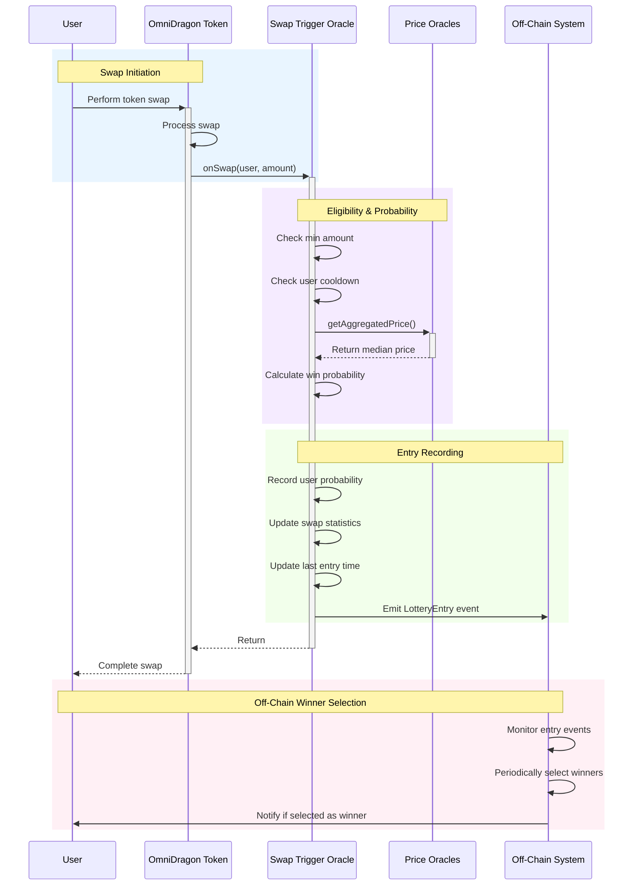

# Swap-Based Jackpot Trigger System

The OmniDragon ecosystem uses a sophisticated swap-based trigger system implemented in the `OmniDragonSwapTriggerOracle` contract to determine lottery entries and potential jackpot winners.

## Architecture Overview

The OmniDragon trigger system uses a price-aware, swap-activity monitoring approach to create a fair and engaging lottery experience:

```mermaid
flowchart TB
    %% Define main components of the trigger system
    subgraph TriggerCore ["Trigger Contract"]
        direction TB
        INTERFACE["IOmniDragonSwapTriggerOracle"]:::interface
        SWAP_ORACLE["OmniDragonSwapTriggerOracle"]:::impl
    end
    
    subgraph OracleSources ["Price Oracles"]
        direction TB
        CHAINLINK["Chainlink Feed"]:::oracle
        API3["API3 Feed"]:::oracle
        BAND["Band Protocol"]:::oracle
        PYTH["Pyth Network"]:::oracle
        STORK["Stork Network"]:::oracle
    end
    
    subgraph Mechanisms ["Probability Mechanisms"]
        direction TB
        BASE_PROB["Base Probability"]:::mechanism
        SWAP_SIZE["Swap Size Bonus"]:::mechanism
        LOGARITHMIC["Logarithmic Scaling"]:::mechanism
        MAX_CAP["Maximum Probability Cap"]:::mechanism
    end
    
    %% Connect the systems
    OracleSources -->|"Price Data"| SWAP_ORACLE
    INTERFACE -->|"Implemented by"| SWAP_ORACLE
    Mechanisms -->|"Determines Win Chance"| SWAP_ORACLE
    
    %% Connect to external systems
    OMNI_DRAGON["OmniDragon Token"]:::external
    JACKPOT_VAULT["Jackpot Vault"]:::external
    OFF_CHAIN["Off-Chain Random Selection"]:::external
    
    OMNI_DRAGON -->|"Calls on Swap"| SWAP_ORACLE
    SWAP_ORACLE -->|"Emits Events"| OFF_CHAIN
    SWAP_ORACLE -.->|"Can Interact with"| JACKPOT_VAULT
    
    %% Apply styling
    classDef interface fill:#e3f2fd,stroke:#1e88e5,color:#0d47a1
    classDef impl fill:#e8f5e9,stroke:#43a047,color:#1b5e20
    classDef oracle fill:#f3e5f5,stroke:#8e24aa,color:#4a148c
    classDef mechanism fill:#fff8e1,stroke:#ffb300,color:#ff6f00
    classDef external fill:#fce4ec,stroke:#ec407a,color:#880e4f
    
    %% Style subgraphs
    style TriggerCore fill:#e3f2fd,stroke:#bbdefb,color:#1565c0
    style OracleSources fill:#f3e5f5,stroke:#e1bee7,color:#6a1b9a
    style Mechanisms fill:#fff8e1,stroke:#ffecb3,color:#ff8f00
```



## Swap-Based Trigger Mechanism

The OmniDragon system uses token swap activity to trigger lottery entries, with the probability of winning proportional to swap size:

```solidity
function onSwap(address user, uint256 amount) external override onlyOmniDragon nonReentrant {
    require(user != address(0), "Zero user");
    require(amount >= minSwapAmount, "Swap too small");
    require(block.timestamp >= lastEntry[user] + cooldownPeriod, "Cooldown active");

    // Calculate win probability for this swap
    uint256 probability = calculateWinProbability(amount);
    
    // Update user's recorded probability
    userWinProbability[user] = probability;
    
    // Update statistics for future calculations
    _updateSwapStatistics(amount);
    
    // Record entry time
    lastEntry[user] = block.timestamp;

    emit LotteryEntry(user, amount, block.timestamp, probability);
}
```

## Probability Calculation

The trigger system uses a sophisticated algorithm that calculates win probability based on swap amount and market conditions:

```solidity
function calculateWinProbability(uint256 amount) public view returns (uint256) {
    // If we don't have enough data yet, return base probability
    if (swapCount < 10 || averageSwapAmount == 0) {
        return baseWinProbability;
    }
    
    // Get aggregated price from oracles
    (int256 price, bool priceSuccess) = getAggregatedPrice();
    
    // If price aggregation failed, use base probability
    if (!priceSuccess || price <= 0) {
        return baseWinProbability;
    }
    
    // Calculate ratio of this swap to average (scaled by 10000)
    uint256 swapRatio = (amount * 10000) / averageSwapAmount;
    
    // Calculate probability with logarithmic scaling
    uint256 probability;
    
    if (swapRatio <= 10000) {
        // For swaps below average, linear scale between base and 2x base
        probability = baseWinProbability + ((baseWinProbability * swapRatio) / 10000);
    } else {
        // For swaps above average, logarithmic scale with diminishing returns
        uint256 logFactor = 10000 * (1 + _log2(swapRatio / 10000));
        probability = baseWinProbability + (baseWinProbability * logFactor) / 10000;
    }
    
    // Cap at maximum probability
    return probability > maxWinProbability ? maxWinProbability : probability;
}
```

## Oracle Price Aggregation

The system uses multiple trusted price oracles to determine fair market values, which helps ensure the probability calculations are accurate:

```solidity
function getAggregatedPrice() public view returns (int256 aggregatedPrice, bool success) {
    int256[] memory prices = new int256[](activeOracleCount);
    uint8 validPrices = 0;
    
    // Collect prices from all active oracles
    for (uint8 i = 0; i < 10; i++) {
        if (oracleSources[i].isActive) {
            (int256 price, bool priceSuccess) = getPriceFromOracle(i);
            
            if (priceSuccess && price > 0) {
                prices[validPrices] = price;
                validPrices++;
            }
        }
    }
    
    // Check if we have enough valid prices
    if (validPrices < minimumOracleResponses) {
        return (0, false);
    }
    
    // Sort prices to find median
    // ... (sorting algorithm)
    
    // Calculate median price
    if (validPrices % 2 == 0) {
        // Even number of prices, average the middle two
        aggregatedPrice = (prices[validPrices / 2 - 1] + prices[validPrices / 2]) / 2;
    } else {
        // Odd number of prices, take the middle one
        aggregatedPrice = prices[validPrices / 2];
    }
    
    return (aggregatedPrice, true);
}
```

## Anti-Abuse Mechanisms

The trigger system includes several measures to prevent abuse and ensure fair participation:

1. **Minimum Swap Amount**: Requires swaps to exceed a configurable minimum amount
   ```solidity
   require(amount >= minSwapAmount, "Swap too small");
   ```

2. **User Cooldown**: Prevents users from participating too frequently
   ```solidity
   require(block.timestamp >= lastEntry[user] + cooldownPeriod, "Cooldown active");
   ```

3. **Multiple Oracle Consensus**: Requires multiple trusted price sources to agree
   ```solidity
   if (validPrices < minimumOracleResponses) {
       return (0, false);
   }
   ```

4. **Logarithmic Scaling**: Prevents large swaps from having disproportionate advantages
   ```solidity
   uint256 logFactor = 10000 * (1 + _log2(swapRatio / 10000));
   ```

5. **Maximum Probability Cap**: Ensures even large swaps have a maximum win probability
   ```solidity
   return probability > maxWinProbability ? maxWinProbability : probability;
   ```

## Trigger Configuration

The system can be configured with these parameters:

| Parameter | Description | Default | Range |
|-----------|-------------|---------|-------|
| `minSwapAmount` | Minimum swap size to qualify | Configurable | > 0 |
| `cooldownPeriod` | User cooldown between entries (seconds) | Configurable | > 0 |
| `baseWinProbability` | Base win probability (basis points) | 100 (1%) | 0-10000 |
| `maxWinProbability` | Maximum win chance (basis points) | 1000 (10%) | > baseWinProbability |
| `minimumOracleResponses` | Minimum required oracle responses | 1 | 1-activeOracleCount |

## Implementation Details

The OmniDragonSwapTriggerOracle contract inherits from multiple OpenZeppelin contracts for security and extensibility:

```mermaid
classDiagram
    %% Define the contract hierarchy
    class Ownable {
        <<OpenZeppelin>>
        +owner: address
        +transferOwnership(address)
        +onlyOwner() modifier
    }
    
    class ReentrancyGuard {
        <<OpenZeppelin>>
        +nonReentrant() modifier
    }
    
    class IOmniDragonSwapTriggerOracle {
        <<interface>>
        +onSwap(address user, uint256 amount)
    }
    
    class OmniDragonSwapTriggerOracle {
        -omniDragon: address
        -jackpotVault: address
        -minSwapAmount: uint256
        -cooldownPeriod: uint256
        -baseWinProbability: uint256
        -maxWinProbability: uint256
        -oracleSources: mapping
        -activeOracleCount: uint8
        -userWinProbability: mapping
        -lastEntry: mapping
        +onSwap(address, uint256)
        +calculateWinProbability(uint256)
        +getAggregatedPrice()
        +getUserWinProbability(address)
        +setMinSwapAmount(uint256)
        +setCooldownPeriod(uint256)
        +addOracle(uint8, address, OracleType, uint8)
    }
    
    Ownable <|-- OmniDragonSwapTriggerOracle
    ReentrancyGuard <|-- OmniDragonSwapTriggerOracle
    IOmniDragonSwapTriggerOracle <|.. OmniDragonSwapTriggerOracle
    
    %% Additional classes related to the system
    class AggregatorV3Interface {
        <<Chainlink>>
        +latestRoundData()
    }
    
    class IDragonJackpotVault {
        <<interface>>
        +addToJackpot(uint256)
    }
    
    OmniDragonSwapTriggerOracle --> AggregatorV3Interface : uses
    OmniDragonSwapTriggerOracle --> IDragonJackpotVault : can interact with
    
    %% Apply styling
    classDef interface fill:#e3f2fd,stroke:#1e88e5,color:#0d47a1
    classDef implementation fill:#e8f5e9,stroke:#43a047,color:#1b5e20
    classDef external fill:#f3e5f5,stroke:#8e24aa,color:#4a148c
    
    class IOmniDragonSwapTriggerOracle,IDragonJackpotVault,AggregatorV3Interface interface
    class OmniDragonSwapTriggerOracle implementation
    class Ownable,ReentrancyGuard external
```

## Trigger Process Flow

The swap-to-lottery entry process follows this sequence:



## Key Features

The OmniDragon swap-based trigger system provides several unique features:

1. **Market-Aware Probabilities**: Uses oracle price data to ensure fair calculations
2. **Proportional Rewards**: Larger swaps have higher (but not disproportionate) win chances
3. **Multi-Oracle Support**: Aggregates data from multiple oracles for reliability
4. **Anti-Abuse Protections**: User cooldowns and minimum swap requirements
5. **Configurable Parameters**: Allows fine-tuning of the system as needed
6. **Emitted Events**: Enables off-chain systems to track entries and manage winner selection

## Integration Example

Example of integrating with the swap trigger oracle in a token contract:

```solidity
// SPDX-License-Identifier: MIT
pragma solidity ^0.8.17;

import "./interfaces/IOmniDragonSwapTriggerOracle.sol";

contract OmniDragonToken {
    IOmniDragonSwapTriggerOracle public swapTriggerOracle;
    
    constructor(address _swapTriggerOracle) {
        swapTriggerOracle = IOmniDragonSwapTriggerOracle(_swapTriggerOracle);
    }
    
    function _transfer(address from, address to, uint256 amount) internal {
        // Token transfer implementation
        
        // If this is a swap with a DEX or specific contract
        if (isSwapTransaction(from, to)) {
            // Trigger lottery entry
            swapTriggerOracle.onSwap(from, amount);
        }
    }
    
    function isSwapTransaction(address from, address to) internal view returns (bool) {
        // Logic to determine if this is a swap
        // ...
    }
}
```
