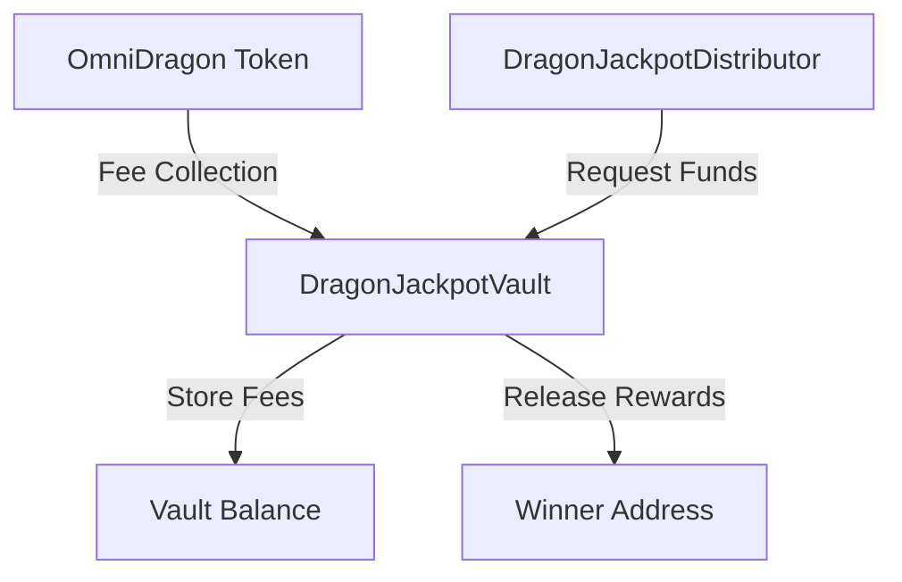

# Jackpot Vault

The DragonJackpotVault is the secure storage component of the Sonic Red Dragon jackpot system, responsible for receiving, holding, and distributing jackpot rewards.

## Overview

The jackpot vault acts as the treasury for the jackpot system, collecting fees from token transactions and storing them until they are distributed to winners:



## Core Functionality

The vault contract implements these key functions:

1. **Fee Collection**: Receives a portion of transaction fees from the token contract
2. **Secure Storage**: Safely holds accumulated rewards until distribution
3. **Authorized Distribution**: Only allows authorized contracts to trigger distributions
4. **Balance Tracking**: Maintains accurate records of available jackpot amounts
5. **Reward Splitting**: Supports multiple jackpot tiers and distribution strategies

## Contract Implementation

The DragonJackpotVault implements core functionality for receiving and distributing funds:

```solidity
/**
 * @dev Adds funds to the jackpot pool
 * @param amount The amount to add to the jackpot (in wrapped native token)
 */
function addToJackpot(uint256 amount) external override {
    require(msg.sender == omniDragon, "Not authorized");
    require(amount > 0, "Zero amount");
    
    // Update the total jackpot amount
    totalJackpotAmount += amount;
    
    // Update the available jackpot amount
    availableJackpotAmount += amount;
    
    emit JackpotDeposit(msg.sender, amount, totalJackpotAmount);
}

/**
 * @dev Distributes jackpot rewards to a winner
 * @param winner The address of the jackpot winner
 * @param amount The amount to distribute (in wrapped native token)
 */
function distributeJackpot(address winner, uint256 amount) external override {
    require(msg.sender == distributor, "Not authorized");
    require(winner != address(0), "Zero address");
    require(amount > 0, "Zero amount");
    require(amount <= availableJackpotAmount, "Insufficient funds");
    
    // Update the available jackpot amount
    availableJackpotAmount -= amount;
    
    // Transfer the jackpot to the winner
    IERC20(wrappedToken).safeTransfer(winner, amount);
    
    emit JackpotDistributed(winner, amount, availableJackpotAmount);
}
```

## Security Features

The vault implements several security features to ensure funds are handled safely:

```solidity
// Access control
modifier onlyOwner() {
    require(msg.sender == owner, "Not owner");
    _;
}

modifier onlyDistributor() {
    require(msg.sender == distributor, "Not distributor");
    _;
}

modifier onlyOmniDragon() {
    require(msg.sender == omniDragon, "Not OmniDragon");
    _;
}

// Emergency withdrawal (for migrations/upgrades)
function emergencyWithdraw(address to, uint256 amount) external onlyOwner {
    require(to != address(0), "Zero address");
    require(amount > 0, "Zero amount");
    require(amount <= availableJackpotAmount, "Insufficient funds");
    
    availableJackpotAmount -= amount;
    
    IERC20(wrappedToken).safeTransfer(to, amount);
    
    emit EmergencyWithdrawal(to, amount);
}
```

## Configuration

The vault has several configurable parameters:

```solidity
// Update distributor contract
function setDistributor(address _distributor) external onlyOwner {
    require(_distributor != address(0), "Zero address");
    emit DistributorUpdated(distributor, _distributor);
    distributor = _distributor;
}

// Update OmniDragon token address
function setOmniDragon(address _omniDragon) external onlyOwner {
    require(_omniDragon != address(0), "Zero address");
    emit OmniDragonUpdated(omniDragon, _omniDragon);
    omniDragon = _omniDragon;
}

// Update wrapped token (WETH, WBNB, etc.)
function setWrappedToken(address _wrappedToken) external onlyOwner {
    require(_wrappedToken != address(0), "Zero address");
    emit WrappedTokenUpdated(wrappedToken, _wrappedToken);
    wrappedToken = _wrappedToken;
}
```

## Jackpot Management

The vault provides several functions for jackpot management:

```solidity
// Get the total amount ever deposited to the jackpot
function getTotalJackpot() external view returns (uint256) {
    return totalJackpotAmount;
}

// Get the current available jackpot amount
function getAvailableJackpot() external view override returns (uint256) {
    return availableJackpotAmount;
}

// Get the total amount distributed to winners
function getTotalDistributed() external view returns (uint256) {
    return totalJackpotAmount - availableJackpotAmount;
}
```

## Distribution Strategies

The vault supports different distribution strategies through configurable parameters:

| Strategy | Description | Configuration |
|----------|-------------|---------------|
| Fixed Amount | Each winner gets a fixed amount | Set through the distributor |
| Percentage | Each winner gets a percentage of the pool | Set through the distributor |
| Tiered | Different tiers get different amounts | Set through the distributor |
| Progressive | Growing jackpot until won | Default behavior |

## Events

The vault emits the following events:

```solidity
// Core jackpot events
event JackpotDeposit(address indexed sender, uint256 amount, uint256 newTotal);
event JackpotDistributed(address indexed winner, uint256 amount, uint256 remaining);
event EmergencyWithdrawal(address indexed recipient, uint256 amount);

// Configuration events
event DistributorUpdated(address indexed oldDistributor, address indexed newDistributor);
event OmniDragonUpdated(address indexed oldOmniDragon, address indexed newOmniDragon);
event WrappedTokenUpdated(address indexed oldToken, address indexed newToken);
```

## Integration with Other Contracts

The vault interacts with several other contracts in the ecosystem:

1. **OmniDragon Token**
   ```solidity
   // In OmniDragon.sol
   function _distributeFees(uint256 jackpotAmount, uint256 ve69Amount) internal {
       if (jackpotAmount > 0 && jackpotVault != address(0)) {
           IERC20(wrappedNativeToken).safeTransfer(jackpotVault, jackpotAmount);
           IDragonJackpotVault(jackpotVault).addToJackpot(jackpotAmount);
           emit FeeTransferred(jackpotVault, jackpotAmount, "Jackpot");
       }
   }
   ```

2. **Jackpot Distributor**
   ```solidity
   // In DragonJackpotDistributor.sol
   function distributeJackpot(address winner) internal {
       uint256 jackpotAmount = IDragonJackpotVault(jackpotVault).getAvailableJackpot();
       IDragonJackpotVault(jackpotVault).distributeJackpot(winner, jackpotAmount);
       emit WinnerSelected(currentJackpotId, winner, jackpotAmount);
   }
   ```

## Security Considerations

The vault is designed with security as a top priority:

1. **Role Separation**: Different roles for deposit and distribution
2. **Access Controls**: Strict validation of caller addresses
3. **Input Validation**: Comprehensive checking of all function parameters
4. **Emergency Recovery**: Owner-only emergency withdrawal for migrations
5. **Balance Checks**: Prevents distributing more than available
