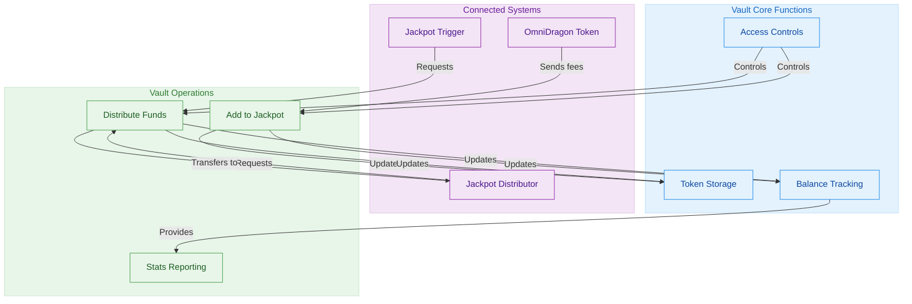
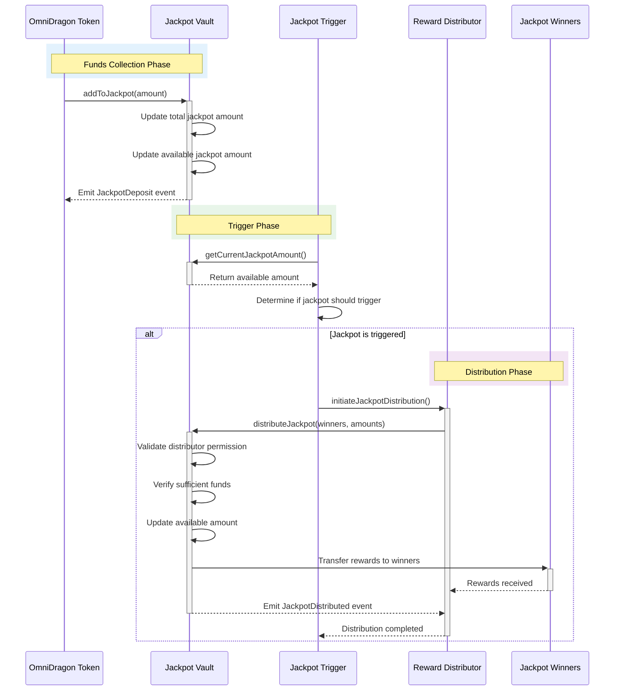

# DragonJackpotVault Contract

The DragonJackpotVault contract (`DragonJackpotVault.sol`) is responsible for securely storing and managing jackpot funds until they are distributed to winners.

## Architecture Overview

The jackpot vault implements a secure fund management system with clear role separation:



## Funds Flow Process

The journey of funds through the jackpot vault follows a well-defined sequence:



## Implementation Details

The DragonJackpotVault contract implements a role-based security model with clear separation of concerns:

```mermaid
classDiagram
    %% Define main contract and components
    class DragonJackpotVault {
        %% State variables
        -address wrappedToken
        -address omniDragon
        -address jackpotDistributor
        -address jackpotTrigger
        -uint256 totalJackpotAmount
        -uint256 availableJackpotAmount
        -uint256 distributedJackpotAmount
        -uint256 distributionCount
        
        %% Functions
        +addToJackpot(uint256 amount)
        +distributeJackpot(address[] winners, uint256[] amounts)
        +getCurrentJackpotAmount() uint256
        +getTotalJackpotHistory() uint256
        +getDistributedJackpotAmount() uint256
        +getDistributionCount() uint256
        +setJackpotDistributor(address newDistributor)
        +setJackpotTrigger(address newTrigger)
        +sweep(address token, address to, uint256 amount)
    }
    
    class Ownable {
        -address owner
        +onlyOwner() modifier
        +transferOwnership(address newOwner)
    }
    
    class ReentrancyGuard {
        -uint256 _status
        +nonReentrant() modifier
    }
    
    class IERC20 {
        +transfer(address to, uint256 amount) bool
        +balanceOf(address account) uint256
    }
    
    %% Define relationships
    Ownable <|-- DragonJackpotVault : inherits
    ReentrancyGuard <|-- DragonJackpotVault : inherits
    DragonJackpotVault --> IERC20 : uses
    
    %% Define interfaces/abstract classes
    class IDragonJackpotVault {
        <<interface>>
        +addToJackpot(uint256 amount)
        +distributeJackpot(address[] winners, uint256[] amounts)
        +getCurrentJackpotAmount() uint256
    }
    
    IDragonJackpotVault <|.. DragonJackpotVault : implements
    
    %% Define access control roles
    class AccessRoles {
        <<enumeration>>
        OWNER
        OMNI_DRAGON
        DISTRIBUTOR
        TRIGGER
    }
    
    DragonJackpotVault --> AccessRoles : enforces
    
    %% Apply styling
    classDef main fill:#e3f2fd,stroke:#1e88e5,color:#0d47a1
    classDef base fill:#e8f5e9,stroke:#43a047,color:#1b5e20
    classDef interface fill:#f3e5f5,stroke:#8e24aa,color:#4a148c
    classDef external fill:#fff8e1,stroke:#ffb300,color:#ff6f00
    
    class DragonJackpotVault main
    class Ownable,ReentrancyGuard base
    class IDragonJackpotVault interface
    class IERC20,AccessRoles external
```

## Key Functions

The DragonJackpotVault contract provides the following core functionality:

### Add To Jackpot

Allows the OmniDragon token contract to add funds to the jackpot pool:

```solidity
function addToJackpot(uint256 amount) external override onlyOmniDragon {
    require(amount > 0, "Zero amount");
    
    // Update jackpot balances
    totalJackpotAmount += amount;
    availableJackpotAmount += amount;
    
    emit JackpotDeposit(msg.sender, amount, totalJackpotAmount);
}
```

### Distribute Jackpot

Allows the authorized distributor to distribute jackpot funds to winners:

```solidity
function distributeJackpot(
    address[] calldata winners, 
    uint256[] calldata amounts
) external override onlyDistributor nonReentrant {
    require(winners.length > 0, "No winners");
    require(winners.length == amounts.length, "Length mismatch");
    
    uint256 totalAmount = 0;
    for (uint256 i = 0; i < amounts.length; i++) {
        totalAmount += amounts[i];
    }
    
    require(totalAmount > 0, "Zero total amount");
    require(totalAmount <= availableJackpotAmount, "Insufficient funds");
    
    // Update jackpot amount
    availableJackpotAmount -= totalAmount;
    distributedJackpotAmount += totalAmount;
    distributionCount++;
    
    // Transfer to winners
    for (uint256 i = 0; i < winners.length; i++) {
        if (amounts[i] > 0) {
            IERC20(wrappedToken).safeTransfer(winners[i], amounts[i]);
            emit JackpotWinner(winners[i], amounts[i]);
        }
    }
    
    emit JackpotDistributed(msg.sender, totalAmount, availableJackpotAmount);
}
```

### Get Current Jackpot Amount

Provides the current available jackpot amount:

```solidity
function getCurrentJackpotAmount() external view override returns (uint256) {
    return availableJackpotAmount;
}
```

## Security Considerations

The DragonJackpotVault contract implements several critical security features:

1. **Role-Based Access Control**
   - Only the OmniDragon token can add funds
   - Only the authorized distributor can distribute funds
   - Only the owner can configure role addresses

2. **Reentrancy Protection**
   - Uses ReentrancyGuard to prevent reentrant calls during distributions
   - Prevents potential attack vectors during token transfers

3. **Input Validation**
   - Checks for zero amounts
   - Validates array lengths match
   - Ensures sufficient funds before distribution

4. **Emergency Controls**
   - Owner can sweep tokens in case of emergency
   - Ability to update distributor and trigger addresses if needed
