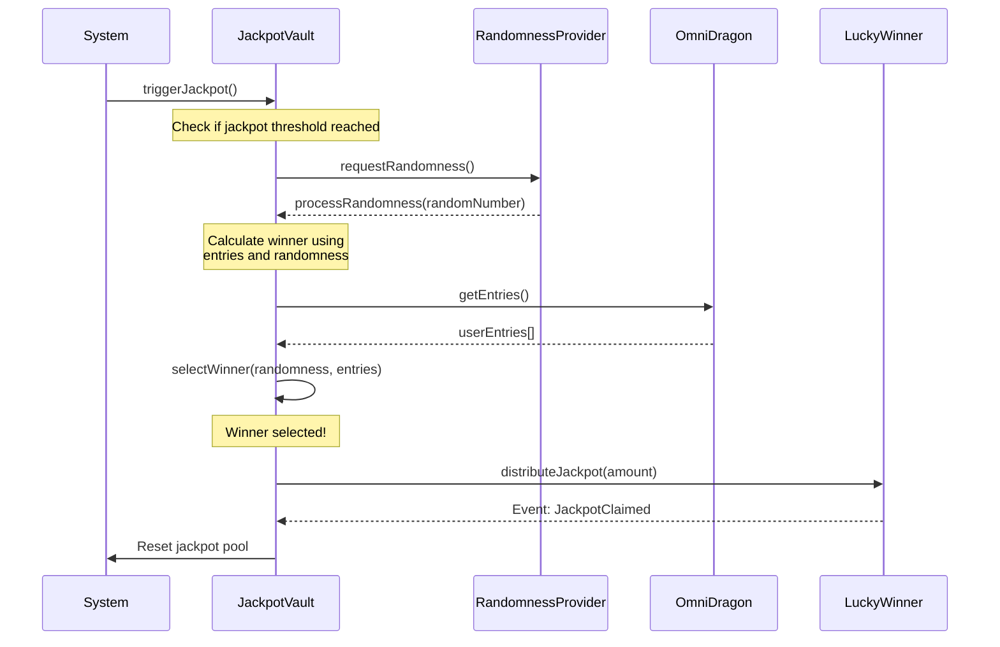

# Jackpot Vault Contract

The Jackpot Vault (`DragonJackpotVault.sol`) is responsible for securely storing funds allocated to the OmniDragon jackpot system and handling the distribution of winnings to lucky participants.

## Contract Overview

The Jackpot Vault is a key component of the OmniDragon ecosystem's unique jackpot mechanism, providing:

- Secure storage for jackpot funds
- Randomized winner selection mechanism
- Configurable winning thresholds
- Integration with dRand for verifiable randomness
- Transparent distribution of jackpot rewards

## Key Functions

```solidity
// Receive tokens from the fee distributor
function receiveJackpotFunds(uint256 _amount) external;

// Trigger jackpot drawing process
function triggerJackpot() external returns (bool);

// Check if jackpot threshold has been reached
function isJackpotReady() external view returns (bool);

// Set jackpot parameters
function setJackpotParameters(
    uint256 _minThreshold,
    uint256 _maxThreshold,
    uint256 _baseOdds
) external onlyOwner;

// Process random number to select winner
function processRandomness(uint256 _randomness) external;

// Distribute jackpot to winner
function distributeJackpot(address _winner, uint256 _amount) external;

// Get current jackpot pool size
function getJackpotSize() external view returns (uint256);
```

## Architecture Diagram

```mermaid
flowchart TB
    %% Main vault contract
    JackpotVault["DragonJackpotVault"]:::main
    
    %% Core components
    subgraph Components ["Core Components"]
        direction TB
        Treasury["Token Treasury"]:::component
        WinnerSelector["Winner Selector"]:::component
        Distributor["Reward Distributor"]:::component
        EntryTracker["Entry Tracker"]:::component
    end
    
    %% Integration with other systems
    subgraph Integrations ["System Integrations"]
        direction LR
        OmniDragon["OmniDragon Token"]:::external
        RandomnessProvider["VRF Consumer"]:::external
        FeeCollector["Fee Collector"]:::external
    end
    
    %% Jackpot logic
    subgraph JackpotLogic ["Jackpot Mechanics"]
        direction TB
        Trigger["Trigger Mechanism"]:::logic
        Threshold["Pool Threshold"]:::logic
        Selection["Winner Selection"]:::logic
        Odds["Entry Odds"]:::logic
    end
    
    %% Connect everything
    Components --> JackpotVault
    JackpotVault --> JackpotLogic
    Integrations <--> JackpotVault
    
    %% Detailed connections
    OmniDragon -->|"Provides tokens"| Treasury
    RandomnessProvider -->|"Provides randomness"| Selection
    FeeCollector -->|"Funds jackpot"| Treasury
    
    Trigger -->|"Initiates"| Selection
    Threshold -->|"Controls"| Trigger
    Selection -->|"Uses"| Odds
    Selection -->|"Selects"| Winner((("Lucky Winner"))):::winner
    
    Distributor -->|"Transfers reward to"| Winner
    EntryTracker -->|"Provides data to"| Selection
    
    %% Participant interactions
    User([User]):::user -->|"Trading activities"| OmniDragon
    User -->|"Earns entries"| EntryTracker
    Winner -->|"Receives jackpot"| User
    
    %% Styling
    classDef main fill:#4a80d1;stroke:#355899;color:#ffffff;font-weight:bold
    classDef component fill:#42a5f5;stroke:#1e88e5;color:#ffffff
    classDef external fill:#78909c;stroke:#455a64;color:#ffffff
    classDef logic fill:#66bb6a;stroke:#43a047;color:#ffffff
    classDef winner fill:#ffd700;stroke:#ff8f00;color:#ffffff;font-weight:bold
    classDef user fill:#ab47bc;stroke:#8e24aa;color:#ffffff;font-weight:bold
    
    %% Subgraph styling
    style Components fill:rgba(33,150,243,0.1);stroke:#bbdefb;color:#1565c0
    style Integrations fill:rgba(117,117,117,0.1);stroke:#f5f5f5;color:#424242
    style JackpotLogic fill:rgba(76,175,80,0.1);stroke:#c8e6c9;color:#2e7d32
```

## Jackpot Winner Selection

The jackpot winner selection process uses a combination of factors to ensure fairness:



## Jackpot Entry Mechanism

Users can earn jackpot entries through various activities in the ecosystem:

| Activity | Entry Calculation | Max Entries |
|----------|-------------------|-------------|
| Token Transfer | 1 entry per 1000 tokens | Unlimited |
| DEX Swap | 10 entries per $100 swap value | Unlimited |
| Liquidity Provision | 5 entries per $100 provided | 1,000 per LP |
| Staking | 1 entry per 100 tokens staked per day | Based on stake duration |

## Security Features

The Jackpot Vault incorporates multiple security measures:

- **Time-Locked Withdrawals**: Treasury funds can only be withdrawn after a time delay
- **Owner Controls**: Administrative functions restricted to authorized addresses
- **Threshold Limits**: Min/max jackpot size with circuit breakers
- **Audit Trail**: Comprehensive event logging for all jackpot activities
- **Rate Limiting**: Cooldown periods between jackpot triggers
- **Emergency Pause**: Ability to pause the jackpot system in emergencies

## Integration Example

Here's an example of how other contracts can integrate with the Jackpot Vault:

```solidity
// SPDX-License-Identifier: MIT
pragma solidity ^0.8.0;

import "@omnidragon/contracts/interfaces/IDragonJackpotVault.sol";
import "@omnidragon/contracts/interfaces/IOmniDragon.sol";

contract JackpotIntegration {
    IDragonJackpotVault public jackpotVault;
    IOmniDragon public omniDragon;
    
    constructor(address _jackpotVault, address _omniDragon) {
        jackpotVault = IDragonJackpotVault(_jackpotVault);
        omniDragon = IOmniDragon(_omniDragon);
    }
    
    // Example: A transaction that generates a jackpot entry
    function swapWithEntry(uint256 _amount) external {
        // Process the swap (simplified example)
        // ...
        
        // Check if jackpot is ready for triggering
        if (jackpotVault.isJackpotReady()) {
            // Try to trigger the jackpot
            jackpotVault.triggerJackpot();
        }
    }
    
    // Example: Register an entry for a user
    function registerJackpotEntry(address _user, uint256 _entryCount) external {
        // Only callable by authorized contracts
        // Implementation would depend on your entry tracking system
    }
}
```

## Interface

The Jackpot Vault exposes its functionality through the following interface:

```solidity
interface IDragonJackpotVault {
    // Fund management
    function receiveJackpotFunds(uint256 _amount) external;
    function withdrawExcessFunds(uint256 _amount) external;
    
    // Jackpot control
    function triggerJackpot() external returns (bool);
    function isJackpotReady() external view returns (bool);
    function getJackpotSize() external view returns (uint256);
    function getMinThreshold() external view returns (uint256);
    function getMaxThreshold() external view returns (uint256);
    
    // Configuration
    function setJackpotParameters(
        uint256 _minThreshold,
        uint256 _maxThreshold,
        uint256 _baseOdds
    ) external;
    
    // Randomness processing
    function processRandomness(uint256 _randomness) external;
    
    // Events
    event JackpotFunded(uint256 amount);
    event JackpotTriggered(uint256 timestamp);
    event JackpotDistributed(address winner, uint256 amount);
    event ParametersUpdated(uint256 minThreshold, uint256 maxThreshold, uint256 baseOdds);
}
```
