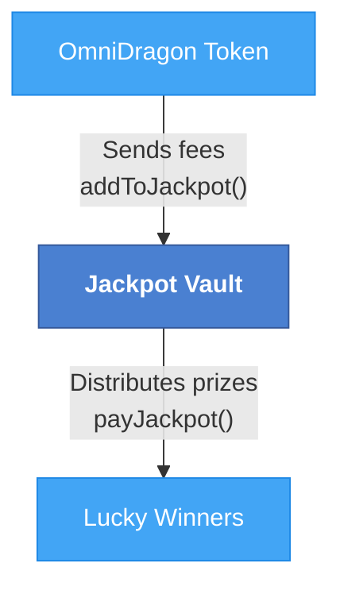

# Jackpot Vault Contract

The DragonJackpotVault (`DragonJackpotVault.sol`) is responsible for storing funds allocated to the OmniDragon jackpot system and handling the distribution of winnings to lucky participants.

## Contract Overview

The Jackpot Vault is a key component of the OmniDragon ecosystem, providing:

- Secure storage for jackpot funds
- Accounting for different token types in the jackpot
- Simple distribution mechanism for jackpot payouts
- Tracking of jackpot win history

## Actual Implementation

The DragonJackpotVault contract is implemented as an Ownable contract with basic fund management:

```solidity
contract DragonJackpotVault is IDragonJackpotVault, Ownable {
    using SafeERC20 for IERC20;
    
    // Track jackpot balances by token
    mapping(address => uint256) public jackpotBalances;
    
    // Wrapped native token (WETH, WrappedNativeToken)
    address public wrappedNativeToken;
    
    // Last win timestamp
    uint256 public lastWinTimestamp;
}
```

## Key Functions

The contract implements straightforward functions for managing the jackpot:

```solidity
// Add tokens to the jackpot (from token contract)
function addToJackpot(uint256 amount) external override;

// Add ERC20 tokens to the jackpot (from any address)
function addERC20ToJackpot(address token, uint256 amount) external;

// Get the current jackpot balance in wrapped native token
function getJackpotBalance() external view override returns (uint256 balance);

// Pay jackpot to winner with specific token
function payJackpotWithToken(address token, address winner, uint256 amount) external onlyOwner;

// Pay jackpot to winner using wrapped native token
function payJackpot(address winner, uint256 amount) external override onlyOwner;

// Get the time of the last jackpot win
function getLastWinTime() external view override returns (uint256 timestamp);

// Set the wrapped native token address
function setWrappedNativeToken(address _wrappedNativeToken) external override onlyOwner;
```

## Jackpot Flow

The jackpot funds flow through the vault in a simple pattern:



## Implementation Details

The Jackpot Vault has several key design features:

1. **Multi-Token Support**: Can hold different types of tokens in the jackpot pool
2. **Owner-Only Distribution**: Only the owner (typically the OmniDragon token contract) can trigger payouts
3. **Win Tracking**: Records the timestamp of the last jackpot win
4. **Configuration Flexibility**: Allows configuration of the wrapped native token address

## Usage Example

Here's an example of how the OmniDragon ecosystem interacts with the Jackpot Vault:

```solidity
// Example: OmniDragon sends fees to the jackpot
function _sendJackpotFees(uint256 amount) internal {
    // Transfer tokens to the jackpot vault
    _transfer(address(this), jackpotVault, amount);
    
    // Notify the vault about the new funds
    IDragonJackpotVault(jackpotVault).addToJackpot(amount);
}

// Example: Trigger a jackpot payout
function triggerJackpot(address winner, uint256 amount) external onlyOwner {
    // Pay the jackpot to the winner
    IDragonJackpotVault(jackpotVault).payJackpot(winner, amount);
    
    emit JackpotPaid(winner, amount);
}
```

## Security Considerations

The Jackpot Vault implements several security measures:

- **Ownership Control**: Only the owner can trigger jackpot payouts
- **Safe ERC20 Usage**: Uses SafeERC20 for all token transfers
- **Balance Validation**: Verifies sufficient balance before payouts
- **Contract Registration**: Includes a utility function `registerMe()` for network compatibility
