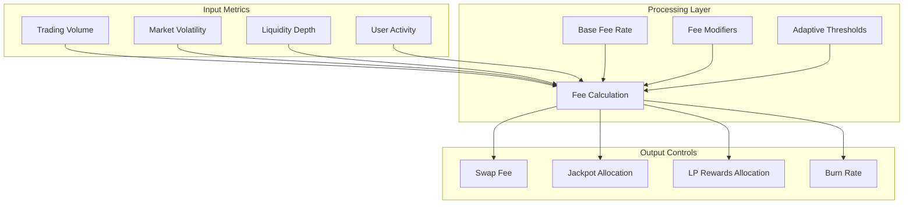
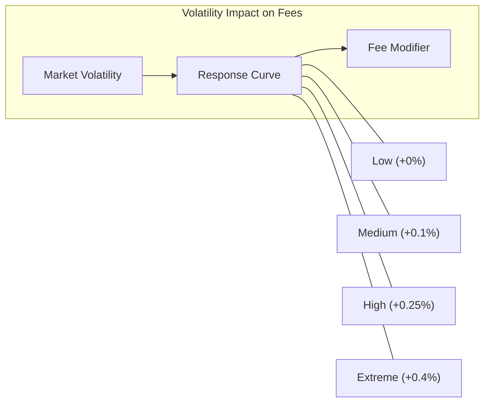
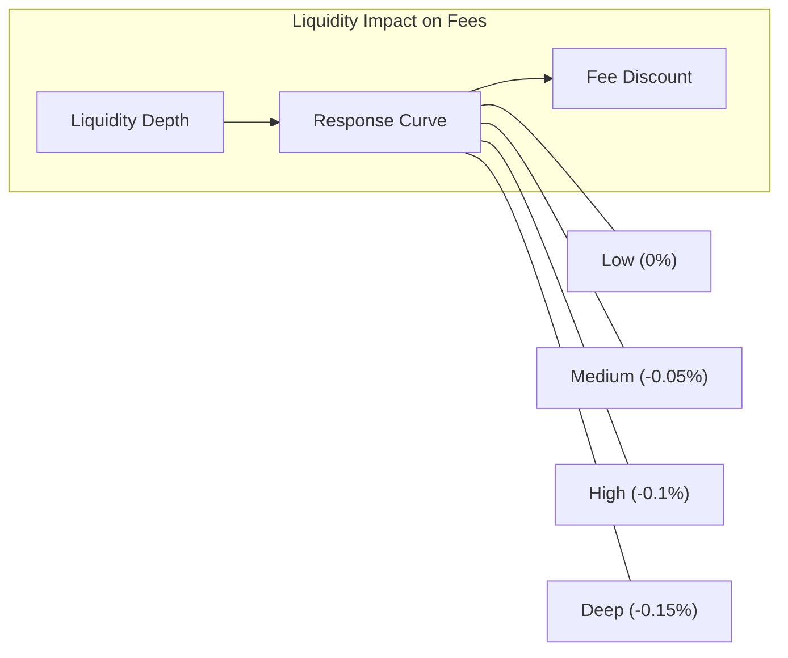

import Tabs from '@theme/Tabs';
import TabItem from '@theme/TabItem';

# DragonAdaptiveFeeManager

**Dynamic fee adjustment system that responds to market conditions and protocol metrics**

<div className="contract-badges">
  <span className="contract-badge fee">Fee Management</span>
  <span className="contract-badge market">Market Responsive</span>
  <span className="contract-badge adaptive">Adaptive System</span>
</div>

## Overview

The `DragonAdaptiveFeeManager` implements a sophisticated dynamic fee adjustment system that automatically calibrates protocol fees based on market conditions, user behavior, and protocol health metrics.



## Key Functions

The library provides a suite of functions for dynamic fee management.

<div className="function-signature">
function calculateAdaptiveFee(uint256 baseFeeBps, uint256 volatility, uint256 liquidity, uint256 volume) internal pure returns (uint256)
</div>

Calculates the optimal fee rate by considering market volatility, liquidity depth, and trading volume.

<div className="function-signature">
function calculateFeeDistribution(uint256 totalFeeBps, uint256 jackpotSize, uint256 lpRatio) internal pure returns (FeeDistribution memory)
</div>

Determines how collected fees should be distributed between jackpot, LP rewards, and token burning.

<div className="function-signature">
function calculateVolatilityMetric(uint256[] memory prices, uint256 timeWindow) internal pure returns (uint256)
</div>

Computes a normalized volatility metric based on recent price movements.

## Adaptive Fee System

<Tabs>
  <TabItem value="formula" label="Core Fee Formula" default>
    <div className="math-formula">
    fee = baseFeeBps * (1 + volModifier - liqModifier + volumeModifier)
    </div>
    <p>The core formula adjusts the base fee by applying modifiers derived from market conditions.</p>
  </TabItem>
  <TabItem value="volatility" label="Volatility Modifier">
    <div className="math-formula">
    volModifier = volatility / VOLATILITY_SCALE * MAX_VOL_IMPACT
    </div>
    <p>Higher volatility increases fees to compensate for increased market risk.</p>
  </TabItem>
  <TabItem value="liquidity" label="Liquidity Modifier">
    <div className="math-formula">
    liqModifier = min(liquidityDepth / TARGET_LIQUIDITY * MAX_LIQ_DISCOUNT, MAX_LIQ_DISCOUNT)
    </div>
    <p>Higher liquidity decreases fees to incentivize trading in well-capitalized pools.</p>
  </TabItem>
</Tabs>

## Response Curves

The adaptive fee system employs several response curves to ensure optimal protocol behavior:

### Volatility Response



As market volatility increases, fees are proportionally increased to compensate for increased risk and provide additional jackpot funding.

### Liquidity Response



Deeper liquidity results in fee discounts to incentivize trading in well-capitalized pools.

## Integration Examples

### Basic Fee Calculation

```solidity
// Import the library
import "../math/DragonAdaptiveFeeManager.sol";

contract TradingProtocol {
    using DragonAdaptiveFeeManager for uint256;
    
    // Base protocol parameters
    uint256 public constant BASE_FEE_BPS = 30; // 0.3%
    
    // Market metrics
    uint256 public lastVolatility;
    uint256 public lastLiquidityDepth;
    uint256 public last24hVolume;
    
    // Calculate the current fee for a trade
    function getCurrentFee() public view returns (uint256) {
        return DragonAdaptiveFeeManager.calculateAdaptiveFee(
            BASE_FEE_BPS,
            lastVolatility,
            lastLiquidityDepth,
            last24hVolume
        );
    }
    
    // Update market metrics (called by oracle)
    function updateMarketMetrics(
        uint256 volatility,
        uint256 liquidityDepth,
        uint256 volume
    ) external onlyOracle {
        lastVolatility = volatility;
        lastLiquidityDepth = liquidityDepth;
        last24hVolume = volume;
    }
}
```

### Dynamic Fee Distribution

```solidity
// Import the library
import "../math/DragonAdaptiveFeeManager.sol";

contract FeeDistributor {
    using DragonAdaptiveFeeManager for uint256;
    
    // Protocol state
    uint256 public jackpotSize;
    uint256 public lpRatio; // Ratio of LP tokens to total supply
    
    // Distribute collected fees
    function distributeFees(uint256 collectedFees) external returns (
        uint256 toJackpot,
        uint256 toLPs,
        uint256 toBurn
    ) {
        // Calculate the optimal distribution
        DragonAdaptiveFeeManager.FeeDistribution memory dist = 
            DragonAdaptiveFeeManager.calculateFeeDistribution(
                collectedFees,
                jackpotSize,
                lpRatio
            );
        
        // Transfer funds to respective destinations
        // ... (implementation)
        
        return (dist.jackpotAmount, dist.lpAmount, dist.burnAmount);
    }
}
```

## Dynamic Range Control

The adaptive fee system implements dynamic range controls to ensure fees remain within acceptable bounds:

1. **Minimum Fee**: Ensures protocol sustainability by maintaining a floor fee rate
2. **Maximum Fee**: Prevents user friction by capping maximum fees during extreme conditions
3. **Response Dampening**: Smooths fee changes to prevent rapid oscillations
4. **Time-Weighted Adjustments**: Incorporates historical data to avoid reactionary changes

<div className="security-consideration">
  <h4>Security Considerations</h4>
  <p>When implementing the adaptive fee system, consider these security best practices:</p>
  <ul>
    <li><strong>Oracle Security</strong>: Ensure market metrics cannot be manipulated by malicious actors</li>
    <li><strong>Bounds Validation</strong>: Implement strict minimum and maximum bounds on all fee parameters</li>
    <li><strong>Smoothing Algorithm</strong>: Use time-weighted average prices (TWAP) to resist manipulation</li>
    <li><strong>Circuit Breakers</strong>: Implement emergency controls for extreme market conditions</li>
    <li><strong>Governance Controls</strong>: Allow parameter adjustments through secure governance process</li>
  </ul>
</div>

## Gas Optimization

<div className="gas-optimization">
  <h4>Gas Optimization Notes</h4>
  <p>The adaptive fee system implements several gas optimizations:</p>
  <ul>
    <li>Caching of market metrics between updates</li>
    <li>Efficient fixed-point arithmetic for fee calculations</li>
    <li>Batched updates of related parameters</li>
    <li>Precalculated scaling factors for common operations</li>
    <li>Minimal state changes during high-frequency operations</li>
  </ul>
</div> 