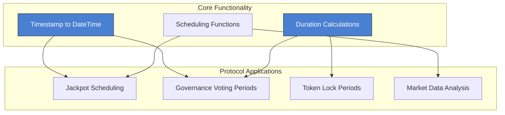

import Tabs from '@theme/Tabs';
import TabItem from '@theme/TabItem';

# DragonDateTimeLib

**Advanced date and time manipulation library for blockchain applications**

<div className="contract-badges">
  <span className="contract-badge utility">Utility Library</span>
  <span className="contract-badge time">Time Management</span>
  <span className="contract-badge optimized">Gas Optimized</span>
</div>

## Overview

The `DragonDateTimeLib` provides sophisticated date and time functionality for blockchain applications, enabling time-based features like scheduled events, duration calculations, and cross-chain time synchronization.



## Key Functions

This library contains essential time and date manipulation functions for blockchain applications.

<div className="function-signature">
function timestampToDateTime(uint256 timestamp) internal pure returns (DateTime memory dt)
</div>

Converts a Unix timestamp into a structured DateTime object with year, month, day, hour, minute, and second components.

<div className="function-signature">
function isLeapYear(uint256 year) internal pure returns (bool)
</div>

Determines if a given year is a leap year according to the Gregorian calendar rules.

<div className="function-signature">
function getDaysInMonth(uint256 year, uint256 month) internal pure returns (uint256)
</div>

Returns the number of days in a specified month, accounting for leap years when necessary.

<div className="function-signature">
function addSeconds(uint256 timestamp, uint256 _seconds) internal pure returns (uint256)
</div>

Adds a specified number of seconds to a timestamp and returns the resulting timestamp.

<div className="function-signature">
function addDays(uint256 timestamp, uint256 _days) internal pure returns (uint256)
</div>

Adds a specified number of days to a timestamp and returns the resulting timestamp.

<div className="function-signature">
function diffSeconds(uint256 fromTimestamp, uint256 toTimestamp) internal pure returns (uint256)
</div>

Calculates the difference in seconds between two timestamps.

## Integration Examples

### Scheduling Jackpot Events

```solidity
// Import the library
import "../math/DragonDateTimeLib.sol";

contract JackpotScheduler {
    using DragonDateTimeLib for uint256;
    
    uint256 public nextJackpotTimestamp;
    
    // Schedule the next jackpot event
    function scheduleNextJackpot() external {
        // Schedule for next Friday at 8:00 PM UTC
        DragonDateTimeLib.DateTime memory now = block.timestamp.timestampToDateTime();
        
        // Calculate days to next Friday (Friday = 5)
        uint256 daysToFriday = (5 + 7 - now.dayOfWeek) % 7;
        if (daysToFriday == 0 && (now.hour >= 20 || (now.hour == 20 && now.minute > 0))) {
            daysToFriday = 7; // If it's already past 8 PM on Friday, schedule for next Friday
        }
        
        // Set target hour, minute, second
        uint256 targetTimestamp = block.timestamp.addDays(daysToFriday);
        DragonDateTimeLib.DateTime memory target = targetTimestamp.timestampToDateTime();
        
        // Adjust to 8:00 PM
        int256 hourAdjustment = 20 - int256(target.hour);
        targetTimestamp = targetTimestamp + uint256(hourAdjustment) * 3600;
        
        // Set minute and second to 0
        targetTimestamp = targetTimestamp - (target.minute * 60) - target.second;
        
        nextJackpotTimestamp = targetTimestamp;
    }
}
```

### Token Lock Duration

```solidity
// Import the library
import "../math/DragonDateTimeLib.sol";

contract TokenLocker {
    using DragonDateTimeLib for uint256;
    
    struct Lock {
        address user;
        uint256 amount;
        uint256 unlockTime;
    }
    
    mapping(address => Lock) public locks;
    
    // Lock tokens for a specific duration
    function lockTokens(uint256 amount, uint256 durationDays) external {
        require(amount > 0, "Amount must be greater than 0");
        require(durationDays > 0, "Duration must be greater than 0");
        
        // Calculate unlock timestamp
        uint256 unlockTime = block.timestamp.addDays(durationDays);
        
        // Create lock
        locks[msg.sender] = Lock({
            user: msg.sender,
            amount: amount,
            unlockTime: unlockTime
        });
        
        // Transfer tokens from user to contract
        // ...
    }
    
    // Check remaining lock time
    function getRemainingLockTime(address user) external view returns (uint256 days_, uint256 hours_, uint256 minutes_) {
        Lock memory lock = locks[user];
        if (lock.unlockTime <= block.timestamp) {
            return (0, 0, 0);
        }
        
        uint256 remainingSeconds = lock.unlockTime.diffSeconds(block.timestamp);
        days_ = remainingSeconds / 86400;
        hours_ = (remainingSeconds % 86400) / 3600;
        minutes_ = (remainingSeconds % 3600) / 60;
        
        return (days_, hours_, minutes_);
    }
}
```

## Security Considerations

<div className="security-consideration">
  <h4>Security Considerations</h4>
  <p>When using date and time functions in smart contracts, consider these security best practices:</p>
  <ul>
    <li><strong>Timestamp Manipulation</strong>: Be aware that block timestamps can be slightly manipulated by miners (within a few seconds)</li>
    <li><strong>Time Zones</strong>: Always use UTC for consistency; avoid local time zones</li>
    <li><strong>Leap Seconds</strong>: The library doesn't account for leap seconds, which are rare but could affect high-precision timing</li>
    <li><strong>Year 2038 Problem</strong>: For very long-term contracts, be aware of the Year 2038 problem with 32-bit timestamps</li>
    <li><strong>Cross-Chain Time Synchronization</strong>: Different blockchains may have slightly different timestamps</li>
  </ul>
</div>

## Gas Optimization

<div className="gas-optimization">
  <h4>Gas Optimization Notes</h4>
  <p>The library implements several gas optimizations:</p>
  <ul>
    <li>Precalculated constants for common time values (seconds per day, hour, etc.)</li>
    <li>Efficient leap year calculation algorithm</li>
    <li>Minimized storage operations for date/time calculations</li>
    <li>Optimized date arithmetic for common operations</li>
    <li>Memory-efficient DateTime struct design</li>
  </ul>
</div> 