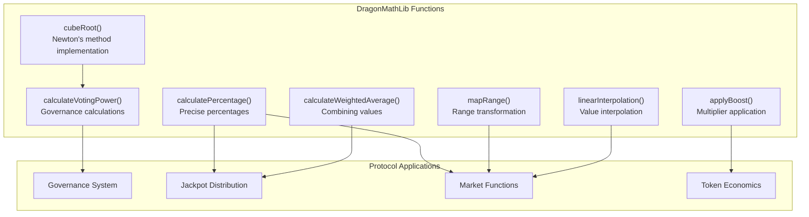

import Tabs from '@theme/Tabs';
import TabItem from '@theme/TabItem';

# DragonMathLib

**Core mathematics library providing essential operations and calculations**

<div className="contract-badges">
  <span className="contract-badge utility">Utility Library</span>
  <span className="contract-badge core">Core Component</span>
  <span className="contract-badge optimized">Gas Optimized</span>
</div>

## Overview

This library contains optimized mathematical operations for critical protocol functions, especially focusing on voting power calculation, precise percentage math, and interpolation:



## Key Functions

### Cube Root Calculation

The library implements an optimized cube root function using Newton's method:

```solidity
/**
 * @dev Calculate cube root using Newton's method (used in voting power calculations)
 * @param n The number to find the cube root of
 * @return The cube root of n, with precision
 */
function cubeRoot(uint256 n) internal pure returns (uint256) {
    if (n == 0) return 0;
    
    // Use improved initial guess for faster convergence
    uint256 x;
    if (n <= PRECISION) {
        // For values <= 1, start with a value close to 1
        x = (n + 2 * PRECISION) / 3;
    } else {
        // For values > 1, use a logarithmic approximation for initial guess
        uint256 log2n = 0;
        uint256 temp = n;
        while (temp > PRECISION) {
            temp = temp / 2;
            log2n++;
        }
        x = 1 << (log2n / 3);
        
        // Ensure x is not zero (fallback)
        if (x == 0) x = n / 3;
    }
    
    // Apply Newton's method with improved convergence check
    for (uint256 i = 0; i < 8; i++) {
        // Implementation details...
    }
    
    return x;
}
```

This implementation features several optimizations:
- Smart initial guess selection based on input range
- Logarithmic approximation for large numbers
- Early exit on convergence
- Precision loss prevention

### Voting Power Calculation

A core function for the governance system that uses cube root normalization:

```solidity
/**
 * @dev Calculate voting power using cube root normalization for more equitable distribution
 * @param amount The amount of tokens
 * @return votingPower The calculated voting power
 */
function calculateVotingPower(uint256 amount) internal pure returns (uint256 votingPower) {
    if (amount == 0) return 0;
    
    // Use cube root for more equitable voting power distribution
    return cubeRoot(amount * PRECISION) * 100;
}
```

This function implements the "cube root rule" (similar to the Wyoming Rule in political science) that creates a more equitable distribution of voting power, preventing large token holders from having disproportionate influence.

### Percentage Calculation

Precise percentage calculation with configurable precision:

```solidity
/**
 * @dev Calculate normalized percentage with high precision
 * @param numerator Numerator value
 * @param denominator Denominator value
 * @param precision Precision factor (e.g., 1e18)
 * @return Percentage with specified precision
 */
function calculatePercentage(
    uint256 numerator, 
    uint256 denominator, 
    uint256 precision
) internal pure returns (uint256) {
    if (denominator == 0) return 0;
    return (numerator * precision) / denominator;
}
```

### Boost Application

Apply multipliers to values with precision control:

```solidity
/**
 * @dev Apply a boost multiplier to an amount with precise math
 * @param amount Base amount
 * @param multiplier Boost multiplier (scaled by precision)
 * @param precision Precision factor (e.g., 10000 for 100.00%)
 * @return boostedAmount The amount after applying the boost
 */
function applyBoost(
    uint256 amount, 
    uint256 multiplier, 
    uint256 precision
) internal pure returns (uint256 boostedAmount) {
    return (amount * multiplier) / precision;
}
```

### Weighted Average Calculation

Combine multiple values with different weights:

```solidity
/**
 * @dev Calculate weighted average of multiple values
 * @param values Array of values
 * @param weights Array of weights (should sum to precision)
 * @param precision Precision factor (e.g., 1e18)
 * @return weightedAvg Weighted average with specified precision
 */
function calculateWeightedAverage(
    uint256[] memory values, 
    uint256[] memory weights, 
    uint256 precision
) internal pure returns (uint256 weightedAvg) {
    if (values.length != weights.length) revert ArrayLengthMismatch();
    if (values.length == 0) return 0;
    
    uint256 sum = 0;
    uint256 weightSum = 0;
    
    for (uint256 i = 0; i < values.length; i++) {
        sum += (values[i] * weights[i]);
        weightSum += weights[i];
    }
    
    // Check to avoid division by zero
    if (weightSum == 0) return 0;
    
    // If weights don't sum to precision, normalize them
    if (weightSum != precision) {
        return sum / weightSum;
    } else {
        return sum / precision;
    }
}
```

### Range Mapping

Transform values from one range to another:

```solidity
/**
 * @dev Map a value from one range to another with precise math
 * @param value Input value
 * @param fromLow Lower bound of input range
 * @param fromHigh Upper bound of input range
 * @param toLow Lower bound of output range
 * @param toHigh Upper bound of output range
 * @param precision Precision factor (e.g., 1e18)
 * @return Mapped value in the new range
 */
function mapRange(
    uint256 value,
    uint256 fromLow,
    uint256 fromHigh,
    uint256 toLow,
    uint256 toHigh,
    uint256 precision
) internal pure returns (uint256) {
    if (fromLow >= fromHigh || toLow >= toHigh) return toLow;
    if (value <= fromLow) return toLow;
    if (value >= fromHigh) return toHigh;
    
    uint256 fromRange = fromHigh - fromLow;
    uint256 toRange = toHigh - toLow;
    
    // Use high-precision calculation to avoid rounding errors
    return toLow + ((value - fromLow) * toRange * precision / fromRange / precision);
}
```

### Linear Interpolation

Calculate values along a linear path between two points:

```solidity
/**
 * @dev Calculate linear interpolation between two points
 * @param startValue Start value
 * @param endValue End value
 * @param startPosition Start position (0-1 scaled by precision)
 * @param endPosition End position (0-1 scaled by precision)
 * @param currentPosition Current position (0-1 scaled by precision)
 * @param precision Precision factor (e.g., 1e18)
 * @return interpolatedValue The interpolated value
 */
function linearInterpolation(
    uint256 startValue,
    uint256 endValue,
    uint256 startPosition,
    uint256 endPosition,
    uint256 currentPosition,
    uint256 precision
) internal pure returns (uint256 interpolatedValue) {
    if (endPosition <= startPosition) return startValue;
    if (currentPosition <= startPosition) return startValue;
    if (currentPosition >= endPosition) return endValue;
    
    uint256 positionRange = endPosition - startPosition;
    uint256 valueRange = endValue > startValue ? 
                        (endValue - startValue) : 
                        (startValue - endValue);
    
    uint256 positionRatio = ((currentPosition - startPosition) * precision) / positionRange;
    
    if (endValue > startValue) {
        return startValue + ((positionRatio * valueRange) / precision);
    } else {
        return startValue - ((positionRatio * valueRange) / precision);
    }
}
```

## Usage Examples

### Governance Voting Power

```solidity
// Import the library
import "../math/DragonMathLib.sol";

contract GovernanceContract {
    using DragonMathLib for uint256;
    
    function calculateVotingPower(uint256 tokenBalance) public pure returns (uint256) {
        return DragonMathLib.calculateVotingPower(tokenBalance);
    }
    
    function determineQuorum(uint256 totalSupply) public pure returns (uint256) {
        // Calculate cube root of total supply for a fair quorum requirement
        uint256 votingPower = DragonMathLib.calculateVotingPower(totalSupply);
        // Use 10% of the voting power as quorum
        return votingPower / 10;
    }
}
```

### Dynamic Pricing Model

```solidity
// Import the library
import "../math/DragonMathLib.sol";

contract DynamicPricingModel {
    using DragonMathLib for uint256;
    
    uint256 private constant PRECISION = 1e18;
    
    // Map the utilization rate to an interest rate
    function calculateInterestRate(uint256 utilizationRate) public pure returns (uint256) {
        // Map 0-100% utilization to 2-20% interest
        return DragonMathLib.mapRange(
            utilizationRate,
            0,
            PRECISION,
            2 * PRECISION / 100,  // 2%
            20 * PRECISION / 100, // 20%
            PRECISION
        );
    }
    
    // Calculate weighted average price
    function calculateWeightedPrice(
        uint256[] memory prices,
        uint256[] memory volumes
    ) public pure returns (uint256) {
        return DragonMathLib.calculateWeightedAverage(prices, volumes, PRECISION);
    }
}
```

## Gas Optimization

The DragonMathLib implements several gas optimizations:

1. **Early Returns**: Functions return early for edge cases like zero inputs
2. **Limited Iterations**: Newton's method implementation caps iterations at 8
3. **Smart Initial Guesses**: Uses logarithmic approximation for better starting points
4. **Early Exit Conditions**: Breaks loops when convergence is detected
5. **Precision Management**: Carefully manages multiplication/division order to maintain precision

## Security Considerations

When using the DragonMathLib, consider these security best practices:

1. **Precision Handling**: Be consistent with precision factors across calculations
2. **Overflow Awareness**: While Solidity 0.8+ has built-in overflow checks, be cautious with large numbers
3. **Division Safety**: Always check for division by zero
4. **Order of Operations**: The order of multiplication and division affects precision
5. **Array Validation**: Validate array inputs before using functions like `calculateWeightedAverage` 