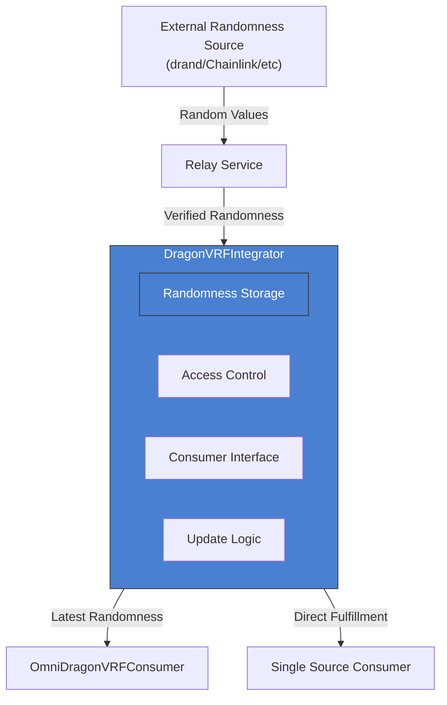

# DragonVRFIntegrator

The `DragonVRFIntegrator` contract serves as a bridge between external randomness sources (like drand networks) and the OmniDragon ecosystem, providing a standardized interface for consuming randomness.

## Overview

This contract is responsible for integrating with a specific randomness source, handling the verification and delivery of random values to consumer contracts:



## Key Features

- **Source Integration**: Connects to a specific randomness source (e.g., drand, Chainlink)
- **Verified Storage**: Stores the latest verified randomness value
- **Access Control**: Restricts randomness updates to authorized entities
- **Consumer Management**: Manages authorized consumer contracts
- **Direct Fulfillment**: Can directly fulfill randomness for simple consumers

## Contract Implementation

The core of the DragonVRFIntegrator is implemented as follows:

```solidity
// SPDX-License-Identifier: MIT
pragma solidity ^0.8.0;

import {Ownable} from "../lib/access/Ownable.sol";
import {ReentrancyGuard} from "../lib/security/ReentrancyGuard.sol";
import "./interfaces/IDragonVRFIntegrator.sol";
import "./interfaces/IDragonVRFConsumer.sol";

/**
 * @title DragonVRFIntegrator
 * @dev Integrates drand randomness network with Dragon ecosystem
 */
contract DragonVRFIntegrator is Ownable, ReentrancyGuard, IDragonVRFIntegrator {
    // drand network information
    uint256 public latestDrandRound;
    uint256 public latestDrandValue;
    uint256 public lastUpdateTimestamp;
    
    // Consumer information
    mapping(address => bool) public authorizedConsumers;
    
    // Events
    event RandomnessUpdated(uint256 round, uint256 value);
    event ConsumerAuthorized(address consumer, bool authorized);
}
```

## Randomness Management

The contract provides functions to update and retrieve randomness:

```solidity
/**
 * @dev Updates the randomness value (only callable by owner)
 * @param _round The drand round number
 * @param _value The randomness value
 */
function updateRandomness(uint256 _round, uint256 _value) external onlyOwner {
    require(_round > latestDrandRound, "Round must be newer");
    
    latestDrandRound = _round;
    latestDrandValue = _value;
    lastUpdateTimestamp = block.timestamp;
    
    emit RandomnessUpdated(_round, _value);
}

/**
 * @dev Returns the latest randomness value
 */
function getLatestRandomness() external view override returns (uint256, uint256) {
    return (latestDrandValue, latestDrandRound);
}
```

## Consumer Management

The contract manages authorized consumers through these functions:

```solidity
/**
 * @dev Authorizes a consumer to request randomness
 * @param _consumer The consumer address
 * @param _authorized Whether to authorize or deauthorize
 */
function setAuthorizedConsumer(address _consumer, bool _authorized) external onlyOwner {
    authorizedConsumers[_consumer] = _authorized;
    emit ConsumerAuthorized(_consumer, _authorized);
}
```

## Randomness Fulfillment

For direct consumers, the contract provides a fulfillment function:

```solidity
/**
 * @dev Allows a consumer to request randomness (only callable by authorized consumers)
 * @param _requestId The requestId to fulfill 
 */
function fulfillRandomness(uint256 _requestId) external override nonReentrant {
    require(authorizedConsumers[msg.sender], "Not authorized");
    
    // Send the randomness back to the consumer
    IDragonVRFConsumer(msg.sender).fulfillRandomness(_requestId, latestDrandValue, latestDrandRound);
}
```

## Security Features

The DragonVRFIntegrator implements several security measures:

1. **Access Control**: Only authorized entities can update randomness
   ```solidity
   function updateRandomness(uint256 _round, uint256 _value) external onlyOwner {
       require(_round > latestDrandRound, "Round must be newer");
       // ...
   }
   ```

2. **Consumer Authorization**: Only authorized consumers can request randomness
   ```solidity
   function fulfillRandomness(uint256 _requestId) external override nonReentrant {
       require(authorizedConsumers[msg.sender], "Not authorized");
       // ...
   }
   ```

3. **Reentrancy Protection**: Uses ReentrancyGuard to prevent reentrancy attacks
   ```solidity
   function fulfillRandomness(uint256 _requestId) external override nonReentrant {
       // ...
   }
   ```

4. **Round Validation**: Ensures only newer rounds can update randomness
   ```solidity
   require(_round > latestDrandRound, "Round must be newer");
   ```

## Deployment and Configuration

### Deployment for a drand Network

To deploy an integrator for a drand network:

```solidity
// Deploy the integrator
DragonVRFIntegrator integrator = new DragonVRFIntegrator();

// Configure the drand relay (off-chain component)
// This component fetches data from the drand network and calls updateRandomness

// Authorize consumers
integrator.setAuthorizedConsumer(omniConsumerAddress, true);
```

### Deployment for Chainlink VRF

For a Chainlink VRF source, the deployment would be slightly different:

```solidity
// Deploy the Chainlink integrator
ChainlinkVRFIntegrator integrator = new ChainlinkVRFIntegrator(
    vrfCoordinator,
    linkToken,
    keyHash,
    fee
);

// Authorize consumers
integrator.setAuthorizedConsumer(omniConsumerAddress, true);
```

## Integration with Relay Services

The DragonVRFIntegrator is typically used with an off-chain relay service that:

1. Monitors the external randomness source
2. Verifies randomness values
3. Submits verified randomness to the integrator contract

For drand networks, this relay service:
- Subscribes to drand beacon outputs
- Verifies BLS signatures
- Submits verified randomness rounds via `updateRandomness()`

## Consumer Interface

To use the DragonVRFIntegrator directly, consumer contracts should implement:

```solidity
interface IDragonVRFConsumer {
    function fulfillRandomness(uint256 requestId, uint256 randomness, uint256 round) external;
}
```

## Usage Example

Here's how a contract would use the DragonVRFIntegrator directly:

```solidity
// Simple consumer that uses a single randomness source
contract SingleSourceConsumer is IDragonVRFConsumer {
    IDragonVRFIntegrator public integrator;
    
    mapping(uint256 => bool) public pendingRequests;
    uint256 public lastRandomValue;
    uint256 private nextRequestId = 1;
    
    constructor(address _integrator) {
        integrator = IDragonVRFIntegrator(_integrator);
    }
    
    // Request randomness
    function getRandomNumber() external returns (uint256) {
        uint256 requestId = nextRequestId++;
        pendingRequests[requestId] = true;
        
        // Request fulfillment from the integrator
        integrator.fulfillRandomness(requestId);
        
        return requestId;
    }
    
    // Called by the integrator to fulfill randomness
    function fulfillRandomness(uint256 requestId, uint256 randomness, uint256 round) external override {
        require(msg.sender == address(integrator), "Only integrator can fulfill");
        require(pendingRequests[requestId], "Request not found");
        
        lastRandomValue = randomness;
        delete pendingRequests[requestId];
        
        // Use randomness here
    }
}
```

## Advanced Usage: Direct Verification

For advanced use cases, the integrator can be extended to perform direct on-chain verification of randomness:

```solidity
// Example for on-chain drand verification
function verifyAndUpdateRandomness(
    uint256 round,
    bytes calldata signature,
    bytes32 previousSignatureHash
) external {
    // Verify the signature
    bool isValid = drandVerifier.verify(
        drandPublicKey,
        signature,
        previousSignatureHash,
        round
    );
    
    require(isValid, "Invalid signature");
    
    // Calculate randomness value from signature
    uint256 randomness = uint256(keccak256(signature));
    
    // Update randomness
    latestDrandRound = round;
    latestDrandValue = randomness;
    lastUpdateTimestamp = block.timestamp;
    
    emit RandomnessUpdated(round, randomness);
}
``` 